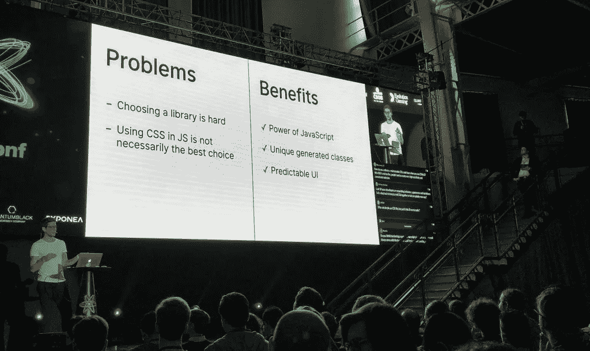

# react conf 2017—摘要

> 原文：<https://medium.com/hackernoon/reactiveconf-2017-summary-162e5085f539>

2017 年的[react conf 于 10 月 26 日和 27 日在布拉迪斯拉发举行。在我看来，CSSinJS 和一般的优化技术是今年会议的主题。](https://reactiveconf.com/)

鉴于我经常参加更多“受欢迎”的会议，我必须承认，我真的对讲座的高质量感到惊讶。

如果你想看整个会议，有[第一天](https://www.youtube.com/watch?v=X9iqnovPGyY)和[第二天](https://www.youtube.com/watch?v=62xd25kEZ3o)的录像。以下是我所选演讲的摘要。

*   尤雨溪:JavaScript 应用程序中的编译时优化
*   伊戈尔·米纳尔:让我们一起摇摆吧
*   [CSS 面板](#csspanel)
*   [蒂亚戈福特:反应生产力革命](#tiagoforte)
*   [杰克·富兰克林:迁移复杂软件](#jackfranklin)
*   [理查德·费尔德曼:CSS 作为字节码](#richardfeldman)
*   [Jared Forsyth:原因:JavaScript 风格的 OCaml](#jaredforsyth)
*   罗宾·弗里希曼:JS 中的 CSS 好的部分&坏的部分
*   大卫·诺伦:走出沥青坑，重访

# [尤雨溪:JavaScript 应用中的编译时优化](https://docs.google.com/presentation/d/1AjT8HeXFeAO61voCsyAEM7UnjjjeY8rHumyVlxs7YbY/edit#slide=id.p)

[视频链接](https://youtu.be/X9iqnovPGyY?t=8h40m58s)

[尤雨溪](http://evanyou.me/),[vue . js](https://vuejs.org/)的创建者，以对 JavaScript 编译技术的总体概述结束了第一天。他指出，web 框架正在集成越来越多的编译器。原因很明显:这都是为了提高性能。

他强调说，迷你编译器可以被视为编译器的一种。

现代框架编译 HTML 模板。在 Vue.js 中，通过首先将模板转换成 AST(抽象语法树),模板被转换成 JavaScript 渲染函数。

人们还可以看到一种趋势，即 AOT(提前编译)而不是 JIT(实时编译)越来越成为处理编译的默认方式。

通过将 CSS 规则仅应用于它所附加的组件，CSS 被编译成 JavaScript。这就克服了人们担心的层叠式继承不良风格的问题。

脸书的[预包装](https://prepack.io/)，一种较新的方法，通过部分评估进行优化。人们必须记住，这是一项相当新的[技术](https://hackernoon.com/tagged/technology)。

# 伊戈尔·米纳尔:让我们一起摇摆吧…

[视频链接](https://youtu.be/X9iqnovPGyY?t=8h7m26s)

[Igor Minar](https://twitter.com/IgorMinar) 是 [Angular 的](https://angular.io/)核心团队的成员，他谈到了通过在 webpack 中使用树抖动和代码消除来减少应用程序包的大小。他鼓励使用可视化工具[web pack-bundle-analyzer](https://github.com/webpack-contrib/webpack-bundle-analyzer)和 [source-map-explorer](https://github.com/danvk/source-map-explorer) 。两者都是识别代码移除有用的领域的良好起点。

树抖动在模块级工作。由于无法检测模块中的死代码，所以应该避免“裸导入”——在没有指定实际类的情况下导入模块，如“import”rxjs/add/operator/map '；`.

如果可能的话，应该总是使用 ES 模块。

用 CommonJS 或 UMD webpack 分析代码有问题。

模块串联很有用，因为它减少了代码量。注意:它必须在 webpack 的当前版本中明确启用。

为了减少应用程序的关键路径，应该进行代码拆分。这将只加载关键路径所需的部分。其他一切都可以在以后加载。

死代码消除意味着删除从不执行的代码。通常这是通过[丑化](http://lisperator.net/uglifyjs/)完成的。既然不能单靠静态代码分析，那就比树摇还难。

Igor Minar — Let’s tree-shake it

# CSS 面板

在轻松的气氛中举行了一次关于 CSS 的有趣的小组讨论。

出现的一个问题是，在只使用 JavaScript 的情况下，如何将设计者的输入集成到 CSSinJS 中。小组成员建议将其分为表示组件和容器组件(React 中的概念)。然后，设计者可以访问表示组件。小组成员留下的未决问题是设计者是否知道足够的技术细节来产生可维护的代码。

另一个有趣的讨论是将静态类型的原理应用于 CSS，就像在 TypeScript 或 Flow 中使用的一样。这里的问题是 CSS 和 HTML 是强耦合的。“静态类型”方法的一个用例可能是确保可访问性颜色。为此，你必须知道潜在的背景颜色，这意味着你必须分析相关的 HTML。

接下来是关于 CSSinJS 的优缺点的讨论，与 SASS 或 Less is 等常见技术不同，CSSinJS 在运行时生成 CSS。

运行时生成消除了对增加应用程序大小的重复 CSS 代码的需要。它还支持像状态驱动样式和某些类型的动画这样的东西，这些东西需要只有在运行时才可用的信息。例如，可以将组件的状态传递给 JavaScript 函数，使其在 CSS 生成方面更加灵活。

主题化是 CSSinJS 的主要优势之一。只需要一个 JavaScript 函数，就可以非常容易地创建几乎无限多的主题..

另一方面，现有的预处理器或预检查机制仅在编译时可用。

一位观众询问了小组成员对 CSS 网格的看法。令人惊讶的是，一致意见是否定的。

当讨论全局与局部样式问题时，小组成员很快同意层次属性的问题是主要问题。这是当父组件的样式信息以一种意想不到的方式泄漏到其子组件时。一方面，可以使用 [CSS3 属性“all:initial”](https://www.w3.org/TR/css3-cascade/#all-shorthand)删除所有继承的样式。另一方面，最好是 CSS 只放在本地。这个规则的例外是:全球风格的价值观，如公司的颜色。

在类名上使用选择器被认为是不好的做法，因为它们最初的目标是纯文档，而不是今天的组件。

在最后的总结中，小组成员说，人们不应该被突然出现的所有新技术吓倒。这在国家预防机制环境中尤其有效。

CSS Panel

# 伊戈尔·米纳尔:AMA(问我任何问题)会议

伊戈尔·米纳尔参加了一个“问我任何问题”的会议，当然也遇到了一个角度与反应的问题。他的回答相当圆滑。他观察到 Angular 提供了一个完整的包，而 React 为您提供了许多选择。他指出，这可能是个问题，因为你必须知道不同的元素是如何相互作用的。

总的来说，Minar 认为有些问题类似于已经用 Java 或 c 等语言解决的问题。

米纳尔提到了谷歌的 [Closure](https://developers.google.com/closure/compiler/) 编译器，在他看来，这是目前消除死代码的最佳工具。如果有类型信息就更好了。例如，当使用 TypeScript 时，这是一个很好的匹配。

在升级 Angular 1 方面，现在有了一个新的选项 [ng-upgrade](https://angular.io/guide/upgrade) ，禁用 Angular 和 AngularJS 之间的相互通信。大公司要求这一功能。他们通常将应用程序的完整部分转换为 Angular，而不想将其与 AngularJS 耦合。

与 React 的性能相比，他说 Angular 使用了更好的方法。React 中的变化检测发生在视图级别，而 Angular 在模型级别。

米纳尔警告说，人们不应该完全相信像摇树这样的优化技术。人们仍然需要测试和测量。他在关于优化技术的演讲中反映了类似 rxjs 中的“裸导入”问题。

Angular Elements 是一个新的库，其中的组件可用于非角度应用。常见的用例是 CMS。

Minar 说，即将发布的 Angular 5 的首要功能是让服务人员成为一等公民。这将改善网络延迟问题。

Minar 最后提到 Angular 的优势是拥有正确的默认设置。如果你有可以选择的框架，你必须知道每个领域的最佳实践。

# [蒂亚戈福特:反应生产力革命](https://de.slideshare.net/tiagoforte/the-react-productivity-revolution-by-tiago-forte)

[链接到视频](https://youtu.be/X9iqnovPGyY?t=2h8m27s)

蒂亚戈·福特做了一个非常不寻常的关于“反应生产力革命”的演讲。没有软件开发经验的 Forte 把自己定义为软件人类学家。他研究这个行业，程序员如何工作，什么因素影响生产力。然后，他的发现被重新定义给非程序员，这样其他行业可能会受益。

他把所谓的“流程”理解为主要的生产力标准。令人惊讶的是，现代研究表明，避免打断或争取时间表或单一任务等事情并不需要将一个人带入“流”中。Forte 认为这些程序甚至会适得其反，因为它们消除了个人交流，让人们远离了业务。

他强调说，大多数人错误地认为，一个人需要一定的时间才能进入“心流”。与时间无关。最好的生产力需要的是状态性、封装性、可重用性和可组合性。

Tiago Forte — The React Productiviy Revolution

# 杰克·富兰克林:迁移复杂软件

[视频链接](https://youtu.be/62xd25kEZ3o?t=1h39m9s)

[Jack Franklin](http://jackfranklin.co.uk/) 讲述了他的团队历时一年将基于 AngularJS 的应用程序迁移到 React 的经历。切换到 React 而不是升级到 Angular 的“特定于上下文”的原因非常简单:最初的开发人员离开了，新的开发人员只是对 React 有了更多的经验。

核心迁移策略不是大爆炸式的发布。相反，他们从位于逻辑组件树底部的组件开始，一个组件一个组件地增量迁移。[n React](http://ngreact.github.io/ngReact/)允许他们将 React 嵌入 Angular。

验收测试非常有用。它们与应用程序代码的耦合不是很强，因此即使底层技术发生变化，它们也不会受到影响。

为了挑选出最先工作的组件，他们选择了流失率最高的组件。这些是经常改变的。富兰克林建议，对于较大的组件，应该试着把它们分成较小的部分。他们使用定期合并的特征分支。

事实证明，在 markdown 的小团队中分享知识是一件好事，他建议在每个项目中都这样做。迁移也是更新工具系统的好时机。

一个巨大的挑战是让非技术人员相信迁移是必要的。

最后，人们还必须接受现实系统中的失败。一个人必须忍受它，不要惊慌。

他演讲的内容可以在 [JSPlayground](https://javascriptplayground.com/blog/2017/08/migrating-complex-javascript-angular-react/) 上找到。

# 理查德·费尔德曼:作为字节码的 CSS

[视频链接](https://youtu.be/62xd25kEZ3o?t=2h10m25s)

[Richard Feldman](https://twitter.com/rtfeldman) ，一位在 [Elm](http://elm-lang.org/) 社区很受欢迎的人物，展示了 Elm 的 CSS 解决方案。他认为使用最初设计用来创建简单文档的技术是现代 web 开发中的主要问题之一。他承认，随着 CSS、JavaScript 和 HTML 标准的不断改进，情况有所好转。但是，它们都绑定到最初为文档设计的原始根。

Elm 提供了一种 elm 风格的编程语言，预先设计用于创建用户界面，例如现代 web 应用程序。它可以编译成 JavaScript，但是开发者不应该承担它的遗留负担。

Feldman 继续通过现场编码展示了创建像垂直对齐这样的设计是多么容易，而使用原生 CSS 是很难做到的。

# Jared Forsyth:原因:JavaScript 风味的 OCaml

[视频链接](https://youtu.be/62xd25kEZ3o?t=6h9m25s)

Jared Forsyth 提出了类型安全且不可变的编程语言 [Reason](https://reasonml.github.io/) ，它基于 [OCaml](http://ocaml.org/) 并由脸书维护。推理的主要标准是易于启动和维护。

与普通 JavaScript 的互操作性比 TypeScript 差，但比 ClojureScript 或 Elm 好。后两者不允许从 npm 获取依赖项。

他对静态类型做了一个很好的陈述，我想引用一下:“单元测试覆盖你能想到的任何东西，类型覆盖你忘记的东西。”

Reason 才刚刚开始用于生产。Forsyth 预计至少两年后才能用于大型项目。

# robin frisch Mann:JS 中的 CSS 好的和坏的部分

[视频链接](https://youtu.be/X9iqnovPGyY?t=1h41m46s)

CSSinJS 从 JavaScript 函数中创建 CSS，提供了更多的可能性、更多的可预测性，并降低了覆盖的风险。至少根据 Robin Frischmann 的说法是这样的，他试图说服他演讲的参与者尝试使用 CSSinJS。

他警告说，这种技术是相当新的，有很多图书馆，因为他们“移动很快”，东西打破了很多。

这是一次相当激励人心的谈话，因为他的论点既合理又易懂。

Robin Frischmann — CSS In JS

# 大卫·诺伦:走出沥青坑，重访

[视频链接](https://youtu.be/X9iqnovPGyY?t=15m2s)

David Nolen 谈到了你在管理状态时所面临的问题，以及 Redux 或 GraphQL 等优秀的工作框架在处理这些问题时所做的工作。他提到了“面向位置的编程”这个术语，或者简称为“扑通”,这对我来说是新的。

在他演讲的后半部分，他展示了[原子](http://www.datomic.com/)。这是 Clojure 中一个不可变的数据库，允许真正的“时间旅行”。实际上，您可以查询数据库过去的任何给定状态。它的原理可以比作 git。

诺伦还推荐阅读论文《[走出焦油坑](https://github.com/papers-we-love/papers-we-love/blob/master/design/out-of-the-tar-pit.pdf)》。

*原载于 2017 年 11 月 4 日*[*www.rainerhahnekamp.com*](https://www.rainerhahnekamp.com/en/reactiveconf-2017-summary/)