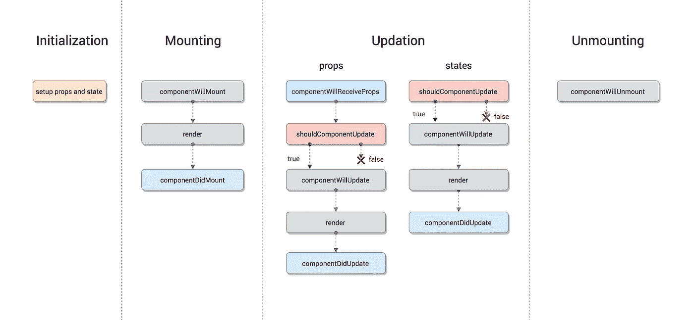

# ReactJs 组件生命周期方法——深入探讨

> 原文：<https://medium.com/hackernoon/reactjs-component-lifecycle-methods-a-deep-dive-38275d9d13c0>

这篇博文是针对 React 16.3 以下版本的。
在 React v16.3 中，组件生命周期方法发生了重大变化。如果你正在使用 React 16.3 以上的版本，请参考下面的博客文章。

 [## 了解 React v16.4+新的组件生命周期方法

### React 新组件生命周期方法的实践指南；构建一个简单的音乐播放器！

blog.bitsrc.io](https://blog.bitsrc.io/understanding-react-v16-4-new-component-lifecycle-methods-fa7b224efd7d) 

## React 及其用户界面

“ReactJs 是一个 javascript 库，用于构建**用户界面**”*是关于 ReactJs 的官方一行介绍。*

## ***什么是用户界面？***

*用户通过点击、悬停、按键或在 UI 组件上执行许多其他事件来与应用程序交互。所有的 UI 组件都在浏览器中诞生，并在某个时间点消亡。整个界面都由一个神来治理，那就是**用户**。*

*用户界面是一个多选项的游乐场，用户可以做任何事情，像 ReactJs 这样的库可以帮助我们创建这个游乐场。*

## *什么是生命周期方法，为什么它很重要？*

*我们周围的一切都经历了出生、成长和死亡的循环。想想树，任何软件应用程序，你自己，一个`div container`或者网页浏览器中的 UI 组件，每一个都会诞生，通过更新成长，然后消亡。*

*生命周期方法是在组件生命周期的不同阶段调用的各种方法。假设如果我们正在创建 YouTube 应用程序，那么显然我们的应用程序将使用网络来缓冲视频，它会消耗电池电量*(假设只有这两个)*。
如果用户在播放完视频后切换到另一个应用程序，那么作为优秀的开发者，我们应该确保以最有效的方式使用网络和电池等资源。每当用户切换到另一个应用程序时，我们可以停止/暂停视频的缓冲，这将停止使用网络和电池。*

*这就是 ReactJs 中的生命周期方法为我们提供的，这样开发人员就可以生产出高质量的应用程序，并确保开发人员可以真正计划在 UI 界面的诞生、发展或死亡的各个时间点做什么以及如何做。*

> *对组件生命周期有很好的理解将超越你开发高质量用户界面的能力。*

# *反应组分的四个阶段*

*React 组件和世界上的任何其他组件一样，都要经历以下几个阶段*

*   ***初始化***
*   ***安装***
*   ***更新***
*   ***卸载***

*下图直观地展示了 ReactJs 生命周期的各个阶段和方法。*

**

*ReactJs lifecycle phases and methods*

*为了可视化这些生命周期挂钩的实现，我们将创建一个名为 Contra music player 的音乐播放器 React 应用程序。让我们从这些阶段开始讨论。*

## *1)初始化*

*在这个阶段，React 组件通过设置初始状态和默认道具(如果有的话)为即将到来的艰难旅程做准备。*

*魂斗罗音乐播放器应用程序的初始化如下*

*组件在构造函数中设置初始状态，稍后可以通过使用`setState`方法进行更改。*

*`defaultProps`被定义为组件的一个属性，用来定义 props 的所有默认值，可以用新的 props 值覆盖。*

*通过渲染像`<ContraMusicPlayer/>`魂斗罗音乐播放器会以*音量* 70%开始，在*暂停*状态下以*黑暗主题*。*

*通过渲染像`<ContraMusicPlayer theme="light"/>`魂斗罗音乐播放器将从*音量* 70%开始，在*暂停*状态下用*灯光主题*。*

## *2)安装*

*在准备好基本需求、状态和道具之后，我们的 React 组件就可以挂载到浏览器 DOM 中了。这个阶段给出了组件安装前后的挂钩方法。在这个阶段调用的方法有*

*   ***componentWillMount** 在 React 组件即将挂载到 DOM 之前执行。因此，在此方法之后，组件**将**安装。在组件挂载之前，您需要做的所有事情都必须在这里定义。
    该方法在组件的生命周期中第一次渲染之前执行一次。
    ***用法:*** componentWillMount 用于初始化状态或道具，关于是否将其与构造函数合并，目前存在巨大争议。*
*   ***渲染**将组件挂载到浏览器上。这是一个纯方法，这意味着每次提供相同的输入时，它都会给出相同的输出。*

*我们的音乐播放器的呈现方法可能如下所示*

*   ***componentDidMount** 这是在组件**在 dom 上挂载**之后执行的钩子方法。
    该方法在组件的生命周期中第一次渲染后执行一次。因为在这个方法中，我们可以访问 DOM，我们应该初始化需要访问 DOM 的 JS 库，如 D3 或 Jquery。
    ***用法:*** 在我们的魂斗罗音乐播放器 app 中，我们想要绘制出整首歌曲的声波图，这是与 D3 或其他第三方 Javascript 库集成的正确方法。*

*下面的例子展示了当 DOM 准备好时 highcharts 的设置*

> ***应该在哪里进行 API 调用？***
> 
> **API 调用应该总是在 componentDidMount 方法中进行。**

* [## ReactJs 中哪里集成 API 调用？— componentWillMount 与 componentDidMount

### 每个想要获取数据或向服务器发送数据的 React 应用程序都需要集成 API。

hackernoon.com](https://hackernoon.com/where-to-integrate-api-calls-in-reactjs-componentwillmount-vs-componentdidmount-710085dc05c3) 

请参考上面的博文，了解更多关于集成 API 调用的信息。

## 3)更新

这个阶段从 react 组件在浏览器上诞生开始，并通过接收新的更新而成长。组件可以通过两种方式更新，发送新的道具或更新状态。

让我们来看看通过调用 setState 更新当前状态时的钩子方法列表

*   **shouldComponentUpdate** 告诉 React 当组件收到新的道具或者状态被更新时，React 应该重新渲染还是可以跳过渲染？
    这个方法是一个问题，**该不该**把**组件**变成**更新** d？
    因此，该方法应该返回 true 或 false，相应地，组件将被重新呈现或跳过。默认情况下，该方法返回 true。 ***用法:*** 例子是我想只在道具状态改变时重新渲染组件的情况之一。

这种方法通常在渲染是一种非常繁重的方法时使用，这时你应该避免不时地渲染。例如，假设每次渲染，组件都会生成一千个质数，让我们考虑某个应用程序具有这种逻辑，然后我们可以控制何时需要它，然后只渲染组件。

*   **componentWillUpdate** 仅在`shouldComponentUpdate`返回 true 后执行。该方法仅用于为即将到来的渲染做准备，类似于 componentWillMount 或 constructor。当在渲染某个项目之前需要一些计算或准备时，可能会有一些用例，这是这样做的地方。
*   **渲染**然后组件被渲染。
*   **componentDidUpdate** 在新的更新组件已经在 DOM 中更新时执行。该方法用于重新触发第三方库，以确保这些库也能更新和重新加载。

## 当父节点发送新的属性时，将调用的方法列表如下:

*   **componentWillReceiveProps**在属性已经改变并且不是第一次渲染时被执行。有时状态依赖于道具，因此每当道具改变时，状态也应该同步。这是应该做的方法。
    在状态改变之前，状态的类似方法并不存在，因为属性在组件中是只读的，永远不能依赖于状态。
    ***用法:*** 这就是状态如何与新道具保持同步。

就状态而言，其余方法的行为与上面定义的完全相同。

*   **shouldComponentUpdate**
*   **组件将更新**
*   **渲染**
*   **组件更新**

## 4)卸载

在这个阶段，不需要组件，组件将从 DOM 中卸载。在此阶段调用的方法

*   **componentWillUnmount** 该方法是生命周期中的最后一个方法。这在组件从 DOM 中移除之前执行。 ***用法:*** 在这个方法中，我们做了所有与组件相关的清理。
    例如，在注销时，可以在卸载主要组件之前清除用户详细信息和所有授权令牌。* **

*请在评论区告诉我你的想法。如果这篇文章对你有帮助，那么你可以给我买杯咖啡😊*