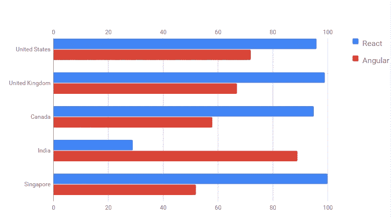
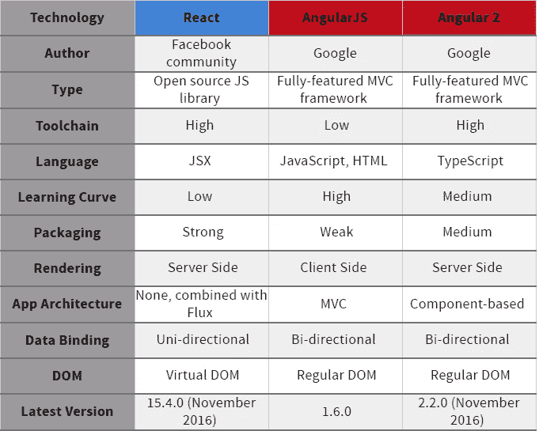

# ReactJS vs 角度对比:哪个更好？

> 原文：<https://medium.com/hackernoon/reactjs-vs-angular-comparison-which-is-better-805c0b8091b1>

为新的 JavaScript 系统、应用程序或网站选择合适的框架是任何企业的头等大事。它会直接影响到项目的持久性、适应最后期限的能力、进一步的代码可维护性以及未来应用程序的可伸缩性。

## JavaScript 权力竞赛:裸数据

JavaScript 工具的数量正在稳步增长，这使得选择合适的技术成为一项挑战。其中讨论最多的是 Angularjs vs Reactjs。两者都是高性能、先进的，并在世界范围内广泛使用。根据最近的 js 框架比较，53%的人经常使用 React，而 32%的人计划学习 React。30%应用了 Angular，10%将尝试它。最新的更新 Angular 2 已经被 13%的人使用，43%的人希望熟悉它。与此同时， [HotFrameworks](http://hotframeworks.com/#top-frameworks) 排名将 AngularJS 列为全球第二大最受欢迎的框架，让位于 ASP.NET。

## 国际利益:

## Reactjs vs Angularjs 就像一本书的简介

## React 与角度比较:库对框架

Angular 是最受欢迎的 javascript 框架之一，像其他类似的软件套件一样，它提供了多种开箱即用的解决方案和设计。当时，React 生态系统由任意数量的可组合的、有针对性的在线工具组成，ReactJS 充当其中一个构件。

## Angularjs 的优势

*   **全球社区支持**是其中一个因素，这可以很容易地使 Angular 成为最好的 javascript 框架。开发人员和设计人员不断协作，为社区做出贡献，增加了框架的可信度和可靠性。
*   它是一个成熟的框架，可以在任何浏览器或平台上运行。此外，它是一致的，充斥着现成的工具，与 React 相比，ng 组件是健壮的并且相当成熟。
*   **双向数据绑定**可能是最重要的特性，因为它分散了每次微小数据更改后的影响，并且不再需要在视图和模型中进行数据同步。

鉴于我们公司积极使用 ng2 的事实，将 react 与 angular 2 进行比较也是必要的。

*   **TypeScript** 是一个增强的 JS 超集，它提供可选的静态类型检查、基于对象的编程模式和高性能类型特性。
*   由于**基于组件的架构**组件具有深度绑定，并且它们中的每一个都包括仅具有相关功能的元素。更重要的是，它们是松散耦合的，并且被恰当地封装。这种方法使得组件易于重用，增强了它们的可测试性和可维护性。

## Reactjs 的优势

*   **JSX** 是一种 JS 语法，支持 HTML 引用和使用 HTML 标记语法来呈现子组件。它促进了机器可读代码的构建，并提供了在一个编译时验证的文件中复合组件的能力。
*   **即时渲染**是 React 最好的特性之一，比角度渲染有明显优势。该技术包括减少 DOM 操作量、优化和加速更新过程的智能方法。虚拟 DOM(文档对象模型)在处理大型数据库时非常有用。
*   Reactjs 和 Angularjs 的核心区别在于 React 是以 **JS 为中心的**，而 ng2 仍然是以 HTML 为中心的。JavaScript 比 HTML 更加健壮，这使得 React 更加简单、专注和一致。

> React.js 将 HTML 嵌入到 JavaScript 中，而其他人继续将 js 放入 HTML 中。

## Angularjs 的缺点

*   尽管有一个全面而清晰的手册，**陡峭的学习曲线**和**复杂性**被列为 Angular.js 的主要弱点之一。与 javascript 框架比较列表中的任何其他客户端渲染技术一样，程序员应该特别强调安全性，以使应用程序可靠和安全。不过，随着 ng2 中**角度通用**和预渲染选项的引入，这个问题得到了解决。

## React.js 的缺点

*   比较 react 与 angular 的性能，首先，值得一提的是 react js**不是一个全面的框架**，正因为如此，将 UI 库集成到一个通用的 MVC 框架中需要更深入的编程知识。考虑到教程数量，有限的生态系统等，它仍然年轻，不成熟。
*   除了 Reactjs 的优点和缺点，我们还应该提到 **Flux** ，它经常被用于添加 react app 的结构和架构。对于一个没有经验的程序员来说，使用这两种技术可能是一个挑战，因为它缺乏结构化和全面的文档或指南。

## 结论

React 和 Angular 为初创企业、小型企业和中端市场企业提供了完全不同的 web 应用程序开发方法。这两种技术都强大而灵活，但没有一种比另一种更差或更好。根据定制应用的目标和特定的系统约束，开发人员可以从 ng2 运行到 React，然后返回。

选择 Angular，它通常假设为前端应用程序创建一个核心框架，而 React.js 可以用于改进其特定部分。此外，它可以与其他框架集成，如 Backbone 甚至众所周知的 Angular。

> [黑客中午](http://bit.ly/Hackernoon)是黑客如何开始他们的下午。我们是 [@AMI](http://bit.ly/atAMIatAMI) 家庭的一员。我们现在[接受投稿](http://bit.ly/hackernoonsubmission)，并乐意[讨论广告&赞助](mailto:partners@amipublications.com)机会。
> 
> 如果你喜欢这个故事，我们推荐你阅读我们的[最新科技故事](http://bit.ly/hackernoonlatestt)和[趋势科技故事](https://hackernoon.com/trending)。直到下一次，不要把世界的现实想当然！

