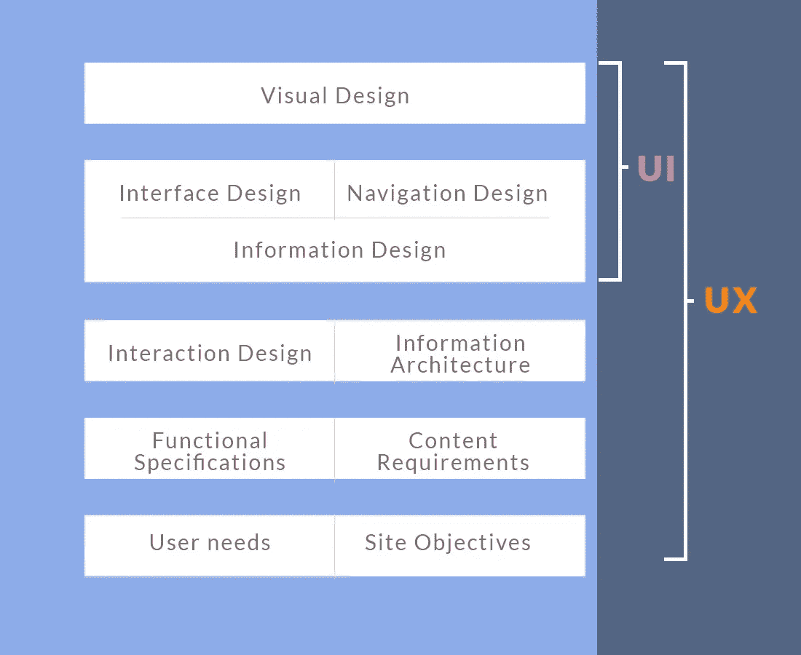

# 你从未有过的用户界面和 UX 介绍

> 原文：<https://medium.com/hackernoon/read-this-for-a-ui-and-ux-introduction-you-never-had-7af66ebb840a>

透过会议室的玻璃，我不禁注意到迪拜酒店相当糟糕——这是我见过的最奢华的地方。

穿过左翼走廊的景象特别令人惊叹。哦，是的——设计师也知道如何捕捉一些乐趣。

我试图在那里交几个朋友，但事情发生时，我只是弯下腰，喝着我的免费香槟。

哦，天哪，她穿的那件红裙子太迷人了。

她很高。我猜是六英尺。

20 出头，最多 24 岁。

她长长的黑发看起来像是“PS 过的”，她深邃的发光的(或者说是顽皮的)眼睛在呼唤着我。

我会坐视不管吗？

我打起精神准备采取行动，当我以为她只是从我身边走过的时候，她看了看，给了我一个相当温柔的微笑——就像素描应用程序上画的那些甜蜜的渐变。

我无法掩饰脸红。

我立刻就想，该死的她太性感了！

请试着忘记后来发生的事…

# **那么什么是用户界面呢？**

**用户界面用非常基本的术语来说，指你能看到或触摸到的一切**。

回到故事。

火红的裙子、长长的黑发和调皮的眼睛可以被称为用户界面(ui)。

如果她是金发或者穿蓝色而不是红色的裙子，那将是“用户界面”的改变。

对于应用程序来说，所使用的颜色、按钮、滑块和其他组件构成了用户界面。

# **好的，用户体验呢？**

还记得那种感觉吗，*“立刻，我就想，该死的她太性感了！”*？

我当时的感受可以比作愉快的用户体验。

你如何让你的用户感觉或行为是指用户体验。

你的产品让用户解决他们的问题有多容易，他们在使用你的产品时感受到的挫折或快乐(希望不是前者)——这是任何产品的用户体验的核心。

# **精心设计的用户界面。**

在开头的故事中，如果没有一些钦佩的成分，可能就不会有“精彩时刻”。

我确实看到了火辣的红裙子、漂亮的头发，以及我称之为*“用户界面元素”*的所有其他优点，然后钦佩之情油然而生。

你看到用户界面如何在创造愉快的用户体验中扮演重要角色了吗？

这正是用户界面所扮演的角色，也是为什么 UI 设计师是每个 UX 设计师的重要盟友。

在任何产品设计中，他们总是一起工作来实现相同的最终目标。

重要的是要注意，在用户界面设计中所做的选择应该仔细考虑，并以用户为中心进行规划。这是为了培养良好的用户体验——这是每个 UX 设计师的请求。

# **一个简单实用的例子。**

几个月前，我受雇做一个重新设计。

来自多伦多的客户帮助非洲学生获得了加拿大学校的录取，所以他们想重新设计他们糟糕的转换网站。

我本可以做出很多设计选择，但是经过一点研究，大多数用户在第一次登陆网站时都想做两件事情中的一件。

1.  申请进入招生程序(听说过这家公司)
2.  更多地了解录取过程是如何进行的(如果他们从未听说过这家公司)

这些选项定义了我的选择，即在用户设备的初始视口中使用“*现在应用*和“*它如何工作*”按钮。(见下文)

# **行业定义**

用户体验设计是一个广阔的领域，在现实生活中是这样的…

For web based products, this graphic above helps illustrate the difference between UI and UX. Adapted from: [http://www.jjg.net/elements/pdf/elements.pdf](http://www.jjg.net/elements/pdf/elements.pdf)

显然，我并没有试图解释用户体验设计的所有内容。

这只是一个有趣的介绍，介绍了它与用户界面设计的区别和联系。

# **关键要点**

*   每个产品都有某种用户界面。然而，它们不一定能培养出美好的体验。
*   出色的用户体验建立在精心设计的用户界面之上，使用户能够轻松实现他们的最终目标
*   理解用户需求和产品目标是打造成功用户体验的基础
*   你想让你的产品用户进入“T8”区吗？—打造愉快的用户体验！

如果你喜欢这篇文章，如果你点击下面的心形图标，我会很感激。对我来说，这肯定是一次愉快的“用户体验”:)