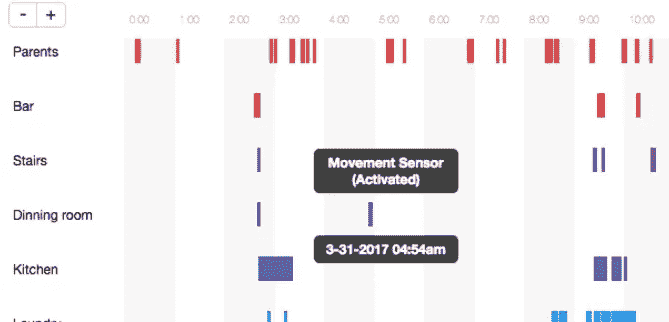
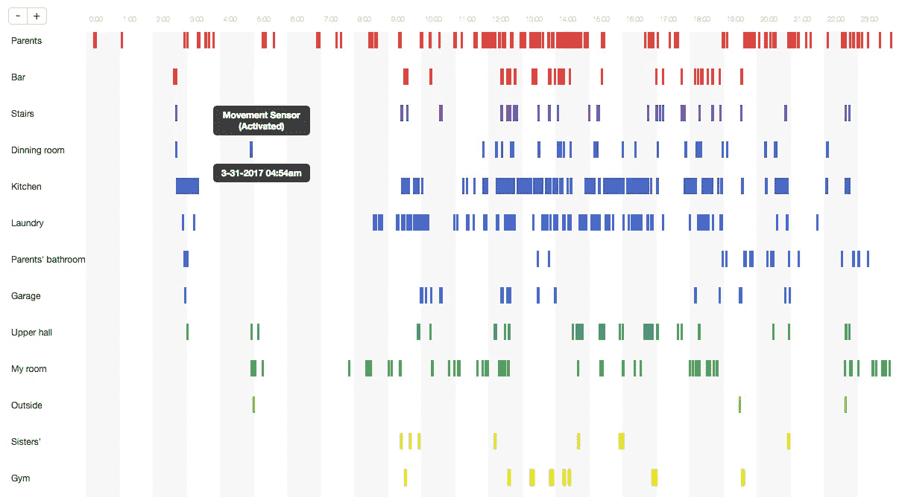

# 阅读我家的活动来帮我爸爸找钥匙。

> 原文：<https://medium.com/hackernoon/reading-my-house-activity-to-help-my-dad-find-his-keys-4fdffeea346f>

我的房子从 2016 年 7 月开始使用物联网供电，全部由我的家庭自动化[初创公司](https://hackernoon.com/tagged/startup) ( [https://hivee.io](https://hivee.io) )设计制造。

从那天起，我就开始记录我家里所有的[活动](https://hackernoon.com/tagged/activity)，从运动检测传感器，到窗户的开关和智能设备如灯泡和空调的控制。

> 自 7 月 5 日以来，我已经记录了 783，709 条活动记录。一天有 2881 个条目。

大量的数据可以用来教我的房子我的家人如何与它互动，所以在某些情况下会有帮助。比如晚上开门后自动开灯，或者晚上走过楼梯时打开楼梯的灯。

## 为数据构建可视化工具

上周，我爸爸带着几杯酒回到家，那天晚上家里发生了很多事情；其中一件事是他丢了钥匙。我的房子有摄像头，但它们都在外面，出于隐私考虑，房子里没有摄像头，所以没有办法看到房子里发生了什么。

> 为什么不使用自从我的房子有了大脑以来一直记录的所有活动日志？

这是我制作的一个 HTML5 工具，用来查看我房子里的所有活动，按房子各个区域的活动划分。每一行代表数据库中任何类型的活动条目，无论是传感器被激活、门被打开还是设备被控制。

> **你还可以判断一个设备是否被墙上的开关控制过，或者是否被某个人用手机控制过。**

Web tool I build to visualize the activity in my house.

所以……多亏了这个，我爸爸在所有寻找他钥匙的地方中只剩下了一个地方:洗衣房。瞧，钥匙又回到了我爸爸身边。

# 下一步是什么？

这个工具不是一个物品定位器工具，有很多事情可以用我房子的所有这些数据来完成，这是下一部分开始的地方:应用**人工智能**技术来尝试预测我房子里接下来会发生什么，这样它就可以自己决定最好做什么，而不用被编程来做，就像在黑暗的过道里行走时学会开灯一样。

我会随时向你汇报最新情况。干杯。

> [黑客中午](http://bit.ly/Hackernoon)是黑客如何开始他们的下午。我们是 [@AMI](http://bit.ly/atAMIatAMI) 家庭的一员。我们现在[接受投稿](http://bit.ly/hackernoonsubmission)，并乐意[讨论广告&赞助](mailto:partners@amipublications.com)机会。
> 
> 如果你喜欢这个故事，我们推荐你阅读我们的[最新科技故事](http://bit.ly/hackernoonlatestt)和[趋势科技故事](https://hackernoon.com/trending)。直到下一次，不要把世界的现实想当然！

