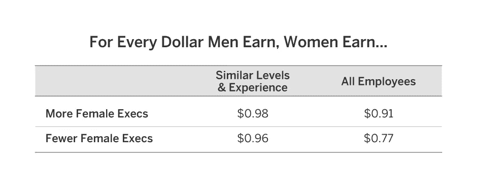
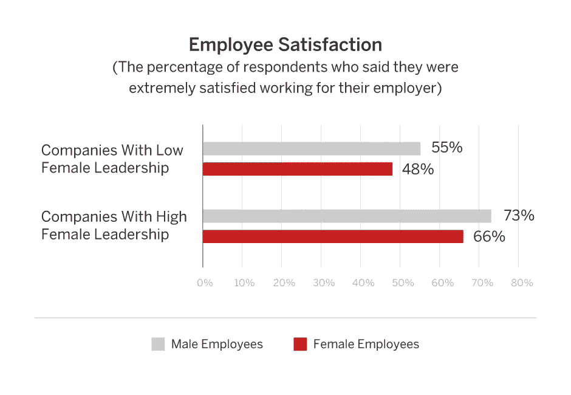
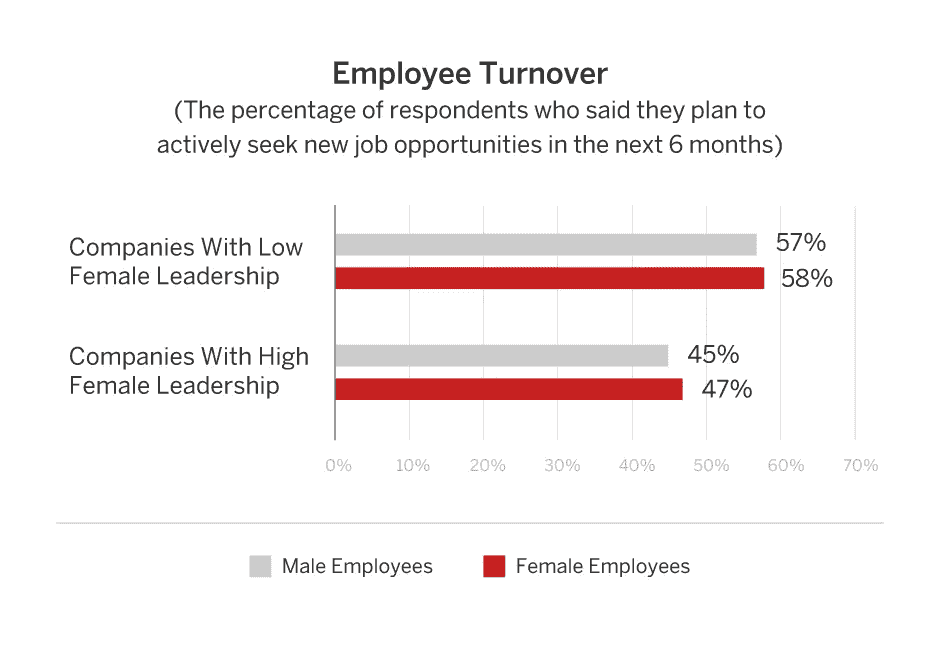

# 准备好得到公平的报酬了吗？加入有更多女性高管的科技公司

> 原文：<https://medium.com/hackernoon/ready-to-be-paid-fairly-join-a-tech-company-with-more-women-executives-23dc15d6f388>

我们已经知道，女性高管越多的公司利润越大。但是根据 [Redfin](http://www.redfin.com) 和 [PayScale](http://www.payscale.com/) 的一项新分析，这些公司也更加公平地支付女性员工。在女性高管较多的科技公司，男女薪酬差距只有一半。

在这项研究中，Redfin 调查了美国 31 家大型科技公司高管团队的性别构成。女性在高管团队中所占比例超过 25%的公司被视为女性高管比例较高，而女性高管比例低于 20%的公司被视为女性高管比例较低。女性占高管团队 21%至 24%的公司不包括在内。PayScale 随后分析了 6562 名在 2015 年 6 月至 2017 年期间为这些公司工作的人的薪酬概况。

我们从两个方面来看待性别薪酬差距。首先，我们比较了相似级别和相似工作年限的男性和女性的工资。然后，我们研究了不考虑工作级别和经验的男性和女性的平均工资。

在女性高管较多的公司，女性的薪酬是男性薪酬的 98%。两美分的薪酬差距可能听起来不算多，但对于一个年薪 10 万美元的男人来说，一个女人在女性高管较少的公司里可以赚到 9.6 万美元，而在女性高管较多的公司里可以赚到 9.8 万美元。在一个女人的职业生涯中，这种差异加起来有数万美元。

当你观察所有的男性和女性，而不考虑他们是否处于相似的角色和级别时，工资差距高达 14 美分。这表明，女性高管比例高的公司也有更多女性担任其他高薪职位。这就是 PayScale 所说的[“机会差距”](http://www.payscale.com/data-packages/gender-pay-gap)

# 男性和女性的员工满意度也更高

女性高管越多的公司，薪酬差距就越小，这或许并不奇怪。但我们的研究也显示，在女性领导较多的公司，男性和女性的工作满意度都较高，而且很少有人说他们会在未来六个月内考虑离职。

# 衡量我们在 Redfin 的薪酬差距

当我在 2015 年第一次成为 CTO 时，我们还没有衡量我们的性别薪酬差距，部分原因是我们不确定我们是否有足够的工程师来获得有意义的结果。但是我们的女性技术小组建议我们对至少有两个男性和两个女性处于同一水平的任何角色进行分析。这些数字可能很小，但它将为我们提供一种手动检查算法标记的任何薪酬差距差异的方法。

最后，我们没有发现男性和女性在薪酬上有任何统计学上的显著差异。但我们现在在调整薪酬时会考虑性别薪酬差距，以确保随着我们的发展不会出现任何问题。我们还决定公开发布[我们的薪酬差距和其他多样性统计数据](https://www.redfin.com/blog/2016/10/race-ethnicity-and-gender-equality-at-redfin.html)，作为一种既让我们自己负责又鼓励其他公司加入我们发布数据的方式。

提高透明度是我们共同努力缩小行业薪酬差距的一种方式。但我们的分析显示，让更多女性担任高管职位也会有所帮助。

**方法论**

PayScale 分析了 2015 年 6 月至 2017 年 6 月期间接受调查的 6562 名员工的薪资概况，这些员工将他们的雇主列为 Redfin 选择的 31 家预定主要科技公司之一。高女性领导指的是领导团队中女性至少占 25%的大型科技公司，低女性领导指的是领导团队中女性少于 20%的大型科技公司。受控制的性别薪酬差距控制了诸如工作年限等变量，而不受控制的性别薪酬差距仅通过查看薪酬中位数来衡量。

**作者:Redfin CTO，** [**布里奇特·弗雷**](https://www.redfin.com/blog/author/bridget-freyredfin-com)

[此处见原文。](https://www.redfin.com/blog/2017/08/gender-pay-gap-is-half-the-size-at-tech-companies-with-more-female-executives.html)