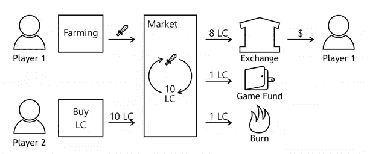
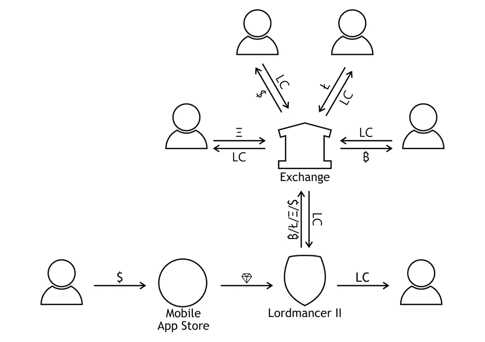

# 游戏中的真实货币交易:加密货币解决方案

> 原文：<https://medium.com/hackernoon/real-money-trading-in-games-a-cryptocurrency-solution-5fdc719cc4f6>

真实货币交易在游戏行业有着悠久的历史，历史上一直被大多数西方游戏开发商和发行商禁止或劝阻，尤其是在[MMORPG](https://www.diablowiki.net/MMORPG)的情况下。巧合的是，由于资源和物品稀缺程度的提高，MMORPGs 也是用户对真实货币交易和市场需求最高的游戏。

下面是几个真实游戏中交易和市场实现的例子。

**团队要塞 2 和 DOTA 2**

这些游戏包含“化妆品市场”(Steam Workshop)，在这里你可以将你的商品交换或出售给另一个玩家，换取真正的美元。这是被 Valve 纵容和鼓励的，他们创建了一个后端和框架来支持这种类型的交换。

Valve 披露了超过 [90%的 TF2](http://www.eurogamer.net/articles/2014-01-17-players-make-how-much-money-in-team-fortress-2) 物品实际上是由玩家创造的。用户可以提交模型和纹理，由社区进行投票，评级足够高的模型和纹理将在 TF2 商店出售。创造者从利润中提成。

DOTA 2 化妆品市场的营业额没有公开数据，但 2015 年该游戏的月总收入超过 1800 万美元。

**第二人生**

第二人生是一个在线虚拟世界。虽然不是传统的 MMOG，但第二人生通过在虚拟空间中尽可能多地模拟真实世界，促进了玩家之间以及玩家与世界之间的互动。开发者林登实验室实现了一个以玩家为中心的经济，玩家可以在其中赚到真金白银。经济是建立在林登币(L$)的基础上的，玩家可以通过在游戏中参加各种活动来赚取。有些活动相当被动，比如坐在野营椅上，而其他像创建虚拟内容和交易虚拟房地产的活动需要真正的技能。

一些玩家宁愿节省时间和花费现金来换取 L 美元，而另一些玩家则更愿意通过他们的游戏内活动来获得 L 美元。这些类型的玩家之间的平衡支持了 LindeX 货币兑换，并提供了允许玩家用真实货币购买 L 美元所必需的流动性。

**宇宙熵**

Entropia Universe 是一个很好的例子，它允许玩家将硬通货兑换成真实的货币。Entropia 使用[微支付](https://en.wikipedia.org/wiki/Micropayment)商业模式，玩家可以用真钱购买游戏中的货币(PED——项目 Entropia 美元)。后来，如果用户获得的收益超过了他们可以使用的，或者决定离开游戏，他们可以按照 10:1 的固定汇率将剩余的 PED 兑换成[美元](https://en.wikipedia.org/wiki/United_States_dollar)。这意味着在 Entropia Universe 中获得的虚拟物品具有真实的现金价值，公司通过交换过程中征收的交易费产生收入。

像 Lordmancer II 一样，Entropia Universe 是一款免费游戏，但用户可以通过花钱购买游戏内货币来购买其他玩家的物品、技能、契约/股份和服务。安特罗皮亚也有一个市场，在那里可以直接购买消耗性资源(弹药、探测器、枪支、发现者、提取者),也可以向其他玩家购买。

在 2004 年和 2008 年的《T4 吉尼斯世界纪录大全》中，Entropia Universe 都以最昂贵的虚拟世界物品销售额而被记录在案。在 2009 年，一个虚拟空间站，游戏中一个受欢迎的目的地，卖了 330，000 美元。这在 2010 年 11 月黯然失色，乔恩·雅各布斯以 63.5 万美元的价格出售了一家名为“永不死俱乐部”的俱乐部；该房产被分割出售，其中最大的一块以 335，000 美元的价格售出。

根据 MindArk 的 [2015 年财报](http://www.entropiaplanets.com/w/images/f/f1/MindArk_Annual_Report_2015.pdf)，他们 2015 年的利润是 400 万 SEK。

**魔兽世界&暗黑 3**

在《暗黑破坏神 3》之前，暴雪不允许在他们的游戏中进行任何形式的真实货币交易，并且该公司参与了一场长期的并且普遍成功的运动来阻止《魔兽世界》中的角色升级服务和淘金者/卖家。在暴雪致力于消除外部游戏市场的同时，他们也开始尝试通过应用内购买来实现游戏的货币化，比如特殊坐骑和领域转移。

2011 年 7 月，暴雪宣布暗黑破坏神 3 拍卖行将包括一个真钱方面的拍卖行。只有物品(以及最终的角色)可以出售，暴雪打算让它与游戏中的黄金拍卖行协同运作。玩家可以在任一服务上列出物品，暴雪对每个列出的物品收取固定费用(以阻止玩家在市场上充斥垃圾物品)。成功购买的交易费也适用。真钱拍卖行的销售收入可以用来购买暴雪的商品和游戏，或者兑换成真实的货币，支付给 Blizard 和他们的金融合作伙伴少量的交易费。

在 2011 年底和 2012 年初，一个漫长的传奇故事接踵而至，因为韩国游戏分级委员会多次拒绝认证暗黑破坏神 3 在韩国销售，因为包括真钱拍卖行。韩国严格监管所有线上和线下形式的赌博，暗黑破坏神 3 内置的真钱机制的设计将其归类为赌博的一种形式。引用 2011 年 9 月《韩国时报》的一篇文章解释了潜在的问题:

“赌博对韩国国民来说是非法的，但这是一个敏感的问题，尤其是在 2005 年至 2006 年的全国性丑闻之后,“海洋故事”游戏机首次通过了监管机构的检查，但在警方发现玩家中存在过度投机和上瘾的行为后被取消了。由于这一争议，监管和批准委员会在游戏评级委员会中成立。

一位知情的业内人士称，中国对涉及现金交易的游戏的态度惹恼了暴雪的当地员工，他们不愿意处理引入拍卖行预计会引起的争议，但总部迫使他们推出这项功能。"

这一预测被证明是正确的，当《暗黑破坏神 3》在 2012 年初提交给分级委员会时，出现了明显的延迟。暴雪第二次提交的时候去掉了“兑现”的元素，但是仍然无法在韩国获得年龄评级。直到 2012 年 1 月 13 日，暗黑破坏神 3 在没有任何真钱拍卖行的情况下被提交，游戏才最终被批准销售。

自 2012 年以来，没有任何暴雪游戏以任何种类的真钱交易为特色。

**加密货币:一种可能的解决方案**

这些例子以及大量游戏物品和货币的黑市证明了玩家对真实货币交易的明显兴趣。然而，实现各种形式的机制的项目会遇到几个困难:

很难平衡一个与外部货币相连的游戏内经济，这通常会导致开发者收入不稳定和不可预测；

在某些地区，这种机制可能会导致游戏被归入赌博游戏类别，而赌博游戏受到的监管与其他游戏不同。

一款名为 Lordmancer II 的 MMO RPG 游戏声称是“第一款开放世界的移动 MMORPG，玩家可以在其中开采加密货币”。它的创造者，俄罗斯游戏工作室 Active Games，引入了一种基于以太坊的加密货币令牌作为游戏的第二种硬通货。根据 Active Games 的说法，这种方法解决了两个问题:

游戏经济基于主币的营业额，并通过对每笔交易征收的代币燃烧和开发者费用进行监管；

Lordmancer II 只允许用户提取加密令牌，因此官方不能将该游戏视为赌博。

玩家可以通过三种方式购买金币。

**在密码交易所**

在游戏的 ICO 于今年 10 月完成并发布后，它的 LordCoin 代币将在密码交易所出售。任何玩家都可以购买代币，并将其转移到他们的游戏帐户。

**在游戏的网站上**

或者，玩家可以在游戏网站上购买金币。这对那些不熟悉加密货币世界的玩家来说很方便。在这种情况下，游戏本身会在一个密码交易所购买 LordCoins，并将其转移到玩家的账户。由于额外的转换成本，价格将会高出一倍。

**游戏中的**

Lordmancer II 还有一个硬通货。它被称为 Crystals，可以使用 appstores 提供的标准应用内购买机制以法定货币购买。

玩家可以用水晶兑换金币，但是兑换速度是加密兑换的四倍。这是由于更高的成本:只有约 30%的玩家支付将达到活跃的游戏，其中 25%将用于购买代币。

**玩家是赢家**

使用这种方法，Active Games studio 旨在使其 [Lordmancer II](http://lordmancer2.io) 成为一个有吸引力的生态系统，吸引那些希望通过种植游戏中的物品和培养游戏角色来赚取法定货币的玩家。当然，游戏本身需要足够好才能流行起来。工作室会成功吗？只有时间能证明一切。

目前， [Lordmancer II](http://lordmancer2.io) 正在俄罗斯进行 beta 测试，它可以在俄罗斯的 Google Play 中使用。

该工作室在 8 月份售罄了 Pre ICO，并筹集了 340 ETH。主 [ICO 回合](http://lordmancer2.io)于 10 月 23 日开始。