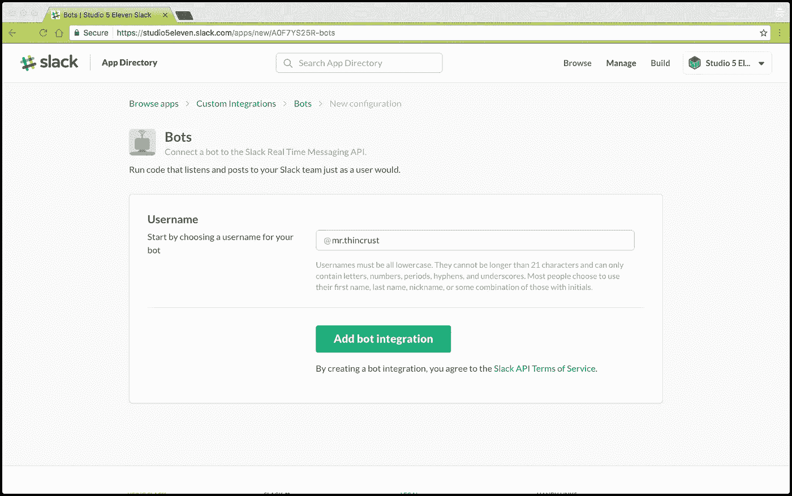
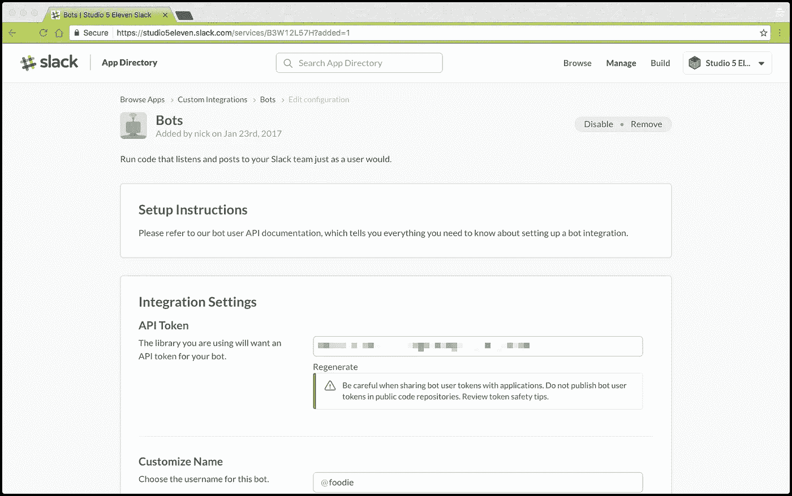
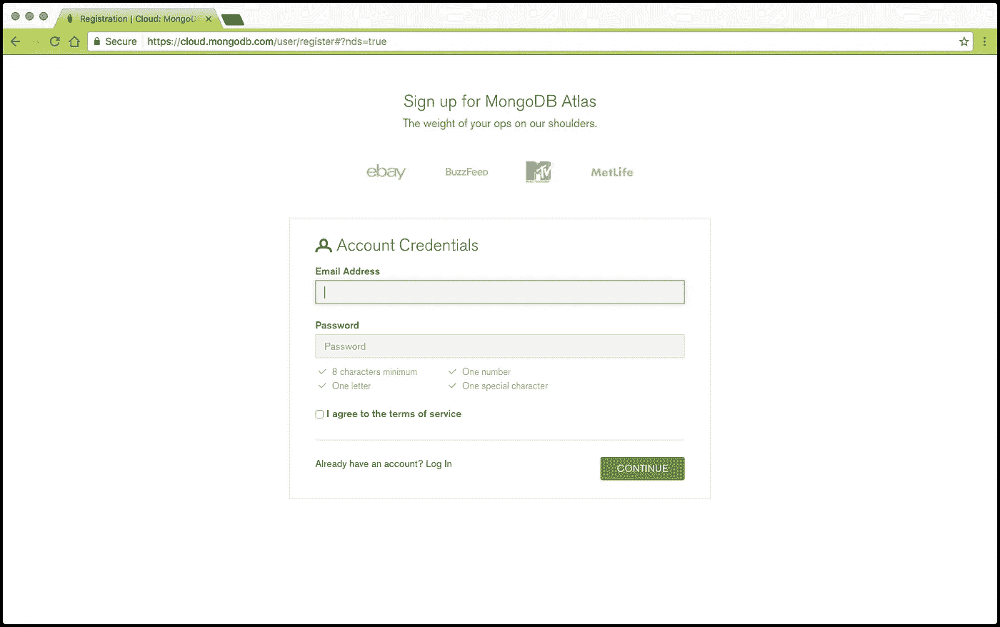
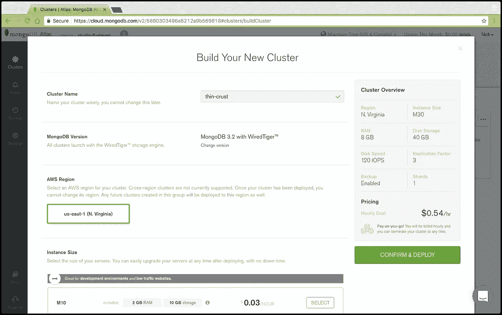
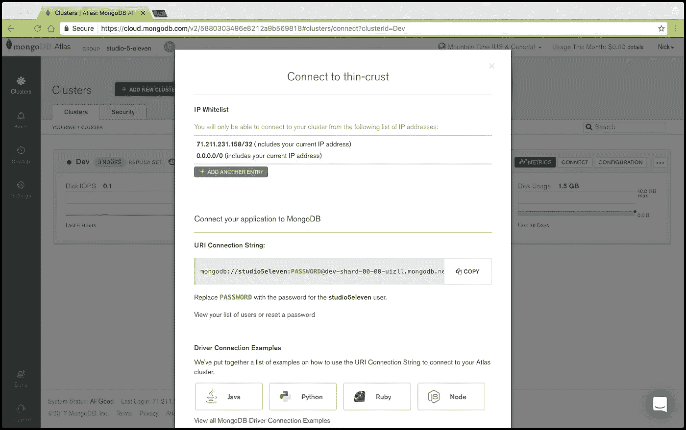
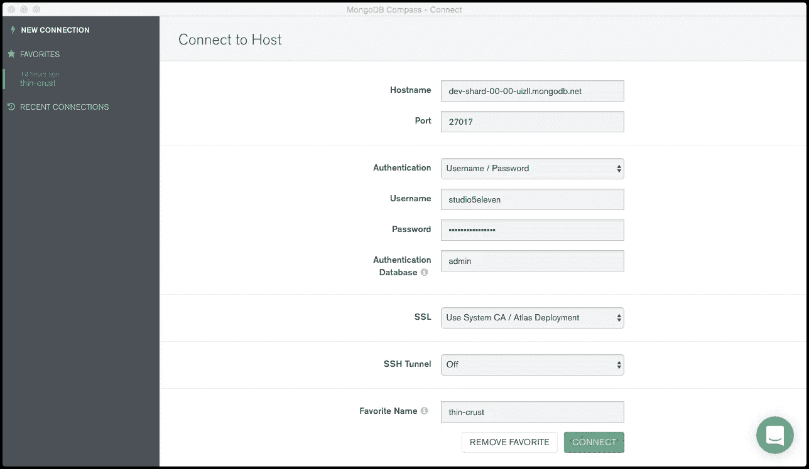
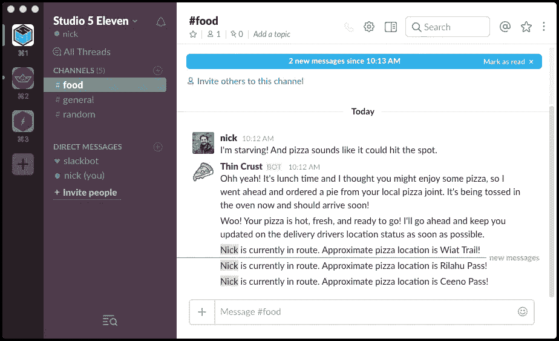

# 使用 Slack、MongoDB Atlas 和可定制游标进行实时交付更新

> 原文：<https://medium.com/hackernoon/real-time-delivery-updates-with-slack-mongodb-atlas-tailable-cursors-802b08b2c6c4>

**#简介**

如果你和我一样，在承担任何规模的工作时，快速有效是最重要的。作为一名开发人员，我每天都会使用一些应用程序来自动完成一些琐碎的任务，这样我就可以将精力集中在重要的复杂任务上，并确保我的工作效率达到最高水平。我最喜欢的工具之一是 [Slack](https://slack.com/) ，因为它如此紧密地集成到我的工作流程中，就像是将我所有的工具和任务联系在一起的网络。

如果你过去几年一直住在山洞里，Slack 就是*21 世纪的*团队沟通应用。Slack 的构建是为了让团队使用起来简单而有趣，它提供了一组广泛的 API，允许开发人员扩展其功能，使其更加有用(和有趣)。我喜欢 Slack 的一个功能是 Slackbot，这是一个友好的机器人，每个 Slack 团队都有，可以指导用户创建他们的个人资料，并向他们解释 Slack 是如何工作的。Slack 有几个内置的机器人(方便的小助手，挂在你的应用程序中，等待命令，然后找到或创建你需要的东西)，并允许你创建自己的东西。

Slack 最吸引我的地方在于它有可能构建你自己的定制机器人。在最基本的层面上，Slack 中的机器人是特殊的自动化用户，它们可以对特定事件做出响应，并做有用的事情来帮助您的团队提高效率。你可以制造的机器人的可能性是无穷无尽的，达到这些外部极限和以别人没有的方式创新的挑战使追求变得更加有趣。

在这篇文章中，我们将开始创建一个定制的 Slack 聊天机器人，它将模拟比萨饼的订购，并在任何给定的时间告诉你馅饼何时准备好，以及它的位置。为了创建这个 bot，我们将拼凑几个流行的技术——[node . js](https://nodejs.org)、 [Slack](https://slack.com) 、 [MongoDB Atlas](https://www.mongodb.com/cloud/atlas) 和 [MongoDB Compass](https://www.mongodb.com/products/lp/compass) 。此外，我们将利用 [MongoDB 可定制游标](https://docs.mongodb.com/manual/core/tailable-cursors/)进行实时通知。

**#先决条件**

为了跟随本教程，我们将假设你有基本的 Node.js 知识，包括一个安装版本的 [Node.js](https://nodejs.org) 和 NPM。您还需要对命令行和 AWS EC2 有一个基本的了解。

**#为你的 Slack 集成创建一个新的机器人**

因为我喜欢食物，尤其是对我来说，我认为构建一个机器人会很有趣，它会告诉你多久可以开始吃外卖披萨。要在您的 Slack 组织中添加新的 bot，请访问[https://[**your organization**]. Slack . com/services/new/bot，](https://[yourorganization].slack.com/services/new/bot,)，其中 **yourorganization** 必须替换为您组织的名称(例如[https://studio 5 eleven . Slack . com/services/new/bot)。](https://studio5eleven.slack.com/services/new/bot).)

***提示*** *:确保您在浏览器中登录到您的 Slack 组织，并且您具有创建新 bot 的管理权限。*

第一步:首先，你需要为你的机器人选择一个名字。薄地壳先生似乎很适合这个小家伙:

**步骤 2:** 接下来，您将转到另一个屏幕，在那里您将复制您的 API 令牌:

将令牌复制到一个安全的地方并保存起来，您可能会需要它。

在这一部分，你还可以指定更多关于你的机器人的细节，比如添加一个头像图片，让你的机器人看起来独一无二。

**#报名 MongoDB 图集(DBaaS)**

MongoDB Atlas 使得在云中设置、操作和扩展 MongoDB 部署变得很容易。从高可用性到可扩展性，从安全性到灾难恢复，MongoDB Atlas 为您提供了一切。

首先，去 https://mongodb.com/cloud/atlas[创建一个账户。](https://mongodb.com/cloud/atlas)

**#构建您的新 MongoDB 集群**

MongoDB Atlas 将通过几个直观的步骤引导您完成设置集群的过程，因此如果您不是老手(或者即使您是老手)也不必担心知道选择什么规格。

出于这个应用程序的目的，我们将把我们的集群命名为“thin-crust ”,但是，您可以随意命名您的集群。对于其余的设置，我们将坚持最低级别的要求，因为这只是一个原型，我们预计不会有大的流量激增。

***注意:*** *您需要为您的集群提供用户名和密码。我建议您选择让 MongoDB Atlas 为您生成一个随机密码。请确保你把它保存在一个安全的地方(也许用你在创建 Slack Bot 时写下的 API 令牌；) )，因为在本教程的后面部分您会用到它。*

一旦您完成了配置步骤，单击“确认和部署”,您的 MongoDB 集群将由 MongoDB Atlas 自动配置。完成后，您将收到一条通知，告知您的群集已被调配，您将能够单击“Connect”按钮，如下所示:

确保您复制了此步骤中的 URL 连接字符串，并将其与您的密码一起保存。您将需要此值才能前进。

**#连接带指南针的 MongoDB Atlas】**

如果您像我一样，您可能会喜欢使用一个漂亮的图形界面来探索您的 MongoDB 集群。令人欣慰的是，MongoDB 的优秀人员开发了一个名为 Compass 的神奇工具，这是一个 MongoDB 的 GUI，是探索和操作 MongoDB 数据的最简单的方法。它可以与 MongoDB Atlas 无缝协作，所以我选择在本教程中使用它。Compass 可在 Linux、Mac 或 Windows 上使用。要下载指南针，前往 https://www.mongodb.com/products/compass。

安装完成后，打开应用程序，您将看到一个干净的 UI，要求您提供登录集群的凭据。使用上一步中在仪表板中提供的 URL 连接字符串(以及您保存的密码)登录。

**#打造您的封顶系列**

MongoDB capped 集合支持可定制的游标，这允许 MongoDB 将数据推送到监听器。如果这种类型的游标到达结果集的末尾，它不会返回异常，而是一直阻塞，直到有新文档插入到集合中，并返回新文档。

封顶集合也具有极高的性能。事实上，MongoDB 在内部使用一个有上限的集合来存储他们的操作日志(或操作日志)。需要注意的一点是，作为高性能的一个权衡，上限集合是固定的(即大小“上限”)，因此不可分片。当你继续追求新的项目时，记住这样的事情可以帮助你选择最有效的工作工具；知道你有什么工具以及何时使用它们总是好的。

要创建您的 capped 收藏，请单击“创建收藏”并将收藏命名为“消息”。单击“capped collection”复选框，并指定一个 8，000，000 字节的 Capped Collection(足够用于本演示)。

**#跳转到代码**

如前所述，我们将在教程中使用 Node.js。代码相当简单。因此，只要你理解了编程的基础，你应该能够很好地理解。

我们的节点应用程序(我称之为“薄壳”)由三个主要文件组成，每个文件都有自己的一组任务:

1.  **Index.js** —初始化 Slackbot 并向 Slack 发布初始消息，随后在披萨完成离开烤箱时进行更新。
2.  **Worker.js** —连接 MongoDB 集群并将随机的街道地址插入到新创建的“消息”集合中。
3.  **Slack.js** —连接到 Slack 和 MongoDB 集群，监听 capped messages 集合的传入更新，并将消息发布到指定的(food)通道。

文件 1: Index.js

**文件二:** Worker.js

**文件三:** Slack.js

完整的资源库可以从 GitHub 下载:

**#在 AWS 上部署您的应用**

鉴于我们的脚本是轻量级的，我们不需要强大的服务器来驱动我们的脚本集。Node.js 运行在单核上，虽然有办法运行在多核上，但我们不需要。

考虑到这一点，我们将使用 [PM2](https://github.com/Unitech/pm2) ，Node.js 的一个轻量级进程管理器。PM2 将从本质上启动应用程序进程(脚本)，并确保它们保持在线，以防某些原因导致它们失败。

PM2 几乎可以在任何服务器上运行，然而，为了我们的目标，我们将在 AWS 上使用通用的 **t2.nano** 服务器，使用 Ubuntu 16.4 LTS。我将简要介绍配置服务器所需的步骤，但是大多数文档都可以在网上获得，所以我将把更广泛的研究留给您。

**第一步:**创建一个账户，或者登录您现有的 [AWS](https://aws.amazon.com) 账户。点击**计算服务**>**EC2**>**创建实例** > **启动实例**。这将为我们的项目设置一个新的实例。

**第二步:**从服务器类型中选择“Ubuntu Server 16.04 LTS (HVM)，SSD 卷类型”，点击“下一步”。接下来，从可用选项列表中选择 **t2.nano** 实例类型。最后，按照必要的步骤(保持一切默认)来配置服务器。配置完成后，您应该在 EC2 仪表板上看到实例状态为“正在运行”。

**步骤 3:** 单击实例旁边的复选框，然后单击顶部导航栏中的“Connect”。这将提供一个弹出对话框，为您提供前进所需的连接字符串。

**步骤 4:** 使用提供的连接字符串，SSH 进入实例并运行 **sudo su** 。从那里，通过运行 **cd ~** 导航到根目录。接下来，我们将安装 Node.js、NPM 和 PM2。

**步骤 5:** 按以下顺序运行命令:

**第六步:**通过运行 **git 克隆**[**git@github.com**](mailto:git@github.com)**:nparsons 08/thin-crust . git**将代码克隆到服务器上。一旦克隆到你的服务器，进入**薄壳**目录，运行命令 **nano process.json** 打开 **process.json** 进行编辑。打开后，放入您的 Slack 令牌和 MongoDB Atlas 连接字符串。然后，您可以使用以下命令成功启动您的应用程序:

***注:*** *如果你想了解 pm2 的幕后情况，你可以* *运行* ***pm2 列表*** *来输出所有活动的进程。更多关于 PM2 的信息可以在他们的官网这里找到:*[*http://pm2.keymetrics.io/*](http://pm2.keymetrics.io/)

**#行动中的应用**

现在你已经看到了底层的东西，你知道代码库是相当简单易懂的，但是它在生产中是什么样子的呢？在用户方面，您的 Slack 通道中会出现如下内容:

**#最后的想法**

队列是描述互操作但独立的流程的强大机制。即使没有数百个，也有数十个商业上可行的解决方案，但是，MongoDB 作为一个强大的消息队列，因为它具有灵活的文档存储能力、多种支持的语言和[可定制的光标](https://docs.mongodb.com/manual/core/tailable-cursors/)“推送”特性。

任意复杂的 JSON 消息的编组和解组是自动处理的。启用安全写入以提高消息的持久性和可靠性，并使用可定制的游标将数据从 MongoDB“推”到 Node.js。

虽然这个应用程序目前只是一个概念验证，但是还可以添加许多功能来更好地服务于最终用户。如果你决定为这个项目做出贡献，这里有一些改进的想法:

*   使用一个移动应用程序收集实际坐标(纬度和经度),并将它们存储在 MongoDB 中，以便进一步增强应用程序。关于地理空间操作符的更多信息可以在这里找到:[https://docs . MongoDB . com/manual/applications/geospatial-indexes/](https://docs.mongodb.com/manual/applications/geospatial-indexes/)
*   利用 Google Maps 或 Mapbox 在 Slack 中显示位置，提供位置的可视化表示。
*   使用位置和方向 API(如 https://www.mapbox.com/directions/的)提供交付的 ETA。
*   使用目前市场上可用的众多流量 API 中的一个，让用户知道他们的订单处理是否因流量过大而延迟。目前，Waze 有一个令人惊叹的开发者 SDK，可以在这里找到:【https://www.waze.com/sdk。

可以想象，可能性是无穷无尽的。我很好奇在下面的评论中听到你对补充和改进的想法。干杯，编码快乐！