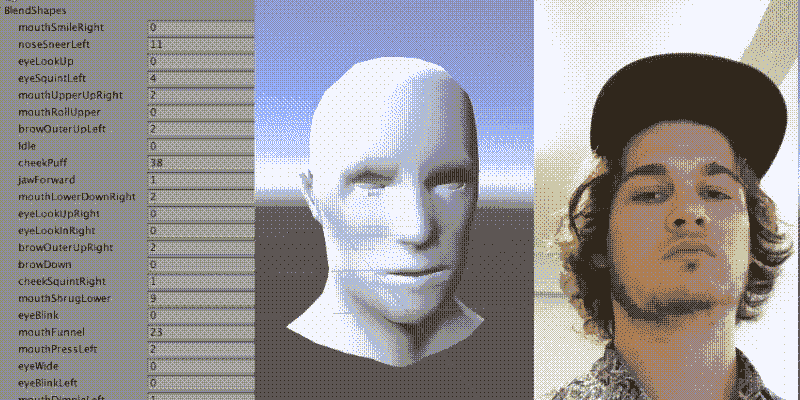
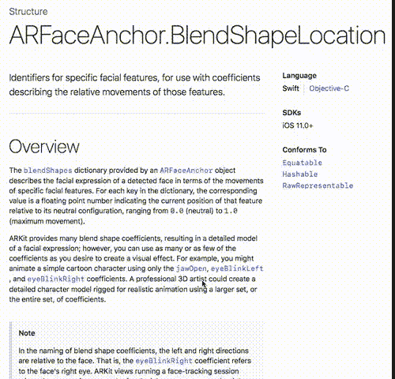
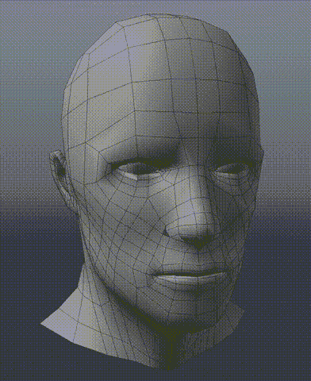
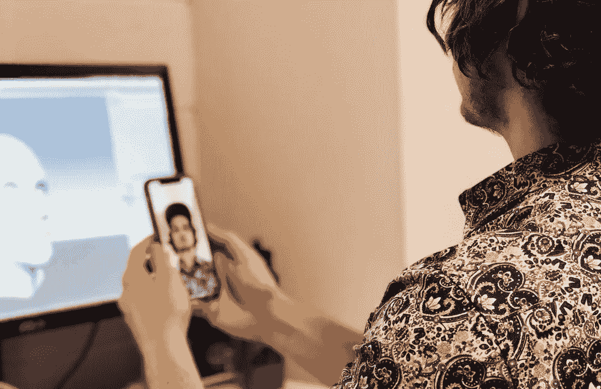

# 使用 iPhone X 实时捕捉面部表情

> 原文：<https://medium.com/hackernoon/real-time-facial-performance-capture-with-iphone-x-b378e21d077f>

当苹果宣布 iPhone X 和 Animoji 时，我们的第一个想法是:我们能不能用它来制作任意 3D 角色的动画？也就是不仅仅是苹果设计的 Animoji。

事实证明，是的，这不仅是可能的。这非常简单，ARKit face APIs 足够强大，可以制作出有用的动画。我们可以实时捕捉它。

我们将涵盖以下内容:

*   苹果的混合形状
*   在我们的模型上构建混合形状
*   我们的 iOS 应用程序通过 UDP 传输混合形状
*   Unity 扩展从我们的 iOS 应用程序接收数据
*   两个项目的源代码

结果是能够将混合形状参数从 iPhone X 实时传输到 Unity 中，以控制您的动画装备。

# 这不是已经做了吗？

最近有一篇[文章](http://prostheticknowledge.tumblr.com/post/167520295696/iphone-x-face-motion-capture-into-houdini-were)展示了 iPhone X 前置摄像头模块的 3D 输出。它显示了从 iPhone X 捕获并输入到 Houdini (3D 动画软件)中的原始顶点数据。然而，我们想要的是获得面部运动数据本身，并将其重新定向到任意的 3D 模型。

因此，举例来说，你只需把 iPhone X 举到脸前，就可以表演游戏中角色的口型同步和面部表情。或者你可以为一部电视剧制作一个角色的动画。

当前的自动面部动画技术分析音素的语音数据(例如，`ee`、`oo`、`ah`)，并将这些声音映射到 3D 模型混合形状。我们认为 iPhone X 可以产生更动态的面部表情，包括眉毛运动、眨眼、鼻子张开和眼睑运动。

# 使用 iPhone X 将面部运动重定向到网格

原来 ARKit 不仅给你从你的脸计算的原始顶点数据，它给你一组混合形状值。混合形状值只是介于 0.0 和 1.0 之间的数字，它告诉你 ARKit 认为你脸上的某块肌肉在运动。

因此，例如，`Jaw Open`混合形状在下颚闭合时为 0.0，在下颚张开时为 1.0。任何介于两者之间的值都表示下颚部分张开。

这真的很强大，因为如果你是一名 3D 艺术家，你不仅可以将苹果的混合形状映射到你的 3D 角色，还可以围绕各种值设计动画装备。例如，也许你有一只长着尖耳朵的卡通狐狸，当你发现有人皱眉时，你可以自动将耳朵转向下方(事实上，苹果公司也用他们自己的 Animoji 做到了这一点)。

# 制作变形目标

最费力的部分是在你定制的 3D 网格上模仿苹果的变形目标。

有很多混合形状。

总共有 [51 种混合形状](https://developer.apple.com/documentation/arkit/arfaceanchor.blendshapelocation)，包括`eyeBlinkLeft`、`eyeWideRight`、`mouthFunnel`、`mouthLowerDownLeft`等等。这些中的大多数是对称的，因为它们有左和右等价物。

这是我们为样本模型制作的混合形状。这些都是相当基本的，而且制作很快，所以我们可以测试这个想法的有效性。您自己的定制模型可以有更好、更复杂的混合形状。

# 它是如何工作的？

演示由两部分组成。iOS 应用程序和 Unity extension 主机。

## iOS 应用程序

在这里可以得到[。](http://github.com/johnjcsmith/iPhoneMoCap)

iOS 应用程序通过 UDP 套接字将苹果在`ARFaceAnchor.blendShapes`提供的混合形状传输到 Unity 主机。本质上是发出一个消息流，每个消息都有 50 个混合形状，格式为`'blend-shape-name:blend-shape-value'`。

这里有很多性能上的改进，但这只是为了演示的目的。

## Unity 扩展主机

在这里可以得到[。](http://github.com/johnjcsmith/iPhoneMoCapUnity)

在 Unity 主机内部，我们有一个扩展，它打开一个 UDP 套接字来监听 iPhone 的消息。当它收到消息时，它会将混合变形值应用到装备上相应的混合变形。

# 如何运行项目

*   从[这里](https://github.com/johnjcsmith/iPhoneMoCapUnity)克隆并打开 Unity 项目。
*   运行 Unity 项目的场景
*   在菜单栏中选择`iPhoneMoCap`->-
*   启用网格预览
*   从[这里](https://github.com/johnjcsmith/iPhoneMoCapiOS)抓取 iOS 应用项目
*   确保您的 iPhone X 连接到同一个 Wifi 网络，并构建/运行此应用程序。(不要忘记 pod 安装)
*   该应用程序应该会发现 unity 主机并开始传输运动数据。

## 作者

**西蒙·桑斯**领导[使](http://enabled.com.au)的移动开发活动非常注重设计和人机交互。Simeon 还被要求会见客户，了解他们的需求并开发技术解决方案。
在[推特上关注西蒙](https://twitter.com/TwoLivesLeft)

约翰·史密斯通常在 9-5 点出现在[的办公室](http://enabled.com.au)。他在较冷的月份穿鞋。除了服装，约翰的作品包括手机、网络和少量的 DevOps。
在推特[上关注约翰](https://twitter.com/johnjamescsmith)

## 获得更多移动应用程序设计技巧或问题？推文给我们 [@EnabledHQ](https://twitter.com/EnabledHQ)