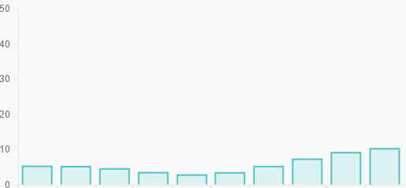

# React 在几分钟内的实时反应图表

> 原文：<https://medium.com/hackernoon/real-time-react-chart-with-rx-net-in-minutes-d76bdcf301e4>

*如何从跨平台添加异步实时数据流。NET 后端到您的 React web 应用程序。*

如果你曾经不得不处理异步数据流，你可能使用过或者至少听说过[react vex](http://reactivex.io/)，这是一个用于反应式[编程的库](https://hackernoon.com/tagged/programming)，它提供了强大的 API 来将数据流转换成可以订阅和操作的可观察序列。但是，它与常规事件驱动方法的不同之处在于，它能够从多个其他可观察序列中组合出新的数据流，您可以非常灵活地组合、过滤或转换这些序列。

我将展示如何利用这个库和我自己的库 [dotNetify-React](http://dotnetify.net/react/) 来实现一个相当简单的异步实时 web 应用程序。下面是我们将要构建的输出:



它是网络浏览器上的实时图表，由异步数据流提供，而异步数据流本身由两个不同的数据流组成；一个用于正弦波信号，另一个用于其振幅。

以下步骤使用脸书的[*create-react-app*](https://github.com/facebookincubator/create-react-app)样板文件生成 web app，以及[。NET Core SDK](https://www.microsoft.com/net/core#windowscmd) 运行后端。您需要首先安装它们。

如果只是想拉源代码，就去 Github[dotnetify-react-demo](https://github.com/dsuryd/dotnetify-react-demo)。还有一个运行在 Visual Studio 2017 上的版本在[dotnetify-react-demo-vs 2017](https://github.com/dsuryd/dotnetify-react-demo-vs2017)。

## 前端

我们将从创建应用程序外壳和安装所需的库开始:

```
create-react-app livechart
cd livechart
npm install dotnetify --save
npm install chart.js@1.1.1 --save
npm install react-chartjs@0.8.0 --save
npm install concurrently --save-dev
```

(我一直使用旧版本的图表库，因为 API 已经发生了变化，我还不熟悉它们。)

添加将呈现图表的组件`/src/LiveChart.jsx`:

```
import React from 'react';
import dotnetify from 'dotnetify';
import { Bar } from 'react-chartjs';export default class LiveChart extends React.Component {
   constructor(props) {
      super(props);
      dotnetify.react.connect("LiveChart", this);
      this.state = {}; this.chartData = {
         labels: Array(10).fill(""),
         datasets: [{
            data: Array(10),
            fillColor: 'rgba(75, 192, 192, 0.2)',
            strokeColor: 'rgba(75, 192, 192, 1)'
         }]
      };
      this.chartOptions = { 
         responsive: true, 
         scaleOverride: true, 
         scaleSteps: 5, 
         scaleStepWidth: 10 
      };
      this.updateChart = value => {
            this.chartData.datasets[0].data.shift();
            this.chartData.datasets[0].data.push(value);
      };
   }
   render() {
      return (
         <Bar data={this.chartData} options={this.chartOptions}>
            {this.updateChart(this.state.NextValue)}
         </Bar>
      );
   }
}
```

该组件最初将从带有空数据集的 *react-chartjs* 中呈现一个条形图组件。一旦通过 *dotNetify* 连接到后端，组件将接收到对`this.state.NextValue`的实时更新，这又会导致图表使用新的数据集值重新呈现。

接下来，替换默认的`/src/App.js`来呈现我们的组件:

```
import React, { Component } from 'react';
import LiveChart from './LiveChart';export default class App extends Component {
  render() {
    return <LiveChart />
  }
}
```

## 后端

前端就绪后，我们现在添加。网芯后端件。首先创建一个默认的 ASP.NET 核心 web 项目并安装所需的包:

```
dotnet new web
dotnet add package DotNetify.SignalR --version 2.1.0-pre
dotnet add package System.Reactive
dotnet restore
```

打开`package.json`并添加下面一行代码，将节点开发服务器未处理的请求重定向到。网络核心服务器:

```
"proxy": "http://localhost:5000/",
```

仍然在`package.json`中，修改调用`react-scripts`的代码行，以便同时使用*和*库来启动 Node 和。网络核心服务器:

```
"start": "concurrently \"react-scripts start\" \"dotnet run\" --kill-others",
```

接下来，添加将向前端组件提供实时更新的类`LiveChart.cs`:

```
using System;
using System.Reactive.Linq;namespace livechart
{
   public class LiveChart : DotNetify.BaseVM
   {
      private IDisposable _subscription;
      public int NextValue { get; set; } public LiveChart()
      {
         var sine = Observable
            .Interval(TimeSpan.FromMilliseconds(100))
            .Select(t => Math.Sin(2 * Math.PI * .06 * t)); var amp = Observable
            .Interval(TimeSpan.FromMilliseconds(100))
            .Select(a => a % 50 + 1); _subscription = Observable
            .Zip(sine, amp, (s, a) => (int) Math.Abs( s * a))
            .Subscribe(value =>
            {
               NextValue = value;
               Changed(nameof(NextValue));
               PushUpdates();
            });
      } public override void Dispose() => _subscription.Dispose();
   }
}
```

这个类背后的想法是产生一个数据流，它由另外两个流组成:一个是正弦波信号，另一个是数字的迭代，以产生波动幅度。为了创建流，我们使用 *Rx* [API](https://hackernoon.com/tagged/api) `Observable.Interval`在一个时间间隔内发出一个整数序列，然后进一步投射到所需的序列中。然后这两个流与`Observable.Zip`合并成一个流，由我们的类实例订阅。

当新数据可用时，我们使用 *dotNetify* API `Changed`和`PushUpdates`将数据发送到前端组件，以更新其本地状态。实际通信是通过*信号员*完成的，该信号员将在可用时使用*网络插座*。但是我们不必担心它，因为它已经被抽象掉了。

接下来，在`Startup.cs:`中配置 *dotNetify* 和 *SignalR*

```
using Microsoft.AspNetCore.Builder;
using Microsoft.AspNetCore.Hosting;
using Microsoft.AspNetCore.Http;
using Microsoft.Extensions.DependencyInjection;
using DotNetify;namespace livechart
{
   public class Startup
   {
      public void ConfigureServices(IServiceCollection services)
      {
         services.AddMemoryCache();
         services.AddSignalR();
         services.AddDotNetify();
      }
      public void Configure(IApplicationBuilder app)
      {
         app.UseWebSockets();
         app.UseSignalR();
         app.UseDotNetify();
         app.Run(async (context) =>
         {
            await context.Response.WriteAsync("LiveChart server");
         });
      }
   }
}
```

最后，构建并运行应用程序:

```
dotnet build
npm start
```

## 摘要

而且，就是这样。您可以在几分钟内快速构建的异步实时 web 应用程序。虽然这个例子有些做作，但我希望它仍然能够说明这种技术有多么强大。

在现实场景中，web 客户端可能会等待多个后端微服务，这些服务的异步输出需要链接在一起才能产生最终结果。使用*react vex*和 *dotNetify* 组合将显著降低代码复杂度，节省您的时间和精力。

[](http://bit.ly/HackernoonFB)[](https://goo.gl/k7XYbx)[](https://goo.gl/4ofytp)

> [黑客中午](http://bit.ly/Hackernoon)是黑客如何开始他们的下午。我们是 [@AMI](http://bit.ly/atAMIatAMI) 家庭的一员。我们现在[接受投稿](http://bit.ly/hackernoonsubmission)，并乐意[讨论广告&赞助](mailto:partners@amipublications.com)机会。
> 
> 如果你喜欢这个故事，我们推荐你阅读我们的[最新科技故事](http://bit.ly/hackernoonlatestt)和[趋势科技故事](https://hackernoon.com/trending)。直到下一次，不要把世界的现实想当然！

