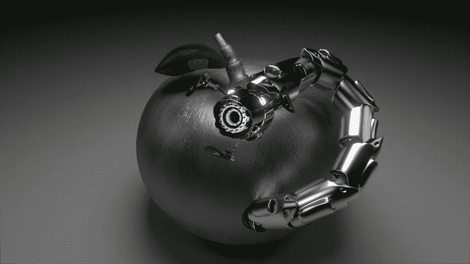

# 真实世界的自动化测试工具不是一根神奇的魔杖

> 原文：<https://medium.com/hackernoon/real-world-automated-test-tool-is-not-a-magical-wand-52627b8a9190>

***但即使是——你也需要专业的魔术师来操作。***

[自动化](https://hackernoon.com/we-really-need-more-helpful-automation-testing-tools-64f333955995)主要是关于方法和团队合作。当然，很多事情依赖于使用的工具，但是工具本身并不能完成工作。最终，是人们必须采取行动并获取结果。

我想大多数行业都是如此。工具——无论是工厂机器、商业分析[软件](https://hackernoon.com/tagged/software)、运输或测试自动化解决方案——都可以*帮助*您更快地完成工作，并且花费更少的资源。但是，设定目标、启动流程和实现结果是人类操作员的任务。

在某些特定领域进展更快。我们已经有了自动驾驶汽车，它可以带你在城市中四处转悠，确定一条最佳路线，而无需你的参与。从技术上来说，很快就有可能在聚会后给一辆全自动汽车发信息，让它送你回家。也许，几年后，我们将会有一个能够对网络用户界面进行全面回归测试的人工智能。但是今天，UI 测试自动化任务需要:

1.  详细的计划，
2.  一个团队，
3.  以及(最后)一个满足需求和项目需要的工具(参见第一部分“计划”的细节)。

当然，制定计划应该在所有其他阶段之前。组建团队也应该在最终决定工具和环境之前完成，原因如下。众所周知，专业的、积极的技术人员即使在资源有限的情况下也会比一群拥有丰富技术资源的新手做得更好。

当然，这并不意味着你应该让你的梦之队装备不足。事实上，最有效的选择是让他们决定第三部分。工程师应该知道他们需要什么；鉴于他们是一个构建良好的团队，他们可能会达成某种协议:一个对项目真正有帮助的[自动化测试工具](http://screenster.io/invoke-script-helping-your-automated-testing-tool-avoid-duplicate-steps/)。

所以还是那句话:以人为本；适当的工具将在适当的时间被发现/创造。设定明确的目标和目的，并重视雇佣专业人士——他们会自己找到实现这一目标的最佳方式。好的领导也是令人敬畏的。综合所有这些，然后一起做一个小调查，了解全球 [UI 测试自动化](http://screenster.io/ci-friendly-tools-for-ui-testing-automation-what-are-your-options/)市场的现状。尝试不同的解决方案，讨论，争论，再尝试——谁知道呢，也许真的会得到一根魔杖！

> [黑客中午](http://bit.ly/Hackernoon)是黑客如何开始他们的下午。我们是 [@AMI](http://bit.ly/atAMIatAMI) 家庭的一员。我们现在[接受投稿](http://bit.ly/hackernoonsubmission)并乐意[讨论广告&赞助](mailto:partners@amipublications.com)机会。
> 
> 如果你喜欢这个故事，我们推荐你阅读我们的[最新科技故事](http://bit.ly/hackernoonlatestt)和[趋势科技故事](https://hackernoon.com/trending)。直到下一次，不要把世界的现实想当然！

