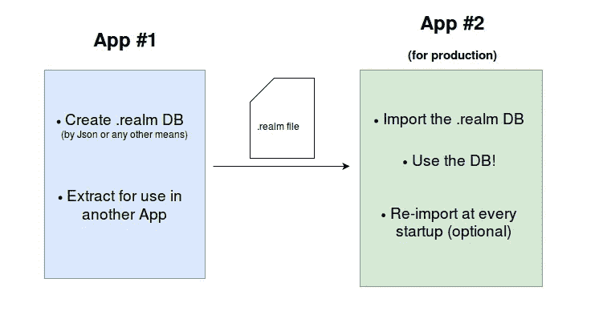
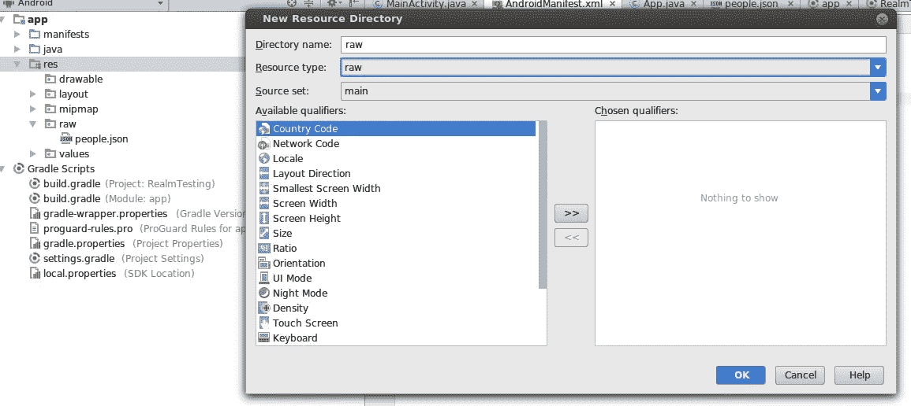
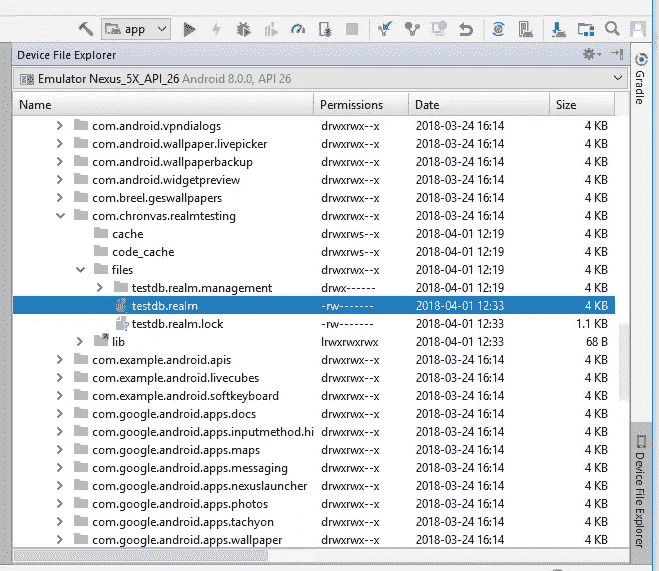

# Android 领域和初始种子数据:从 Json 预填充并提取数据库

> 原文：<https://medium.com/hackernoon/realm-for-android-pre-populating-from-json-and-extracting-the-database-8709a2f8db18>

我曾经遇到过创建一个使用 Realm 的应用程序的“麻烦”,这个应用程序的数据库中已经填充了数据，并且在发布的应用程序中只包含创建的[数据库](https://hackernoon.com/tagged/database)文件，而忽略了用来填充它的 Json(或任何其他文件)。

为“待发布”的应用程序这样做可以节省时间(解析文件和填充数据库)和空间(省略用于创建数据库的文件)。

## 主要思想:

我将展示实现这一点的最简单的方法，但这还可以改进(也许是一个单独的 [Gradle](https://hackernoon.com/tagged/gradle) 任务？)甚至成为主项目的一部分，不必为一个 app 维护 2 个代码库和 2 个不同的项目。

## 对于草率的

> 这个项目在 [Github](https://github.com/chronvas/RealmTesting) 上，但是先检查“记住”部分

# 开始！

我用的是 Android Studio (3.1)和 Realm Java 版本 5.0.0。项目的 build.gradle 如下所示:

app 模块的 build.gradle 如下所示:

是时候添加一个扩展 android.app.Application 的类了，所以我们的整个应用程序从这个类开始，Realm 在 OnCreate 上进行初始化和配置。为您的设置名称非常方便。包含数据库的领域文件。这样可以[通过](https://realm.io/docs/java/latest/api/io/realm/RealmConfiguration.Builder.html)更多的配置。只要记得在 Android 清单中指出这个类就行了。

现在我们需要 Json 文件。出于简洁的原因，一个简单的文件命名为“people.json”:

的。json 文件必须放在原始资源中才能被访问。如果原始资源文件夹不存在，请创建它

用于解析 Json 的表示 Java 类:

## 好吧！是时候进行解析了

通常，我们会使用一个扩展 AsyncTask 的助手类。但是由于 Realm.executeTransaction，我们可以用这个内置方法来代替。

和一个简单的呼叫按钮。importFromJson()

请记住，调用 importFromJson 不会删除数据库或其中的数据，它只是添加 Json 解析的结果。

在 Android monitor 上，我们可以查看完成所需的时间，可能是从已发布的应用程序中节省的时间。

# 现在，我的。领域数据库文件？

一旦你把应用程序运行到一个设备上，在 Android Studio 中，打开“设备文件浏览器”，导航到“Data / Data / <package name="">/ files”目录下你就可以找到了。领域文件，并将其拖到您的计算机上。</package>

## 成功了吗？

为了简单起见，您可以添加另一个按钮来返回在数据库中找到的人数。这两个简单按钮的代码可能如下所示:

现在拿着。realm 文件，并再次将其放在 raw resources 下，以用作数据库。

# 在“待发布”应用程序上

只要把。领域文件，并使用 App.java 上的 copyBundledRealmFile 方法将其复制到适当的位置(FilesDir)。

我添加了一个***shouldOverwriteDatabaseOnAppStartup***标志，如果你想在每次应用程序启动时用一个新的覆盖数据库，或者只保留应用程序第一次运行时 copyBundledRealmFile 创建的数据库:

# 谨记！

*   将***shouldOverwriteDatabaseOnAppStartup***标志设置为 true，**每次应用程序启动**时，它都会复制或覆盖。领域数据库从原始目录到/files 目录，所以请记住，无论你做什么改变，它将在 App.java 调用时丢失。为了演示这个“问题”,我又添加了 2 个按钮来更改和查询第一个人的名字。**为了避免这种**，将标志设置为 false，这将在写入之前检查文件是否存在。领域文件。
*   的。领域文件仍有 2 个实例。在原始资源目录和/files 目录中。所以节省空间是不完全的。
*   在读取数据库时，不要忘记使用正确的数据模型，或者在需要时使用领域迁移。

> 我希望这篇文章对你有用。这个项目可以在这里找到[https://github.com/chronvas/RealmTesting](https://github.com/chronvas/RealmTesting)
> 
> 特别感谢 Kenneth Geisshirt 阅读本文并建议 realm . execute transaction over async task

> [黑客中午](http://bit.ly/Hackernoon)是黑客如何开始他们的下午。我们是阿妹家庭的一员。我们现在[接受投稿](http://bit.ly/hackernoonsubmission)并乐意[讨论广告&赞助](mailto:partners@amipublications.com)的机会。
> 
> 如果你喜欢这个故事，我们推荐你阅读我们的[最新科技故事](http://bit.ly/hackernoonlatestt)和[趋势科技故事](https://hackernoon.com/trending)。直到下一次，不要把世界的现实想当然！

