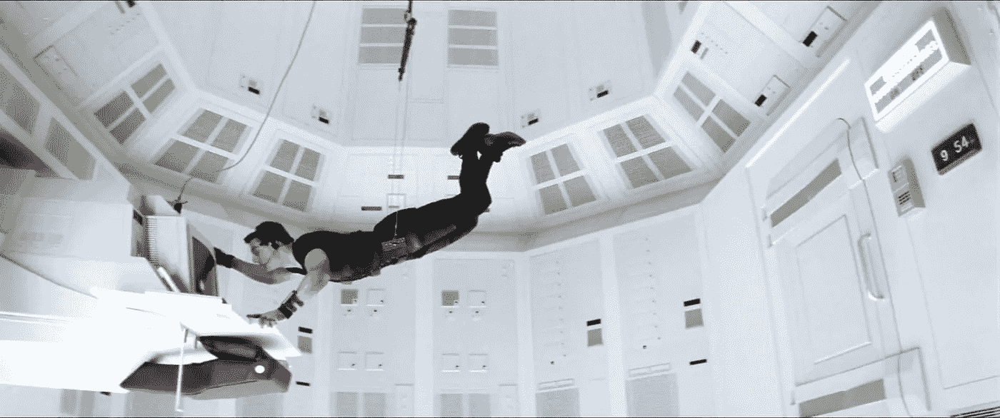
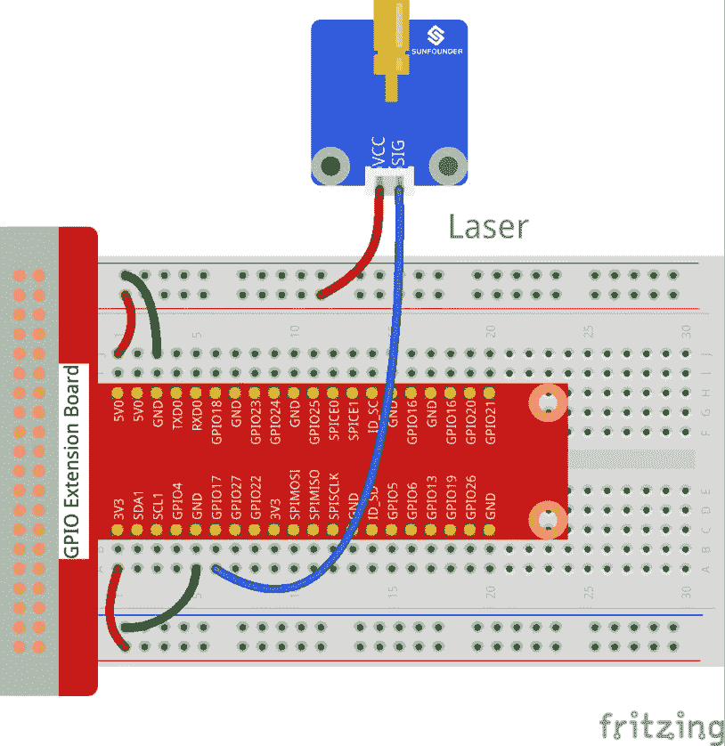
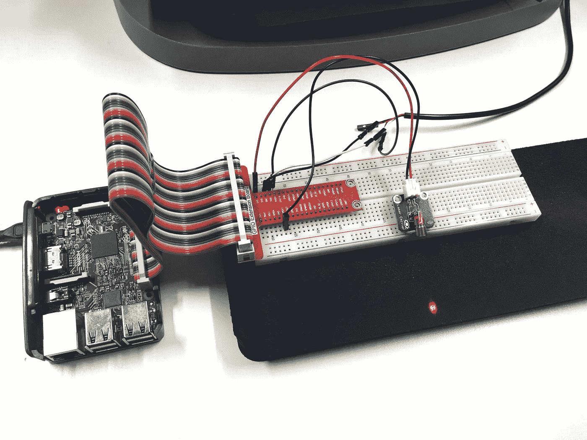

# 在拉斯贝里皮星球的伊利莎重建不可能完成的任务的安全系统

> 原文：<https://medium.com/hackernoon/rebuilding-the-mission-impossible-security-system-in-elixir-on-raspberrypi-e4ed07650210>

由[刘矩](https://twitter.com/arkh4m)


Rebuilding the Mission Impossible security system in Elixir on RaspberryPi

是的，你没看错。在本教程中，我们将重建 1996 年经典电影《碟中谍》中令人惊叹的安全系统。我们将使用树莓派，许多传感器，我们将在[药剂](http://www2.erlang-solutions.com/l/23452/2017-05-02/4ktymv)中编写代码。



对那些没看过这部电影的人来说，这只是一个快速复习。伊森·亨特是一名超级间谍，他试图潜入中情局总部，窃取一份有价值的双面间谍名单。不幸的是，该列表被安全地存储在一个高度安全的掩体中，具有以下安全机制:

*   激光束
*   温度传感器
*   噪声传感器
*   地面振动传感器

# 准备

在我们开始之前，让我给你我在开始开发 Raspberry Pi 时收到的最好的建议:**给你自己一根 USB 转 TTL 的串行电缆**！你可以在 adafruit ( [链接](https://www.adafruit.com/product/954?utm_source=Erlang%20Solutions&utm_medium=Blog&utm_campaign=Raspberry%20Pi%20Mission%20Impossible&utm_term=Elixir)、[教程](https://learn.adafruit.com/adafruits-raspberry-pi-lesson-5-using-a-console-cable?utm_source=Erlang%20Solutions&utm_medium=Blog&utm_campaign=Raspberry%20Pi%20Mission%20Impossible&utm_term=Elixir))上找到它们，这些小设备将省去你为了使用你的覆盆子而必须连接外部显示器、键盘和鼠标的麻烦。只需连接电缆，启动`screen`，你就可以进入了。

现在我们需要一些传感器来构建我们的安全系统，我找到了 Sunfounder 制作的一套传感器，它拥有我们需要的一切，甚至更多([链接](https://www.amazon.com/SunFounder-Modules-Sensor-Raspberry-Extension/dp/B014PF05ZA))。我和这家公司没有任何关系，但是他们把所有的 C 和 Python 代码都放在了 github 上，所以我认为他们很酷。

我们最不需要的就是长生不老药！我们可以按照本教程在我们的树莓 Pi 上安装它。

# 我们开始吧

我们现在可以使用我们钟爱的`mix`创建项目了:

```
$ mix new intrusion_countermeasures
```

并在我们的`mix.exs`文件中添加`elixir_ale`作为依赖项:

```
defmodule IntrusionCountermeasures.Mixfile do use Mix.Project def project do [app: :intrusion_countermeasures, version: "0.1.0", elixir: "~> 1.4", build_embedded: Mix.env == :prod, start_permanent: Mix.env == :prod, deps: deps()] end def application do [extra_applications: [:logger], mod: {IntrusionCountermeasures, []}] end defp deps do [{:elixir_ale, "~> 0.5.6"}] end end
```

这个库将为我们提供控制 Raspberry GPIO 管脚和 I2C 总线的抽象。你可以在这里找到更多关于图书馆的信息。所以让我们安装并编译:

```
$ mix deps.get && mix compile
```

# 首先:激光！

抓住您的激光发射器模块，并以这种方式将其连接到试验板:



现在我们可以开始为我们的安全系统编写代码了:

```
defmodule IntrusionCountermeasures do use Application def start(_, _) do {:ok, laser} = Gpio.start_link(17, :output) pid = spawn(fn -> loop(laser) end) {:ok, pid} end def loop(laser) do :timer.sleep(200) turn_on(laser) :timer.sleep(200) turn_off(laser) loop(laser) end defp turn_on(pid) do Gpio.write(pid, 0) end defp turn_off(pid) do Gpio.write(pid, 1) end end
```

我们使用`Gpio.start_link`连接 GPIO 引脚 17，指定我们将其用作输出。然后，我们产生一个递归循环函数，重复地打开和关闭激光器。我们可以用`iex -S mix`运行我们的应用程序，激光将开始闪烁。多酷啊。

还要注意，默认行为是写`0`打开某个东西，写`1`关闭它。为了让代码更容易理解，我添加了`turn_on`和`turn_off`助手。

这是我桌子上的一张照片:



# 阅读更多

现在我们有了激光闪烁，请访问 Erlang 解决方案博客 了解如何添加噪声、温度和振动检测传感器。

*了解更多关于 Erlang Solutions 如何通过*[*Elixir Development*](http://www2.erlang-solutions.com/l/23452/2017-05-02/4ktymv)*或* [*为您提供支持的信息，注册我们的邮件列表*](http://www2.erlang-solutions.com/emailpreference) *成为第一个知道我们未来博客文章的人。*

*原载于*[*www.erlang-solutions.com*](http://www2.erlang-solutions.com/l/23452/2017-05-02/4kv1pz)*。*