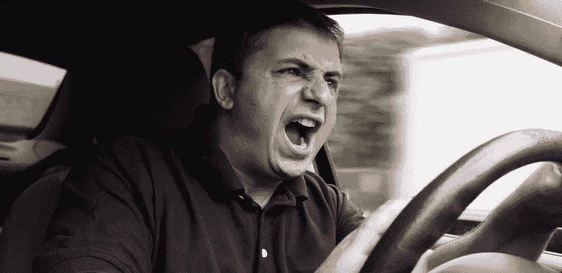

# 鲁莽的司机反对自动驾驶汽车

> 原文：<https://medium.com/hackernoon/reckless-driver-against-self-driving-cars-b787dc4af273>

尽管他在快车道上忙碌，但地区男子丹·卡特勇敢地花时间将自动驾驶汽车的危险带到聚光灯下。

在一个十字路口超速行驶，差点撞倒一个跑到街上的孩子，卡特若有所思地说:“你知道，司机要做出道德决定，需要处理很多复杂的信息。我们怎么能相信一台不道德的电脑会做出正确的选择呢？”在对孩子按喇叭和咒骂之后，他继续说道，“我只是说，如果没有人类司机在棘手的情况下做出最后的决定，自动驾驶汽车将会对我们的社会造成严重破坏。”

在记者发稿时，有人听到卡特大喊“加速，混蛋！”因为他差点撞上一辆在黄灯时减速的汽车。