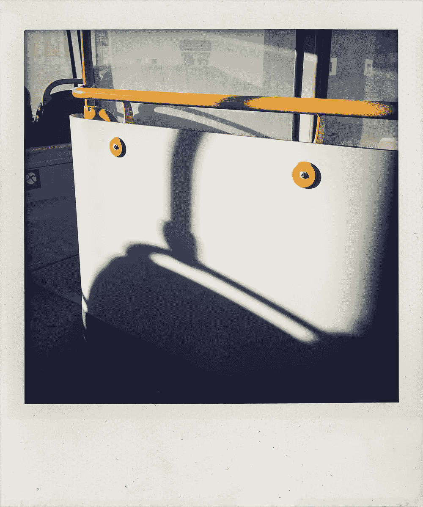
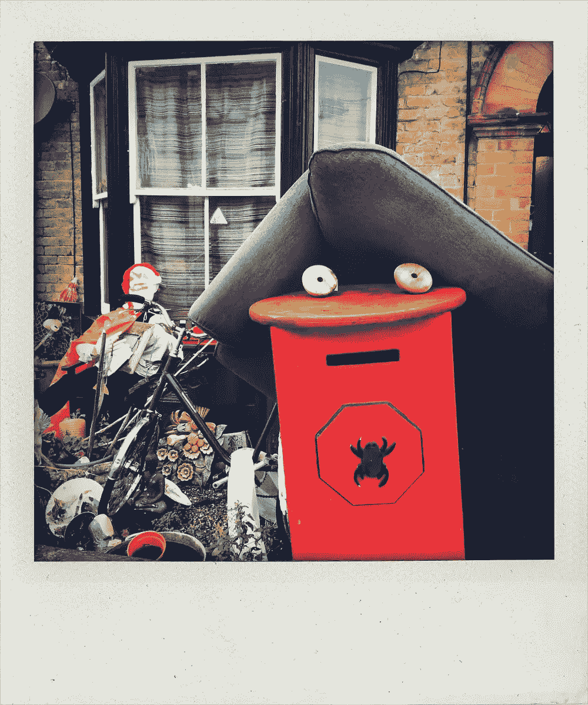
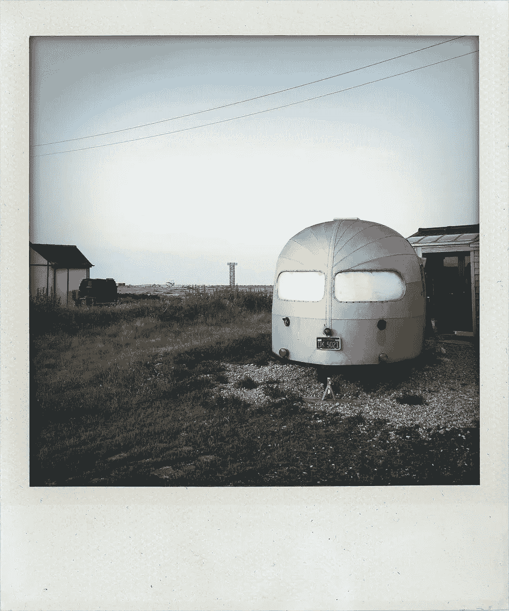
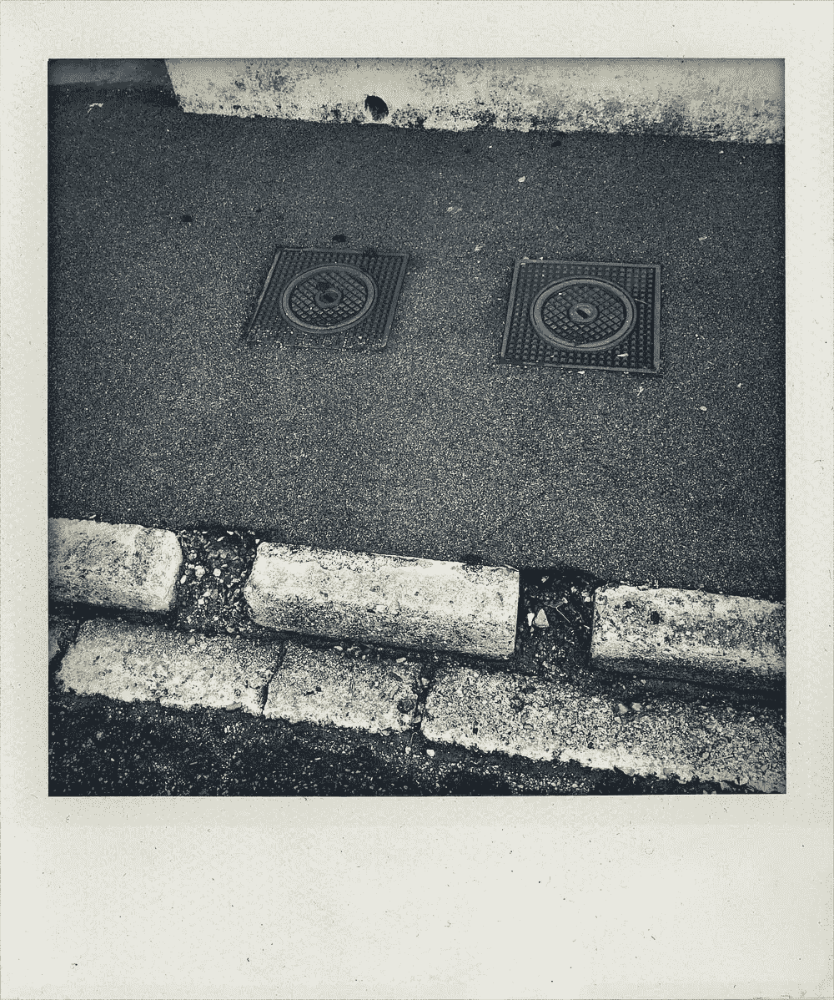

# 承认

> 原文：<https://medium.com/hackernoon/recognition-112babc49db8>

[series: Objects Are People Too | photography: Justin Sutcliffe](https://justinsutcliffe.pixelrights.com/albums/pdhQuc/objects-are-people-too)

艺术是一种强加给经验的模式，我们的审美享受是对这种模式的认知。—阿尔弗雷德·诺斯·怀特海