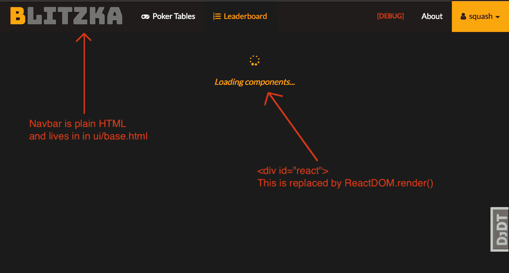
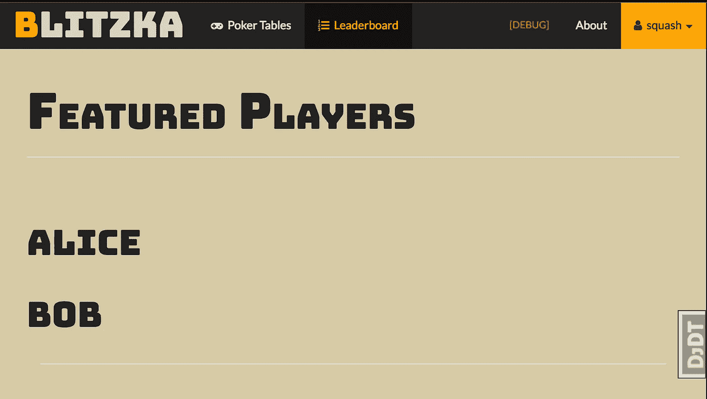

# 协调后端模板和前端组件

> 原文：<https://medium.com/hackernoon/reconciling-djangos-mvc-templates-with-react-components-3aa986cf510a>

## 如何在不制作单页应用程序的情况下构建前端

在$startupNameHere，我们决定用 Django 编写后端，用 React 编写前端。这种组合如今并不罕见，但如果你曾经尝试过，你可能会发现后端模板系统的页面组合和 React 的组件模型之间存在一些摩擦。

最根本的问题是 Django 希望您使用模板片段构建页面，而 React 希望将您带入以 JS 组件为主要构建块的世界。Rails、Flask 和任何其他使用模板的后端框架也会出现这种冲突。

我在这里告诉你这些不一定要冲突，有可能两者都用而不激怒小人国。

# 放弃 SPA，拥抱页面组件

我们的解决方案是放弃单页面应用模型，而是让 Django 单独为每个页面提供服务，为每个页面提供一个根 React 组件。Django 模板提供了不会在页面之间改变的基本站点组件(如导航条、页脚),而特定于每个页面的内容(如扑克界面、排行榜)是在 React 中编写的。

> 抛弃 SPA，为什么会说出这么恐怖的话？！

*   **单页面应用并不总是解决方案**，通过让 Django 处理页面样板和路由，我们已经获得了稳定性(错误仅限于一个页面)、更容易的调试、更容易的搜索引擎索引和更容易的静态页面管理
*   当您在 Django 模板中有了所有的页面样板时，为静态内容(例如关于页面、登录页面)创建非 React 页面就容易多了
*   不需要处理 React 路由器，历史 API，或者在幕后异步获取页面内容(更多关于我们如何在不刷新页面的情况下进行页面热加载的内容将在后面的文章中介绍)

> 那么这在实践中是什么样的呢？

# Django 模板

这里我们有一个用于 React 页面的基本模板，注意它是如何扩展 ui/base.html 的(它包含了我们的标题、导航条和所有放在基本模板中的常用内容)。

这个基本模板可以接受 JS 组件文件和 props 的任意组合。如果你想你甚至不必传递一个 React 组件，你可以传递一个 Vue.js 或 Angular 脚本，让它渲染到`window.react_mount`并读取`window.props`。

> 但是这个页面是空的，我如何渲染我的 React 组件？

`{{component}}`是一个脚本的路径，例如`leaderboard.js`，它包含一个标准的 React 组件，使用 ReactDOM 呈现。该脚本应该已经编译好，并且可以通过浏览器从 staticfiles 文件夹中访问。它可以被你的后端和 nginx 主动缓存，因为内容从不改变，所有动态内容都通过`window.props`传递。

到目前为止，这给了我们一个带有导航条和加载消息的基本页面。一旦我们有一个组件要挂载，加载消息就会被组件替换(这个过程发生得如此之快，以至于您的用户永远不会看到加载组件…消息)。

# 反应组分

现在我们定义一个布局页面的基本 React 组件。我们可以从其他 JS 文件中导入可重用的组件，或者只是将它们全部写在一个文件中。为了简单起见，我将在这里这样做。一个更复杂的页面可能会挂载一个 redux Provider，导入几十个组件，或者在这里设置 websocket 连接。可以把它看作是您的'`base.js`'入口点，类似于 SPA `base.js`，只不过它只定义了一个页面的内容。

这里我实现了一个简单的排行榜，它显示了用户列表。

## 构建 Javascript 组件

我们使用 [browserify](http://browserify.org/) 将这个源文件从 ES6 编译成古 JS，并把它放在我们的 staticfiles 文件夹中，这样就可以很容易地提供(和缓存)它。为了简单起见，我选择了 browserify，但是您可以在您的项目中使用 webpack 并获得相同的结果。

`browserify src/pages/leaderboard.js > static/src/pages/leaderboard.js`

太好了，现在屏幕上有东西了！

> 但是 Alice & Bob 是从哪里来的，我们是怎么把数据传递给模板的？

# 景色

Django 视图只需要向 react_base.html 模板提供以下上下文，就可以正确地呈现这个页面:

1.  `component` = `leaderboard.js`(上面我们的 React 文件)
2.  `props` = `{users: [{username: ‘alice’}, {username: ‘bob’}]}`(作为道具传递给 React 组件的数据)
3.  `title` = `‘Leaderboard’`(用于浏览器标签标题)

# 为什么使用这种模式，有其他选择吗？

这种在基本模板中安装组件的简单模式非常强大，它传递要反应的东西。它允许您自由地混合和匹配模板组合与 React 组件，这取决于您对给定页面的需求。

> 但是我们已经在一个复杂的 REST API 上构建了我们的整个前端，从用户信息到页面内容都有端点，为什么这样更好呢？

如果你已经有了一个基于 REST API 的 SPA，不要去重写你的整个前端。使用 REST API + SPA 可以获得一些使用 page-as-a-component 无法获得的优势，比如减少了包的大小，因为 webpack 可以跨页面优化共享代码。如果将后端功能拆分成单独的微服务，也可能更容易扩展。如果您对稍微大一点的包没问题，那么页面作为组件的方法是很好的，这样可以获得灵活性以及与 Django 模板和路由的良好交互。

> 如果我现在从头开始开发一个应用程序，我有什么选择？

*   **SPA +粒度 API:** 使用 Django 作为 REST API 后端，并通过 API 端点提供所有页面数据，这些数据由一个单片 SPA React 应用程序查询(这是我在网上看到教得最多的方法)。这种方法对于微服务风格的后端来说非常好，因为前端并不关心后端是如何构建的，或者它到达了什么端点，只要它获得了所需的数据。
    - *Webpack 针对这种方法进行了优化。
    -前端可以建立在许多独立的微服务端点之上
    -前端处理路由&切换到新页面
    -很难确定服务器端渲染(可能对搜索索引不利)
    -在不良连接上加载缓慢，因为数据需要多次往返*
*   **SPA + 1 个每页请求 API:** 将每个页面的数据作为一个请求提供，前端仍然处理路由，但后端是用每页一个视图构建的，而不是许多更小的 REST API 端点。这样开始通常比为每个查询公开单独的端点更容易，但是它相当紧密地耦合了后端&前端逻辑。
    - *前端处理路由&切换到新页面*
    - *前端几乎依赖于来自一个端点的所有数据
    -加载时间更快，比拥有单独端点更容易缓存
    -更容易进行服务器端渲染，因为视图与前端数据匹配
    -在不良连接上表现不错，但仍需要 2 次往返*
*   **模板化的 JS 片段:**使用模板系统编写 React 组件，通过包含 JS 代码片段来构建呈现所需页面的 html 模板(而不是挂载一个包含 JS 中定义的整个页面的组件文件)。根据我的经验，这种方法需要最大的 haxxing，因为您完全忽略了 JS 导入的好处，并且破坏了您的 lint 页面、缩小 JS 以及将页面编译为所需的最小 JS 量的能力。这是像[django-react-template tags](https://github.com/Frojd/django-react-templatetags)这样的库使用的方法，它允许服务器端渲染，但是它引入了很多复杂性(包括一个节点服务器！)到你的后端。
    - *不需要 AJAX 请求，所有数据由页面提供*-
    -*后端处理所有路由，前端链接是正常的 href
    -服务器端呈现非常容易，数据全部由一个视图提供，片段可以独立呈现并缓存
    -容易在逐段的基础上用 react 组件替换 non-react 组件
    -加载速度非常快，呈现的片段可以缓存并与其数据一起提供(非常适合搜索索引)【T33*
*   **页面组件**(我们的方法):用 JS 编写页面，将每个页面作为可缓存的`<script>`包含在模板中，通过 props 传递数据。这种方法结合了两者的优点，您可以在 React 中进行页面合成，同时还可以轻松地在服务器端呈现和缓存整个页面。当您没有单独的 react 片段时，管理数据流也更容易，因为所有组件都是从一个挂载点向下分层布局的。
    *-稍微更难将&匹配模板片段与 React 组件* -*-比*模板化 JS 片段更可定制-*构建过程
    - *灵活，同样适用于 Vue.js 或 Angular
    等非 React 页面-更易于管理数据流 bc。单个 JS 入口点(esp。with redux)
    -如果脚本包被缓存，则加载 1 个往返页面**
*   有你的团队使用但我没有提到的模式吗？*我一直在寻找新的，联系我@theSquashSH，我会在这里收录。*

# 扩展页面作为组件模式

> 好吧，小人国的人对这个设计很满意，但是他们想要更多的功能！

上面的代码示例过于简化。2017 年的真正应用程序可能会安装 Redux 提供程序，创建 WebSocket 连接，通过网络获取内容，并导入几十个组件来组装一个完整的页面。

既然我已经介绍了一个基本模式，是时候考虑用下一层功能来扩展它了。根据您的应用，您可以决定添加:

*   Django 端更高级、可扩展的页面视图
*   添加一些所有页面共享的属性(如当前用户信息、查看语言、时区、`get_base_props(request)`)
*   用于[管理前端状态](https://hackernoon.com/shape-your-redux-store-like-your-database-98faa4754fd5)的冗余存储
*   **WebSocket 使用 django-channels** 连接到 Django，其中处理程序代码位于页面视图的旁边(查看我们的 [django-channels-router](https://github.com/Monadical-SAS/django-channels-router) 库)
*   实时更新的[反应动画](https://github.com/Monadical-SAS/redux-time)与后端时间同步
*   点击链接而不刷新时，热加载新页面。这是用`react-router`做 SPA 的一个优点，但是我们不需要做完全的 SPA 就可以非常接近。通过向<主体>
    2 追加一个新的脚本标签来加载下一个页面的 JS 组件文件。以 JSON 响应的形式查询一个服务于该页面道具的端点，并将它们保存到`window.props`
    3。使用:
    `ReactDOM.render(<NewPage {...window.props}/>, window.react_mount)`
    呈现新页面热加载可能很难正确完成，当加载 JS 脚本和查询 API 端点时，很难干净地从错误中恢复并返回到正常导航，这可能会以多种方式独立失败。您可能还需要修改历史 API，以便在导航时更改 URL 和浏览器标题。

如果你有任何问题，可以在 twitter @theSquashSH 上联系我，或者在[https://oddslingers.com](https://oddslingers.com)查看我们的网站！

在我们的应用程序(一个扑克网站)中，我们使用`django-channels`通过 WebSockets 向`react-redux`前端发送数据。前端实时显示一些游戏状态，同时与所有其他站点的观众保持时间同步，保持在 25 毫秒以内。我们没有找到任何以我们喜欢的方式实现 web 动画的库，所以我们最终实现了自己的库:`[redux-time](https://github.com/Monadical-SAS/redux-time)`。如果你正试图用`redux`风格的状态管理以一种功能性的、声明性的方式来做实时动画，这是值得一试的。我们还开发了`[django-channels-router](https://github.com/Monadical-SAS/django-channels-router)`,它是后端路由，用于处理去往/来自前端的套接字消息。如果你觉得这两个库有用，或者你以前做过类似的工作，请告诉我！

# 链接和资源:

*   如果你是 Django 和结构化应用程序的新手，从这里开始一个温和的介绍:[构建你的第一个 Python & Django 应用程序](https://scotch.io/tutorials/build-your-first-python-and-django-application)
*   django-react-templatetags 一个用于模板化 react 片段的库
*   小人国的人到底是谁？！
*   [为什么 React.js 不需要 MVC](http://www.code-experience.com/why-you-might-not-need-mvc-with-reactjs/)
*   涵盖更多细节的教程，有一些不同的设计决策:[我他妈的怎么设置 Django，Django REST Framework，ReactJS 和 Browserify？](http://gregblogs.com/how-django-reactjs-and-browserify/)
*   [next . js](https://learnnextjs.com):React&节点的构建环境/库，使用了与*页面组件*非常相似的系统

> TL；dr 让 Django 管理你的路由，为每个页面制作单独的 JS 文件，通过模板将 props 数据传递给你的组件

# —

希望你觉得这有用！如果有，给这篇文章一个💚，或者在 twitter 上 ping 我 [@theSquashSH](https://twitter.com/theSquashSH) 。

如果你对涉及以太坊的很酷的 Django + React/Redux 项目感兴趣， [Monadical 正在招聘](https://monadical.com)远程&本地开发人员(第一个月我们会带你去阳光明媚的麦德林)！

