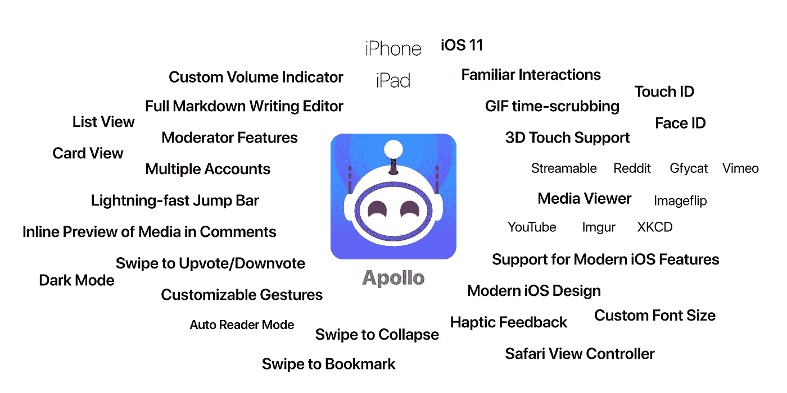
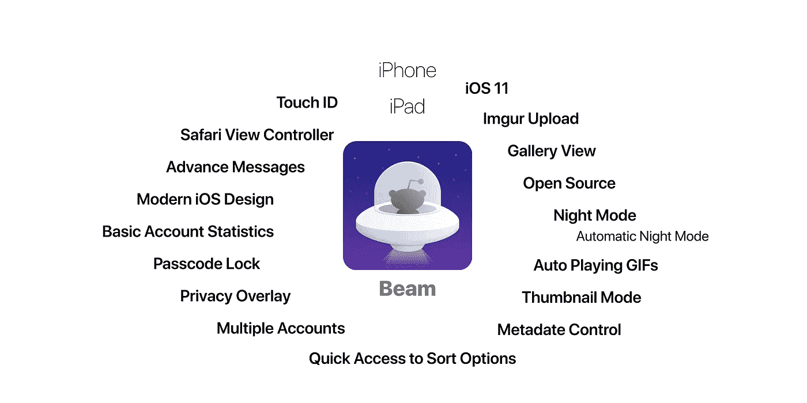
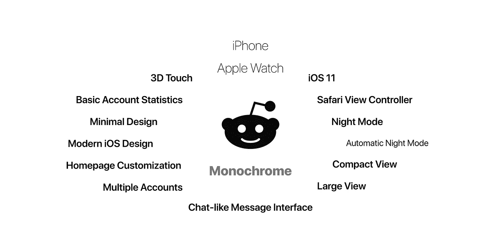
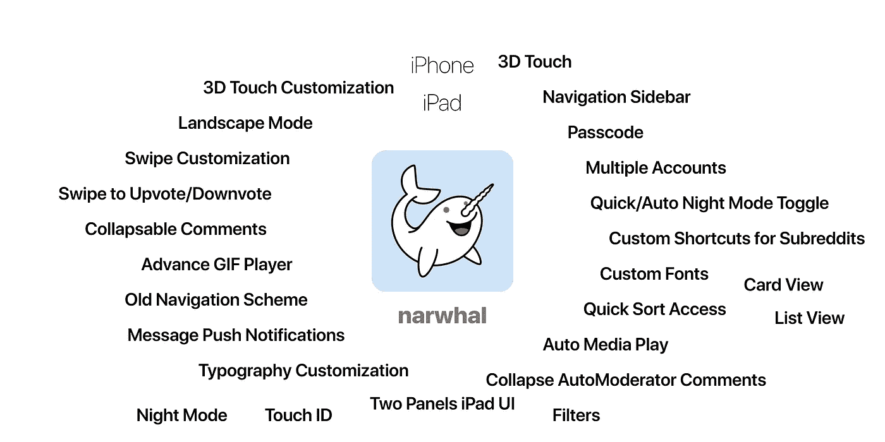
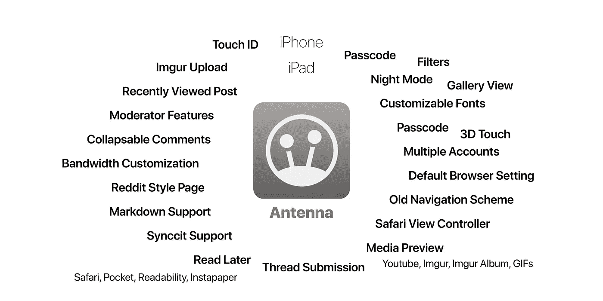

# 用于 iOS 的 Reddit 客户端

> 原文：<https://medium.com/hackernoon/reddit-clients-for-ios-d183db1057ea>

[Reddit](https://hackernoon.com/tagged/reddit) 很棒；Reddit 官方 app 不是！虽然 Reddit 团队正在努力推出一种混合设计语言，他们可以统一 iOS 和 [Android](https://hackernoon.com/tagged/android) 之间的用户体验，但到目前为止，他们只成功推出了一款漏洞百出、反应迟钝的官方应用。官方应用年轻而大胆，它将成为大多数人的首选应用。但很快，它将成为下一个人人讨厌但不得不使用的 Twitter、脸书、YouTube 和 Pinterest 官方应用，因为它提供第一手体验，并获得其他应用不允许提供的独家功能。它将为你提供广告，并像其他大家伙一样跟踪你。

就像 Twitter 官方应用的早期时代一样，Reddit 仍然有许多优秀的第三方应用。在本文的其余部分，我将列出一些在 iOS 上可用的出色的 Reddit 客户端，作为官方 *Reddit for iOS* 的替代。我不指望他们中的许多人能坚持多久，因为我确信 Reddit 团队不会非常喜欢他们，因为 YouTube 不喜欢 ProTube，或者 Twitter 不喜欢 TweetBot！

## Reddit 的阿波罗——每个人的客户端，尤其是读者/作家

Apollo 可能是 iOS 上最年轻的 Reddit 客户端，但它是其中最纯粹的。核心体验直观明了。开发者从默认的 iOS 应用程序的行为中继承了很多，他非常紧密地跟随苹果 HUD。因此，你会立刻觉得你知道这个应用程序和隐藏在其中的每一个交互。你不需要学习它。颜色和手势都很熟悉。他们的行为和感觉与他们在 Mail 或 Notes 应用程序中的感觉相似。一个微妙的触觉反馈正在奖励应用程序中的每一个小互动；这使得向上投票更有价值！

阿波罗本质上是免费的。唯一被锁定在 IAP ( **2.99 美元** / **3.99€** )背后的功能是能够在 Reddit 上发布，其他一切都是免费的。原因是在《阿波罗》中的写作体验是真正不同的。Apollo 提供了一个功能丰富的 Markdown 环境，用于在 Reddit 上发布长篇大论的帖子。它提供了一个漂亮干净的预览，以及你期望从 Markdown 编辑器中得到的所有其他功能。这就是为什么我认为 Apollo 对喜欢写长文的 Reddit 用户更有吸引力。Markdown 编辑器在 iPad 上表现得更加出色，你可以为高级功能提供更多空间，类似于 [1Writer](https://itunes.apple.com/us/app/1writer/id680469088?mt=8&uo=4&at=1000l3&ct=md) 或 [iA Writer](https://itunes.apple.com/us/app/ia-writer/id775737172?mt=8&uo=4&at=1000l3&ct=md) 。

Apollo 仍然是一个非常年轻的客户端，尽管它在发布之前已经开发了三年多。这款应用给人的感觉很精致，但它需要更多的时间来成熟。与旧的应用程序相比，Apollo 还缺少一些重要的功能，即*图库视图*。幸运的是，开发者正在积极地与用户沟通，他对路线图和他的决定相当开放。

## [Beam for Reddit](https://itunes.apple.com/us/app/beam-for-reddit/id937987469?mt=8&uo=4&at=1000l3&ct=md) —观众的客户端

Beam，正如他们的开发者所描述的，是一个用来浏览 Reddit 的客户端。它更强调浏览体验。*媒体视图*，来自*显示包* (IAP， **1.99 美元** / **2.29€** )，提供了一些选项来控制你查看 Reddit 内容的方式，尤其是当它由照片组成时。Beam 的用户界面简洁干净，用户体验熟悉流畅。与 Apollo 相比，你会发现它对 iOS 不太友好，但仍然非常接近。

总的来说， [Beam](https://itunes.apple.com/us/app/beam-for-reddit/id937987469?mt=8&uo=4&at=1000l3&ct=md) 是一个伟大而现代的 Reddit 客户端，说到媒体，我更喜欢它而不是 [Apollo](https://itunes.apple.com/us/app/things-3/id904237743?mt=8&uo=4&at=1000l3&ct=md) 。Beam 的另一个优点是其出色的 iPad 应用程序。显示包尤其在 iPad 上大放异彩，你可以获得更大的缩略图和更大的照片。

**2018 年 1 月 4 日更新:**展示包和身份包现在都是免费的！

*作旁注，*[梁现为 ***开源***](https://github.com/awkward/beam) ***！这是一个好消息，因为它有望推动开发向前发展，并且对于感兴趣的开发人员来说，这将是一个极好的例子。***

## [Reddit 阅读器](https://itunes.apple.com/us/app/readder-for-reddit/id1043575806?mt=8&uo=4&at=1000l3&ct=md) —安静但强大的客户端

Readder 也是一个相对年轻的客户。这可能是第一个尝试在 iOS 平台上寻找和体验的客户端。开发者在客户端中包含了许多强大的功能，即非常灵活的查看体验。基本上，你可以选择查看每一个列表——子编辑、朋友帖子、用户帖子、…——以许多不同的布局，如列表、卡片、杂志、瀑布、马赛克、全屏或文本。从这个意义上说，Readder 免费提供了 Beam 的*显示包*的更强大版本。[reader](https://itunes.apple.com/us/app/readder-for-reddit/id1043575806?mt=8&uo=4&at=1000l3&ct=md)还会记住你对每个列表的选择；因此，你可以自定义每个子编辑或用户。

我觉得 Readder 是介于[阿波罗](https://itunes.apple.com/us/app/things-3/id904237743?mt=8&uo=4&at=1000l3&ct=md)、[光束](https://geo.itunes.apple.com/us/app/beam-for-reddit/id937987469?uo=4&at=1000l3&ct=md&mt=8)和[独角鲸](https://itunes.apple.com/us/app/narwhal-for-reddit/id845422455?mt=8&uo=4&at=1000l3&ct=md)之间的中间地带，它被设计得非常强大而又熟悉。该应用程序感觉像一个 iOS 应用程序。你会发现交互很流畅，手势可以定制，但可能没有 Apollo 开箱即用那么直观。另一方面，在邮政和 subreddit 之间导航比阿波罗或 Beam 容易得多，也快得多。有一个快速访问侧栏——类似于 narwhal——你可以通过从屏幕左侧滑动来访问你的子编辑列表、搜索或过滤器。

尽管我很喜欢 Readder，并且仍然偶尔使用它，但在用户体验方面，它落后于 Apollo。《阿波罗》对细节的关注使得它在匆忙中被开发出来。这并不是说 Readder 有问题或不稳定，而是缺少最后的润色。有许多定制选项，事实上，Readder 可以定制为阿波罗的外观和感觉。这就是阅读器的强大和灵活之处。我认为开发者需要重新思考应用的核心体验，也许可以找到一套更好的默认选项。

Readder 提供了一个 Pro 套装，价格为 2.99 美元/3.49€(T1)，另加 1 美元 T2(T3)/1€(T5)，你可以在苹果电视上浏览 Reddit。Readder iPad 应用程序设计精良，功能强大。

## [Reddit 的单色](https://itunes.apple.com/us/app/monochrome-for-reddit/id1128991367?mt=8&uo=4&at=1000l3&ct=md) —极简 Reddit 客户端

单色是一个非常简单的 Reddit 客户端。这是为 iOS 编写原生 Reddit 客户端的又一次尝试。它与阿波罗共享许多设计元素，但它的表现力较弱。您不能折叠评论或帖子，没有子编辑的媒体视图或自定义，也没有向上投票/向下投票的滑动。

单色是一个整体的 Reddit 客户端，旨在提供良好的感觉。这就是苹果公司设计 Reddit 客户端的方式:*简单、干净，几乎不需要任何定制*就可以工作！Monochrome 为 **1.99$** / **2.29€** 提供了一个 Pro 包，该包增加了黑暗界面、3D 触摸、滑动折叠以及对多个帐户的支持。

## reddit 的独角鲸——发电站

reddit 的独角鲸在 Reddit 停止使用它之前是 AlienBlue 的竞争对手，现在它是 iOS 最灵活、最强大和最成熟的 Reddit 客户端。用户界面很干净，但是很老气！评论有点挤在一起，很像 Reddit 网站，但**它工作正常，它拥有你想要的一切！**你甚至可以自定义刷卡的门槛。你能控制一切！

虽然我不喜欢独角鲸，但它是一个伟大而强大的 Reddit 客户端。我个人无法使用它，因为它的交互与我通常对原生 iOS 应用程序的期望非常不同。我认为你应该试一试独角鲸，看看你是否能忍受它。随着阿波罗在设计上如此接近完美，这变得更加困难。

独角鲸本质上是自由的；如果你想去掉广告，你只需支付 3，99 美元(T1)/4，49€(T3)。Narwhal 还提供了一个相当不错的 iPad 应用程序。iPad 的体验类似于 Readder，因为它提供了两个面板导航。

*顺便说一句，在采用新的 iOS 功能方面，narwhal 并不是最新的应用。例如，它不完全支持 Safari 视图控制器；因此，您不会获得登录自动填充或 1 密码助手。*

## [Reddit 的天线客户端](https://itunes.apple.com/us/app/antenna-client-for-reddit/id572391252?mt=8&uo=4&at=1000l3&ct=md) —另一个发电站

触角很像独角鲸。看起来更老气了。你可以进行大量的定制。它还为包含大量照片的子编辑提供缩略图视图。然而，用户界面和交互感觉非常陈旧和陌生。毕竟，这些是第一批用于 iOS 的 Reddit 客户端，它们起源于 iOS 7 之前的时代，在那个时代，应用程序可以更自由地定义它们的交互。例如，在 iOS 7 之前，从屏幕左侧滑动(返回)是不存在的，大多数应用程序，如 Antenna，都实现了它的一个变体，通过从屏幕上的任何地方向右滑动，将你带到上一个视图。因此，汉堡包菜单必须靠右，而这通常不是你所期望的。这些不一定是糟糕的设计决策，如果你已经习惯了，那么它就是完美的，但是对于新的 iOS 用户来说，这些肯定看起来很奇怪。

与 narwhal 相比，Antenna 将大部分功能置于付费墙之后。对于 **2.99$** / **3.49€** ，你将能够发布、隐藏帖子、使用夜间模式、过滤子编辑和定制应用程序。天线的 iPad 应用程序运行良好，我认为这是你能要求的最接近 Reddit 网站的体验！

*由于支持新的和现代的 iOS 功能，Antenna 比 narwhal 稍快，但与更现代的 Reddit 客户端相比，它仍然较慢。*

## [Reddit for iOS](https://itunes.apple.com/us/app/reddit-official-trending-news/id1064216828?mt=8&uo=4&at=1000l3&ct=md) —其余的客户端

最后还有 iOS 的*官方 Reddit*。官方客户端很年轻，但是发展很快。我不喜欢它的设计语言，因为开发人员决定采用混合设计，这种设计应该在 iOS 和 Android 上都很熟悉。我个人认为这是一个可怕的想法，因为最终你会迫使你的用户遵守你的规则——他们会的——并迫使你的开发人员弯曲本地 API 和 UX 来实现一些半完美的东西。

官方的 Reddit for iOS 应用程序并不是一个可怕的应用程序。它会让很多用户满意，很多人爱它，也会爱它。不幸的是，过一段时间后，它将是唯一可以使用的应用程序。

我希望我设法给出了 iOS 上 Reddit 客户端状态的概述。也希望 Reddit 不要步 Twitter 或者 Tumblr 的后尘走向湮没！

如果你喜欢这篇文章，给它几个*掌声*。欢迎你到 [**给我买一两杯**](https://www.paypal.me/amirmasoudabdol) 咖啡。感谢阅读！:-)

