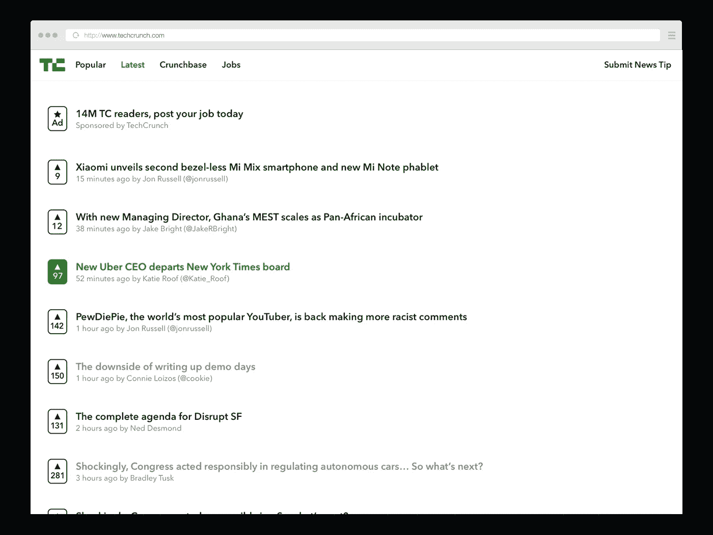
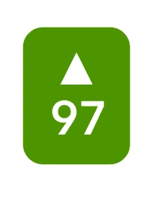
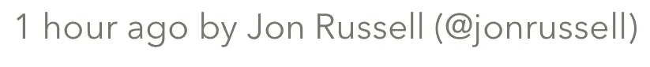

# 重新设计 TechCrunch

> 原文：<https://medium.com/hackernoon/redesigning-techcrunch-1ecae542e6af>

我曾经是一个普通的 TechCrunch 读者，但我已经为他们混乱和缓慢的用户界面挣扎了一段时间。作为一个更干净和更快界面的忠实粉丝，受黑客新闻、 [CNN Lite](http://lite.cnn.io) 和早期产品搜索的启发，我想花一天时间重新设计 TechCrunch。

> 声明:这是一个个人项目，可能不反映 TC 的观点。由[设计并为其设计](http://fairpixels.pro)

## 结果如下:

## 向上投票

Reddit、Hacker News、Product Hunt 和其他平台使用 upvotes 的方式，帮助他们的大部分用户快速浏览流行的内容。像 TC 这样的网站，被投资者和其他想要快速浏览流行趋势的人访问，可以通过查看流行的东西来极大地改善人们的浏览方式。

## 故事

与 HN 和 Reddit 相比，TC 的不同之处在于，故事是由它们自己的作者写的。这不是一个链接到其他网站的社交网络，他们是一家新闻出版公司。拥有 upvote 系统，结合内部的书面内容，创造了一种独特的体验。你甚至可以关注那些经常写你感兴趣的主题的作者。

## 饲料

除了流行的、最新的和工作的提要之外，还可能有为用户提供更多价值的提要。交易、事件和其他可以货币化的类别的提要，同时仍然保持一个干净和快速的界面。

就是这样。

如果你想玩这个设计的源文件，你可以在这里免费下载并使用草图文件[。](https://www.dropbox.com/s/auk7qgg3ljyzhe8/tc.sketch?dl=0)

我是 Fairpixels.pro 的首席设计师，我们在那里为网络和移动开发团队提供无限的 UI 设计。