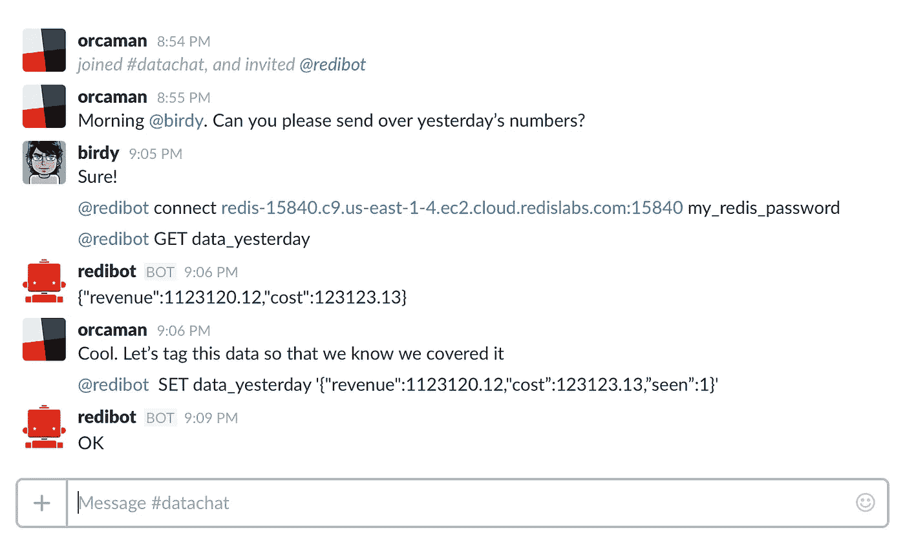

# redibot:让 redis 加入对话！

> 原文：<https://medium.com/hackernoon/redibot-bring-redis-into-the-conversation-304bfd3106a9>

所以前几天我决定编写我的第一个 [Slack](https://hackernoon.com/tagged/slack) bot。我希望了解服务器如何与 Slack 通信以创建 bot 体验的最基本的概念，同时希望在我使用它的时候创建一些有用的东西。

这就是[机器人](https://github.com/orcaman/redibot)的诞生。一天晚上，我花了几个小时研究这个项目，结果非常有用。

[redibot](https://hackernoon.com/tagged/redibot) 基本上是一个 go 应用程序，一方面与 [Slack RTM API](https://api.slack.com/rtm) 通信(这是 Slack 内部实时通信的 API。可以想象，这种通信是基于 websockets)和 redis 的另一方面(使用牛逼的 [redigo 包](https://github.com/garyburd/redigo))。

最初，我希望复制 redis-cli 在 Slack 中运行 redis 命令[的体验。这样做的目的是通过使用 Slack 而不是必须使用 redis-cli 来使团队更容易使用 redis。](http://redis.io/commands/)

当我在做的时候，发生了一些有趣的事情。

## 事实证明，Slack 的协作特性在与 redis 这样的 DB 平台集成时表现得非常好。

通常，您可能会发现团队讨论需要访问数据的日常操作的渠道。例如，在某个频道，您可能会让 QA 人员询问昨天的数据。随后是团队中一个或多个工程师的响应，然后数据科学家可能会提供一个要运行的查询。

当直接从 Slack 使用时，这一切变得更加舒适。每个人都会接触到 redis 命令序列，这些命令用于产生数据告诉我们的故事。数据本身当然也在那里。我发现这非常有用。

## 发布-订阅结合使用 redis 和 Slack 可以永远改变你在 Slack 上使用通知的方式

好吧，也许这有点夸张，但是有了 redibot，因为您可以直接从 Slack 发布和订阅任意 redis 频道，所以您不再需要任何其他通知机制。

所有可以发布到 redis 的服务器现在都可以直接将通知推送到 Slack，而不必通过 web 钩子。如果您已经有很多使用 redis 的后端，这就特别有用。他们现在有了一种简单的方式向 Slack 报告内容，而不需要进行重大的代码修改。

## 投稿！

redibot 是开源的，让这个小项目变得更严肃会很酷。

> [黑客中午](http://bit.ly/Hackernoon)是黑客如何开始他们的下午。我们是 [@AMI](http://bit.ly/atAMIatAMI) 家庭的一员。我们现在[接受投稿](http://bit.ly/hackernoonsubmission)并乐意[讨论广告&赞助](mailto:partners@amipublications.com)机会。
> 
> 如果你喜欢这个故事，我们推荐你阅读我们的[最新科技故事](http://bit.ly/hackernoonlatestt)和[趋势科技故事](https://hackernoon.com/trending)。直到下一次，不要把世界的现实想当然！

