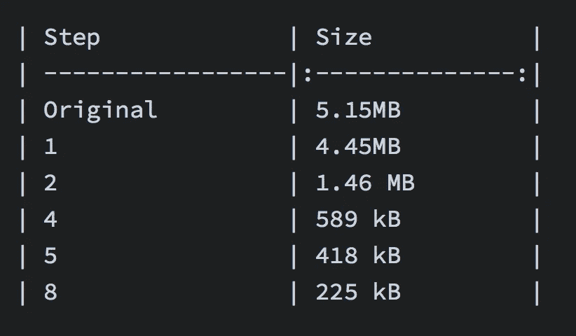

# 为生产减少 webpack 捆绑包的大小

> 原文：<https://medium.com/hackernoon/reduce-webpack-bundle-size-for-production-880bb6b2c72f>

这里不介绍，开始。

1.  **使用正确的环境变量**

```
new webpack.DefinePlugin({
 ‘process.env’: {
 ‘NODE_ENV’: ‘production’ 
 }
})
```

**2。使用生产参数**

```
webpack -p
```

**3。高级丑化**

```
new UglifyJSPlugin({
 // options
})
```

**4。优化依赖项导入**

不导入完全依赖关系:

```
import _ from ‘lodash’;
```

只需导入您真正需要的内容:

```
import _ from ‘lodash/core’;
```

**5。使用** [**捆绑包分析器**](https://github.com/webpack-contrib/webpack-bundle-analyzer) **计算出增加大小的因素**

例如，大多数时候我们应该忽略即时的本地文件

```
new webpack.IgnorePlugin(/^\.\/locale$/, /moment$/)
```

**6。从您的捆绑包中提取供应商**

```
module.exports = {
 …,
 entry: {
 app: ‘./src/index.js’,
 vendor: [‘react’, ‘moment’, ‘lodash/core’]
 },
 …,
 plugins: [
 …,
 new webpack.optimize.CommonsChunkPlugin({
 name: ‘vendor’
 })
 ]
};
```

**7。从您的捆绑包中提取供应商**

```
module.exports = {
 …,
 module: {
 rules: [
 …,
 // css
 {
 test: /\.css$/,
 use: ExtractTextPlugin.extract({
 fallback: ‘style-loader’,
 use: [‘css-loader’]
 })
 }
 ]
 },
 plugins: [
 …,
 new ExtractTextPlugin(‘style.css’),
 ]
};
```

8。按路线划分的代码

*   [网络包文档](https://webpack.js.org/guides/code-splitting/)
*   [反应式代码分解](https://github.com/didierfranc/react-code-splitting)

**我的一个项目每一步的结果**



再见。