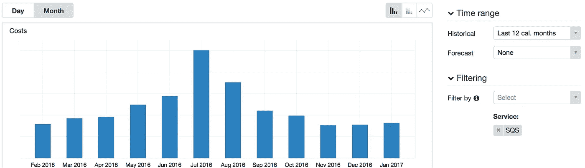
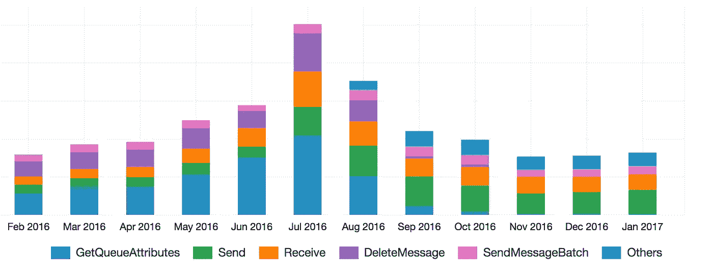

# 降低云中的成本

> 原文：<https://medium.com/hackernoon/reducing-costs-in-the-cloud-c6d822415aa7>

Credits to [Salim Batlouni](https://medium.com/u/61bd5185adba?source=post_page-----c6d822415aa7--------------------------------) our Photographer / Product Manager

## 一个调查高速创业公司成本上升的故事

[*昂哈米*](https://www.anghami.com) 是中东领先的音乐& [娱乐](https://hackernoon.com/tagged/entertainment)平台。我们被称为中东的[Spotify](http://www.businessinsider.com/meet-anghami-the-spotify-of-the-middle-east-2016-8)，尽管我们更喜欢的是 [*Anghami*](https://play.anghami.com) *。*数百万用户每天使用我们的服务来欣赏**音乐**、**音乐视频**或 [**表情**](/@batlounis/how-our-app-became-a-social-hub-a8acf0421812?source=linkShare-847353d1a4a-1487661653) 。

从 4 年前的第 0 天起，我们就一直在使用 [AWS](https://hackernoon.com/tagged/aws) 云，我是在两年半前加入 2 &的(天啊，时间过得真快)，我们非常喜欢我们获得的规模和灵活性。我们依靠 AWS 的 [SQS](https://aws.amazon.com/sqs/) (简单队列服务)在我们的一些系统中来回异步移动数据。对于那些不知道 SQS 或我们所谓的消息队列如何工作的人来说:它们是一些系统(或 SQS 的服务)，在这些系统中，你可以将一些我们称为**【消息】**的数据推送到我们称为**【生产者】**的地方，然后你可以从中提取数据，并在我们称为**【消费者】**的地方进行处理，以异步完成任务的处理，其中**【消费者】** *通常*运行较长的任务

围绕 SQS 的包装器和核心处理实现是在我加入之前编写的，并且在我们当时运行它的规模下工作得相当好。然后发生了一些事情，我们需要处理更多的数据，所以我们开始添加更多的“消费者”来获取和处理“消息”。从那时起，我们开始发现我们的 SQS 成本与我们处理的“邮件”数量不成比例地增加了！队列紧急模式和调查。

Total SQS Costs with a BIG jump in July

我打开了我们的 AWS 计费仪表板(那是我第一次打开),查看发生了什么。我发现他们提供了一个名为“成本浏览器”的标签，其中包含了“每日支出视图”的链接。在那里，我选择了我感兴趣的日期范围(在成本增加和添加“消费者”之前和之后)，然后为上面显示的服务 SQS 添加了一个过滤器。

然后我注意到了*分组*选项，然后试图看看不同的选项是什么，我们案例的神奇选项是按 *API 操作*分组，这很有意义，因为 SQS 按 API 操作的数量收费，而不是“消息”。

SQS Costs grouped by API Operation

提供的图表给了我理解事物所需的所有洞察力。我们的大部分支出都花在了 **GetQueueAttributes** 调用上(上面蓝色部分)。有意思！我打开了我们拥有的 SQS 包装器核心的旧代码，检查对调用 API 调用的方法的调用，每次我们试图获取消息进行处理以检查队列是否有任何内容，如果没有，则休眠。这很奇怪，但如果没有它，我们会一直循环调用 **ReceiveMessage** API(最初编写这段代码时，SQS 没有长时间轮询)。当我采用代码时，SQS 有很长的轮询时间，所以首先我更新了我们所有的队列，将**接收消息等待时间**设置为最大值(20 秒)，这基本上告诉 SQS 库保持到 SQS 的 HTTP 连接等待 20 秒，因为它仍然可以接收更多的消息，限制为每个调用 10 条消息。

然后我更新了代码以利用长轮询，这消除了我们对 GetQueueAttributes API 调用的所有依赖，并且我从代码中删除了它们。这是第一次大规模削减成本，当时基本上是浪费。

在我的第一次调查大获全胜之后，我开始考虑如何进一步调整。我们知道，我们将总是成批接收“消息”,每批最多 10 条，我们在同一个节点上处理这些消息。当一个消息被成功处理时，您必须调用 **DeleteMessage** API 来告诉 SQS 将它从它的消息池中删除(在 SQS 有一个安全机制，为消息设置一个超时，在超时之后，它被释放回可用的消息池中)。接下来要做的是将这些消息批处理到 **DeleteMessageBatch** 中，而不是删除消息，注意不要越过相关队列的**可见性超时**。在我修改了代码之后，我们看到了成本的进一步降低，因为我们基本上每 10 条消息就调用一次 **DeleteMessageBatch** (实际上这要低一些，大约每 7 条消息调用一次，因为我们并不总是得到 10 条消息或者无法处理等等。).

然后，我继续批处理一些可能的 **SendMessage** 调用，这也导致了一些减少，但是由于这些系统的性质，在发送时不能批处理太多，因为它们是在我们的 API 实例接收一些调用时一个接一个生成的。我们还将 ***自动缩放*** 逻辑添加到我们的“消费者”层，通过上述更改，我们不再需要担心，并且通过仅拥有我们需要处理的消息负载所需的实例数量来进一步降低成本。

感谢阅读！

> [黑客中午](http://bit.ly/Hackernoon)是黑客如何开始他们的下午。我们是 [@AMI](http://bit.ly/atAMIatAMI) 家庭的一员。我们现在[接受投稿](http://bit.ly/hackernoonsubmission)并乐意[讨论广告&赞助](mailto:partners@amipublications.com)机会。
> 
> 如果你喜欢这个故事，我们推荐你阅读我们的[最新科技故事](http://bit.ly/hackernoonlatestt)和[趋势科技故事](https://hackernoon.com/trending)。直到下一次，不要把世界的现实想当然！

