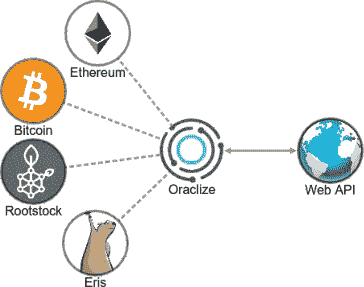
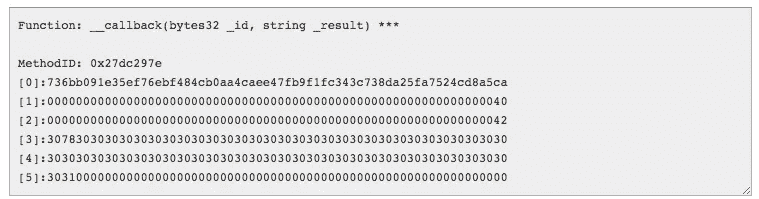
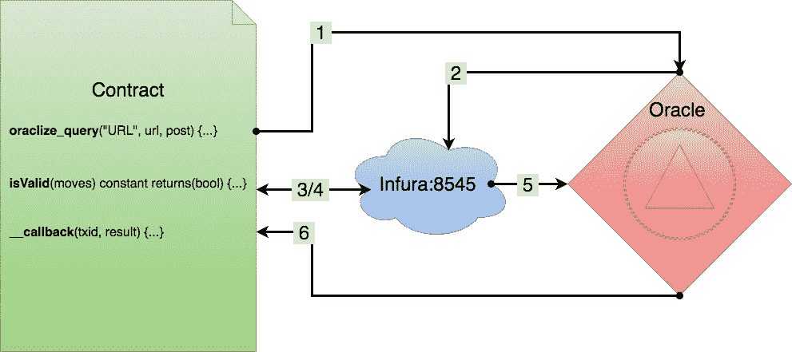

# 通过使用 Oraclize 进行异步 Tx 来减少 ETH 气体

> 原文：<https://medium.com/hackernoon/reducing-eth-gas-by-making-an-asynchronous-tx-with-oraclize-32a5d10236c8>


在前一篇[文章中(🤑)](/@billyrennekamp/reducing-eth-gas-23x-by-converting-arrays-to-bytes-ccf3b46daea5)通过将数组转换成字节串，我能够将一个[以太坊](https://hackernoon.com/tagged/ethereum)花费 9500 万(MM) gas 的事务减少到 4.1MM。这是建造[三叶草网络](https://clovers.network)过程中的一大步，但是 4.1 毫米的气体仍然是不可接受的。通过利用 Oracle 卸载大部分工作并只保存结果，我能够将它再次减少到 1.5 毫米——基本上是在以太坊虚拟机(EVM)上进行异步调用。

正在讨论的事务包含一个使用用户提供的走法玩黑白棋游戏的函数。如果游戏是有效的，并且之前没有注册过，用户就成为了那个棋盘的主人，并且可以把它作为三叶草出售(✤).此外，如果棋盘是对称的，那么相对于对称的稀有程度，用户将获得一个 ERC20 ClubToken (︎♣︎)的采矿奖励。虽然这个游戏在 EVM 上编程相当简单，但复杂程度仍然非常昂贵。那是因为检查游戏过程中的每一步都是和那个游戏的结果一起保存的。这对于证明验证的方法很重要，但是还有另外一种不用花钱就能证明验证的方法:询问先知🔮。

一个神谕提供了一个通往 EVM 之外世界的入口。如果你想知道当前乙醚的美元、欧元或英镑价格，去问先知吧。如果你想知道天气🌤在芝加哥，谁赢了小熊队🐻游戏或者你从✈️到奥德的航班是否会延迟——去问神谕吧。你还可以用神谕做一些在 EVM 上不可能做的事情，比如生成随机数。

有一些关于这些功能是否属于以太坊[区块链](https://hackernoon.com/tagged/blockchain)的争论，因为理论上所有的交易都应该是可验证和可重复的——一个特定时刻的 URL 请求怎么可能是可重复的？(关于辩论和预言更多信息，请查看[这里](https://blog.ethereum.org/2014/07/22/ethereum-and-oracles/)，这里[这里](https://blog.oraclize.it/understanding-oracles-99055c9c9f7b)，这里[这里](https://ethereum.stackexchange.com/questions/11589/how-do-oracle-services-work-under-the-hood)。幸运的是，我想要一个 oracle 来调用已经在 EVM 上的函数。这样，验证的方法仍然是可验证的，但我不必花时间记录产生结果的所有步骤。

## 他说她说…



Oraclize 是一个 oracle，它提供了大量的数据源，包括 Wolfram Alpha、IPFS 和任何可公开访问的 URL。他们还提供了查询各种区块链的基本信息的能力，如区块数和开采难度。我需要使用`eth_call`在以太坊区块链上运行一个非事务性(常量)函数，但是 Oraclize 目前还没有提供。相反，我将使用 [Infura 的](https://infura.io)公开可用的以太坊节点来进行 JSON RPC 事务(与 [Metamask](https://metamask.io) 的方式相同)。在开始构建 JSON RPC POST 请求之前，我们先来看看目前为止的契约:

```
function claimGame(bytes28 firstMoves, bytes28 lastMoves) {
  if (isReal(firstMoves, lastMoves)) {
    saveGame(firstMoves, lastMoves);
  }
}function isReal(bytes28 p1, bytes28 p2) constant returns(bool) {
  // play the game and check for completeness and errors
  ...
}function saveGame(bytes28 p1, bytes28 p2) {
  // finally save the game
  ...
}
```

这里的`checkGame()`是一个以游戏棋步为参数的函数——在这种情况下，棋步以字节 28 格式存储(关于以字节存储数据的类似技术，请查看我前面提到的[arrays to bytes 文章](/@billyrennekamp/reducing-eth-gas-23x-by-converting-arrays-to-bytes-ccf3b46daea5))。`checkGame()`做的第一件事是通过使用`isReal()`检查移动是否在玩一个真实的游戏。这是我试图避免的合同中昂贵的部分。但是，您会注意到它是一个常量函数，这意味着它不会改变区块链上的任何内容。这就是为什么有神谕可以召唤它，而神谕不需要支付任何汽油。之后，oracle 可以将结果发送回合同，以便以较低的成本保存。

## 添加 Oraclize


利用 Oraclize 的第一步是将他们的合同添加到您的合同中。你可以从他们的 [github](https://github.com/oraclize/ethereum-api) 下载 oraclizeAPI.sol 的副本。把它添加到你的契约的顶部，让你的契约继承这些函数。在这种情况下，我称我的合同为 CheapTrick。

```
pragma solidity ^0.4.13;import "./oraclizeAPI.sol";
contract CheapTrick is usingOraclize {
  ...
}
```

下一步是用指定的 URL 数据源触发 Oracle。契约继承了函数`oraclize_query`,该函数根据您的需要采用各种不同的参数。我们将使用这样的格式，第一个参数作为数据源，第二个参数作为 URL 端点，第三个参数作为 POST 对象随请求一起发送。或者，您可以添加一个整数，表示在触发请求之前等待的秒数，以及回调中使用的 gas 的明确数量。

```
function claimGame(bytes28 firstMoves, bytes28 lastMoves) {
  oraclize_query('URL', 'https://infura.io', '{...}');
}
```

最后一步是调用继承的`__callback()`函数来处理 URL 数据源查询的结果。

```
function __callback(bytes32 queryId, string results) {
  if (results == 'true') saveGame(???, ???);
}
```

你会注意到，在这个回调中，你已经丢失了对正在进行的移动的引用。Oraclize 提供了一个查询 ID 来帮助完成这个过程。为了跟踪哪一个回调属于哪一个查询，您可以使用如下的映射和结构来跟踪它们:

```
pragma solidity ^0.4.13;import "./oraclizeAPI.sol";
contract CheapTrick is usingOraclize { struct Moves {
    bytes28 firstMoves;
    bytes28 lastMoves;
  } mapping (bytes32 => Moves) validIds;

  // oraclize_query returns the query ID that is used in the mapping
  function claimGame(bytes28 firstMoves, bytes28 lastMoves) {
    bytes32 q = oraclize_query('URL', 'https://infura.io', '{...}');
    validIds[q].firstMoves = firstMoves;
    validIds[q].lastMoves = lastMoves;
  } function __callback(bytes32 q, string result) {
    if (bytes(result)[65] == 0x31) {
      saveGame(validIds[q].firstMoves, validIds[q].lastMoves);
    }
  } ...}
```

在这种情况下，使用查询 ID 作为键，将查询 ID 保存在结构的映射中。当回调被触发时，可以使用相同的查询 ID 再次提取移动。

## 弦理论


你可能也注意到了`if(bytes(result)[65] == 0x31)`这句台词，或者被它搞糊涂了。这才是之前被错误使用的`if (results == ‘true’)`的真实执行方式。`oraclize_query()`点击了一个 JSON RPC 端点，该端点将依次调用之前看到的`isReal()`函数。此函数返回一个布尔值，但是由于以太坊以字节 32 为增量工作，所以布尔值返回为字节 32。它不返回字符串“true ”,而是返回十六进制值 1。

```
true  = 0x0000000000000000000000000000000000000000000000000000000000000001false = 0x0000000000000000000000000000000000000000000000000000000000000000
```

由于`__callback()`中的结果实际上是一个字符串，这变得更加复杂。所以它不是返回`bytes32`，而是由`string`表示的`bytes32`。

```
true  = "0x0000000000000000000000000000000000000000000000000000000000000001"

false = "0x0000000000000000000000000000000000000000000000000000000000000000"
```

为了检测游戏是否有效，我们需要查看字符串中的最后一个值，并检测它是`1`还是`0`。在 Solidity 中处理字符串时，重要的是要记住它们是作为 UTF8 字符的字节数组(`bytes[]`)存储的。根据 w3schools.com 的说法，我们字符串中的 UTF8 控制字符如下所示:

```
string 0 = decimal 48  = hex 0x30
string 1 = decimal 49  = hex 0x31
string x = decimal 120 = hex 0x78
```

在可靠性方面，我们的字符串如`bytes[]`所示，看起来像这样:

```
string = "0x0000000000000000000000000000000000000000000000000000000000000001"string[] = ["0", "x", "0", "0", ..., "1"];
bytes[] = [0x30, 0x78, 0x30, 0x30, ..., 0x31];
```

我们需要检查数组中的最后一个元素，所以我们使用上面契约中的相同代码片段:`bytes(result)[65] == 0x31`(记住由于`0x`前言，数组的长度为`66`)然后**瞧**我们检测结果是真还是假。



在这一点上，需要指出的是，Oraclize 还提供了通过 docker 配置向 IPFS 上传一段定制代码的能力，这将允许它在 Amazon micro 服务器上部署足够长的时间，以返回结果而不是 URL 数据源。如果这样做了，返回的字符串可能比我们从 RPC 端点得到的字符串更有效。然而，一个 URL 数据源每个查询要花费合同所有者大约 0.01 美元，而微服务器每个请求要花费大约 0.50 美元。(如果你还在读这篇文章，你现在应该知道我一直在寻找这些交易🤑)

## JSON RPC POST


对于最后一部分，重要的是要了解发送到 Infura 端点的 JSON RPC POST 对象内部的实际内容，这个端点之前由邪恶的`{…}`表示。这意味着我们需要根据这里的 中的 **JSON-RPC 规范** [**手工创建我们的事务，并根据这里的**](https://github.com/ethereum/wiki/wiki/JSON-RPC#eth_call) 中的**以太坊契约 ABI 规范** [创建数据对象。我们的基本`eth_call`函数遵循以下格式:](https://github.com/ethereum/wiki/wiki/Ethereum-Contract-ABI)

```
// Request
curl -X POST --data '{"jsonrpc":"2.0","method":"eth_call","params":[{coming soon}],"id":1}'

// Result
{
  "id":1,
  "jsonrpc": "2.0",
  "result": "0x"
}
```

params 数组由一个对象组成，该对象包含协定地址和正在发送的数据，以及所需的块号:

```
{"jsonrpc": "2.0", "method": "eth_call", "params": [**{to:"0xFAK3W4LL374DDR355", data:"...."}, "latest"]**}
```

数据值将是所需函数名和随其一起发送的参数的十六进制表示。根据规范，函数名由 **散列****字符串*****名称*****函数**的**前 4 个字节** *表示(包括任何参数😳 **)** 。在我们使用 [web3.js 实用程序](https://github.com/ethereum/web3.js/tree/1.0/packages/web3-utils)帮助的例子中，它看起来如下:***

```
**var utils = require('web3-utils')let functionName = "**isReal(bytes28,bytes28)**"functionName = utils.sha3(functionName)
//**0x6b3bd7986bb57b171ccf6056a91eae803767c4600238e08445ece9b98c39ca21**functionName = utils.hexToBytes(functionName)
// **[107, 59, 215, 152, 107, 181, 123, 23, 28, 207, 96, 86, 169, 30, 174, 128, 55, 103, 196, 96, 2, 56, 224, 132, 69, 236, 233, 185, 140, 57, 202, 33]**functionName = functionName.slice(0, 4)
// **[107, 59, 215, 152]**functionName = utils.bytesToHex(functionName)
// **0x6b3bd798****
```

**结果我们的函数名看起来像`0x6b3bd798`。下一部分是用字节表示参数。由于我们的移动已经是十六进制格式，我们只需要通过填充它们并删除 0x 前缀，将它们从 28 字节调整为 32 字节:**

```
**var utils = require('web3-utils')let firstMoves = "0xd9b7774f9af573c5d69d4996a971f147dfac39f7e9f37785891dfee5"first32Moves = utils.padRight(first32Moves.slice(2), (32 * 2))
// **d9b7774f9af573c5d69d4996a971f147dfac39f7e9f37785891dfee500000000**let lastMoves = "0xbd9bb7ed12e559bfcaad69b5f04fa1061438927fc681167470000000"lastMoves = utils.padRight(lastMoves.slice(2), (32 * 2))
// **bd9bb7ed12e559bfcaad69b5f04fa1061438927fc68116747000000000000000****
```

**把它们放在一起，我们就得到了数据🎉**

```
**{"jsonrpc": "2.0", "method": "eth_call", "params": [{to:"0xFAK3C0N7R4C7W411374DDR355", data:"**6b3bd798****d9b7774f9af573c5d69d4996a971f147dfac39f7e9f37785891dfee500000000bd9bb7ed12e559bfcaad69b5f04fa1061438927fc68116747000000000000000**"}, "latest"]}**
```

**你可以使用 Oraclize 强大的查询测试器[在这里](http://app.oraclize.it/home/test_query#VVJMKFBPU1Qp:anNvbihodHRwczovL21haW5uZXQuaW5mdXJhLmlvLykucmVzdWx0:IHsianNvbnJwYyI6IjIuMCIsImlkIjoxLCJtZXRob2QiOiJldGhfYmxvY2tOdW1iZXIiLCJwYXJhbXMiOltdfQ==)测试结果。这个示例代码并不对应于一个已部署的契约，所以实际上不会工作。但是，如果您点击链接，您将看到一个请求当前块号的工作示例。**非常重要:不要忘记在 POST 有效负载的开头或结尾添加一个空格字符。这告诉 Oraclize 数据实际上是一个 POST 对象。在 Oraclize 团队有人回答我的 github 问题之前，我遇到了很多麻烦🙏****

## **最后**

****

**我们总共涵盖了:**

*   **什么是神谕**
*   **如何导入和使用 Oraclize 的 API 契约**
*   **如何跟踪查询和回调**
*   **如何在 Solidity 中使用字符串**
*   **如何创建对 Infura 端点的 JSON RPC eth_call**