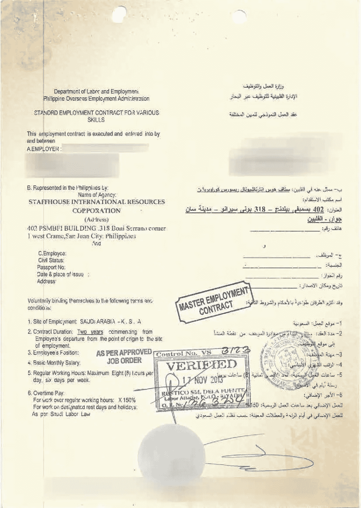

# 通过区块链——handshake . tech 减少对农民工的剥削

> 原文：<https://medium.com/hackernoon/reducing-exploitation-of-migrant-workers-via-the-blockchain-handshake-tech-d358482ea120>


每个人都喜欢讨论:[区块链](https://hackernoon.com/tagged/blockchain)将如何扰乱金融等行业，它将如何彻底改变公民与政府的互动，以及你应该如何投资他们的 ICO 以向他们新成立的公司提供资金。然而有趣的是，区块链也有能力改善弱势群体的生活，通过各种方式，比如给他们一个[有形的身份](http://fortune.com/2017/06/19/id2020-blockchain-microsoft/)，以及[授权给贫穷国家的企业家](https://hbr.org/2017/05/how-blockchain-could-help-emerging-markets-leap-ahead)。认识到重大社会变革的潜力后， [ConsenSys](https://medium.com/u/6c7078bf7b01?source=post_page-----d358482ea120--------------------------------) 组织了[区块链社会影响黑客马拉松](https://www.blockchainforsocialimpact.com/hackathon/)。

我们的团队 [Handshake](http://handshake.tech/) 已经加入并致力于提高外来务工人员招聘过程的透明度，让外来务工人员能够在以太坊区块链上签署来自知名招聘机构和雇主的经过验证的劳动合同。本文简要介绍了农民工面临的一些问题，并讨论了为什么区块链为解决这些问题提供了一个很好的平台。

# 问题是

像菲律宾这样的国家的经济体系依赖于其人口中的很大一部分出国工作并寄钱回家。特别是对于菲律宾的工人来说，这些工作大多是中低技能的工作，如家政服务、护理和电气工作，主要集中在几个国家，包括沙特阿拉伯、阿联酋、新加坡、香港和卡塔尔([来源](https://centerformigrantadvocacy.com/history-of-philippine-migration/))。

这些本身都没有问题，但这些移民工人的招聘过程极其复杂，工人们往往最终会在目的地国工作，工作条件和工资与他们最初达成的协议大相径庭。他们无法获得他们签署的合同或条件，不确定如何获得帮助，[可能会被迫签署条款更不利的新合同](https://centerformigrantadvocacy.com/history-of-philippine-migration/)。

# 进入区块链

这是一个介绍区块链如何在招聘过程的一个环节中提高企业实体的透明度和问责制。最终，Handshake 正在进行的端到端流程将从雇主级别的工作订单开始，并一直保护工人，直到流程结束，他们准备好开始向家里汇款。

如果合同是书面的，甚至只是口头上的，那么伪造和剥削工人的风险就很高。握手允许的是在一个分散的服务上以象征性的形式存储法律文件，比如劳动合同:。例如，该合同:



1st page of an actual contract given to the team by StaffHouse.

可以转换成 JSON(目前是手动过程):

```
{
  employer: {
    name: "Saudi Arabia Employment Company",
    uPortId: "0x99618818fd5cc2d9ed6543f973ee54859bb79df7"
  },
  location: {
    country: "Saudi Arabia",
    city: "Riyadh",
    streetAddress: "123 Main St"
  },
  laborContract: {
    durationMonths: 24,
    hoursPerDay: 8,
    daysPerWeek: 5,
    position: "Domestic assistant"
    description: "A brief description of what the role will entail.",
    monthlySalary: 2300,
    currency: "USD",
    overtimeMultiplier: 1.5,
    vacationLeaveDays: 21,
    sickLeaveDays: 10,
    terminationNoticeDays: 15,
    employerPaysVisa: true,
    transportToWorkIncluded: true,
    transportFromWorkIncluded: true,
    housingIncluded: false,
    foodIncluded: false,
    emergencyMedicalIncluded: true
  }
}
```

这个简单的、令牌化的结构将被存储在 IPFS 上，其散列将被推送到以太坊智能合约。这一过程的最终结果是劳动合同现在是不可变的——它的细节不能改变(否则在合同的变动中有时会发生)。

当潜在员工通过握手来签署合同时，他们将能够查看条款和条件，并确信他们签署的细节在事后不会被更改。他们还可以查看代理机构和雇主的身份，查看他们的认证，他们以前处理员工的声誉，并满怀信心地知道他们将到达合同中指定的雇主。

为了处理流程中所有参与者的公司和个人身份的跟踪和验证，Handshake 将使用 [uPort](https://www.uport.me/) 。

这将允许几个重要的特征:

*   监管机构可以证明招聘机构拥有他们宣称的资质。
*   通过 uPort 的社交媒体档案双向绑定，潜在员工可以研究他们计划为之工作的公司。
*   一个基于信誉的可靠系统，用于跟踪招聘机构或雇主的道德行为。

最终，招聘人员和员工之间的这种小互动只是拼图的一部分。如前所述，Handshake 将利用区块链的特性来提高整个招聘流程的透明度。

# 取得联系

我们已经和这个行业的一些主流组织合作，包括世卫组织和菲律宾的 StaffHouse。如果你是一个具有前瞻性思维的、[技术](https://hackernoon.com/tagged/technology)-首先是道德招聘机构或雇主，并且你希望能够公开验证你的合规性，并确保你的员工有更安全的就业体验，请通过 [handshake.tech](http://handshake.tech/index.html) 联系我们，或者直接在这里或 Twitter 上联系我:@ codingupastorm！