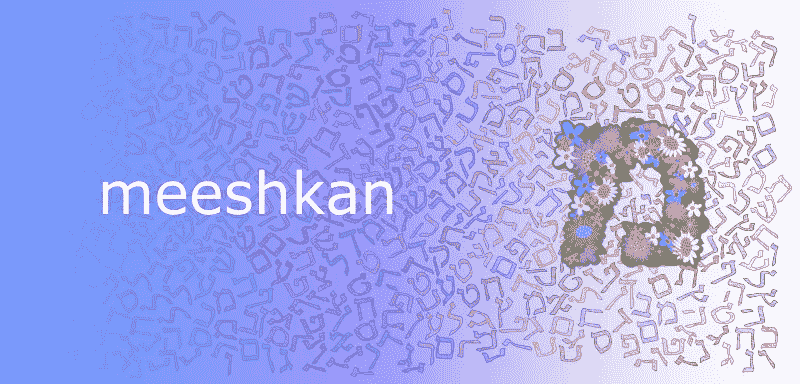

# Redux 动作创建器创建者

> 原文：<https://medium.com/hackernoon/redux-action-creator-creators-6684b051d4c6>

*更新:一位读者要求我将此作为 npm 包发布。完成了完成了。[](https://www.npmjs.com/package/redux-ize)*。尽情享受吧！**

*在 redux 应用中，我们有动作，我们有动作创建者，但是在 [Meeshkan](https://meeshkan.com) ，我们使用 Redux 动作创建者。听起来像过度杀戮吗？也许吧。但是让我展示我们如何使用它，然后你来判断！*

*因此，假设我们有一个动作创建器，它创建一个动作，并且由于`react-redux`，当我们调用它时，通过我们的中间件自动分派它。中间件可以添加各种好东西(时间戳、设备信息……)，记录事件，运行异步任务等等。让我们放大我们的动作创建者:*

```
*export default clapForPost(nClaps) => ({
    type: "CLAP_FOR_POST",
    payload: nClaps
});*
```

*让我们放大一下我们的分析中间件:*

```
*import analytics from 'my-analytics-tool'export default store => next => action => {
  if (action.meta && action.meta.analyticsData) {
    analytics(action.type, action.meta.analyticsData)
  }
  next(action);
}*
```

*嗯…在我们的分析数据中，我们真的很想报告掌声来自哪个页面。所以我们回到我们的`action.js`文件，写一个新的函数:*

```
*export default clapForPostWithAnalytics(nClaps, analytics) => ({
   type: "CLAP_FOR_POST",
   payload: nClaps,
   meta: { analytics },
});*
```

*你闻到代码的味道了吗？如果我们还想引入基于我们在应用程序中所处位置的导航数据呢？如果我们有五个可能的东西要补充，你好 2⁵不同的功能。*

*如果我们能给一个动作添加一点分析数据，给另一个动作添加一点导航数据，那就太好了…让我们开始吧！*

```
*const ize = n => r => (...argsOuter) => f => (...argsInner) => {
  const primo = f(...argsInner.slice(n));
  return {
    ...primo,
    meta: {
      ...(primo.meta ? primo.meta : {}),
      ...r(...argsInner.slice(0, n), ...argsOuter),
    },
  }
}export const analyticsIze = ize(0)(a => ({
  analytics: a || {},
}));export const promiseIze = ize(2)((resolve, reject) => ({
  form: {
    resolve,
    reject,
  }
}));export default (...args) => args.reduce((a,b) => b(a));*
```

*然后在我们的文件与行动创作者…*

```
*import Ize, { promiseIze, analyticsIze } from './ize';
import { clapForPost } from './actions/self-aggrandizing';class MyComponent {
  render() {
    const { clapForPost } = this.props;
    const clapper = () =>
      new Promise((res, rej) => clapForPost(res, rej, 3));
    return (<button onClick={clapper}>Hello world</button>);
  }
}connect(null,
{
  clapForPost: Ize(
    clapForPost,
    promiseIze(),
    analytics({placeInApp: 'MyComponent'})
  ),
})(MyComponent);*
```

*将要发送的操作是:*

```
*{
  type: "CLAP_FOR_POST",
  nClaps: 3,
  meta: {
    analytics: {
      placeInApp: 'MyComponent',
    },
    form: {
     resolve: [Function resolve],
     reject: [Function reject],
    },
  },
}*
```

*瞧，我们的行动创造者创造者！有趣的是，这一策略是从我们对`redux-form`世界中一个[常用黑客](https://github.com/redux-saga/redux-saga/issues/161#issuecomment-191312502)的改编中发展而来的。动作创作者创作者是这种策略的一种概括。*

*在 [Meeshkan](https://meeshkan.com) 中，经验法则变成了:*

1.  *当一个动作包含不可能链接到 UI 的信息时，使用中间件。*
2.  *当一个操作只包含与该操作明显相关的信息时(例如，用于登录的电子邮件)，请使用操作创建者。*
3.  *当你需要分发 UI 相关的信息或者随机的顶级 hacks，而不把它们放在动作的有效载荷中时， *action creator creator 模式*是你的朋友。*

*黑客快乐！*

**