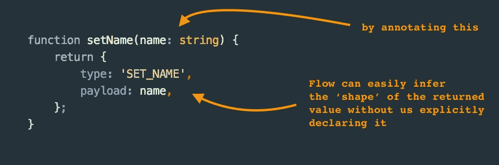
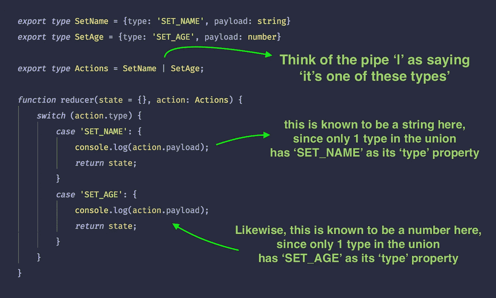
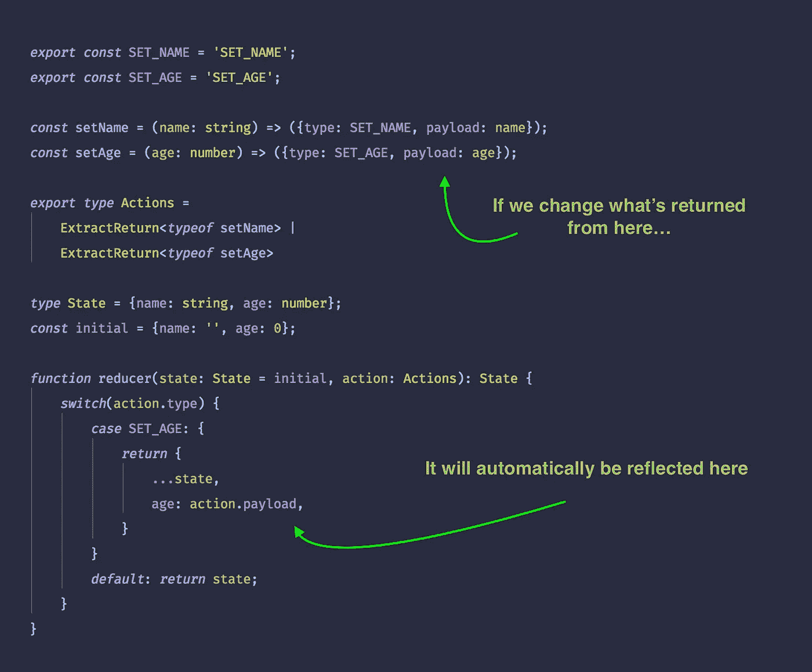

# Redux & Flow-type —以最少的击键次数获得最大的收益

> 原文：<https://medium.com/hackernoon/redux-flow-type-getting-the-maximum-benefit-from-the-fewest-key-strokes-5c006c54ec87>

作为一个经常使用 Typescript 的用户，我完全了解类型系统的好处。特别是在使用 React & React-Native 进行 UI 开发的领域，我不认为我可以想象回到一个当你输入时编译器不验证你的道具和状态更新的时代…

Typescript 很棒，我没有抱怨，但是最近关于 Flow 真正引起我注意的一件事是别名化&重用函数返回值的推断类型的能力。

这意味着，给定一个带参数注释的函数，并且不执行任何副作用，Flow 将能够计算出返回值的“形状”或“类型”，并允许您在其他地方使用它。



With only a single annotation, we’ve provided a lot of information for Flow to use when verifying our programs.

# 如何重用函数的推断返回类型

我知道这很难，但请耐心听我说。这是我在挖掘大约 2000 个 github 问题线程时发现的一个片段。我见过其他的，但是这个好像很好用，所以…

```
*type* _ExtractReturn<B, F: (...args: *any*[]) => B> = B;
*export type* **ExtractReturn**<F> = _ExtractReturn<*, F>;
```

我们正在导出一个名为`**ExtractReturn**`的泛型类型，它接受另一个类型(在本例中，是函数的“typeof ”),并提取推断的返回类型——要将它与上面的函数一起使用，您可以像这样使用`typeof setName`:

```
import {**setName**} from './actions';
import {ExtractReturn} from './types';type **ReturnValue** = ExtractReturn<typeof **setName**>
```

如果你不明白这里到底发生了什么，不要担心，只需复制/粘贴片段，然后继续下一部分——我在这里故意做得很笨拙，因为我想把重点放在这篇博客的要点上(事实上我自己也不是类型系统专家)！不管怎样，说点好的！

# 这对 Redux 项目有什么帮助

我见过的在 Redux 应用程序中提供类型安全的最常见方法是将每个动作的形状与实际的函数实现分开定义。所以你通常要定义你的应用程序“允许”使用的所有动作对象，然后在动作创建者和减少者中重用这些类型。它通常看起来像这样:

**之前:**

```
*export const* **SET_NAME** = 'SET_NAME';
*export const* **SET_AGE** = 'SET_AGE';

*export type* **SetName** = {type: 'SET_NAME', payload: **string**}
*export type* **SetAge** = {type: 'SET_AGE', payload: **number**}

*const* setName = (name: **string**): **SetName** => {
    *return* {type: **SET_NAME**, payload: name}
}*const* setAge = (age: number): **SetAge** => {
    *return* {type: **SET_NAME**, payload: age}
}

*export type* **Actions** = **SetName** | **SetAge**;
```

当然，这个例子很小，只有 2 个动作创建者，为了节省空间，我把它压缩到一个虚构的文件中，但是它足以解释这里的概念。

将每个动作“形状”定义为它自己的类型，如第 3 行和第 4 行所示，这意味着您可以非常具体地指定一个函数应该返回的对象/动作。考虑到您必须像这样预先声明它们，这非常有力地保证了您不会将意外的对象形状分派到您的 Redux 存储中。太棒了。

不过最重要的是，这种技术还允许您创建最后一行所示的“标记联合”。在 Typescript 领域，它被称为“有区别的联合”,基本上是一种基于特定字段的值缩小任何类型检查的方法——在我们的例子中，它是来自对象的“类型”字段。



Flow calls it a ‘tagged union’, whilst in TS land it’s known as a ‘discriminated union’ — very powerful.

因此，使用这种将所有动作定义为独立类型的技术，我们既可以强制执行动作创建者的返回类型，同时也可以根据哪个动作被触发来缩小 reducers 中的类型检查。听起来很棒，对吧？

实际上这很棒——我以前使用过这种技术，没有任何真正的*问题，*,但是我仍然觉得尝试这些类型系统以尽可能少的输入从它们那里提取尽可能多的价值很有趣。

所以回头看看前面的代码，我个人的观点是，必须为每一个动作想出新的名称，复制动作名称，以及必须注释每个动作创建者的返回值，这些都是可以避免的事情。

记住这一点，如果我们只使用前面的`ExtractReturn`助手，前面的例子可以简化如下:

**之后:**

```
*export const* **SET_NAME** = 'SET_NAME';
*export const* **SET_AGE** = 'SET_AGE';*const* setName = (name: string) => {
    *return* {type: **SET_NAME**, payload: name}
}

*const* setAge = (age: number) => {
    *return* {type: **SET_AGE**, payload: age}
}*export type* **Actions** =
    ExtractReturn<*typeof* **setName**> |
    ExtractReturn<*typeof* **setAge**>
```

事实上，我们已经减少了动作名称本身的重复，这很好，但是我们也不再需要为我们的动作想出单独的名称——我们都知道给事情命名有多难，对吧？！

最后一行中导出的类型`Actions`仍然会生成如前所述的‘带标签的联合’,这意味着我们不会失去之前得到的任何(令人敬畏的)缩小的类型检查——耶！

也许最有趣的是，我们现在已经将真实的来源转化为我们实际的代码，而不是单独的类型。这意味着对任何 action-creator 中返回值的任何更改都会自动传播到整个系统——不需要更新任何单独的类型！



More type-safety per keystroke, and less duplication!

这是一种有些人会感到不舒服的权衡，我完全理解这一点——我可以看到将所有动作对象类型与代码分开显式定义的好处(正如我所说的，我以前使用过这种方法，没有问题)。

但是，在从事大型类型项目(包括 Typescript 和 Flow)之后，我对这种类型的东西有了一些看法:

*   类型极其重要，项目越大，重要性就越大&回报也越大。
*   如果你要使用类型检查器，那就全力以赴。它并不像你想象的那样只输入一个项目的子集。
*   但是类型注释是有噪音的，代码中的“噪音”总是我们应该减少的。
*   如果您可以使用类型检查器根据您的代码动态地为您创建类型，那么就去做吧！这个博客就是一个例子，我希望我们能看到更多这样的例子。

## 最后一点

当我使用“更少的输入”和“更少的击键”这样的短语时，我并不是在谈论用实际的字符来创建“更短”的代码，而是直接谈论要创建、导入、导出、命名和维护的“东西”更少。这篇博文展示了一种用非常少的代码产生非常相似的类型安全的方法(当你考虑一个真正的代码库时)。

希望你喜欢这个实验！

## 链接:

*   gist—[https://gist . github . com/anonymous/9 fbb 548 a 38 b 6 c 24114d 4 bad 360 bfe 8 f 8](https://gist.github.com/anonymous/9ffb548a38b6c24114d4bad360bfe8f8)
*   [流试](https://flow.org/try/#0PTAEAEDMBsHsHcBQJQAkCm0AO6BOoAXWUdADwNwEMBjA0ASwDtI9d0ATUNggV10cIBPHKFiRQlUJB6Na9WI0QFh6UAH0AouSq0ASul78APACEANKABiALlAAKAHRPKuAOYBnW5UaCA2gF0ASlAAXgA+UBMIkMiAbiUVUC0KGgJ9Q0YjS2j1ZJ00gz5MgCoLbPjkMABVd1VqBXcCbwJ3CVbGWFwAW0poRHrGRtAAQQBxDVDQAHIxjSn4gaGAOWGAWQmYqZX1+cRK0UZoQVBGdA5CYixcWAA3enZVZRxWyE6JNx4u9EYWhgFU+SMAC01DYlCIuHc+24RSEIng9Gg0FAACNVEwWLg2OxENJZARAaBagRhq50HZKGTbIxPmjcMEAN6IUAsriFfigBlw9C2WYWLCUQRwSjsLxk0AAX0QUtxMjkCiJBiWlC+dkYKp5J1peEZzNZMI5XKemu2Gn5guFopOGsl0r2xtAAGUmgRVDEuZTNTSunSLOqvrZGrgmK5bfsAMJg10SUAyQkOgZNJghiRIwgAC1UBoExtaYn2YlAglgfFA1HTsFq-3lwNB6HBnXcDlAABVM2z3DxoHRqN5UaoeLVOJRWpImq4yTiUHGFQR0+DU3B4C8lxdrViEBnVAKhbARdzUSPzgqpsapqArrAcLhlAkRMMa60QnqWXlUukikZjYXiaT0BEAB8XySbR33ZTJv3EYllS+MI9jxGs2XYHhqDwOxGnBTVnUwyYPSpUAAAY-Q1WwpnPCULABBReUfQJbGw6MmVZIkEQIcsKRrBxjV1ZjmN7WoRnGWwmN40SUEzNgLBgTcAGsOmXCROJ3S0GFHLUfTwYDRJZbNOS07TmKcBwMNdMx9IMllPS8JSLT3dgzIs1kpQM5ztP41RTWE8zePEvB0Ck1c5IQUcbN3fd6DUoMQ285jdJExzDKcEz-Ji7T-U1KjGAcZS7K42AABkEDwcMjzsQIHIS1zRKq3iHkgSguwIWxdOS+JmKlCUgA)

像这样？如果你有，那么也许你会喜欢我在 https://egghead.io/instructors/shane-osbourn[e 上的一些课——很多都是免费的，我涵盖了香草 JS，Typescript(很快流？)，RxJS 等等。](https://egghead.io/instructors/shane-osbourne)