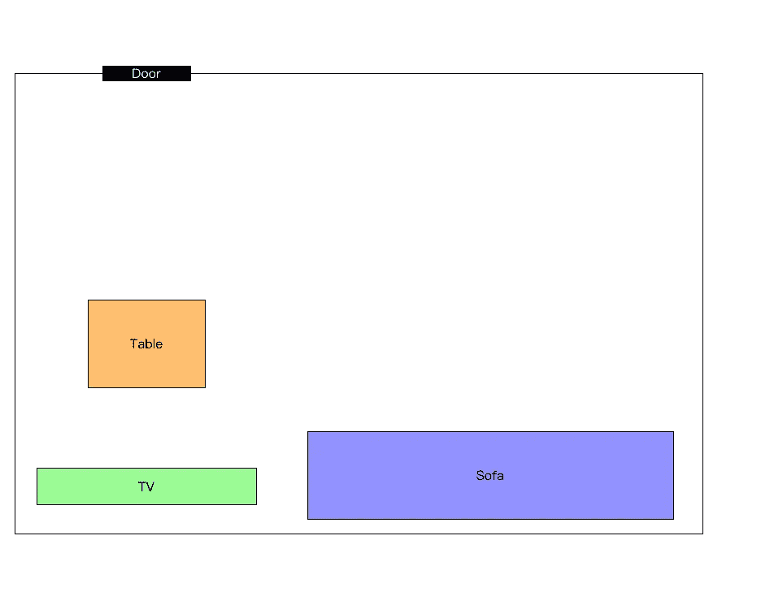
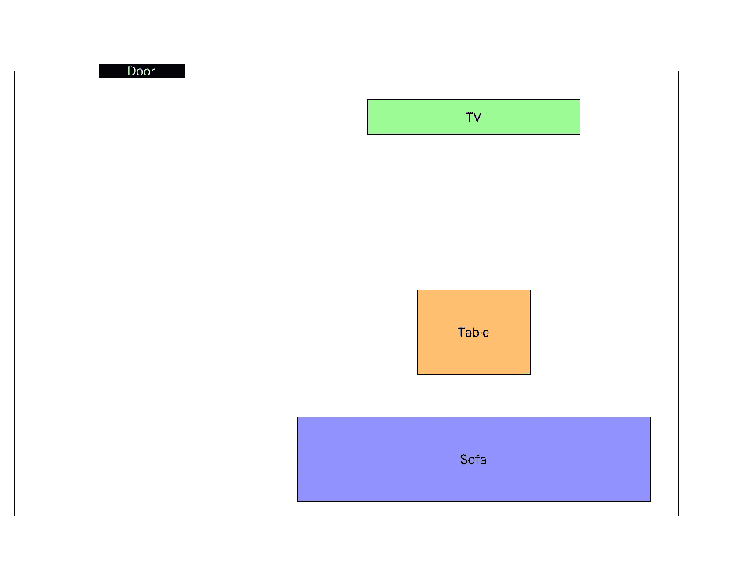
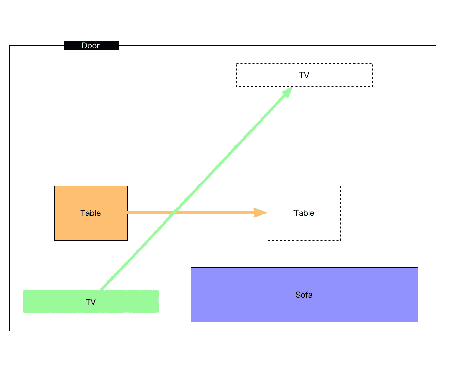
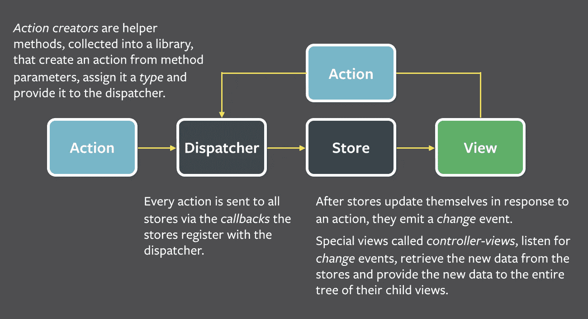

# 假人 Redux

> 原文：<https://medium.com/hackernoon/redux-for-dummies-867f7aff7a2f>

这些天我们都在谈论 React，而大量 React 开发者已经沉迷于一个最流行的 Flux 实现——Redux。

以下是脸书对通量的官方定义:

*Flux 是脸书用来构建客户端网络应用的应用架构。它通过利用单向数据流来补充 React 的可组合视图组件。它更多的是一种模式而不是一个正式的框架，你可以立即开始使用 Flux，而不需要大量的新代码。*

最近，我的一个朋友问了我一个问题:**‘我知道 React 是一种将 web 视图写成组件的方式，但是 Redux 到底是什么？’**

故事是这样的。

大学毕业后，你一边在一家小创业公司做前端开发，一边在市中心租了一套小公寓。这是你客厅的地图视图。

一个星期六，你邀请你的朋友大卫去你的公寓。大卫发现你的家具在客厅的位置有点固定。这里的每一件家具都是一个 React 组件，许多组件组成了你的客厅。

大卫和你订了一份比萨饼外卖，你们计划一起在家吃饭，看一部最近很受欢迎的电影。然而，你们都发现很难同时坐着、吃东西和看电视，这是由家具的相互作用造成的。

你的计划来了，你想这样重新摆放你的家具:

你让大卫先移动电视，然后是桌子。

完成了。现在是披萨和电影时间！

结束。

首先让我们再想想这个虚构的故事。

*   你发现电视和桌子的位置不合理
*   绘制蓝图
*   请大卫做某些工作
*   家具重新摆放

然后我们再来看看 Redux 的核心概念(包括这里的 React)。

*   查看(反应):你的客厅看起来像什么
*   商店:你的家具的坐标(影响视野)
*   行动:你要求的任务(移动电视、桌子)
*   Reducer:任务的实际工作，比如将桌子向右移动 10 米，这将改变商店

所以从 Redux 的角度来看，整个故事应该是:

**视图— - >动作— - >减速器— - >储存(状态)——>视图**

这正是这张复杂的通量图的意思:

image from [https://facebook.github.io/flux/docs/overview.html#content](https://facebook.github.io/flux/docs/overview.html#content)

[**这里的**](https://github.com/haochuan/redux-practice/tree/master/Redux-For-Dummies/src) 是整个故事的代号。

这里 可以看到在线演示 [**。**](http://haochuan.github.io/redux-practice/Redux-For-Dummies/)

想了解 react 和 redux 项目对 webpack 和热加载的设置，请看 [**这里**](https://github.com/haochuan/startreact) 。

你也可以在这里找到我:

*   [_ 浩川的博客](http://haochuan.io/)
*   [github](https://github.com/haochuan)