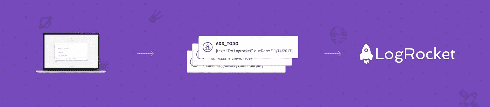
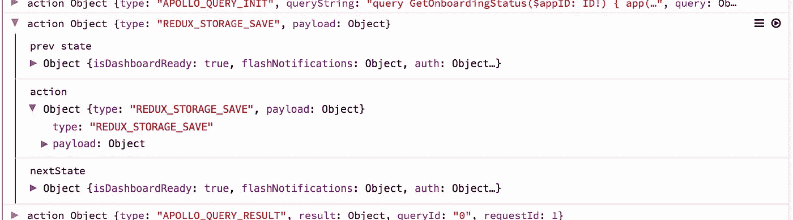
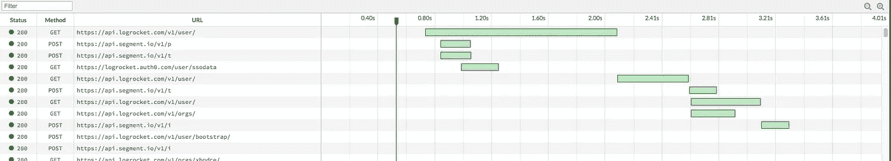
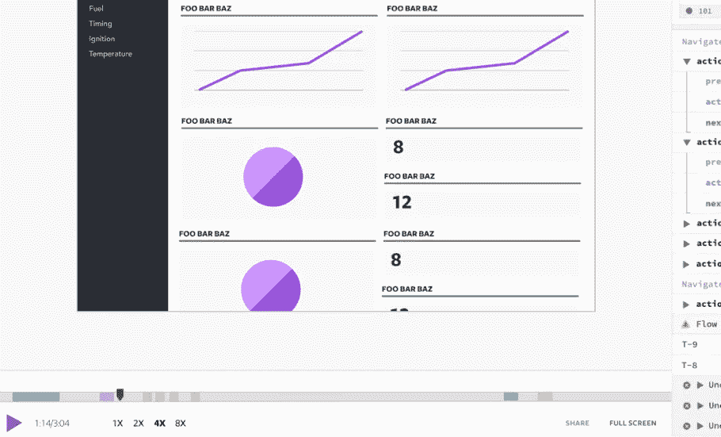
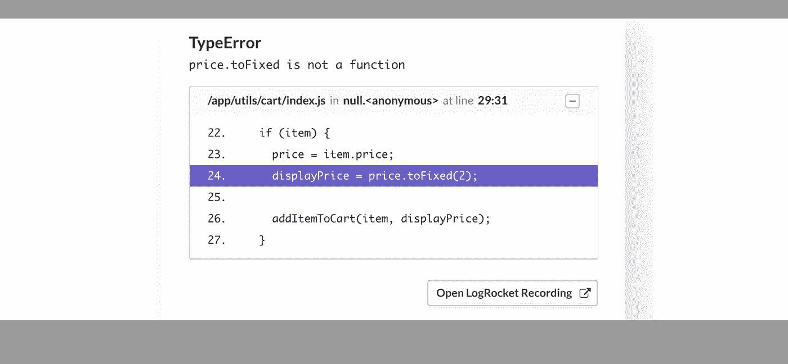
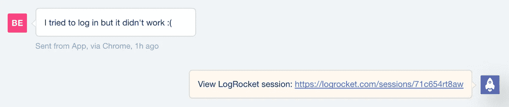

# 生产中的冗余日志记录

> 原文：<https://medium.com/hackernoon/redux-logging-in-production-d489d614de78>



理解网络应用中的问题很难。在神秘的 JavaScript 错误、用户报告的 bug 和 QA 中发现的问题之间，有一个持续的斗争来超越影响用户的问题。这些只是显而易见的问题——大多数 bug 实际上从未被报告过，因为有糟糕体验的用户只是离开或默默忍受。

为了解决这个问题，开发人员越来越多地采用前端日志工具，因为像 Redux 这样的现代状态管理库会留下丰富的审计线索。记录生产中的操作和状态使得理解错误和用户报告的问题变得容易。

在本文中，我将向您展示如何使用 LogRocket 设置 Redux 日志记录。然后，我将讨论使 Redux 应用程序更容易调试的技术。

# LogRocket:网络应用的 DVR


LogRocket 是一个前端日志工具，可以让你回放问题，就像它们发生在你自己的浏览器中一样。LogRocket 不需要猜测错误发生的原因，也不需要向用户询问截图和日志转储，而是让您重放会话以快速了解哪里出错了。它可以与任何应用程序完美配合，不管是什么框架，并且有插件可以记录来自 Redux、Vuex 和@ngrx/store 的额外上下文。

除了记录 Redux 操作和状态，LogRocket 还记录控制台日志、JavaScript 错误、堆栈跟踪、带有头+正文的网络请求/响应、浏览器元数据和自定义日志。它还使用 DOM 来记录页面上的 HTML 和 CSS，甚至为最复杂的单页面应用程序重新创建像素级完美视频。

# 设置 LogRocket

设置 LogRocket 很容易，只需要在应用程序中添加几行代码:

1.  用 NPM 安装:`npm i --save logrocket`。
2.  在[https://app.logrocket.com](https://app.logrocket.com)创建一个免费账户，并记下你的申请 id。
3.  在应用程序中初始化 LogRocket:

```
import LogRocket from 'logrocket';// Initialize LogRocket with your app ID
LogRocket.init(<your_application_id>);
```

4.添加 Redux 中间件。

```
import { applyMiddleware, createStore } from 'redux';const store = createStore(
  reducer, // your app reducer
  applyMiddleware(middlewares, LogRocket.reduxMiddleware()),
);
```

这就是基本设置——这是您开始使用 LogRocket 所需要的全部内容！

LogRocket 也有用于替代 Flux 实现的插件，比如 **ngrx** 和 **vuex** ，你可以在这里阅读关于[的内容。](https://docs.logrocket.com)

# 重放用户会话



在 LogRocket 中重放会话就像在自己的浏览器中看到它发生一样。您可以使用完整的操作负载以及前一个和下一个状态来检查 Redux 操作。



LogRocket 捕获网络请求和响应，并允许您深入研究特定的请求，查看头部和主体。瀑布图显示了计时，可以很容易地看出哪些请求很慢，或者是否发生了潜在的争用情况。



有时候，仅靠 Redux 日志不足以理解一个 bug，尤其是在处理用户报告的问题时。LogRocket 的视频回放可以让你准确地看到用户在你的应用中看到了什么。

由于这个视频实际上是 DOM 的重建(而不是真实的视频)，你可以检查 HTML/CSS 以了解视觉错误，或者以两倍的速度播放以快速了解用户在处理支持问题时在应用中做了什么。

# 将 Redux 日志集成到您的工作流中

能够重放用户会话和查看 Redux 日志在整个开发工作流程中很有帮助。

## **修复 bug**



LogRocket 集成了错误报告工具，如 Sentry 和 Bugsnag，让您看到每个 bug 的 Redux 日志和视频。这不仅有助于修复错误，也有助于理解错误的影响，因为有些 JavaScript 错误是完全无害的。通过观看错误发生时的视频，您可以很容易地判断它是否实际影响了用户，或者可以忽略。

## **支持**

很多时候，用户会报告问题，但不会给出足够的上下文来弄清楚到底发生了什么。

如果你正在使用像[对讲机](https://intercom.com)这样的聊天支持工具，你可以直接集成 LogRocket，这样每当用户开始聊天时，它就会添加一个带有录音 URL 的注释。



如果您正在集成一个更通用的分析工具，您可以使用如下跟踪 API 添加记录 URL:

```
LogRocket.getSessionURL(function (sessionURL) {
  analytics.track('LogRocket recording', sessionURL);
})
```

# 充分利用生产冗余测井

生产日志在所有 Redux 应用程序中都非常有用，但是通过在设计应用程序时考虑日志，可以确保日志在调试问题时发挥最大作用。

## **尽量保持 Redux 中的大部分状态**

我不想在这里讨论本地状态和 Redux 状态，但是当决定一个给定的状态是否应该在 Redux 中时，问问你自己在调试问题时看到那个状态是否有帮助。如果答案是肯定的，考虑将该状态放在 Redux 中，这样它将与崩溃报告和用户问题一起被记录。

## **使用利用 Redux 的数据提取库**

像 GraphQL 的 **apollo-client** 和 REST 的 **redux-query** 这样的库都有助于通过 redux 从网络获取数据。它们使用 Redux 作为持久层，这意味着在调试问题时，您可以检查您的 Redux 日志，以查看这些客户端获取了什么数据。

如果您喜欢更简单的方法，您可以通过在查询和从网络接收数据时简单地分派显式操作来构建自己的数据获取“框架”。

## **使用 Redux 处理不确定性来源**

当从 websockets、local storage、IndexedDB 甚至 Date()等 API 访问数据时，考虑调度 Redux 操作的结果，以便将来可以轻松地调试这些操作。例如，当监听 websocket 时，在每个消息上分派一个 Redux 动作——这样就可以在 Redux 日志中看到数据。

## **利用其他控制台 API**

像`console.time()`、`console.count()`和`console.group()`这样的控制台方法可以让你将丰富的数据添加到日志中，比如 React 组件渲染计数、事务计时和组件生命周期日志。如果你有兴趣了解更多，我在这里写了一篇关于这个[的帖子。](https://blog.logrocket.com/leveraging-the-console-api-in-react-apps-44df6d1ebeb2)

## **构建源地图并上传到 LogRocket**

LogRocket 支持你可以通过一个 [cli](https://github.com/LogRocket/logrocket-cli) 上传的源地图。通过这样做，您可以看到 JavaScript 错误、Redux 操作、控制台日志和网络请求的符号化堆栈跟踪，这让您可以看到代码中特定操作的触发位置。

# 结论

React 和 Redux 经常被称赞为构建可维护的应用程序的工具——其中一个重要的组成部分是可调试性。在生产环境中记录 Redux 数据提供了这种洞察力，因为通过检查 Redux 状态、网络请求和 DOM 可以很容易地调试 bug 和其他用户报告的问题。

使用 LogRocket 进行 Redux 日志记录可以大大简化修复 bug 和支持用户的工作。您可以在此了解更多信息:

[](https://logrocket.com) [## JavaScript 应用程序的日志记录和会话重放

### LogRocket 帮助您了解影响用户的问题，以便您可以重新开始构建优秀的软件。

logrocket.com](https://logrocket.com) 

> 我喜欢写关于 React、Redux 和其他开发工具的文章。如果你有任何想法或评论，请在这里留下，或在 twitter @b_edelstein 上与我聊天。感谢阅读！

[](http://bit.ly/HackernoonFB)[](https://goo.gl/k7XYbx)[](https://goo.gl/4ofytp)

> [黑客中午](http://bit.ly/Hackernoon)是黑客如何开始他们的下午。我们是这个大家庭的一员。我们现在[正在接受投稿](http://bit.ly/hackernoonsubmission)，并乐意[讨论广告&赞助](mailto:partners@amipublications.com)机会。
> 
> 如果你喜欢这个故事，我们推荐你阅读我们的[最新科技故事](http://bit.ly/hackernoonlatestt)和[趋势科技故事](https://hackernoon.com/trending)。直到下一次，不要把世界的现实想当然！

