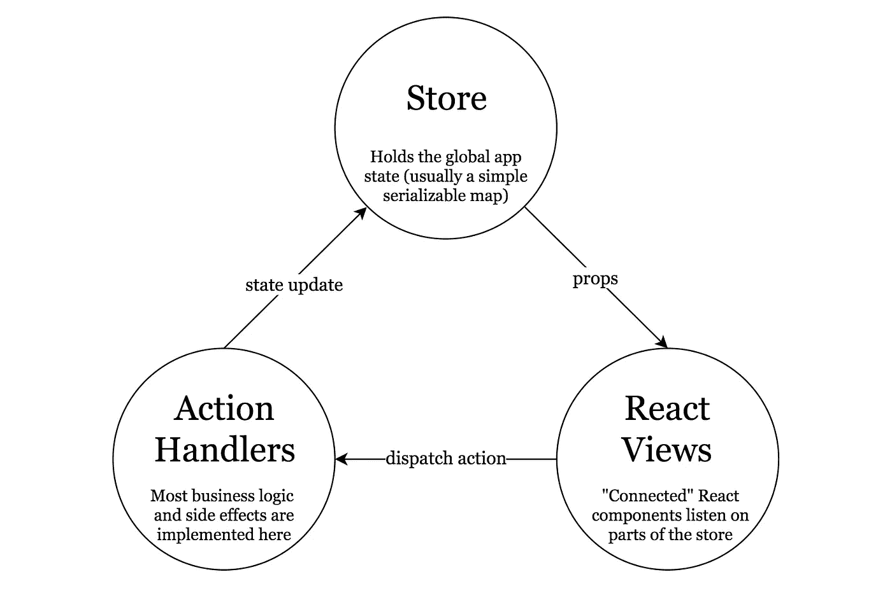
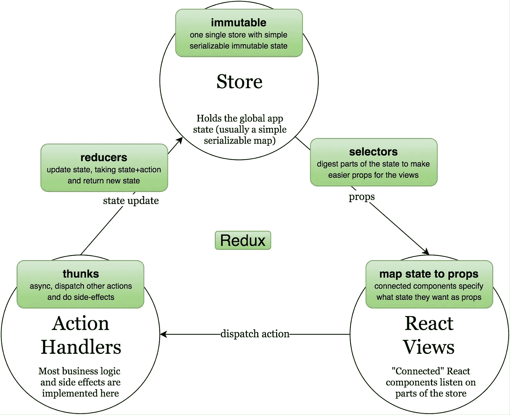

# Redux Step by Step:一个简单而健壮的现实生活应用工作流

> 原文：<https://medium.com/hackernoon/redux-step-by-step-a-simple-and-robust-workflow-for-real-life-apps-1fdf7df46092>

no trees, just rocks

[*Redux*](https://hackernoon.com/tagged/redux) *已经成为* [*React*](https://hackernoon.com/tagged/react) *应用中管理数据流最流行的 Flux 实现之一。然而，阅读 Redux 经常会导致感官超负荷，从而只见树木不见森林。下面展示的是一个简单明了的工作流程，用于使用 Redux 实现现实生活中的应用。通过一个实际应用程序的一步一步的实现演示了这个例子。它试图以实用的方式应用 Redux 背后的原则，并详细说明每个决策背后的思维过程。*

## 惯用重叠的自以为是方法

Redux 已经不仅仅是一个图书馆，它是一个完整的生态系统。它受欢迎的原因之一是它能够适应不同的写作风格和许多不同的口味。如果我在寻找异步动作，我应该使用 [thunks](https://github.com/gaearon/redux-thunk) 吗？又或许[承诺](https://github.com/acdlite/redux-promise)？还是[传奇](https://github.com/yelouafi/redux-saga)？

哪种口味是“最好的”并没有一个正确的答案。而且使用 Redux 也没有一个正确的方法。说到这里，选择太多是[压倒](http://www.ted.com/talks/barry_schwartz_on_the_paradox_of_choice?language=en)。我想呈现一种我个人喜欢的*固执己见的*味道。它很健壮，可以处理复杂的现实生活场景——最重要的是——它很简单。

## 所以我们来建个 app 吧！

我们需要一个真实的例子来说明。只要我们固执己见，互联网上最有趣的地方就是 Reddit。让我们做一个应用程序，显示那里最有趣的帖子。

在第一个屏幕上，我们将询问用户他们感兴趣的 3 个主题。我们将从 Reddit 的默认首页[子编辑](https://www.reddit.com/subreddits/default)列表中提取主题列表。

用户做出选择后，我们将在一个可过滤的列表中显示这 3 个主题中每个主题的帖子列表——所有主题或 3 个主题中的一个。当用户点击列表中的帖子时，我们将显示其内容。

## 设置

由于我们使用 React for web(我们可能会在未来的帖子中添加 React Native)，我们的起点将是 [Create React App](https://github.com/facebookincubator/create-react-app) ，官方入门套件。我们还将安装 NPM[redux](https://www.npmjs.com/package/redux)、 [react-redux](https://www.npmjs.com/package/react-redux) 和 [redux-thunk](https://www.npmjs.com/package/redux-thunk) 。结果应该是类似于[这个](https://github.com/wix/react-dataflow-example/tree/998decf6277717ffcee61dea30005c1fe917ae2a)的东西。

为了避免样板文件，让我们快速初始化 Redux 存储，并在 *index.js* 中连接 thunk 中间件:

## Redux 应用程序中的生命流动圈

Redux 教程中经常缺少的一个主要东西是宏大的画面和 Redux 适合的地方。Redux 是 [Flux](https://facebook.github.io/flux/) 架构的一个实现——一种在 React 应用中传递数据的模式。

在 classic Flux 下，应用状态保存在*商店*中。分派的*动作*导致该状态改变，之后监听这些状态改变的*视图*将相应地重新呈现它们自己:

Flux 通过使数据单向*流动来简化生活。随着代码库的增长和变得更加复杂，这减少了意大利面条效应。*

理解 Redux 的困难之一是有太多不直观的术语，如*归约符*、*选择器*和 *thunks* 。通过把它们放在通量图上，更容易看出它们的位置。这些只是实现循环不同部分的各种 Redux 构造的技术名称:

你可能已经注意到，Redux 生态系统中的其他术语，如*中间件*和*传奇*，都不存在。这是有意的，因为它们不会在我们的工作流程中扮演重要角色。

## 项目目录结构

我们将根据`/src`下面的顶级目录结构来组织我们的代码:

*   `/src/components` “哑”对不知道 Redux 的组件做出反应
*   `/src/containers`
    *连接*到我们 Redux 商店的“智能”React 组件
*   `/src/services`
    外部 API 的抽象外观(如后端服务器)
*   `/src/store`
    所有 Redux 特有的代码都在这里，包括我们应用的所有*业务逻辑*

`store`目录按*域*组织，每个域包含:

*   `/src/store/{domain}/reducer.js`
    减速器作为默认导出，所有选择器作为命名导出
*   `/src/store/{domain}/actions.js`
    所有的域动作处理程序(thunks 和普通对象创建者)

## 国家优先的方法

我们的应用程序有两个屏幕，我们将从第一个屏幕开始，让用户选择正好 3 个主题。我们可以开始实现通量循环的任何一点，但是我发现对我来说从状态*开始通常是最容易的。*

那么我们的*话题*屏幕需要什么 *app 状态*？

我们需要保存从服务器检索到的主题列表。我们还需要保存到目前为止用户选择的主题的 ID(最多 3 个)。按照选择的顺序保存它们会很好，所以如果我们已经有了 3 个并且选择了另一个，我们可以简单地删除最老的一个。

我们将如何构建这个应用程序状态？在我之前的文章中有一个可行的建议列表——“在构建你的应用状态时避免意外的复杂性”。根据提示，这将是一个合适的结构:

主题 URL 将作为唯一的 ID。

我们将在哪里保持这种状态？在 Redux 中，*缩减器*是保存状态并更新状态的构造。我们将通过*域*来组织我们的代码，所以这个缩减器的自然位置将是:`/src/store/topics/reducer.js`

有一些样板文件来创建一个缩减器，你可以在这里看到它。注意，为了加强我们状态的*不变性*(如 Redux 所要求的)，我选择了使用名为[无缝不可变](https://github.com/rtfeldman/seamless-immutable)的不变性库。

## 我们的第一个场景

在对状态建模之后，我喜欢采用一个用户场景，并从头到尾实现它。在我们的例子中，让我们创建我们的*主题*屏幕，并在它一出现就显示一些主题。这个组件将连接到我们的 reducer，这意味着它是一个“智能”组件，能够感知 Redux。我们将把它放在`/src/containers/TopicsScreen.js`中

有一些样板文件来创建一个连接的组件，你可以在这里看到它。让我们也将它显示为我们的 [App 组件](https://github.com/wix/react-dataflow-example/blob/57d53f2901e46ab2d90f756fd8c5988a5521e8e8/src/App.js)的内容。现在，当一切都设置好了，我们可以获取一些主题。

> ***规则:*** ***智能组件不允许有除调度动作以外的任何逻辑。***

场景从视图的`componentDidMount`开始。由于不能直接在视图上运行逻辑，我们将调度一个获取主题的动作。这个动作当然是异步的，所以它将是一个 [thunk](https://github.com/gaearon/redux-thunk) :

为了抽象 Reddit 服务器 API，我们将创建一个新的*服务*来执行实际的网络获取。它的方法将是异步的，所以我们可以对响应进行`await`。总的来说，我非常喜欢 [async await API](https://jakearchibald.com/2014/es7-async-functions/) ，以至于我的代码已经很久没有直接使用过`promises`了。

*服务*返回一个`array`，但是我们的状态结构将主题存储在一个`map`中。动作体是进行转换的好地方。为了在状态中实际存储数据，我们必须通过调度一个标准的普通对象动作来调用我们的缩减器。

此阶段的完整源代码可在[此处](https://github.com/wix/react-dataflow-example/tree/a74d3607578c6ef65da738ab2f92b80789258b2b/src)获得。

## 关于服务的几句话

服务用于抽象外部 API——在许多情况下，服务器 API 就像 Reddit 的[提供的](https://www.reddit.com/dev/api/)一样。这个抽象层的好处是 API 的变化，我们希望尽可能地将代码与它们分离。如果将来 Reddit 决定重命名端点或更改域名，我们有望将对应用程序的影响控制在服务范围内。

> ***规则:服务必须完全无状态。***

在我们的方法论中，这是一个棘手的规则。想象一下如果我们的 Reddit API 需要登录会发生什么。我们可能会试图通过用登录详细信息实例化它来在*服务*中保存这个登录状态。

这在我们的方法中是不允许的，因为所有的应用程序状态都必须包含在*存储*中。在*服务*中保持状态将是状态泄漏。在这种情况下，可接受的方法是为每个服务函数提供登录信息作为参数，并将登录状态保存在我们的一个*还原器*中。

实现服务相当简单，你可以在这里看到。

## 完成场景—缩减器和视图

普通对象动作`TOPICS_FETCHED`到达我们的缩减器，并包含新获取的`topicsByUrl`作为参数。我们的 reducer 除了保存状态数据之外，不需要做太多工作:

请注意[无缝不可变](https://github.com/rtfeldman/seamless-immutable#merge)的用法，它使这种不可变的改变变得显而易见。不变性库当然是可选的，比起[对象传播技巧](http://redux.js.org/docs/recipes/UsingObjectSpreadOperator.html)，我更喜欢它们的语法糖。

状态更新后，我们的视图需要重新呈现。这意味着视图需要监听它所关心的状态。这是通过 [mapStateToProps](https://github.com/reactjs/react-redux) 完成的:

我决定我们的视图将使用一个单独的`ListView`组件来呈现主题列表，该组件采用一个`rowsById`地图和一个`rowsIdArray`(受 [React Native](https://facebook.github.io/react-native/docs/listview.html) 的启发)。我正在用`mapStateToProps`准备`TopicsScreen`中的这两个道具(稍后会直接传给`ListView`)。这两个道具可以从我们的状态中推导出来。注意一些有趣的事情，我没有直接访问状态..

> ***规则:智能组件应该总是通过选择器访问状态。***

选择器是 Redux 中最重要的构造之一，但人们往往会忽略它。选择器是一个纯粹的函数，它将全局状态作为参数，并返回一些转换。选择器与*减速器*紧密耦合，位于`reducer.js`内部。它们允许我们在视图使用数据之前对数据进行一些计算。在我们的方法中，我们将这一思想更进一步。每当有人需要访问状态的一部分时(像在`mapStatetoProps`中)，他们需要通过一个选择器。

为什么？想法是封装应用程序状态的内部结构，并从视图中隐藏它。想象一下，我们后来决定改变内部状态结构。我们不想检查应用程序中的所有视图并重构它们。传递一个选择器将允许我们将重构限制在*缩减器*上。

这就是我们的`topics/reducer.js`的样子:

我们 app 的整个当前状态，包括`ListView`，在这里可以看到[。](https://github.com/wix/react-dataflow-example/tree/6b115770ac82d6f78a9f209630d0e0165f359316/src)

## 关于“哑”组件的一些话

`ListView`是“哑”组件的一个很好的例子。它没有连接到商店，也不知道 Redux。与位于`/src/containers`的“智能”连接组件不同，这些组件位于`/src/components`

“哑”组件通过 props 从它们的父组件接收数据，并且可以保存本地组件状态。假设您正在从头开始实现一个`TextInput`组件。闪烁的插入符号位置是本地组件状态的一个很好的例子，它不应该进入全局应用程序状态。

那么我们什么时候需要从“智能”组件转移到“笨”组件呢？

> ***规则:将智能组件中的视图逻辑提取到哑组件中，使其最小化。***

如果你看一下 [ListView](https://github.com/wix/react-dataflow-example/blob/6b115770ac82d6f78a9f209630d0e0165f359316/src/components/ListView.js) 的实现，你会看到它包含了视图逻辑，比如对行进行迭代。我们希望在我们的智能 [TopicsScreen](https://github.com/wix/react-dataflow-example/blob/6b115770ac82d6f78a9f209630d0e0165f359316/src/containers/TopicsScreen.js) 组件中避免这种逻辑。这使得我们的智能组件仅作为布线。另一个好处是`ListView`逻辑现在是可重用的。

## 下一个场景—多主题选择

我们已经完成了第一个场景。让我们继续下一个——让用户从列表中选择 3 个主题。

我们的场景从用户点击其中一个主题开始。这个事件由`TopicsScreen`处理，但是由于这个智能组件不能包含任何业务逻辑，我们将调度一个新的动作— `selectTopic`。这个动作也将是一个 *thunk* ，放置在`topics/actions.js`中。如您所见，我们导出的几乎每个动作(由视图调度)都是一个 *thunk* 。为了更新 reducer 状态，我们通常只从 thunk 内部分派普通的对象操作。

关于这个 thunk 的一个有趣的方面是，它需要访问状态。注意我们是如何保持每个状态访问都要经过一个选择器的规则的(尽管有些人可能会说这有点过分)。

我们必须更新 reducer 来处理`TOPICS_SELECTED`动作并存储新选择的主题。有一个有趣的问题是`selectTopic`是否需要成为 *thunk* 。或者，我们可以让`selectTopic`成为一个普通的对象动作，并将这个业务逻辑移到 reducer 本身。这是一个有效的策略。就我个人而言，我更喜欢将业务逻辑保持在 thunks 中。

一旦状态更新，我们需要将主题选择传播回我们的视图。这意味着在`mapStateToProps`中添加选中的主题。由于视图需要查询每个`rowId`是否被选中，所以将这些数据作为地图传递给视图更方便。由于数据无论如何都要经过一个选择器，这将是一个进行转换的好地方。

实现上述内容后，将由于行选择导致的背景颜色变化重构到一个新的哑组件——`ListRow`——我们的 app 看起来就像[这个](https://github.com/wix/react-dataflow-example/tree/a279a45055370ef769e5f799cf44a2b034131ab3/src)。

## 关于业务逻辑的几句话

好方法的目标之一是实现视图和业务逻辑之间的适当分离。到目前为止，我们的业务逻辑是在哪里实现的？

所有的业务逻辑都在`/src/store`目录下的 Redux 下实现。大部分在`actions.js`的 *thunks* 里面，还有一些在`reducer.js`的*选择器*里面。这实际上是一个官方规则:

> ***规则:将所有业务逻辑放在动作处理程序(thunks)、选择器和归约器中。***

## 导航到下一个屏幕—帖子列表

当我们有不止一个屏幕时，我们需要一种导航方式。这通常是通过使用导航组件来实现的，比如 [react-router](https://github.com/ReactTraining/react-router) 。为了使我们的例子简单，我想故意避免使用路由器。像路由器这样固执己见的外部依赖往往会将注意力从方法的概念讨论上转移开。

相反，让我们添加一个状态变量，`selectionFinalized`，告诉我们用户是否完成了主题选择。一旦用户选择 3 个主题，我们将显示一个按钮，一旦点击，将完成选择，并移动到下一个屏幕。单击该按钮将调度一个直接设置该状态变量的操作。

这与我们到目前为止所做的事情非常相似，唯一有趣的部分是知道何时显示按钮(只要至少选择了 3 个主题)。为此，我们可能会尝试添加另一个状态变量，但是这个变量实际上可以从我们现在状态中已经有的数据中导出。这意味着我们应该将这个业务逻辑实现为一个选择器*:*

*以上的完整实现可在[这里](https://github.com/wix/react-dataflow-example/blob/2884e36fb3549b7aeb405145bef9e5f75eefaa1b/src/containers/TopicsScreen.js)获得。为了进行实际的屏幕切换，我们需要将`App`变成一个连接的组件，并让它在`mapStateToProps`中监听`selectionFinalized`。完整的实现可在[这里](https://github.com/wix/react-dataflow-example/blob/5c9504d7138dfa08f98a77fc56c906288e4047e3/src/App.js)获得。*

## *帖子屏幕—再次声明优先*

*既然我们现在对这个方法很有经验，我们可以更快地运行第二个屏幕的实现。这个新的屏幕处理一个新的领域— *帖子*。为了使我们的应用程序尽可能模块化，我们将给这个域一个单独的 *reducer* 和单独的应用程序状态。*

*提醒—该屏幕的目的是显示可以根据主题过滤的帖子列表。用户可以点击列表中的帖子并查看其内容。根据我们的结构化提示[和](https://hackernoon.com/avoiding-accidental-complexity-when-structuring-your-app-state-6e6d22ad5e2a#.cn46edbo4)，这将会起作用:*

*而我们的新*岗位*减速机是[出身](https://github.com/wix/react-dataflow-example/blob/29f7a950a3c51143c4df85d92952a771014fb4ba/src/store/posts/reducer.js)。*

## *第一个场景—显示没有过滤器的帖子列表*

*像往常一样，当我们的状态被建模时，我们转移到一个简单的用户场景，并从头到尾实现它。让我们从显示没有应用任何过滤器的完整帖子列表开始。*

*我们需要一个新的智能容器来显示帖子，我们将其命名为`PostsScreen`，并让它在挂载时调度一个名为`fetchPosts`的新动作。在`posts/actions.js`我们的新域名下，这个动作将会是 *thunk**

*这和我们之前做的很像，这里实现的是[这里是](https://github.com/wix/react-dataflow-example/blob/1298dc958b5c4c1b01b8f3f187f127d0dc291694/src/store/posts/actions.js)。*

*在 thunk 结束时，我们发出简单的动作`POSTS_FETCHED`,将柱子运送到减速器。我们必须修改我们的减速器来存储数据。为了在`PostsScreen`中显示列表，我们需要将其`mapStateToProps`连接到提供这部分状态的选择器。然后，我们可以通过重用我们的`ListView`组件来显示列表。*

*也没什么新的，这里的实现是。*

## *下一个场景—过滤帖子列表*

*这个场景从向用户显示可用的过滤器开始。我们可以使用现有的选择器从*主题*缩减器状态中提取这些数据。当一个过滤器被改变时，我们将分派一个动作，直接在*post*reducer 中改变它。*

*有趣的部分是将过滤器应用于帖子列表。在我们的应用程序状态下，我们目前持有所有的`postsById`和`currentFilter`。我们不希望将过滤后的结果保存在应用程序状态中，因为它可以从它们中派生出来。在到达`mapStateToProps`中的视图之前，用于导出数据的业务逻辑在*选择器*中运行。因此，我们的选择器将是:*

*此阶段的完整实现可在[此处](https://github.com/wix/react-dataflow-example/tree/938c0d6ef8cff2bdd66cdd8a5ad3693fd7ffaffa/src)获得。*

## *最后一个场景—显示帖子详细信息*

*这个场景实际上是最简单的。我们有一个保存`currentPostId`的应用程序状态变量。我们所要做的就是当用户点击列表中的一篇文章时，通过调度一个动作来更新它。`PostsScreen`需要这个状态变量来显示文章细节，这意味着我们需要一个*选择器*来驱动它进入`mapStateToProps`。*

*这里看一下详细实现[。](https://github.com/wix/react-dataflow-example/blob/ae35eaa20b798b34225240a13a52c3e2586a4208/src/containers/PostsScreen.js)*

## *我们完事了。*

*这也完成了我们整个示例应用程序的实现。该应用程序的完整源代码可在 GitHub 上获得:
[https://github.com/wix/react-dataflow-example](https://github.com/wix/react-dataflow-example)*

**

## *我们固执己见的工作流程规则摘要*

*   **App 状态是一等公民，* [*结构*](https://hackernoon.com/avoiding-accidental-complexity-when-structuring-your-app-state-6e6d22ad5e2a#.cn46edbo4) *它像一个内存中的数据库。**
*   **智能组件不允许有除调度动作以外的任何逻辑。**
*   **智能组件应该总是通过选择器访问状态。**
*   **通过将智能组件中的视图逻辑提取到非智能组件中，使其最小化。**
*   **将所有业务逻辑放在动作处理器(thunks)、选择器和归约器中。**
*   *服务必须是完全无状态的。*

*记住，Redux 为个人风格提供了很大的空间。有许多具有不同规则集的备用工作流。我想起了我的一些好朋友，他们更喜欢[redux-promise-middleware](https://github.com/pburtchaell/redux-promise-middleware)而不是 *thunks* ，并且喜欢将所有的业务逻辑只放在*reducer*中。*

*如果你想分享一个不同的为你工作的方法，请随意为上面的项目准备你自己的实现，我们将提供它作为一个比较的分支。*

******

> *[黑客中午](http://bit.ly/Hackernoon)是黑客如何开始他们的下午。我们是阿美族家庭的一员。我们现在[接受投稿](http://bit.ly/hackernoonsubmission)并乐意[讨论广告&赞助](mailto:partners@amipublications.com)机会。*
> 
> *如果你喜欢这个故事，我们推荐你阅读我们的[最新科技故事](http://bit.ly/hackernoonlatestt)和[趋势科技故事](https://hackernoon.com/trending)。直到下一次，不要把世界的现实想当然！*

**