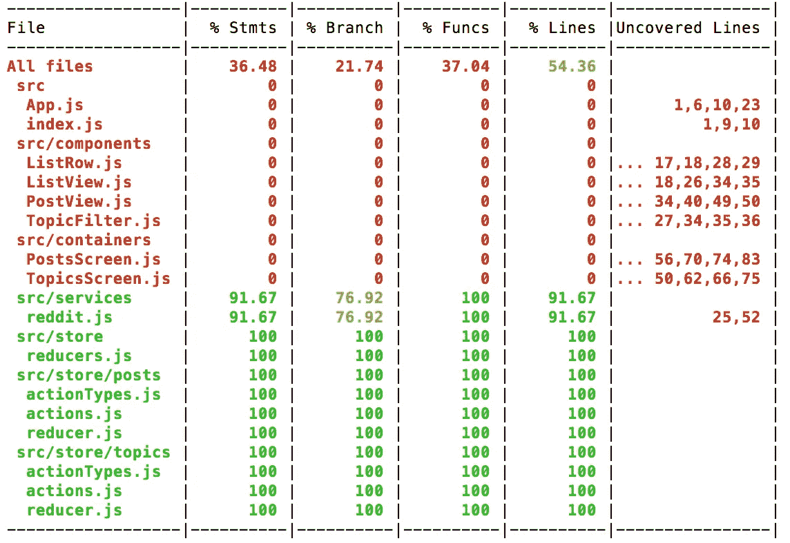

# 逐步还原测试:测试业务逻辑的简单方法

> 原文：<https://medium.com/hackernoon/redux-testing-step-by-step-a-simple-methodology-for-testing-business-logic-8901670756ce>

full coverage, all green

> *与* [上一篇文章](https://medium.com/u/9406506a2c3b#.q8vryqq6r)中实现的 Reddit 应用。它让用户从首页子编辑中选择 3 个主题，然后在一个可过滤的列表中看到他们的帖子。用代码刷新你的记忆，这里有:【https://github.com/wix/react-dataflow-example 
> 
> ## 为测试进行设置
> 
> 运行*单元测试*需要某种测试运行程序。像 [jest](https://facebook.github.io/jest/) 这样的现代跑步者包括你需要测试的一切，比如[设置和拆卸](https://facebook.github.io/jest/docs/setup-teardown.html#content)、[期望](https://facebook.github.io/jest/docs/using-matchers.html#content)和[嘲讽](https://facebook.github.io/jest/docs/mock-functions.html#content)。
> 
> 我们的应用依赖于 [create-react-app](https://github.com/facebookincubator/create-react-app) ，它已经预配置了 [jest](https://facebook.github.io/jest/) 。您可以在“终端”中运行以下命令来进行设置:
> 
> 注意，我们还安装了[redux-test kit](https://github.com/wix/redux-testkit)——这个库减少了测试 Redux 的样板文件，使测试过程更加简单有趣。
> 
> 最后一个命令`npm test`将在观察模式下启动 jest，并在我们编写测试时自动运行它们。如果您的项目没有预装 jest，您可以按照这些说明或简单地运行`npm install jest --save-dev`来轻松安装它
> 
> ## 我们的游戏计划
> 
> 如果我们一直遵循[方法](https://hackernoon.com/redux-step-by-step-a-simple-and-robust-workflow-for-real-life-apps-1fdf7df46092#.q8vryqq6r)，我们所有的业务逻辑都可以在各种 Redux 构造中找到，比如[动作处理器](http://redux.js.org/docs/advanced/AsyncActions.html) ( [thunks](https://github.com/gaearon/redux-thunk) )、[选择器](http://redux.js.org/docs/recipes/ComputingDerivedData.html)和[reducer](http://redux.js.org/docs/basics/Reducers.html)。我们所要做的就是练习如何测试每一个:
> 
> 1.  **减速器的单元测试**
> 2.  **选择器**的单元测试
> 3.  **动作处理程序**的单元测试(thunks)
> 4.  **服务的单元测试**
> 5.  整个**商店**的整合测试

## 减速器的单元测试

Reducers 是纯粹的函数，它接受现有的状态和动作，并在应用动作后返回新的状态。纯函数的好处是没有副作用，所以不需要模仿。

我们需要注意的一件事是[不变性](http://redux.js.org/docs/faq/ImmutableData.html#why-is-immutability-required)。不允许 Reducers 通过就地更改某个键来改变现有状态。这是一个 [redux-testkit](https://github.com/wix/redux-testkit) 帮助我们验证不变性的例子。

jest 的推荐做法是将测试与被测试的文件放在一起。我们的第一个减速器出现在`src/store/topics/reducer.js`。我们将把它的测试放在`src/store/topics/__tests__/reducer.spec.js`附近。

先从最简单的[题目减速器](https://github.com/wix/react-dataflow-example/blob/45f020f0c29075d7fcfe1d5d444a807a69a6d842/src/store/topics/reducer.js)测试开始。当我们的 reducer 在没有提供现有状态和动作的情况下被执行时(两者都是*未定义*，它应该返回初始状态:

接下来，让我们添加一些发送动作并检查是否返回正确状态的测试。为此，我们将使用 redux-testkit 的[减速器配方](https://github.com/wix/redux-testkit#recipe---unit-testing-reducers):

注意，当向我们的 reducer 提供现有状态时，我们需要保持与 reducer 实现如何保持其状态的兼容性。在这种情况下，它使用[无缝不可变](https://github.com/rtfeldman/seamless-immutable)，这意味着我们也必须这样做。

如果你的状态对象是复杂的和深度嵌套的，redux-testkit 包含其他方法来断言[状态增量](https://github.com/wix/redux-testkit#reducerreducerwithstatestateexpectactiontochangeinstatechanges)或者使用[定制期望](https://github.com/wix/redux-testkit#reducerreducerwithstatestateexecuteaction)。

经过全面测试的主题减速器在此处[可用](https://github.com/wix/react-dataflow-example/blob/e36e1f43ce797d47795eb15b44575f3e21912c7d/src/store/topics/__tests__/reducer.spec.js)，在此处发布减速器[。](https://github.com/wix/react-dataflow-example/blob/e36e1f43ce797d47795eb15b44575f3e21912c7d/src/store/posts/__tests__/reducer.spec.js)

## 选择器的单元测试

选择器也是纯粹的函数，它获取现有的全局状态并从中返回一些派生数据。再说一次，没有副作用，所以不需要嘲笑。

我们还需要注意这里的[不变性](http://redux.js.org/docs/faq/ImmutableData.html#why-is-immutability-required)。选择器是只读的，不应该改变状态。当使用像 [array.reverse](https://developer.mozilla.org/en-US/docs/Web/JavaScript/Reference/Global_Objects/Array/reverse) 这样的函数时，很容易忽略这一点，这些函数会使它们运行的对象发生变异，并在选择器运行时意外地改变状态。和以前一样，redux-testkit 帮助我们验证了不变性。

我们将测试与被测试的文件放在一起，但是我们将选择器测试与缩减器测试分开，即使缩减器实现在同一个文件中包含选择器。[主题选择器](https://github.com/wix/react-dataflow-example/blob/97d26fc14b4d9f3a340bf57c2ab74af78f3c062b/src/store/topics/reducer.js)位于`src/store/topics/reducer.js`内部。我们将把他们的测试放在`src/store/topics/__tests__/selectors.spec.js`附近。

让我们从对 [getSelectedTopicsByUrl 选择器](https://github.com/wix/react-dataflow-example/blob/97d26fc14b4d9f3a340bf57c2ab74af78f3c062b/src/store/topics/reducer.js#L48)的简单测试开始。我们将测试当状态为空(初始)时，它是否返回正确的结果。像以前一样，我们将使用 redux-testkit 的[选择器配方](https://github.com/wix/redux-testkit#recipe---unit-testing-selectors):

再次注意，当向我们的选择器提供现有状态时，我们需要保持与 reducer 实现如何保持其状态的兼容性。在这种情况下，它使用[无缝不可变](https://github.com/rtfeldman/seamless-immutable)，这意味着我们也必须这样做。

我们应该向这个选择器添加几个测试，以涵盖状态不为空的情况:

注意，redux-testkit 包含其他方法，如 [execute](https://github.com/wix/redux-testkit#selectorselectorexecutestate-args) ，如果您喜欢使用定制的期望。

经过全面测试的主题选择器在这里[可用](https://github.com/wix/react-dataflow-example/blob/e36e1f43ce797d47795eb15b44575f3e21912c7d/src/store/topics/__tests__/selectors.spec.js)，文章选择器在这里[可用](https://github.com/wix/react-dataflow-example/blob/bcc6993e6bc27b1929cfc581ca6f773c931537d8/src/store/posts/__tests__/selectors.spec.js)。

## **动作处理程序**的单元测试(thunks)

根据我们的[方法](https://hackernoon.com/redux-step-by-step-a-simple-and-robust-workflow-for-real-life-apps-1fdf7df46092#.q8vryqq6r)，几乎我们导出的每个动作(由视图调度)都是一个 [thunk](https://github.com/gaearon/redux-thunk) 。Thunks 包装执行动作的同步或异步函数。它们还会导致副作用，比如访问服务器，这在编写单元测试时通常会被嘲笑。

当对 thunk 进行单元测试时，我们需要断言什么？thunk 的主要输出是分派其他动作——主要是触发 reducers 中状态修改的普通对象动作。Thunks 还可以调度其他 thunks。这意味着我们应该对派出的*设定期望值。此外，由于 thunks 会导致访问服务器之类的副作用，我们也可以对这些设置期望值。*

像往常一样，我们将测试与被测试的文件放在一起。[主题动作](https://github.com/wix/react-dataflow-example/blob/53a2f3411d855b97860bb18ea75974eec82c29d8/src/store/topics/actions.js)在`src/store/topics/actions.js`里面。我们将把他们的测试放在`src/store/topics/__tests__/actions.spec.js`附近。

让我们从测试 [fetchTopics 动作](https://github.com/wix/react-dataflow-example/blob/53a2f3411d855b97860bb18ea75974eec82c29d8/src/store/topics/actions.js#L14)开始。我们将测试它是否会触发预期的调度。因为这是一个单元测试，所以我们不会实际执行分派——它们会被嘲笑。我们将使用 redux-testkit 的 [Thunk 方法](https://github.com/wix/redux-testkit#recipe---unit-testing-thunks):

## 单元测试 thunks 调用其他 thunks

随着您的系统变得越来越复杂，您可能会有一个 thunk 分派另一个 thunk。这是一个有趣的测试案例。我们可以在我们的 Reddit 应用程序的 [selectTopic 操作](https://github.com/wix/react-dataflow-example/blob/bcc6993e6bc27b1929cfc581ca6f773c931537d8/src/store/topics/actions.js#L40)中看到这个例子。

我们的最佳实践是始终将不同的 thunks 视为不同的单元——即使它们在同一个文件中。这意味着当*单元测试*一个调度另一个的 thunk 时，我们不会实际执行第二个 thunk——我们会一直模拟它。为了改进我们的测试，给第二个 thunk 的匿名内部函数一个明确的名字也是一个好主意:

我们的助手库 redux-testkit 在测试调度另一个 thunk 的 thunk 时提出了几个[限制](https://github.com/wix/redux-testkit#limitations-when-testing-thunks-that-dispatch-other-thunks)。我们不能对发送给第二个 thunk 的参数设置期望值，也不能模仿它的返回值。乍看起来，这些限制降低了我们测试的广度，但它们实际上加强了对兄弟思维的正确处理。

如果您的用例受到这些限制，您可能不会将不同的 thunks 视为不同的单元——这通常是一种*代码气味*。进一步的讨论超出了这篇文章的范围，但是这个主题非常重要，所以我们决定专门写一篇简短的文章——“Redux Thunks Dispatching Other Thunks——讨论和最佳实践”。

那么 [selectTopic action](https://github.com/wix/react-dataflow-example/blob/bcc6993e6bc27b1929cfc581ca6f773c931537d8/src/store/topics/actions.js#L40) 的单元测试会是什么样子呢？

经过全面测试的主题操作在[这里](https://github.com/wix/react-dataflow-example/blob/b95f82560bd2e04c04d1702ce29a572449dfd0ed/src/store/topics/__tests__/actions.spec.js)可用，发布操作[这里](https://github.com/wix/react-dataflow-example/blob/b95f82560bd2e04c04d1702ce29a572449dfd0ed/src/store/posts/__tests__/actions.spec.js)。

## **服务的单元测试**

服务是外部 API 的抽象外观(如后端服务器)。它们是无状态的，通常包含纯逻辑。服务的一个常见副作用是使用 [fetch](https://developer.mozilla.org/en-US/docs/Web/API/Fetch_API/Using_Fetch) 发出 HTTP 请求——我们将不得不对此加以模仿。为此，我们将使用 [jest-fetch-mock](https://github.com/jefflau/jest-fetch-mock) 。用
`npm install jest-fetch-mock --save-dev`安装

像往常一样，我们将测试与被测试的文件放在一起。reddit 服务位于`src/services/reddit.js`内部。我们将在`src/services/__tests__/reddit.spec.js`附近进行测试。

让我们从对 [getDefaultSubreddits 命令](https://github.com/wix/react-dataflow-example/blob/cae09bba934bda406bca8ed5d5caffededdce6ab/src/services/reddit.js#L11)的简单测试开始:

这些测试在开发过程中也非常方便，因为它们让我们可以根据遵循契约的示例数据进行工作。对于这个测试，我们手动记录了 Reddit API，并将记录作为 JSON 放在 [reddit.subreddits.json](https://github.com/wix/react-dataflow-example/blob/cae09bba934bda406bca8ed5d5caffededdce6ab/src/services/__tests__/reddit.subreddits.json) 中。实际上，更方便的做法是先编写测试，然后完成满足它们的实现。

经过全面测试的 reddit 服务在[这里](https://github.com/wix/react-dataflow-example/blob/cae09bba934bda406bca8ed5d5caffededdce6ab/src/services/__tests__/reddit.spec.js)可用。

## 整个**商场的整合测试**

到目前为止，我们所有的测试都集中在单个*单元*——单个缩减器、单个选择器、单个 thunk 或单个服务。我们的下一个议程是测试我们的单元如何互连——换句话说，*集成测试*。

关于术语“集成测试”有很多模糊之处——这完全取决于什么与什么集成。让我们明确并准确地定义什么在我们的案例中起作用。我们的重点是客户中业务逻辑单元之间的集成。不是客户端和服务器之间的集成。业务逻辑和 UI 之间没有集成。

使用 Redux，我们的业务逻辑与应用程序的其余部分完全分离，位于我们的*商店*下。为了一起测试所有的 Redux 结构，我们需要一个实际的 Redux store 实例。没有理由不使用真实的东西，所以我们将创建一个商店实例，就像我们在[生产代码](https://github.com/wix/react-dataflow-example/blob/53a2f3411d855b97860bb18ea75974eec82c29d8/src/index.js#L10)中创建商店一样。

驱动我们测试场景的输入是什么？回顾 Flux [架构图](https://cdn-images-1.medium.com/max/1600/1*stmn8kxXJrX9hbk39hHQJA.png)，触发商店变化的唯一方式是通过分派一个动作。这意味着*动作*将成为我们的输入。

在我们的场景中，我们将做出什么样的断言？回顾 Flux [架构图](https://cdn-images-1.medium.com/max/1600/1*stmn8kxXJrX9hbk39hHQJA.png)，消费我们商店的唯一方式是监听更新状态。我们通常从不直接访问新状态，而是使用选择器。这意味着*选择器*将用于我们的断言。

为了将测试与被测试的文件放在一起，我们将使用`src/store`文件夹。[主题域](https://github.com/wix/react-dataflow-example/tree/cae09bba934bda406bca8ed5d5caffededdce6ab/src/store/topics)位于`src/store/topics`下。我们将在`src/store/__tests__/topics.spec.js`附近进行测试。

让我们从一个实例化商店的空框架开始:

我们不需要 redux-testkit 的太多帮助，因为我们所做的只是使用官方的 Redux API。我们添加的唯一助手是一个名为 [FlushThunks](https://github.com/wix/redux-testkit#flushthunks--flushthunkscreatemiddleware) 的中间件。这个中间件跟踪所有已经被分派的 thunks。这对于一个 thunk 分派另一个 thunk 并让我们在运行断言之前等待所有承诺都被解析的情况很有用。如果您没有 thunks 分派其他 thunks，您可以移除这个中间件。

让我们实现一个有趣的与主题相关的集成场景:我们将从从 reddit 服务获取所有主题开始。然后只选择其中的两个，并验证我们的选择仍然无效(需要 3 个)。然后，我们将选择第三个并验证选择是否有效。一旦选择了 3 个主题，系统通过[分派](https://github.com/wix/react-dataflow-example/blob/cae09bba934bda406bca8ed5d5caffededdce6ab/src/store/topics/actions.js#L40)一个帖子动作从这些主题中预取帖子。最后，我们将验证预取是否成功，以及正确的帖子是否到达了我们的商店。最后一个动作是一个 thunk 调度另一个 thunk——所以我们需要使用 FlushThunks 来等待一切平息下来:

这个场景似乎重复了我们之前的*单元测试*中已经测试过的方面。这是正确的。根据定义*集成测试*需要几个单元并组合它们的流程。

这个想法是为了测试单元之间的少量快乐流。没有必要检查每个可能的组合。让我们以上面的场景为例，没有必要添加另一个测试来检查当选择第四个主题时会发生什么(我们期望第一个主题被替换)。我们已经在广泛的*单元测试*中涵盖了这些边缘情况。

记住我们的金字塔。我们走得越高，我们需要写的场景就越少。集成场景的总数应该大大低于单元场景。不确定应该编写哪些集成场景？尝试找到您尚未在集成场景中涉及的*动作*，并围绕它们构建一个动作。

经过全面测试的主题域可在[这里](https://github.com/wix/react-dataflow-example/blob/0ae091aab8f798cee5fe5d235218c5e6c0a6d3cb/src/store/__tests__/topics.spec.js)，帖子域[这里](https://github.com/wix/react-dataflow-example/blob/0ae091aab8f798cee5fe5d235218c5e6c0a6d3cb/src/store/__tests__/posts.spec.js)。

## 摘要

我们已经完成了我们的游戏计划，我们的业务逻辑应该包括在内。我们示例 Reddit 应用程序的完整代码(包括业务逻辑的完整测试)可在 GitHub 的以下分支中找到:

 [## wix/react-数据流-示例

### react-dataflow-example -为现实生活中的 react 应用程序尝试不同的数据流方法

github.com](https://github.com/wix/react-dataflow-example/tree/redux-thunk-tests) 

## 新闻报道

你如何知道你是否有足够的测试覆盖率？一种方法是使用 jest 覆盖率报告，它指出了在测试中实际执行的代码行的百分比。通过运行以下命令生成报告:

当测试业务逻辑时，我们应该能够毫无困难地达到 100%的覆盖率。请记住，完全覆盖并不一定意味着测试是有意义的，我们现在可以盲目自信地部署。但是如果你没有 100%的话——他们肯定是缺乏的。

这是我们为 Reddit 应用程序编写的测试覆盖报告:

我们的服务还需要一点改进。我们可以看到[未测试的线](https://github.com/wix/react-dataflow-example/blob/0ae091aab8f798cee5fe5d235218c5e6c0a6d3cb/src/services/reddit.js#L25)，它们看起来像是我们甚至可以选择忽略的边缘条件。

因为我们只测试业务逻辑，所以我们可以使用以下命令将报告限制在相关目录— `src/store`和`src/services`:

## 发布演职员表场景

写出好的测试是有艺术的。如果你写的测试太少，你将不会获得完全覆盖所提供的信心。如果你写得太多，维护它们会变得很麻烦，不会增加价值。

保证编写正确数量的测试的方法之一是 TDD — [测试驱动开发](https://en.wikipedia.org/wiki/Test-driven_development)。我们是 Wix 中 TDD 的忠实粉丝，但是我们没有成功地用 Redux 创建一个感觉自然的 TDD 工作流。这最终导致了 [remx](https://github.com/wix/remx) 的诞生——一个由 [Redux](https://github.com/reactjs/redux) 教条启发而来的习惯用法 [MobX](https://github.com/mobxjs/mobx) 的有趣组合。很快会有更多。

> [黑客中午](http://bit.ly/Hackernoon)是黑客如何开始他们的下午。我们是 [@AMI](http://bit.ly/atAMIatAMI) 家庭的一员。我们现在[接受投稿](http://bit.ly/hackernoonsubmission)并乐意[讨论广告&赞助](mailto:partners@amipublications.com)机会。
> 
> 如果你喜欢这个故事，我们推荐你阅读我们的[最新科技故事](http://bit.ly/hackernoonlatestt)和[趋势科技故事](https://hackernoon.com/trending)。直到下一次，不要把世界的现实想当然！

