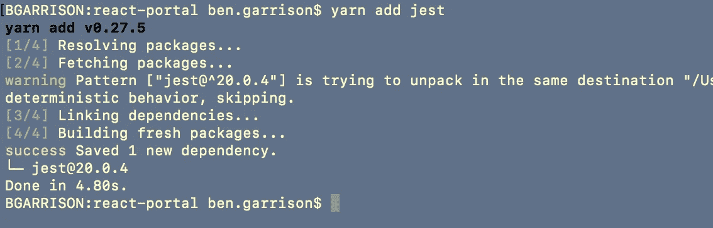
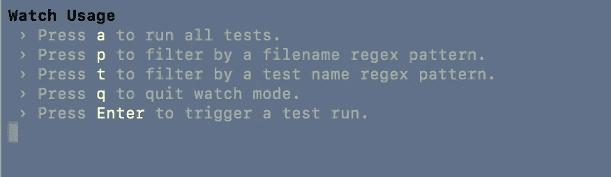
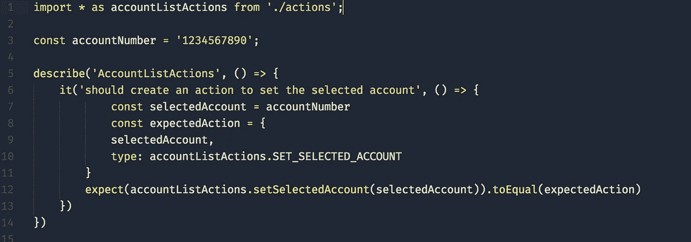
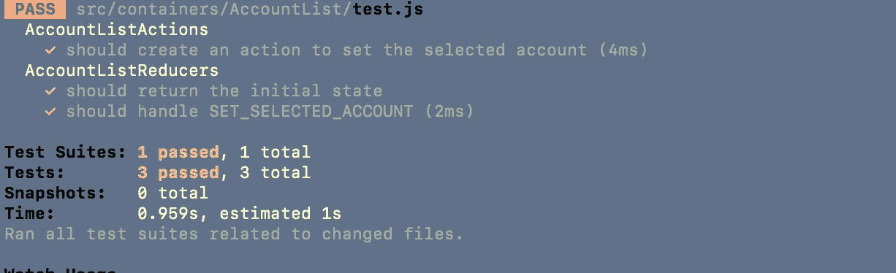
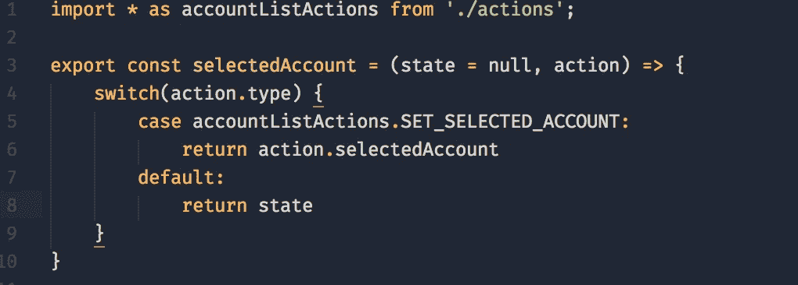
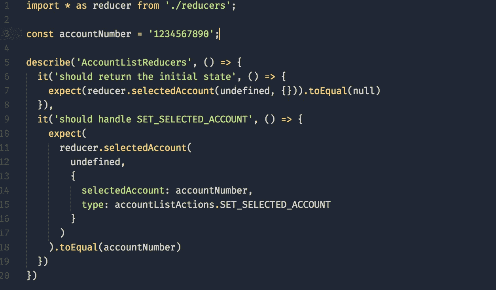

# 用 Jest 进行冗余单元测试

> 原文：<https://medium.com/hackernoon/redux-unit-testing-with-jest-f3a18f387f75>

如果你正在用 [create-react-app](https://github.com/facebookincubator/create-react-app) 引导你的 react 应用，你可能会意识到 Jest 现在已经被嵌入了。Jest 是另一个 [**FB**](http://facebook.com) 创造，旨在简化 javascript 单元测试的编写。它目前正在获得牵引力，你可以在这里找到非常好的 Jest 教程、这里的和这里的。

这篇介绍性的教程着重于为支持 Redux 的 React 应用程序编写测试，更具体地说，是为您的[动作](http://redux.js.org/docs/basics/Actions.html)和[减少器](http://redux.js.org/docs/basics/Reducers.html)编写测试。

**入门:**

*   如果你从 create-react-app 引导，你的项目中可能已经有 Jest，如果没有，你需要添加它。在这篇文章中，我将多次引用[纱线](https://yarnpkg.com/lang/en/)，如果你用 [NPM](https://www.npmjs.com/) 来进行包管理的话，我将把它替换掉。

yarn add jest

*   您还没有进行任何测试，但是从这里您可以运行*纱线测试*来启动手表终端，您将看到几个选项:

yarn test watch options

Yarn 有一个内置的正则表达式，它会搜索 src 文件夹的所有级别，它会搜索符合以下三个标准之一的文件:

*文件夹中带有“. js”后缀的文件。

*后缀为`. test.js '的文件。

*后缀为` . spec.js '的文件。

好，让我们写一个简单的第一个测试。我们将从测试一个非常简单的动作创建器开始。如果你不熟悉动作和动作创建者的区别，读读[这个](https://decembersoft.com/posts/whats-the-difference-between-action-and-action-creator-in-redux-js/)。

# actions.js

下面是一个 actionsJS 文件，带有一个常量 *SET_SELECTED_ACCT* 和动作创建者: *setSelectedAccount()。这是我们将要测试的动作创建器。*

actions.js

# 测试. js

这是我们的测试文件。我们从我们的 *actions.js* 文件导入所有内容，设置一个假的*账号*进行测试，然后开始我们的测试。第 5 行和第 6 行描述了我们的测试(您可以在 describe 中放置多个 *it* 测试)，第 8 行开始我们模拟的预期响应，第 12 行执行我们的操作，并使用一个 *toEqual* [matcher](https://facebook.github.io/jest/docs/en/using-matchers.html#content) 来比较接收到的响应和预期的响应。

如果成功，您的终端将输出如下内容，如果出错，终端中将显示失败的上下文。

watch options results

现在让我们测试一个减速器。Reducers 可能很复杂，但是为它们编写测试相当简单，因为它们只是 JS 函数。

# reducers.js

reducers.js

这是一个简单的 reducer 文件，只有一个 reducer:*selected account*。注意，我们从 out *actions.js* 文件中引用了相同的 const*SET _ SELECTED _ ACCOUNT*。

# 测试. js

这个描述函数包含两个测试，第 6 行和第 9 行。第 6 行测试 *selectedAccount: null 的初始状态。*第 9 行执行一个*未定义*状态(第 12 行)的减速器和一个具有两个属性的动作:*选择账户*和*类型。这与我们之前测试的动作相同。第 18 行确保 reducer 返回 accountNumber。*

这就是关于使用 Jest 测试 Redux 动作和 Reducers 的介绍。我们将 Jest 添加到我们的项目中，在我们的 *test.js* 文件中为 Action creator 和 Reducer 创建了测试，并查看了一些用于导航 Jest 测试的终端输入和输出。

# 当前正在收听:

# 其他资源:

*   [Jest 文档](https://facebook.github.io/jest/)
*   [使用 Redux 和 Jest 进行测试](http://redux.js.org/docs/recipes/WritingTests.html)

在推特上让我知道你的想法。坚持下去。

# **如果你喜欢这篇文章，请推荐，帮助别人找到！**

