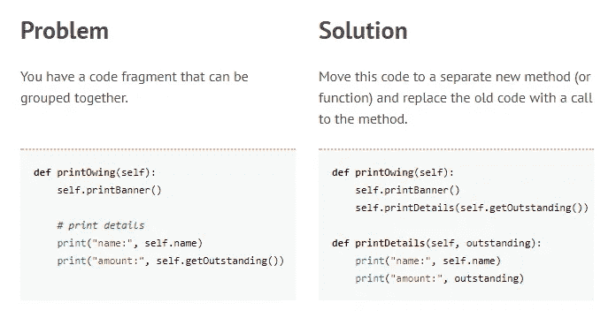

# 重构——卫生习惯

> 原文：<https://medium.com/hackernoon/refactoring-the-hygienic-habit-b2ee0f5528ba>

> 通过不断改进代码的设计，我们让工作变得越来越容易——约书亚·克里耶夫斯基，重构模式

[Pinterest](https://www.pinterest.com/pin/343751384028774338/)

重构是对现有的、有效的代码进行改进。

好吧，但是“更好”是什么意思？它意味着更好的结构、更好的构建、更好的可读性和更好的理解。

您的代码更容易使用，更容易添加新功能，更容易发现和修复错误，更容易扩展和维护，这是一种防止代码逐渐失控的方法。

## 什么是重构*什么是*

> 如果你曾经看过一个有点太长的方法，发现其中有几行是属于一起的，就把它们分开放入它们自己的方法中。
> 
> 然后用对新方法的调用替换了原始代码。这是一种重构，是提取方法的重构。

这是一个小型的 **技术**的**集合**，用于改进已经存在的代码。这段代码已经写好了，并且已经在运行了。我们没有改变它的功能。

这些单独的技术，每一个都是一个单独的重构技术，它们通常很小，每一个都处理一个特定的常见问题。

不存在任何人都可以遵循的一套规则或特定的顺序。但是有一套技术可以帮助你重构代码。

Extract Method Refactoring — [refactoring.guru](https://refactoring.guru/extract-method)

现在，如果你已经写了一段时间的代码，你几乎已经做了一些。但是使用**形式重构技术**，**给决策**带来了更多的自觉意识。

它不会取代你的直觉，但它会给你更多的问题去问:

1.  如果你试图拆分一些代码，你真正应该寻找什么？
2.  当局部变量和非局部变量混合时你会怎么做？
3.  有没有什么原因让你不把一些代码拆分成它自己的方法？

## —技术类别

思考重构技术的一个有用的方法是理解它们可以根据它们操作的代码的不同层次被分成几个类别。

他们中的一些人关心的是**个体方法**本身，而不是担心类层次或设计模式。

然后，我们从更高的角度进行重构。我们仍然**在研究这个方法，但是**现在对我们的类更加**了解了。这个方法在正确的类中吗？。**

而且，我们可以上升到另一个抽象层次，不要太关注方法，而是更多地关注不同类之间的**通信。*A 类似乎除了使用 B 类的方法和属性之外什么也不做？。***

我们甚至更上一层楼。在**面向对象的应用程序中，有一些技术确实大放异彩。我们应该使用更多的继承和多态还是更少的继承和多态？。**

> 您将看到几个重构**看起来是彼此**的精确逆。一种重构技术被称为“添加参数”，但另一种被称为“移除参数”。
> 
> 毕竟，完全可以理解的是，你需要的技术有时是另一种技术的对立面。

## *什么重构不是*

重构是 ***不是*调试**。

你的代码已经需要工作了。这不是发现 bug 的方法，你应该在 bug 发生的时候就修复它。

所以，这是真的，**在**重构的过程中**你可能会发现 bug**。但是当你开始处理这个问题的时候。你已经停止了重构，你已经开始修复错误，这是一种非常不同的心态。

重构是 ***而不是*的表现**。

这是另一个非常普遍的误解，即我们清理代码会使它更快。

不，代码性能不是重构的目标，甚至也不是期望。**但是，我们的表现是！**。我们将能够更快地阅读和理解代码。不仅仅是单独的代码片段，而是更大的应用程序。

**重构是*而不是*增加功能**

如果在这个过程中你添加了一个新的特性，你就不再是重构了。因为在重构中，我们不会改变代码的行为。

我们可能会在内部做很多事情，创建新的类，将功能从一个地方转移到另一个地方，重命名，重组。但是重构过程的最终结果不会改变代码的可见行为。

因此，之前使用我们应用程序的任何最终用户根本不知道我们做了什么。我们没有修复错误，我们没有让它更快，我们没有增加功能。

## 为什么要使用重构

那么，为什么要进行重构呢？

好吧，所以，重构**不是**添加功能，重构不是寻找 bug，重构不是关于性能，**但是我们简单地重构** **，因为我们想做那些事情**。

因为结构良好的代码将使添加新特性和新功能变得更加容易。这将使开始分析性能变得更加容易。因此，我们正在重构，以消除未来的障碍。

我们做重构是有原因的。**如果没有理由重构，那就不要做。**

> 如果我们编写了一个应用程序，并且很久都没有使用过。它起作用了，它足够快了。与他们的任何其他系统都没有冲突，也没有需要添加的功能。
> 
> 这可能是世界上最丑陋的代码，但是，它不需要重构。因为没有理由这样做。

在**团队文化**中，当它不是文化的一部分时，团队通常很难**获得批准**花时间重构，因为好处不会立即显现。

是的，我们没有增加功能，我们没有提高性能，我们没有修复错误，**所以为什么要这么麻烦呢？我们费心是为了能更容易地做这些事情。**

## 何时使用重构

重构**是不是** **不是一个独立的阶段。**

当你第一次学习重构时，它听起来像是你作为一个独立的阶段做的事情。你写一个应用程序，然后重构它。

好吧，如果你有一个混乱的现有代码，你可能需要不时地这样做，但是，目的是你开始一直这样做。

**当你写代码的时候，你可以边写边重构。你写一个新的类或一些新的方法，检查并测试它，然后花几分钟扫描并确保它尽可能地被重构。**

在团队环境中，学习重构的一个很好的方法是**代码审查或结对编程**。

把多双眼睛带到同一个代码上。你会发现不同的人发现不同的重构机会。

而且，如果你是一个单独的开发者，你需要更加注意应用个人技术，尤其是那些你不会自然想到的技术。

## 如何重构

# ⚠ …

> 我们不会深入研究每一种重构技术，它试图解决什么问题，以及如何在代码中应用它。其中大部分都很容易理解，你可以在下面的“下一步去哪里”一节中找到它们。从常见的低级技术开始，一直到更多不同的级别。

## —步骤

首先，**你不需要知道所有的重构，只要开始使用它们**。

事实上，要想学好它们，更实际的做法是挑选一些技巧，并开始积极地应用它们。

> 在学习了这些重构技术之后，你会发现自己很自然地写出了更模块化的代码，更好的面向对象的代码，知道了将一部分功能或一部分数据放在什么地方。

**那么，如何开始呢？**从底层开始，较低的级别，基本重构，一路向上。

比如重命名和提取方法，缩短参数列表，最小化无用的临时变量，让你的条件更容易阅读。

所以，当你在看代码的一部分时，**只需要浏览两三遍那部分代码**。

你在**而不是 寻找的是**，在那里我可以应用 *X* 重构技术**。**

你要寻找的是会引起你注意的**事物**。让这段代码变得难闻的东西。我们用它来作为我们需要改进的指标。*这就是被称为* ***的代码气味。***

所以，重复的代码，冗长的方法，冗长的参数列表，太多的注释，还有[列表和](https://en.wikipedia.org/wiki/Code_smell#Common_code_smells)。

但是，有些代码气味**不是来自扫描**，它们将**需要密切关注**。比如，数据块或下推或上拉方法或字段的地方。

> 许多最常见的编程 ide，如 Visual Studio、Xcode 和 Eclipse，实际上会帮助您实现许多这些重构技术。

## —自动化测试

我们正在改变代码，这带来了风险。

要证明你在重构**时所做的**改变仅仅是你想要的**，最好的方法就是在**之前和之后对你的代码**运行一组**自动化单元测试**。**

自动化测试可以使用类似 Java 中 Jnit 的测试框架来完成。

> 自动化测试一直到测试驱动开发或行为驱动开发策略都是对重构的极大补充。

## 接下来去哪里

当你对一套重构感到满意，并且想更进一步探索更多的时候，那么你的资源绝对应该包括马丁福勒的**[**重构改进现有代码的设计**](https://martinfowler.com/books/refactoring.html) **】。****

> **这本书不打算从头到尾读一遍。大部分是重构的目录。所以与其说是教程，不如说是参考。**

**refactoring.guru 的******(与马丁·福勒的书相关)和[**refactoring . guru**](https://refactoring.guru/refactoring)**网站都有简短的摘要，并附有代码示例。**********

******随着你越来越熟悉，你可能还想在你的平台或环境中寻找关于重构的资源。原理完全一样。但是经常会有**平台特定的提示和窍门**。******

> ****感谢阅读！如果你喜欢这篇文章，你能点击👏按钮？很有帮助！****