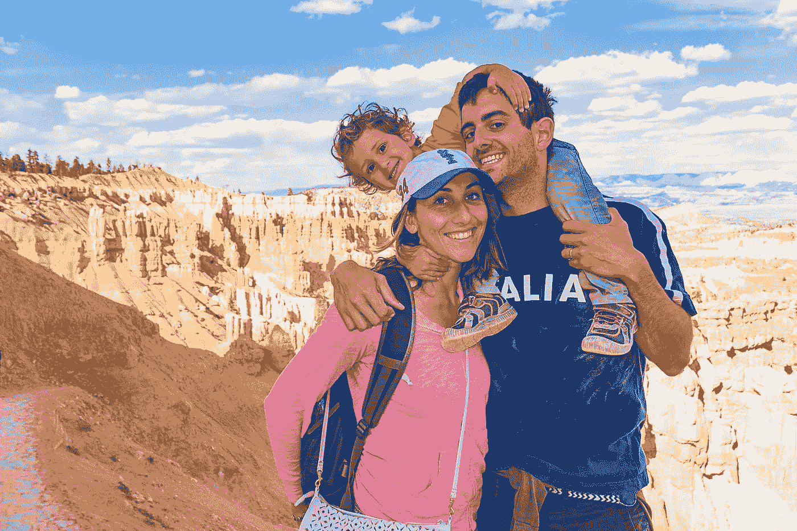

# 我 30 岁时的反思和学习

> 原文：<https://medium.com/hackernoon/reflections-and-learnings-as-i-turn-30-2b7e02bc7d03>

今天我 30 岁了。我不太确定为什么，但是绕太阳旋转 30 圈似乎是一个里程碑。我仍然会借此机会反思迄今为止的[生活](https://hackernoon.com/tagged/life)，以及我希望在[的未来](https://hackernoon.com/tagged/future)会是什么样子。

山姆·奥特曼在做《T5》时分享了一些《T4》的好东西，我不打算参赛。我也不打算像 Ryan Allis 那样发布 1200 多张幻灯片，尽管你真的应该去看看。

30 岁时，我发现自己在一个完全不确定的时期非常快乐，不知道自己是如何走到这一步的。直到今天，我的生活肯定没有按计划进行，但我必须承认，我现在过得不公平地轻松。

我高兴的是我没有任何遗憾。我总是很快做出决定，而且大多是基于直觉，我想这也是我未来继续做决定的方式。

从不攻读硕士学位，搬到旧金山，结婚，生孩子，搬到山区..如果你不做决定，就不会发生。如果你等待一个完美的时间或理由，它永远不会发生。

我发现惰性必须积极对抗，但是生活给了你正确的线索，这是非常明显的。你只需要付诸行动。

## 后悔最小化框架

在过去的几年里，我越来越多地质疑我所做的事情，以确保它确实符合我想做的事情以及我想对这个世界产生的影响。我认为这表现在[使命和市场组合](http://m14t.com/portfolio)中，也表现在[促使我开始 Kickpay](/@kickpay/kickpay-fd50c48e084c#.9762ropcf) 的动机中。

我发现对做出这些和其他决定最有用的是非常简单而且可能是显而易见的“后悔最小化框架”，杰夫·贝索斯在解释他如何决定创建亚马逊时举例说明了这一点。

到今天为止，这使得回答很多问题变得非常容易。

*   我会后悔这么年轻就娶了老婆吗？**地狱号**
*   我会后悔年纪轻轻就要孩子吗？没有。
*   我会后悔工作耗尽了我的生命，而没有花时间和我出色的妻子和家人在一起吗？最肯定的。
*   我会后悔搬到山里，与大自然更加和谐地生活吗？即使这意味着拒绝很多很酷的商业和工作提议。肯定不是。

所以现在我又一次面临这个问题:当我老了的时候，我会后悔(不)做什么？

**我越来越开始思考的是，我会后悔没有更积极地帮助保护地球免受我们不受控制的增长和随之而来的破坏。**

当你老的时候，留给我的孩子一个比我发现的更糟糕的星球似乎是一个太大的负担。

尽管我认为政府将是这个问题上变革的头号驱动力，但我确实相信创业公司对此有很多话要说，也有很多事要做。

因此，鉴于这是我过去几年一直在做的事情，我认为我必须更多地参与寻找、帮助、投资、创办那些有明确目标保护我们自然资源的初创公司。

幸运的是，随着惊人的技术创新在我们周围发生，从纳米材料到生物技术，人工智能，金融技术，物流等等，这一天变得越来越容易。

我发现，投资像 [Aspiration](https://funds.aspiration.com/redwood/) 、 [Clara Foods](http://clarafoods.com) 、 [Vitro Labs](http://www.vitrolabsinc.com/) 这样的公司，比我做过的任何事情都让我感到自豪，因此我认为这可能是一个明确的指示，表明了我要走的路。

我们会看到它通向哪里。

**加成:**不同方面的一些随想(有些更多的是对自己的提醒，但也许能对别人有所帮助。):

## **关于关系:**

*   娶你能找到的最聪明的女人。优点比缺点多得多。
*   找一个和你不一样，但是和你有相同爱好的人结婚，更重要的是和你有相同的价值观。
*   每天培养你们的关系，很容易认为这是理所当然的，让它溜走，直到它最终破裂。你不想那样。
*   你只有两个父母。花时间和他们在一起，关心他们。你很快就会处于他们的位置。

## **关于金钱:**

*   赚得比花得多的最好方法，就是一开始就少花钱。
*   金钱买不到幸福的说法是一个神话。不幸的是，我们的世界仍然围绕着主权债务资金运转，为了支付让你快乐的东西，你需要拥有主权货币。
*   这与物质主义产生幸福的说法大相径庭，恰恰相反——但在我看来，要幸福，你需要的不仅仅是基本需求。

我的经验是快乐来自于:

*   1)爱他人，并有能力供养他们(金钱能做到这一点)。
*   2)有想住哪里就住哪里的自由，有想做什么就做什么的自由(这通常也是有经济保障才能做到的。独创性是其中的一部分，但没有钱，对大多数人来说风险太大)
*   3)经历:旅行、运动、与朋友一起吃饭等。(都是钱使能的)。
*   简而言之，金钱(不是愚蠢的数量，而是足够)为我买到了幸福，但这条线很短。话虽如此，与其痛苦地试图赚很多钱，不如钱不多。

## **关于孩子:**

*   [孩子是你一生中 51%最好的事，49%最坏的事。](https://blog.codinghorror.com/on-parenthood/)
*   我认为如果你能在 4 周中的 3 周内有孩子，那将是完美的，但不幸的是，情况并非如此。
*   你的生活将会完全改变，我欢迎这种改变，因为 100%有孩子比 100%没有孩子要好得多。但这很复杂。

> [黑客中午](http://bit.ly/Hackernoon)是黑客如何开始他们的下午。我们是 [@AMI](http://bit.ly/atAMIatAMI) 家庭的一员。我们现在[接受投稿](http://bit.ly/hackernoonsubmission)并乐意[讨论广告&赞助](mailto:partners@amipublications.com)机会。
> 
> 如果你喜欢这个故事，我们推荐你阅读我们的[最新科技故事](http://bit.ly/hackernoonlatestt)和[趋势科技故事](https://hackernoon.com/trending)。直到下一次，不要把世界的现实想当然！

