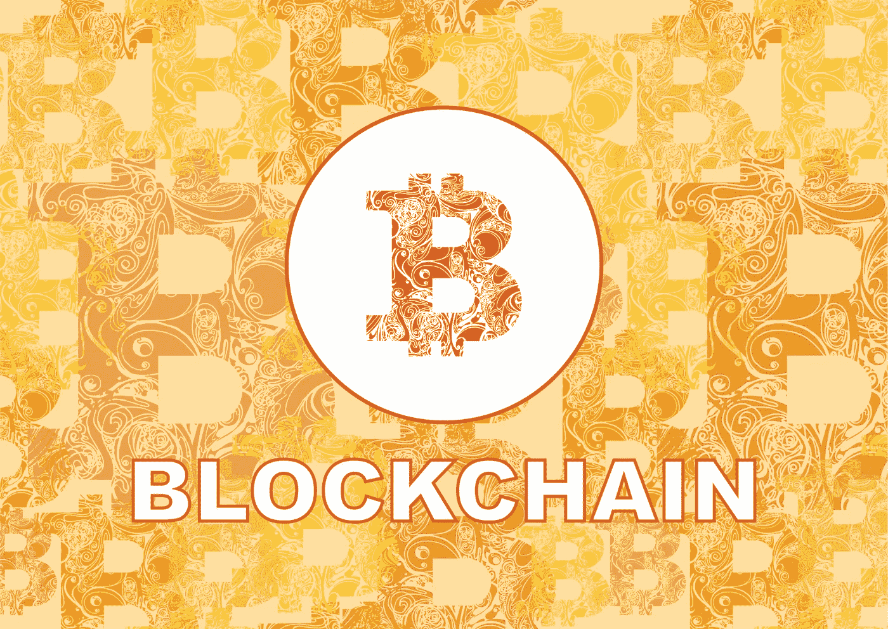
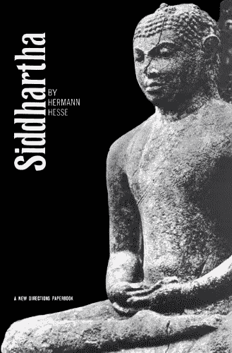
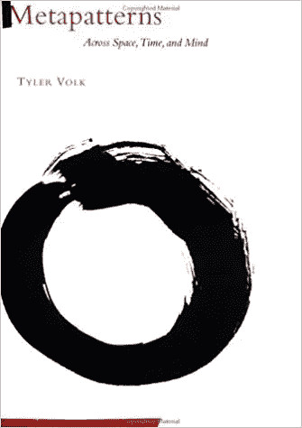
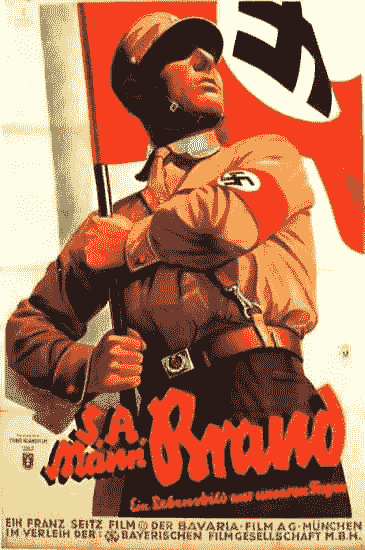
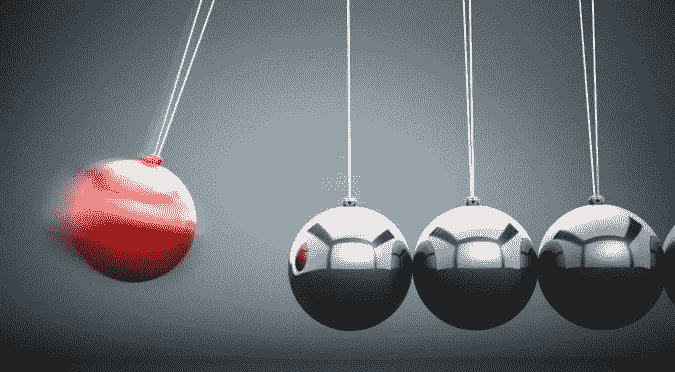
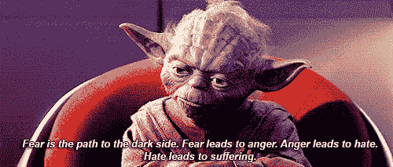
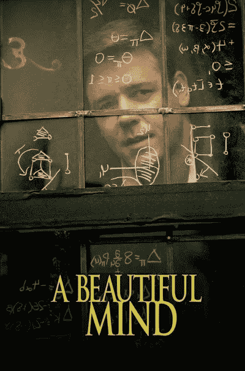
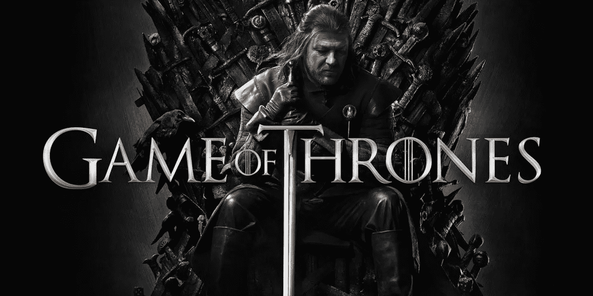

# 对有史以来最好的区块链推文的思考

> 原文：<https://medium.com/hackernoon/reflections-on-the-best-blockchain-tweets-ever-written-d488af960d4f>

如果你不知道 [**海军拉维康**](https://twitter.com/naval) ，你应该。谈到投资，他是精英中的精英。他已经投资了超过 100 家公司，其中包括后来获得巨大成功的科技独角兽，如 **Twitter** 和**优步**。他还创立了 [**AngelList、**](https://angel.co/) 一种为天使投资人和创业者提供的速配资源。

但这还不足以让我给这个人太多的信任。不像很多人，我不会被成功冲昏头脑。你可以成功，也可以当傻逼。正如艾克哈特·托尔曾经说过的“你不需要聪明来赚钱，你只需要聪明就行了。”

但是拉维康德很聪明。

这不仅仅是因为他的顶级书单与我最喜欢的几本书非常接近。

我一生大概读过 [**悉达多** ( *希尔达罗斯纳译*](http://amzn.to/2sSi8iD) )大约二十遍。如果你惊讶地看到天使投资人的清单上有一堆精神和哲学书籍，这应该是你的第一个线索，表明你有一个独特的头脑。我在 NYU 认识的大多数商学院兄弟都认为安·兰德的《源泉》是唯一一本书。

翻翻拉维坎特的 [**推特**供稿](https://twitter.com/search?q=naval%20ravikant&src=tyah)或者听听 [**这篇采访**](https://www.farnamstreetblog.com/2017/02/naval-ravikant-reading-decision-making/) ，你会很快意识到，这个男人最懂得如何思考。 [**批判性思维**是*今天和明天的*世界](https://singularityhub.com/2017/07/04/7-critical-skills-for-the-jobs-of-the-future/?utm_content=buffere8953&utm_medium=social&utm_source=twitter-hub&utm_campaign=buffer)最必备的技能。

最近他一直在考虑**【区块链】**(以及我认为最能改变世界的另外两项技术， [**CRISPR 和 AI**](https://twitter.com/jwangARK/status/863957649364316165) )。几周前，他放弃了关于区块链 和未来市场的 36 条推文。它们注定会成为经典。我已经读了几十遍了，我还会再读几十遍。每次我看着它们，它们都会带来更深刻的见解。

它们是一种似乎永远不会消失的分形。

他不可能当场就把它们扔了。如果是的话，上帝保佑他，他比我想象的还要聪明。但我对此表示怀疑。很明显，它们代表了多年来关于区块链对社会和世界意味着什么的思考的结晶。

区块链革命就像海啸一样到来，将重塑社会的方方面面，但大多数人还没有看到。这是因为它们真正的影响还在后面。人们通常很难理解突破性技术，因为他们没有参照系。想象一下向一个 18 世纪的农民描述一个网络浏览器。它甚至不会开始有任何意义。

直到今天，甚至许多我钦佩的[杰出人士](https://twitter.com/fchollet/status/883785045722279936)也将比特币和加密货币视为:

*   庞氏骗局
*   郁金香狂热
*   自由主义者接管世界的邪恶阴谋
*   毒品贩子的货币
*   书呆子钱

大众媒体上的秘密报道通常很糟糕([它已经被宣布死亡了大约 1000 次，尽管它还在继续成长和繁荣](https://99bitcoins.com/bitcoinobituaries)，尽管我正在一点一点地变得更好。在我的文章《 [**为什么每个人都错过了过去 500 年最重要的发明**](https://hackernoon.com/why-everyone-missed-the-most-important-invention-in-the-last-500-years-c90b0151c169) 》中，我尽了最大努力来驳斥这些论点，但当然大多数人不会让逻辑妨碍良好的下意识反应。最终，cryptos 和区块链将需要遵循一个老作家的格言向世界证明他们自己:

**秀不告诉。**

换句话说，除了日内交易之外，他们必须开始为普通人提供动力。这就来了。但是在区块链的“Mozilla 时刻”到来之前，当它变得如此简单，以至于奶奶都可以使用它的时候，我们将不得不盯着我们的水晶球来弄清楚事情将会如何发展。

这就是 Naval 的推文的内容。这一切将走向何方。

我们从头开始:

> ” [**区块链将用市场取代网络**](https://twitter.com/naval/status/877467629308395521) **。**

他在这里到底是什么意思？要理解这一点，你必须理解他所说的网络是什么意思。

[字典](https://www.google.com/search?q=network+define&ie=utf-8&oe=utf-8)将**网络**定义为“**一组或一个系统的相互联系的人或事物**”其他定义包括，“任何细丝、线、脉、通道的网状组合。”还有一个“ [**系统视角**](http://www.necsi.edu/guide/concepts/system_perspective.html) ”的概念，即“将系统在其环境中的所有行为作为一个整体来考虑。”

但是真的，一个网络就是一个 [**元模式**](http://amzn.to/2ugsjRE) **。这是一个跨越空间、时间和思想的网络。**

想想大城市纵横交错的街道或者街道下迷宫般的下水道。你的神经系统和你头脑中密集的树状森林都是网络，蜿蜒的河流像地球的动脉一样在陆地上涌动。

但是网络不仅仅是物理的东西。它们是连接我们所有人的物理、数字和精神道路。这意味着从不同的角度来看，几乎所有的东西都是一个网络，从我们头脑中错综复杂的信仰体系，到不同人之间思想的语言交流，再到金钱、能量和数字信息在我们星球上的流动方式。

> “重叠的网络创造并组织了我们的社会……金钱是一个网络。宗教是一个网络。公司是一个网络。道路是一个网络。电是一个网络。”

有些是显而易见的，有些则不那么明显。道路是容易的，但是公司呢？这是一个所有人为一个共同目标而努力的网络。宗教？这是一个由共同信念团结起来的人们的网络。

世界在这些不同群体的推动和拉动下不断发展。拥有共同信仰体系的人聚集在一起，形成复杂的影响力、经济和军事力量链。早期人类的部落和氏族从未离开我们，他们只是像池塘里的涟漪一样向外扩展，变得更加错综复杂。

这些大家族在全力扩张的过程中相互争斗。随着他们让更多的人接受他们看待宇宙的方式，他们的影响网也在扩大。他们添加的每个人都会增加他们的力量。

> “网络有‘网络效应’。”增加新的参与者增加了网络对所有现有参与者的价值。因此，网络效应创造了一种赢家通吃的动态。这些网络的统治者成为社会中最有权力的人。"

它们越膨胀，就越能塑造真实的结构。领先的网络趋向于成为唯一的网络。“他们的网络成为我们所有人生活和工作的网络。如果网络是好的，那么生活就是好的。如果这个网络是邪恶的，那么生活就是悲惨的，充满了痛苦。

但是我们如何进入一个好的或坏的网络呢？

简单。有两种方法可以获得网络优势:

*   暴力和控制
*   开放和精英管理

如果你仔细观察，你会发现两种截然不同的信仰体系在起作用。

The dark reality of closed systems like fascism and communism.

一个是黑暗的现实。狂怒和愤怒是主导情绪。这些信仰体系视严格的等级制度为至高无上。只有某些人应该控制其他人做什么。这种哲学的信徒崇拜地位和权力。暴力是他们的主要武器。

另一方面，**好的网络是*开放和精英化的*** 他们具有协作性和包容性。最佳创意胜出，它们可以来自任何地方。阶级和等级消失了，理想的方法闪耀着光芒，被整个网络所采纳。这是一种务实的哲学，一种从不寻求争斗，但如果被迫争斗，就会结束争斗的哲学。

这些哲学之间的斗争是永恒的。

封闭就是黑暗。

开放是光明的。

世界历史是封闭与开放、集权与分权、僵化与流动之间的战争。

钟摆来回摆动，永无止境。

在朝鲜，一个强大的铁腕人物夺取了控制权，并建立了一个封闭的体系，将现实扭曲成令人作呕的恐惧和恐怖的噩梦。在世界的另一个地方，在更早的时代，英国启蒙哲学家的学生将茶扔进大海，并开始了一场开放的系统革命，导致他们在两百年后成为地球上最强大的国家。

这些都不是巧合。它们是固定的、确定的结果，就像白天和黑夜一样不可避免。封闭导致衰败和死亡，开放导致成长和扩张。

每一种哲学都有分支的可能性，从它们的出发点直接*跳出来*。

有些道路是敞开的，有些是完全封闭的。

例如，一个暴力政权除了使用酷刑和恐惧之外，永远不会有创造性。创造性的分支枯萎而死。可能性像紧闭的门一样关上了。这就是为什么朝鲜没有给世界带来新的创新，没有新的想法，没有产品。朝鲜唯一的“创造力”是种族灭绝，因为他们消灭了一个家庭的三代人，哪怕是最轻微的侮辱。相反，他们的注意力转向内心，偏执，黑暗，受限，就像一棵树被绳子捆绑，迫使它生长发育不良。

每一种可能性都与它之前的一种联系在一起，就像 [**一串珠子上的**](https://books.google.com/books?id=0j17ePgjaYUC&pg=PT49&lpg=PT49&dq=like+beads+on+a+string+siddhartha&source=bl&ots=e-dgTeQdkl&sig=_hfmVVqhmkvMEm1ZPDy1qcJ0V3w&hl=en&sa=X&ved=0ahUKEwi7tuew04nVAhVEy1QKHS2iC04Q6AEIQDAG#v=onepage&q=like%20beads%20on%20a%20string%20siddhartha&f=false) 。

正如尤达所说，“恐惧导致愤怒。愤怒导致仇恨。仇恨导致痛苦。”

随着时间的推移，这些分支路径不断向外扩展，孕育了更多的绝望或更多的快乐和自由。[运动中的物体倾向于保持运动](http://www.physicsclassroom.com/class/newtlaws/Lesson-1/Newton-s-First-Law)。它要么继续走向黑暗和腐烂，要么成长和繁荣，延伸到光明。

除非它被破坏了。

中断会带来变化和新的可能性。

# 即将到来的重生

我们现在比以往任何时候都更需要中断。

五十年来，世界趋向于越来越集中、控制和不平等。钟摆摆摆得太远了。现在，即使是最初开放的精英网络也开始衰落。他们过度集中和过度专业化。

“过度专业化，你就会滋生虚弱。这是缓慢的死亡。”—壳中的幽灵

我们现在在这个星球上的很多地方都看到了这一点，因为民主国家正在被财阀和盗贼统治或者彻头彻尾的独裁政权所取代，比如土耳其和菲律宾。这些国家因管理不善、疯狂的经济政策、腐败和扭曲的现实观而分崩离析，正如我们在委内瑞拉看到的那样，最糟糕的人掌权，做出糟糕的决定，烧毁自己的房子，里面的每个人都是如此。

是什么导致一个系统失败，另一个系统成功？

信仰体系。

你的信仰决定你的现实。

> “你的信念成为你的思想，
> 你的思想成为你的语言，
> 你的语言成为你的行动，
> 你的行动成为你的习惯，
> 你的习惯成为你的价值观，
> 你的价值观成为你的命运。”
> 
> —甘地

每个信仰体系都认为自己对真理有一个完整的了解。

他们都不知道。不是你的，不是我的，也不是其他人的。

相反，我们只是离真相越来越近或者越来越远。如果我们拒绝看清眼前的事物，我们的决定只会失败，因为它们是从错误的前提开始的。错误的开始导致错误的结束。

**每一个人、每一个群体就像一个球体上的一点，受限于我们从特定角度所能看到的东西，却幻想着我们能看到整个球体。**

不同群体看待现实*的程度决定了他们的痛苦程度。*

如果两组对现实有不同的梦想，谁会赢？

我们如何决定？

我们创造的最强大的系统之一是**市场**。如果我认为我有人们想要的商品或服务，那就是我的信仰体系。可能正确也可能不正确。我的产品可能很棒，也可能很糟糕。

不管怎样，市场会让我知道的。如果没人买，我可能做错了什么。也许我卖得不对，或者也许产品根本就没那么好，我需要回去工作来改进它？

**市场并不完美，但它们不断朝着越来越好的答案调整，慢慢接近真相。**最佳答案增加了整个系统以及个人的财富和价值。游戏中的玩家朝着积极的[纳什均衡](https://en.wikipedia.org/wiki/Nash_equilibrium)努力，正如书中和电影中详细描述的**。**

**最终，市场会“做对”。世人可能会在梵高有生之年忽视他的天才，只是后来才意识到那些旋转的绿色和金色笔画是多么不可思议，并以每幅画支付数百万美元作为回应。**

****纵观历史，市场和网络是相关但又分离的。市场不过是一种网络。它们除了充当交换商品和服务的方式之外，没有什么作用。真正的权力在于氏族的权力，在于暴力、强制和匮乏的权力。****

**直到现在。**

**如今，暴力帮派的时代正迅速走向终结，因为一种全新的市场出现了:**

**[**市场网络**。开放和任人唯贤](https://twitter.com/naval/status/877469376848445440)。**

*****区块链将市场和网络融合成一个辉煌的、混合的系统。*****

**[区块链是一项新发明，它允许开放网络中有功绩的参与者在没有统治者和金钱的情况下进行治理。](https://twitter.com/naval/status/877469715160903680)它们是基于成绩的、防篡改的、开放的投票系统。功勋是那些致力于推进网络的人。正如社会给你钱是因为你给了社会它想要的，区块链给你硬币是因为你给了网络它想要的。”**

**这些硬币需要不同种类的加工。每个区块链都有自己的目的。比如，“[比特币支付保障账本安全。以太坊支付(执行和验证)计算。](https://twitter.com/naval/status/877470341760598016)”**

**连锁店通常信奉一种类似 UNIX 的哲学，即“只做一件事，因此做好一件事”，而不是试图做 50 件事，然后一件都不做。随着市场网络的发展，我们将会看到越来越专业化的网络，其中一些可以很好地进行分布式防篡改存储，另一些可以处理分散的身份，还有一些可以执行智能合同和更先进的法律框架，等等。**

**但是这些网络将会比我们现在的系统更有效率。**

**在今天的专业化网络中，权力集中在少数军阀手中，他们变得越来越强大，与世界其他地方的希望和梦想隔绝。最终贪婪和愚蠢将他们引入歧途，他们试图通过走后门和破坏网络来操纵游戏。当一种观点设法支配所有其他观点时，社会就开始衰退和崩溃。这个系统变得让其他人无法忍受，最终爆发。**

**但是分散的区块链系统能够经受住敌对行动者腐蚀他们的企图，把他们扭曲到他们自己有限的现实观点。那是因为没有一组信仰体系控制着通往王国的钥匙。相反，网络中的每个参与者都持有密钥，从而在整个系统中有效地分配能量。**

**这导致了一种新的动态:**

*****相互竞争的群体* *必须合作达成共识* *否则他们会让整个系统崩溃，他们都会遭殃*。****

**相比之下，在当今世界，一个系统可以被一个强大的团体操纵，因为他们除了自己之外对其他团体没有同理心(这是氏族思维的一个特点)，他们对整体造成了巨大的破坏，造成了广泛的痛苦，而同时*认为*他们在做好事。**

**我们在现代银行系统中看到了这一点。银行系统持有所有的钱，制定所有的规则。他们收买影响力，让英联邦的规则屈从于他们的意志。如果他们有他们的方式，他们将建立他们控制的残废的区块链，因此他们能继续任意地改变游戏规则对他们有利。这些都是精英和暴民控制的区块链:简而言之，破碎和无用的区块链，根本不是区块链。**

**让一个区块链由一个君主、一个公司、一个精英或者一群暴民控制是荒谬的**

**原因很简单。只有当银行家、银行股东、银行存款人和监管者*同时持有钥匙*时，我们才能实现*真正的均衡*。因为我们都有不同的兴趣、不同的信仰体系和不同的难题，我们将不得不达成一个有利于整个体系的协议，否则我们将使它崩溃。既然没有人想让整个系统崩溃，因为我们会失去一切，我们会克服所有困难，找到达成协议的方法。**

**这有点像 Satoshi 在[原比特币论文](https://bitcoin.org/bitcoin.pdf)中对“51%问题”的描述。如果一个矿工或一群矿工获得 51%的采矿权，他们不能改变历史交易，但他们可以改变和拒绝当前的交易。然而，聪明智地认为这不是问题。如果有人真的投入了大量的时间和金钱来建立这么大的矿业力量，他们会从保持系统平稳运行中获益更多。通过欺骗系统，他们获得了很小的收益，但破坏了对整个系统的信心，这使市场陷入困境，使他们所有的时间和金钱都变得毫无价值。**

**"[市场的价值取决于资源的投入。资源就是金钱，一种冻结的、可交易的时间形式](https://twitter.com/naval/status/877469430841724929)**

**没有人想烧掉所有的“冻结的和可交易的时间”,这样他们的能量就可以从破坏性行为转化为有益于整个系统并保持其平稳运行的行为。**

# **分形宇宙**

**区块链的可能性是无限的，从透明的[端到端可验证的投票](https://en.wikipedia.org/wiki/End-to-end_auditable_voting_systems)，到股票和股份发行、[到安全性、计算、预测、注意力、带宽、功率、存储、分发、内容](https://twitter.com/naval/status/877470481481220096)等等。**

****我在这里就不赘述了，因为我已经把** [**做了，在**](https://hackernoon.com/why-everyone-missed-the-most-important-invention-in-the-last-500-years-c90b0151c169) [**中的**](https://artplusmarketing.com/how-we-can-deliver-a-universal-basic-income-right-now-and-save-ourselves-from-the-robots-without-e1972e22e8eb) **一号****[**其他文章**](https://hackernoon.com/how-we-build-an-unstoppable-peer-to-peer-tor-with-a-billion-exit-nodes-4b232dac162d) [**你可以看看**](https://hackernoon.com/how-the-decentralized-web-will-rewrite-the-rules-of-security-and-save-the-net-from-the-barbarian-23db16af34a1)**[**如果你喜欢**](https://hackernoon.com/the-good-the-bad-and-the-ugly-of-consensus-2017-8776056f97a3)******

******随着时间的推移，可能性只会扩大和繁荣，波及到生活的方方面面。区块链将催生一个由微型经济叠加而成的新兴生态系统，通过更大的元链以无限倒退的方式连接起来。******

******这将改变世界。******

************

******今天，我们的网络被“国王、牧师、精英、企业和暴徒”所统治。就当是**权力的游戏**吧。这是一个黑暗而残酷的游戏。******

****区块链永远颠倒了这种动态。他们将极大地改善地球上的力量平衡。****

****区块链开放的、以价值为基础的市场可以取代以前由国王、公司、贵族和暴民经营的网络。****

****按照库兹韦尔的“加速回报法则”，去中心化的力量将开始变小并呈指数增长****

****"[基于区块链的市场网络将取代现有网络。慢慢地，然后突然。在一件事情上，然后在许多事情上。](https://twitter.com/naval/status/877471146152574976)****

****对许多人来说，这种转变将是坎坷和令人震惊的。****

****这甚至可能是令人厌恶的，因为垂死的部族会不惜一切代价努力抓住过去不放。但最终，它们会像三叶虫一样成为历史。****

****当这一切都结束时，没有人会为失去旧的、破碎的、腐朽的、渴望权力和暴力的国王、王后、暴民和企业网络而悲伤。****

****############################################****

****如果你喜欢我的作品**，请** [**赏光访问我的作品页面**](https://www.patreon.com/danjeffries) **因为这是我们一起改变未来的方式。**帮我脱离母体**我会百倍地回报你的慷慨，把我所有的时间和精力集中在写作、研究和为你和世界提供惊人的内容上**。****

****###########################################****

## ****如果你和我一样热爱加密空间，那就来吧，加入 [DecStack，这是一个虚拟的加密货币和分散应用项目的合作场所](http://decstack.com/)，在这里你可以接触到多个项目。永远完全免费。只是进来和社交，一起工作，分享代码和想法。通过反馈让你的想法更好。寻找新朋友。见见你的新家人。****

****############################################****

******如果你喜欢这篇文章，我很乐意你能打小心脏推荐给别人。之后，请随时将文章通过电子邮件发送给朋友！非常感谢。******

****###########################################****

********

****[Photo credit](https://extranewsfeed.com/the-winds-of-world-war-iii-8bc369584f67)****

****关于我:我是一名作家、工程师和连续创业者。在过去的二十年中，我涉及了从 Linux 到虚拟化和容器的广泛技术。****

*****你可以看看我的最新小说，* [***一部史诗般的中国科幻内战传奇***](http://amzn.to/2gAg249) *在这部小说中，中国挣脱了共产主义的枷锁，成为世界上第一个直接民主国家，运行着一个高度先进、人工智能的去中心化应用平台，没有领导人。*****

## ****当你加入我的读者群，你可以免费得到一本我的第一部小说《蝎子游戏》。读者称之为“神经癌的第一次严重竞争”和“黑色侦探会见约翰尼记忆术。”****

## ****你也可以根据书中的想法查看[蝉开源项目](http://iamcicada.com/)，该书概述了如何立即将该技术变为现实，你可以参与其中。****

## ****最后，你可以[加入我的私人脸书小组，Nanopunk Posthuman 刺客](https://www.facebook.com/groups/1736763229929363/)，在这里我们讨论所有的科技、科幻、幻想等等。****