# React 中的引用:您需要知道的一切！

> 原文：<https://medium.com/hackernoon/refs-in-react-all-you-need-to-know-fb9c9e2aeb81>

borrowed from [https://i.ytimg.com/vi/TWzA2Ir1ZJc/maxresdefault.jpg](https://i.ytimg.com/vi/TWzA2Ir1ZJc/maxresdefault.jpg)

昨天晚上，当我浏览一个流行的 react 库时，我发现了“refs ”,即使我知道它是如何工作的，我也不太相信我的理解，所以我决定更深入地研究它，并最终与你们分享我的想法。

根据 react 文档，引用用于获取对 DOM(文档对象模型)节点或 React 应用程序中组件实例的引用，即引用将返回我们所引用的节点。让我们看一个例子。

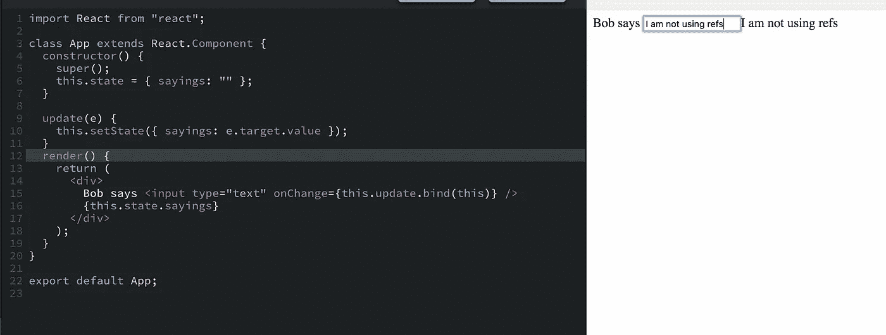

在上面的例子中，为了获得 bob 所说的值，我使用了事件 e 的目标值。使用 refs 可以这样做

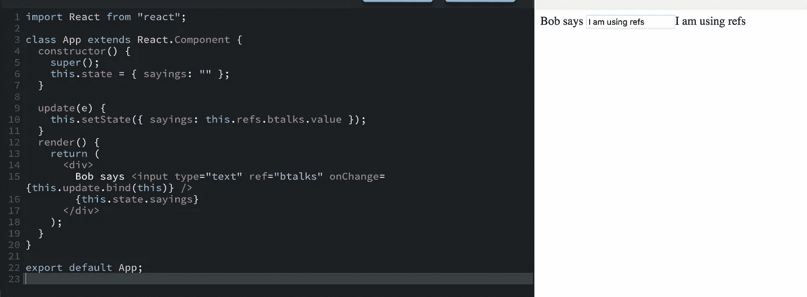

此外，我们可以在 refs 中传递一个回调函数，它可以用来做其他很酷的事情。在 job 上面使用带有回调的 refs 可以通过这种方式完成

# 当你需要裁判而不是身份证的时候。

众所周知，ID 对整个 DOM 树中的单个元素起作用，因此我们想改变焦点的背景色。有了身份证就会这样

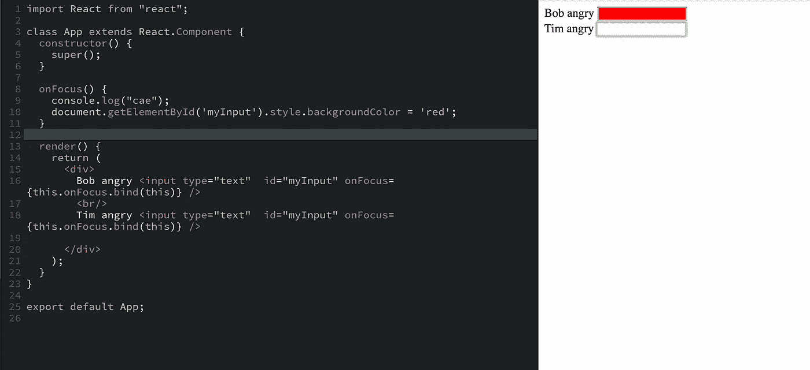

因为 Bob 在 Tim 之前，并且两者都有相同的 ID，在其上运行后台操作代码，但是只有 Bob 对 focus 而不是 Tim 生气。如果我们使用引用，我们可以用一个特定的引用名替换 id，我们应该做得很好。但是我建议使用这种用例的类，因为它更好，而且 refs 有它的警告，我们很快就会看到。

# 当它返回一个 DOM 节点或组件的实例时。

如果 ref 指向一个标准组件(DOM 节点，如`input`、`select`、`div`等)，则检索该元素；你只需要叫`this.refs.ref.`

如果引用指向一个复合组件(一个你自己创建的定制组件)，你需要使用新的`ReactDOM`模块，就像这样`ReactDOM.findDOMNode(this.refs.ref).`

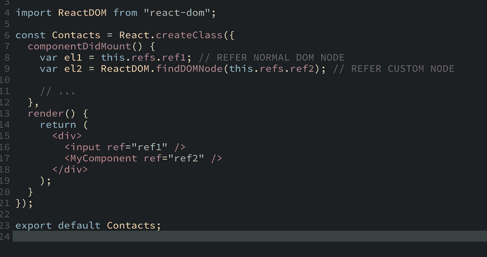

# 第一次设置`ref`值是什么时候？

随着 **render()** 中的react，生命周期方法也像

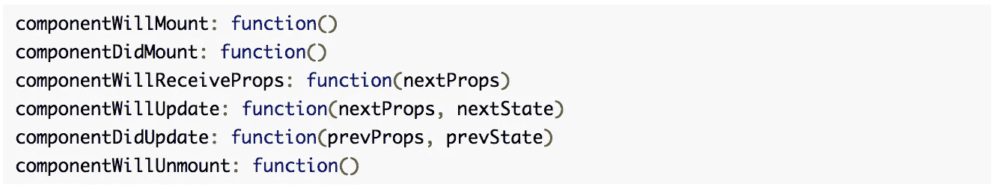

因此，ref 首先在第一个`render()`之后，但在`componentDidMount()`之前设置。

# 只有在必须的情况下才使用“ref ”,否则不使用……为什么？

*   它阻碍了 Babel 内嵌插件的优化工作。
*   使用 refs 有点偏离 react 的思维方式，即一旦状态改变，你就重新呈现依赖于该状态的所有 UI 组件。React 将负责确保只更新 DOM 中正确的部分，使整个事情变得高效。您最终可能会以 Jquery 的方式使用 refs，但这并不是我们的目标。

# 何时使用参考文献？

根据 react 官方文件，

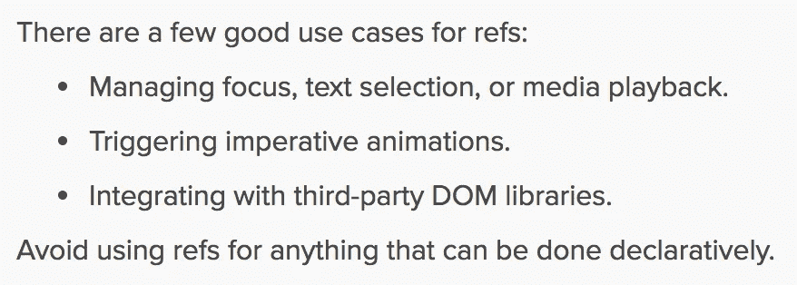

Official React Docs

# 最后，引用时的银弹！

*   不要内联 refs 回调:我使用内联回调向您展示了为什么这样做不好

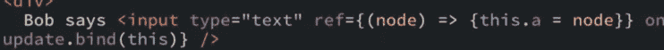

箭头和`render()`中的`bind`函数通过在每次重新渲染时在**上创建一个新函数来提高性能。应该是这样做的**

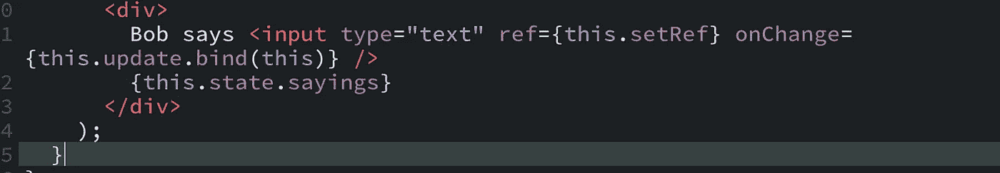

此外，如果将`ref`回调函数定义为内联函数，它将在更新过程中被调用两次，第一次是用`null`，第二次是用 DOM 元素。React 这样做是为了“清理”旧的 ref 并“设置”新的 ref，以防上一个和下一个回调成为真正不同的函数。为了避免过时的引用(和内存泄漏)，清理是必要的。

*   我还故意使用了**字符串引用**，这也不是一个好的做法。

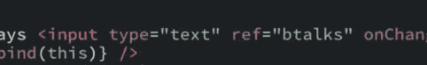

*根据 react 官方文档，虽然字符串引用没有被弃用，但它们被认为是遗留的，并且很可能在将来的某个时候被弃用。回调引用是首选。*

*   引用不应该用在功能组件上，因为它们没有实例。例子

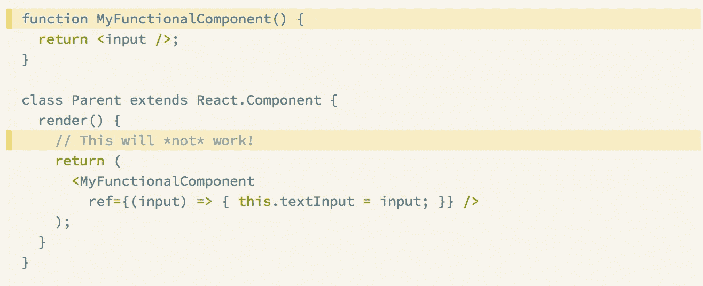

React Official Docs

由于 MyFunctionalComponent 没有实例，所以上面的代码不会像预期的那样工作。

**但是** `**ref**` **属性将在函数组件**内部工作，只要你引用一个 DOM 元素或者一个类组件:

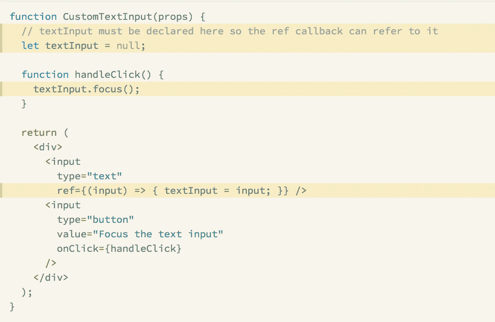

React Official Docs

希望你现在已经很好地理解了 **refs** 以及它的使用案例和注意事项。如果你发现它有用，请与你周围的人分享。

谢谢

让我们继续在[推特](https://twitter.com/solodynamo) **上的对话。**