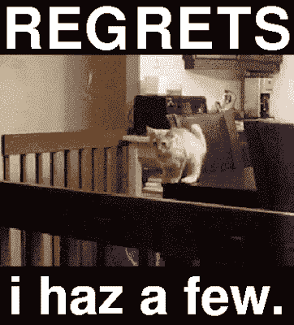

# 强化学习(简介)

> 原文：<https://medium.com/hackernoon/reinforcement-learning-part-1-d2f469a02e3b>

> “强化学习是简单的决策科学。这就是它如此普遍的原因。”—大卫·西尔弗

# 摘要

你可能已经观察到最近机器[学习](https://hackernoon.com/tagged/learning)的饱和程度。这实际上是“监督学习”的饱和(可怜的卡格尔)。

除了反向传播，我们大多数人都不知道其他任何学习算法。最近有几个类似于'[平衡传播](https://arxiv.org/abs/1602.05179)和'[合成梯度](https://arxiv.org/abs/1608.05343)，但或多或少属于类似于反向传播的范例。

而无监督学习和强化学习仍然是空白(相对而言，至少是主流)。

在这篇博客中，我们将深入探讨强化学习，或者我喜欢称之为'*愚蠢之后是后悔*或者'*假设*学习。这些名字其实很准确。

# 介绍

**强化学习是在“因果”环境中基于交互的学习。**

结果或后果是基于要达到的目标的行动和原因。

就像和你喜欢的人聊天一样。目标是给她留下深刻印象，但你说的每一句话都有后果。

她会:

*   觉得你迷人还是
*   随机记起她必须去某个地方

*# BelieveMeIAmAGuy #内向问题*

RL 是以目标为导向的学习，学习者(在 RL 中被称为' *agent* '不是被命令采取什么行动，而是被鼓励去探索和发现产生最佳结果的最佳行动。模糊地说，*探索*是基于*试错*的方法。

在 RL 中，你现在行为不仅影响你现在的回报(得到那个吻)，还会影响你未来的回报(她同意第二次约会)。所以代理人可能会选择更高的未来回报，而不是当前的高回报。

记住下面这句话，你以后会更好理解的:

> RL 不是通过表征学习方法来定义的，而是通过表征学习问题本身来定义的。

# 代理人

RL 中的学习者被称为代理。

一个'*智能体*'具有对其环境的*感知，并能够以*与环境*交互的形式采取行动，以最大化从环境*获得的*回报。*

**问)**谁是主管？

**Ans)** 在监督学习中，*训练集监督学习者的学习*。因此，它就像一个监督者。

**问)**RL 代理如何以及何时比主管更优秀？

在一个未知的领域，一位主管(你曾经的单身朋友)不太知道该怎么做(打动你的暗恋对象)。在这种情况下，更好的学习可以通过自己的(代理)经验来完成。

# 勘探-开采权衡

明明有取舍，总有取舍！

监督学习具有偏差-方差权衡，而 RL 具有探索-利用权衡。

为了获得高额报酬，代理人可以选择

*   过去卓有成效的行动
*   探索更好行动的可能性

我们来分解一下

*   利用:利用预先学到的知识获得好的回报
*   探索:尝试新事物以获得更好或更差的回报

*在随机任务中，一个动作必须尝试多次，以获得对其回报的可靠估计。然而，这并不能保证哪一个是最好的行动。代理不能同时探索和利用，因此需要权衡。*

> 在勘探过程中获得的信息可以在未来的步骤中多次利用。

# 额外的

有时 RL 包括监督学习。这样做是为了确定哪些能力对获得回报至关重要。

**示例:**

> 进化，确保你知道如何呼吸，否则无论你有多牛逼，你都将一事无成。
> 
> 在成长过程中，你是否获得了与坐立不安的纺纱者一起玩的诺贝尔奖不是被监督的部分所关心的。

这些算法被归类为深度强化学习。

稍后会有更多的介绍，现在就让我们看看他们的表现有多好吧！

# RL 基础

RL 有 4 个基本概念:

*   政策
*   奖励函数
*   价值函数
*   (环境的)模型[理想的]

## 政策

它定义了代理在任何给定时间的行为。

粗略地说，策略是当前已知状态和处于这些状态时要采取的行动的映射。

在心理学上，它对应的是刺激反应规则。

策略可以是查找表或广泛搜索过程的形式。

## 奖励和价值

**奖励**是指在**直接意义上**什么是好行为的增益。

**值**是累积增益，用于估计一项行动在**长期**中的效果。

**例子:**

> 现在吃蛋糕会让我开心。虽然从长远来看，蛋糕对我的健康有害。

**奖励系统**将奖励和价值结合在单一概念下，并传达:

*   一个行为的回报有多少
*   因此，一个国家是多么令人向往

在生物学意义上，它指的是快乐和痛苦。

从关系的角度来说，它指的是她说“你看起来很可爱”和“你应该把胡子剃掉”(现在还疼)。

大多数情况下，代理人不会改变奖励系统，尽管它可以作为改变政策的基础。

**举例:**

> 脱离这个循环很痛苦，所以回报很低。我不能改变奖励制度，以痛苦为乐。酪我可以控制我骑车的方式，这样我就不会再摔倒了。

**我们主要关心的是价值而不是报酬。**

**问)**为什么？

奖励只能确保眼前的收益是最大的，未来的收益可能会更糟。价值确保我们有最大的整体收益。

**问)**那还有什么问题？

通常眼前的收益比未来的收益更有保障。

**问)**什么是价值函数？

**Ans)** 顾名思义，价值函数就是用来计算一个动作的价值的函数。棘手的是他们是如何做到的。这些通常使用基于复杂推理的算法。

**例如:**

> 你买一只股票。目前市场状况良好。所以你可以很有把握地在明天卖掉它，获得丰厚的回报。现在，如果你再持有这些股票一年，价值可能会飙升到几倍，但你永远无法确定这一点。

# 进化算法

虽然听起来很像，但是 RL 和进化算法不是一回事。

进化算法不使用价值函数。他们直接搜索政策空间。

**优点:**

*   当代理对环境没有太多感觉时有效

缺点:

*   他们不会注意到代理在其整个生命周期中经历了哪些状态
*   他们没有利用这样一个事实，即他们所寻求的政策是一个从国家到行动的函数。

这只是第一章，对 RL 的基本介绍。在接下来的章节中，我们还有一个世界要探索。

是啊，那是随机的 GIF。