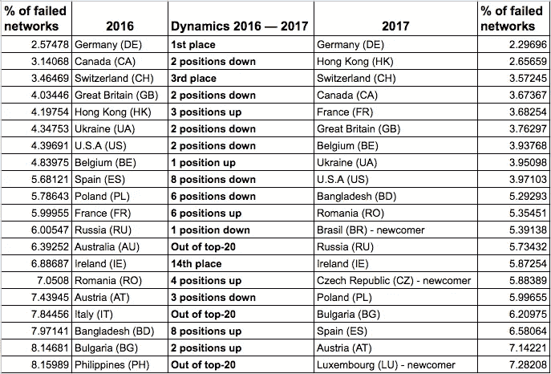
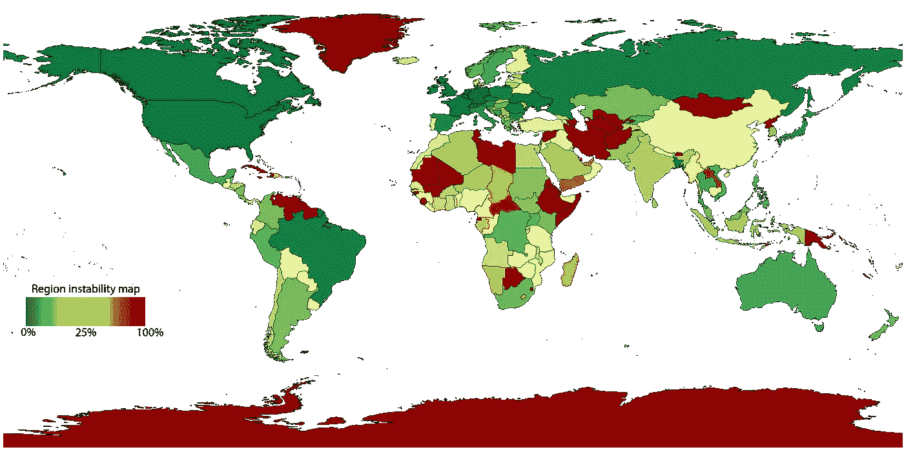
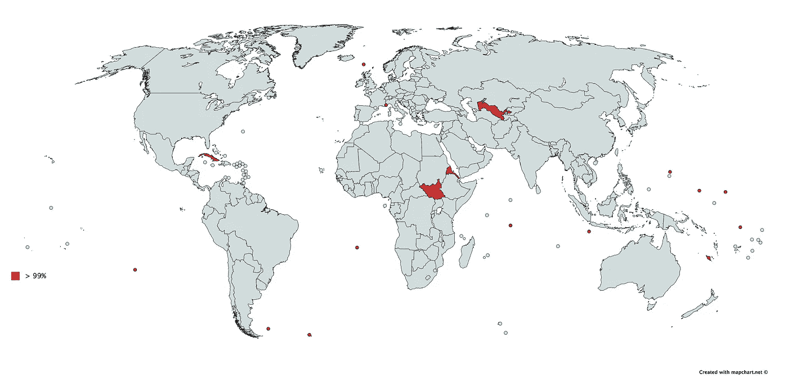

# 国家互联网部分的可靠性

> 原文：<https://medium.com/hackernoon/reliability-of-national-internet-segments-1e26dd1b5297>

互联网在网络层的连通性是自治系统( [AS](https://en.wikipedia.org/wiki/Autonomous_system_(Internet)) )之间交互的结果，自治系统之间的备选路由越多越稳定，这是基本的容错原则。这项研究显示了单个 AS 的中断如何影响该地区的全球连通性。

任何 AS 的全球连通性都基于其到一组一级 ISP 的路由。一级提供商是跨国和跨洲提供商，在全球范围内提供连接服务。如果 AS 和第 1 层之间没有活动路由，则该 AS 没有全局连接。

让我们假设一个给定的 AS 正在经历严重的网络退化。我们希望找到以下问题的答案:“该地区有百分之多少的其他 AS 会失去与一级运营商的连接，从而失去全球可用性？”

为什么我们要模拟这种情况？严格地说，当现代互联网出现时，人们认为每个 as 至少有两个上游(更高级别的互联网服务提供商),这将保证在其中一个失败的情况下容错。然而，在现实中，大型公交运营商的失败曾经发生过吗？答案是肯定的，而且经常如此。因此，如果有人还没有遭受痛苦，是时候提醒墨菲定律:“任何可能出错的事情都会出错。”

为了模拟这种情况，我们采取了以下步骤:

1.  对于世界上的每一个自治系统，我们都借助于 [Qrator 的 AS 关系模型来创建通往一级运营商的所有备选路由。雷达](https://radar.qrator.net/)项目；
2.  使用 Maxmind 地理数据库，我们将国家与每个地址空间进行匹配；
3.  对于每个 AS，我们都对地理数据进行了归一化处理，以避免 AS 在该区域出现退化的情况。香港就是一个很好的例子:亚洲最大的互联网交易所 HKIX 有数百名会员，而与此同时，在香港互联网领域却没有任何会员。
4.  之后，我们评估一个给定 AS 的可能故障对其他 ASN 以及国家的影响。
5.  对于每个国家，我们发现自治系统对给定区域中其他 ASN 的影响最大。

在这里你可以看到 2017 年最具容错能力地区的前 20 名，以及更新后的 2016 年结果。

Comparison between the 2016 and 2017 results of the network reliability survey

如你所见，每年都有一些变化。然而，由于千分之一的差异，前 20 个稳定区域没有太多显著变化。说到容错能力最强的国家，单个主要 AS 关闭对该地区自治系统的影响不到 10%(有 29 个这样的国家)，所有这些国家都有多样化的 IP 传输服务市场，有许多替代路由。

此外，我们还想强调 Cogent 的 AS 174 标准对几个地区的重要影响:法国、英国、美国、爱尔兰，仅排在前 20 名。这意味着 AS174 中的问题甚至可能导致几个邻近地区的问题。虽然 Cogent 的中断不会导致完全不可用，因为我们谈论的是多样化和高度发达的国家部分。

同样，俄罗斯也没有什么惊喜。主要的互联网服务提供商仍然是 Rostelecom，但即使其中一家出现故障，也不会导致俄罗斯 ISP 中超过 5.73%的网络失去全球可用性。与此同时，俄罗斯 2017 年的故障转移百分比略好于去年，在容错区域的前 20 名中仅排名第 13 位。在俄罗斯，几乎没有一级 ISP。然而，公共交通市场的代表是大中型二级网络，它们提供了如此高的稳定性和故障转移百分比。

国家最大的 ISP 总是比其他人更能影响地区可靠性吗？我们的计算表明这并不总是正确的。例如，在德国，最大的 ISP 是 Deutsche Telecom，但是当谈到该地区的连接可靠性时，属于 Versatel 的 AS 8881 的中断会影响到最多的德国 ASN。我们相信，二级互联网服务提供商越来越重要的趋势在不久的将来将会盛行。

此外，在谈到趋势时，我们不能提到 2017 年的平均“不稳定性”为 41%，比 2016 年少 1.6%。

National segments reliability map, from dark green (top reliability) to dark red (bottom reliability). Yellow is 25%

2017 年，新兴非洲区域取得了最显著的进步。冈比亚和利比里亚等地区的故障转移能力显著提高，几乎提高了 40%。然而，世界各地走向容错的趋势不能被称为“单向的”例如，我们可以称之为牙买加，对单一 ISP 稳定性的依赖从 2016 年的 34%上升到 2017 年的 91%。这个国家的外部连接几乎完全依赖于 AS 23520(哥伦布网络)的可靠性。

Countries with 99% dependency on a single ISP

在我们评级的底部，有一些地区，在单个 ISP 故障的情况下，可能会经历完全(高达 100%的全球连接丢失)不可用。对于前苏联国家，我们只谈论乌兹别克斯坦，它在我们的评级中排名第 235 位，在 AS 28910 故障的情况下不可用率为 99.94%。

除了已经提到的国家，古巴和南苏丹可能是读者最熟悉的国家，超过 99%的依赖于单一的 ISP。朝鲜有 92%。令人惊讶的是，摩纳哥的连通性很差(欧洲唯一的红点)，而另一个小主权国家卢森堡正在关闭容错能力最强的前 20 个地区。

随着越来越多的网络安全风险和许多关于攻击互联网基础设施的新闻，现在是政府、私营和上市公司以及普通用户思考自己立场的时候了。两次，如果您所在的地区有 50%的不稳定性，但老实说，25%的故障转移率足以在大型全国性服务提供商(如 DNS 服务)受到严重攻击的情况下，在可用性和连接性方面遇到麻烦。不要忘记，在完全不可用的情况下，外部世界也将与位于问题区域内的服务和数据分离。

我们的调查结果表明，建立在竞争基础上的 ISP 市场最终会更加稳定，对特定区域内外的问题更能容忍失败。反之亦然，单个 AS 故障可能导致一个国家甚至更大区域的大部分用户无法使用网络。

我们很乐意回答您对本次调查的意见和问题，欢迎提问！