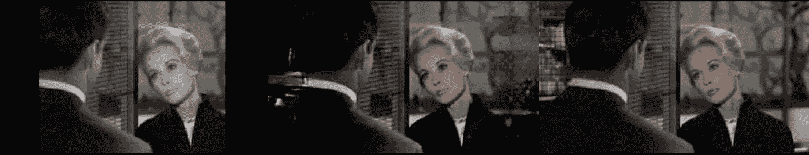
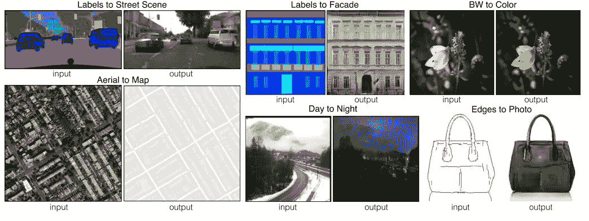
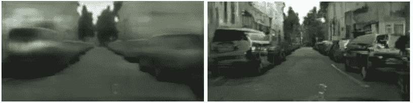
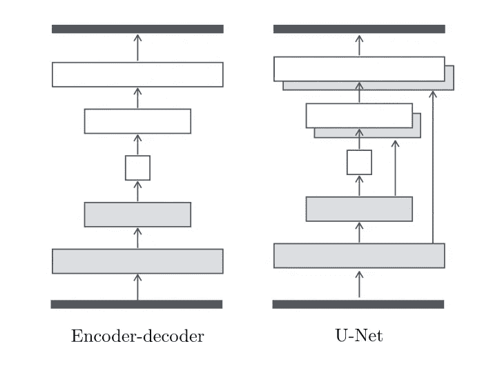
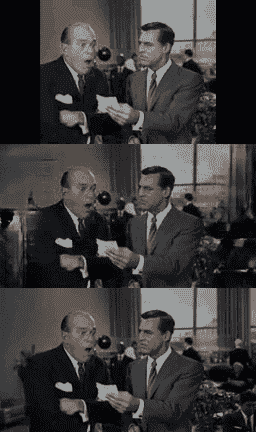
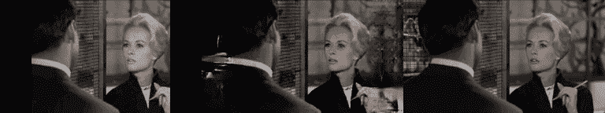
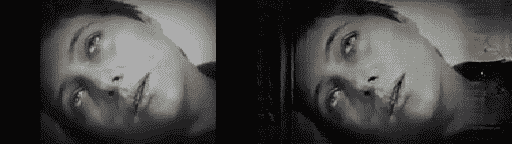
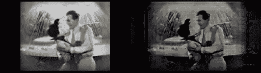
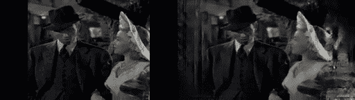

# 用 Pix2Pix 在 Tensorflow 中翻拍经典电影

> 原文：<https://medium.com/hackernoon/remastering-classic-films-in-tensorflow-with-pix2pix-f4d551fa0503>

新年快乐在 2017 年的第一篇帖子中，我想做一些有趣和有点不同的事情，暂时从 RL 转向生殖网络。在过去的几天里，我一直在与一个名为 [Pix2Pix](https://arxiv.org/abs/1611.07004) 的生成性对抗网络合作，并希望分享该项目的成果。这个框架来自最近发表的论文“*用条件对抗网络进行图像到图像的翻译*”。与接受噪声输入并生成图像的 vanilla GANs 不同，Pix2Pix 学习接受一幅图像，并使用对抗框架将其转换为另一幅图像。这方面的例子包括将街道地图转换为航空摄影，将图纸转换为照片，将白天的照片转换为夜晚的照片。理论上，任何两个保持相同结构的意象之间的翻译都是可能的。

Examples of translated images using Pix2Pix.

让我印象深刻的一个可能的和令人兴奋的用途是给黑白照片着色的能力，以及填补图像中缺失的空白。这两种能力加在一起，可以用来对 20 世纪 50 年代及更早的电影进行某种形式的重新灌制。以 4:3 纵横比拍摄的黑白电影尤其能从这一过程中受益。这种“重制版”既可以着色，也可以将宽高比扩展到更熟悉的 16:9。

Top: input. Middle: My Pix2Pix remaster. Bottom: Original. Taken from [Rear Window](http://www.imdb.com/title/tt0047396/?ref_=nv_sr_1).

在这篇文章中，我将介绍 Pix2Pix 的设计，提供一个 [Tensorflow](https://hackernoon.com/tagged/tensorflow) 的实现，并展示一些电影重制过程的结果。如果你是 GANs 的新手，我推荐阅读我之前的两篇关于 GANs 的文章，以便更好地了解它们是如何工作的。Pix2Pix 实际上只是一个 GAN 加上一些额外的架构变化。

 [## 用经典的海绵宝宝插曲来解释生成性对抗网络

### 外加一个 Tensorflow 教程来实现您自己的 GAN

medium.com](/@awjuliani/generative-adversarial-networks-explained-with-a-classic-spongebob-squarepants-episode-54deab2fce39) 

## Pix2Pix

Pix2Pix 以非常直观的方式构建了 GAN 架构。在 GAN 公式中，我们有一个发生器`*G*`和一个鉴别器`*D*`，它们是敌对训练的。训练发生器从噪声输入`z`产生逼真的图像，训练鉴别器区分真实图像`x`和发生器`G(x)`产生的图像。使用来自鉴别器的反馈，生成器可以改进其过程，以生成将来更可能欺骗鉴别器的图像。这样做可以产生更逼真的图像。

当从 GAN 到 Pix2Pix 时，最明显的变化是，代替噪声`*z*`发生器被馈送一个实际的图像`*x*`，我们想将其“翻译”成另一个结构相似的图像`*y*`。我们的发电机现在生产`*G(x)*`，我们希望与`*y*`区别开来。

除了原始的 GAN 损失之外，我们还利用了`L1`损失，这只是生成图像上像素绝对值的损失。在这种情况下，我们强迫发电机近似为`*G(x) = y*`附加损耗:

`L1 = |G(x) - y|`

在传统的氮化镓中，我们永远不会利用这种损耗，因为它会阻止发生器产生新的图像。然而，在图像翻译的情况下，我们关心的是准确的图像翻译，而不是新颖的图像翻译。这种对精确图像的渴望也是我们不完全取消网络中 GAN 部分的原因。`L1`丢失本身会由于试图生成“平均”正确的图像而产生模糊或褪色的图像。通过保持 GAN 的损耗，我们鼓励网络产生清晰的图像，在视觉上与真实情况难以区分。

Left: image translation with only L1 loss. Right: Image translation with L1 and GAN losses.

沿着确保精确图像的路线，对 Pix2Pix 的第三个改变是在生成器中使用了 U-Net 架构。简单地说，U-Net 是一个自动编码器，其中一半网络中编码器的输出与另一半网络中解码器的镜像输出相连。通过包含这些跳过连接，我们可以防止网络中间成为信息流的瓶颈。

U — Net Architecture

在 Pix2Pix 的情况下，我们的输入是我们想要翻译的图像`x`，输出是我们想要它变成的图像`G(x)`。通过连接镜像层，我们能够确保原始图像的结构直接传送到网络的解码器。当考虑彩色化的任务时，在提供彩色化图像的结构方面，在编码器的每个尺度上学习的表示对于解码器是非常有用的。

在 Pix2Pix 论文中，作者还讨论了利用称为 PatchGAN 的不同鉴别器架构。PatchGAN 背后的想法是，不是为整个图像产生单个鉴别器分数，而是为图像的每个补丁产生一组单独的分数，然后将这些分数平均在一起产生最终分数。这种方法可以通过依赖更少的参数来提高性能，并且正确调整的面片大小可以提高图像质量。因此，补丁大小与图像大小相同的补丁根相当于传统的鉴别器架构。为了简单起见，我的 Pix2Pix 实现使用了传统的鉴别器，或者对图像进行修补。

## 重新灌制电影

鉴于电影的悠久历史，媒体中的许多经典作品都是在半个多世纪前创作的，因此与今天的电影相比，它们是用非常不同的技术制作的。《卡萨布兰卡》、《公民凯恩》、《大都会》、《美好生活》等经典影片都是在有限的宽高比下以黑白方式拍摄的。尽管有视觉上的限制，这些电影仍然唤起了复杂和完全实现的世界。看着它们，很容易闭上眼睛，想象它们在全彩色和更广阔的视野下可能是什么样子。如果有足够的时间，艺术家甚至可以着色和扩展画面，就像有时对经典电影所做的那样。凭借 Pix2Pix 框架的力量，我想知道是否有可能让神经网络自动学习做这件事。

为了实现这一点，我将我的 GAN 实现转换为如上所述的 Pix2Pix 架构，并开始在一组经典电影上训练它。设置很简单:我决定利用阿尔弗雷德·希区柯克电影集(*《迷魂记》*、*《后窗》*、*《西北偏北》*)作为训练集。我选择这些电影是因为它们是彩色的、宽屏的，但在当时，许多电影还是黑白的。因此，很多服装、灯光和建筑都与我想要翻拍的更老的电影相似。我选择它们也是因为它们是那个时代我的最爱。

每个视频的大小都调整为 256x144，图像帧以 2fps 的速度提取。从那时起，每一帧都被转换为灰度进行预处理，并被裁剪为 4:3 的宽高比。这组帧组成了训练输入`x`。原始帧被用作期望输出`y`。

Top: input x. Middle: output G(x). Bottom: original y. Taken from [North by Northwest](http://www.imdb.com/title/tt0053125/?ref_=fn_al_tt_1).

经过一天的训练，有骄人的成绩！在训练影片本身上，网络能够相当精确地再现原始图像(如上所示)。

当然，在 ML 领域，这基本上是欺骗。需要一个单独的测试集来获得真正的性能。下面是利用网络重现的《T2》中的一个例子《T3》(希区柯克的另一部经典)。至关重要的是，该网络从未使用这些帧或电影中的任何其他帧进行训练。

Left: input x. Middle: output G(x). Right: original y. Taken from [The Birds](http://www.imdb.com/title/tt0056869/?ref_=nv_sr_1).

至少在“同一个导演的电影”的转让领域，该网络似乎表现得惊人地好。另一个更长的重制序列来自*的《鸟》*:

然而，这样做的主要原因是考虑到没有彩色或宽屏版本的老电影的重新制作。下面是一些例子，比如《让·达可的激情》、*大都会*和*美好生活*都是用经过训练的 Pix2Pix 网络“重新录制”的:

Left: Original. Right: Remastered. Taken from [The Passion of Joan of Arc](http://The Passion of Joan of Arc).

Left: Original. Right: Remastered. Taken from [Metropolis](http://www.imdb.com/title/tt0017136/?ref_=nv_sr_1).

Left: Original. Right: Remastered. Taken from [It’s a Wonderful Life](http://www.imdb.com/title/tt0038650/?ref_=nv_sr_1).

结果并不完美，但我对它们相当满意，因为训练时间相对较短，训练集较小，并且对基线框架的更改很小。随着训练时间的延长和所用影片的增多，结果无疑会有所改善。该体系结构还增加了许多可以提高性能的功能。最大的缺点之一是网络没有利用视频的时间结构。一帧中屏幕外的对象可能出现在另一帧中。这样，可以利用 RNN 或滑动窗口来捕获帧之间的信息。我把这项工作留给任何感兴趣的人去做。

这个 [Github 库](https://github.com/awjuliani/Pix2Pix-Film)包含了你想要自己训练和运行 Pix2Pix 所需要的一切。此外，我已经上传了一个预先训练好的模型[在这里](https://drive.google.com/open?id=0B8x0IeJAaBccNFVQMkQ0QW15TjQ)，如果你只是想尝试重新录制你自己最喜欢的老电影，而不是从头开始重新训练一个模型。存储库中提供了启动和运行的说明。

这种工作仍处于早期阶段，但我相信，不需要多少年，我们就能坐下来观看《大都会》或无数其他经典电影，拥有我们能想象到的所有视觉细节。向旧媒体注入活力的能力是深度学习令人兴奋的潜力，这种潜力只会随着技术的成熟而增长。

如果你想关注我关于深度学习、人工智能和认知科学的文章，请在 Medium @ [Arthur Juliani](https://medium.com/u/18dfe63fa7f0?source=post_page-----f4d551fa0503--------------------------------) 或 twitter [@awjliani](https://twitter.com/awjuliani) 上关注我。

请考虑捐赠 来帮助支持未来的教程、文章和实现。任何贡献都非常感谢！

> [黑客中午](http://bit.ly/Hackernoon)是黑客如何开始他们的下午。我们是阿妹家庭的一员。我们现在[接受投稿](http://bit.ly/hackernoonsubmission)并乐意[讨论广告&赞助](mailto:partners@amipublications.com)机会。
> 
> 如果你喜欢这个故事，我们推荐你阅读我们的[最新科技故事](http://bit.ly/hackernoonlatestt)和[趋势科技故事](https://hackernoon.com/trending)。直到下一次，不要把世界的现实想当然！

