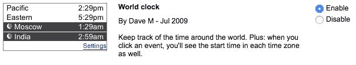
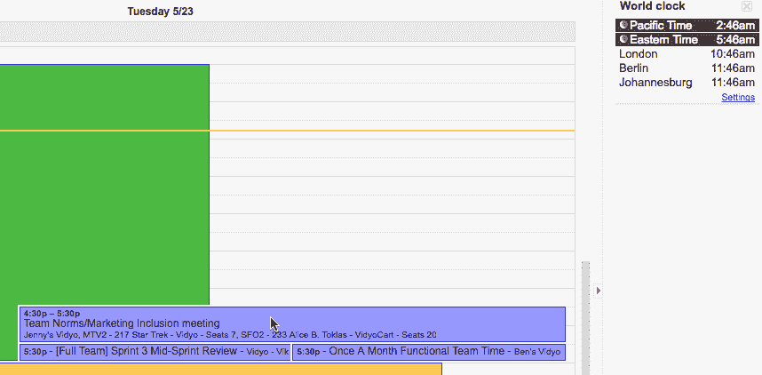
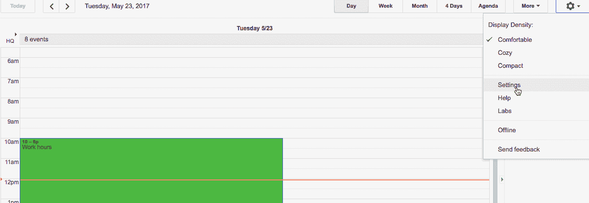
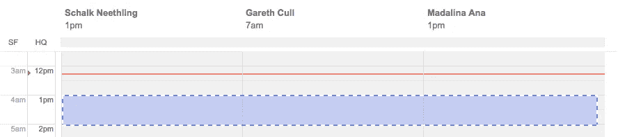
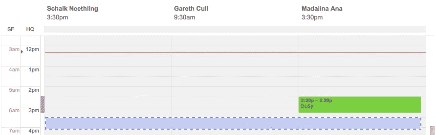

# 默认远程:使用谷歌日历的时区工具

> 原文：<https://medium.com/hackernoon/remote-by-default-use-google-calendars-time-zone-tools-704b74e9bd1b>

[Pudong International Airport](https://unsplash.com/search/pudong-international-airport) ~ by [Frankie Guarini](https://unsplash.com/@frankieguarini)

默认为远程。远程工作系列。有效利用[工具](https://hackernoon.com/tagged/tools)对您的公司、您的员工意味着什么，以及您为什么应该关注它。

作为一名远程工作者，这些话题对我来说当然很重要，但是[迹象表明远程工作正在增加。](https://remote.co/signs-flexible-work-is-here-to-stay/)

当然，采用分布式劳动力有很多好处。事实上，它不仅打开了多元化和全球人才库的大门，还让你的公司对这些人更有吸引力。

因为这消除了边界的概念，它为各行各业的人创造了巨大的机会，无论在哪里。为一个更加繁荣的全球社会做出贡献。

有了背景知识，让我们开始看看如何利用[谷歌日历](https://calendar.google.com/)的时区工具。

# 世界时钟

要在[谷歌](https://hackernoon.com/tagged/google)日历中启用世界时钟，点击`Settings`(齿轮图标)，然后点击`Labs`。向下滚动到底部，启用时钟，并点击`Save`。

Screen shot of World Clock on the labs view

回到日历的主视图，你会在屏幕的右上角看到世界时钟。对于每个位置，它显示当前的当地时间。它还清楚地显示了当前是晚上的位置。

要添加更多位置，只需点击小部件右下角的`Settings`链接。有一点不是很明显，但在小部件描述中有所暗示，那就是世界时钟是上下文敏感的。

看看下面的动画`gif`。它演示了当您在日历上突出显示会议或时间时，小部件会更新以显示所有地点的当地时间。

Animated gif showing in context highlighting of World Clock

# 双时区主日历视图

默认情况下，Google 日历会在主日历视图的左侧显示您的当前时区。但是，您可以将其配置为显示一个额外的时区。

如果您的大多数团队成员都位于同一个时区，这将非常有用。要启用此功能，点击`Settings`，然后再次点击下拉菜单`Settings`。

在结果视图中，查找“您的当前时区”部分。在此部分，单击标题为“显示附加时区”的链接。选择你想要的时区，给它一个名字，然后`Save`你的改变。

回到主视图，现在您会看到两个时区都列在日历的左侧。

Animated gif of the above instructions

# 安排会议

在文章的最后部分，我们将看看如何使用谷歌日历的时区工具来安排会议，并尊重所有与会者。

点击`Create`，在下一个视图中点击“查找时间”选项卡。在`Guests`下，添加您打算邀请参加会议的人员列表。当您添加客人时，您将会看到，不仅添加了他们的日历，而且在视图的顶部显示了他们的姓名和基于当前活动时间选择的当地时间。

Screen shot showing calendar with guests, and their local times

现在，正如你在上面看到的，虽然下午 1 点对我和 Madalina 来说可能是一个完美的时间，但早上 7 点是不礼貌的，所以我们需要找到一个更好的时间。

Madalina 在下午 2:30 到 3:20 之间很忙，但是我们所有的日历在下午 3:20 到 4:30 之间都有一个开放时间。不过，在下午 4:30，我们几乎所有人的会议都开始了，所以，我不想再多说了。

一般来说，我会避免安排连续的会议，因此，尽管我们认为我们的会议需要 45 分钟，但我会将会议缩短到 30 分钟，并建议时间为下午 3:30 到 4:00。

Screen shot showing the final suggested meeting time

因此，考虑到之前和即将召开的会议，以及每位客人的当地时间，我们已经到了一个对每个人都有利的时间。

分布式团队的长期成功和幸福在很大程度上取决于选择正确的工具。虽然会议并不总是你一天中最愉快/最有成效的部分，但我希望这篇文章能让你更容易安排会议。

期待大家的评论和见解。

> [黑客中午](http://bit.ly/Hackernoon)是黑客如何开始他们的下午。我们是 [@AMI](http://bit.ly/atAMIatAMI) 家庭的一员。我们现在[接受投稿](http://bit.ly/hackernoonsubmission)并乐意[讨论广告&赞助](mailto:partners@amipublications.com)机会。
> 
> 如果你喜欢这个故事，我们推荐你阅读我们的[最新科技故事](http://bit.ly/hackernoonlatestt)和[趋势科技故事](https://hackernoon.com/trending)。直到下一次，不要把世界的现实想当然！

