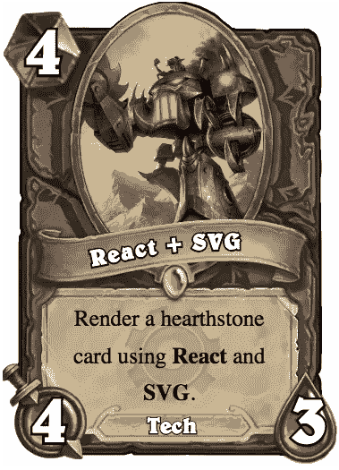
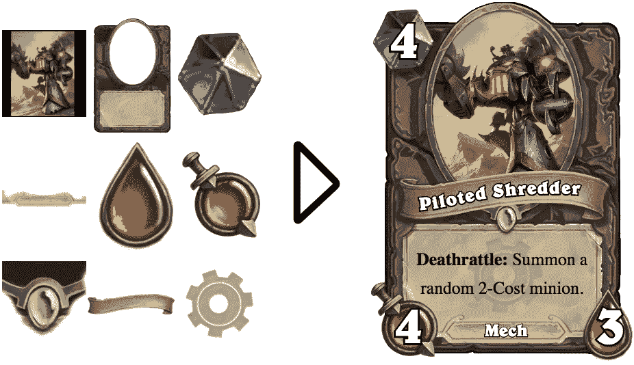
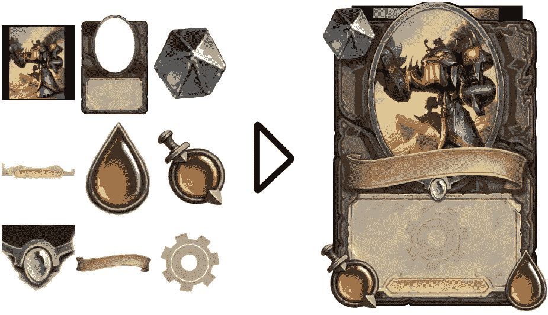
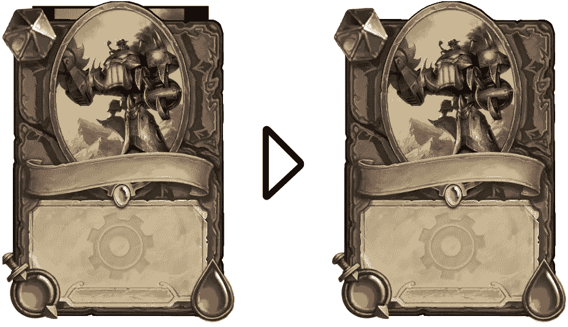
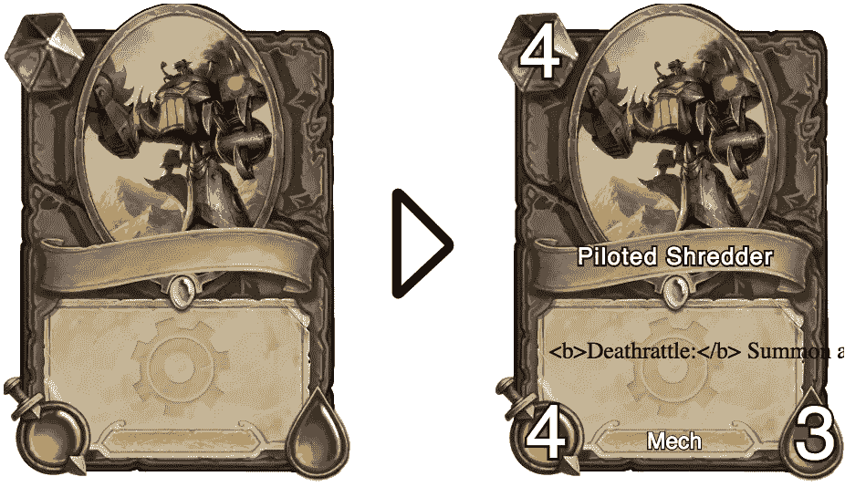
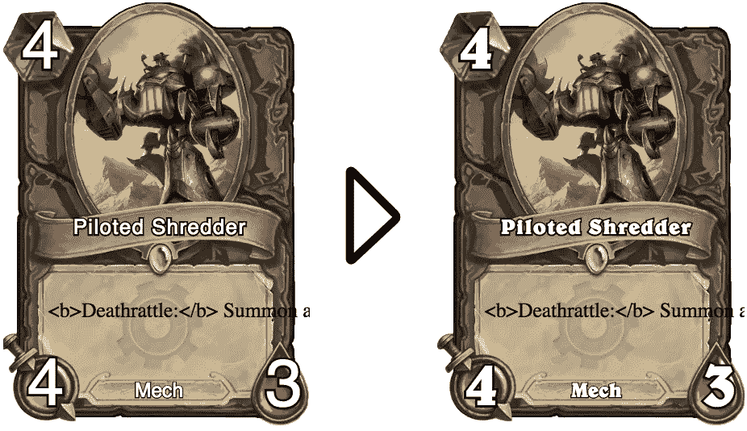
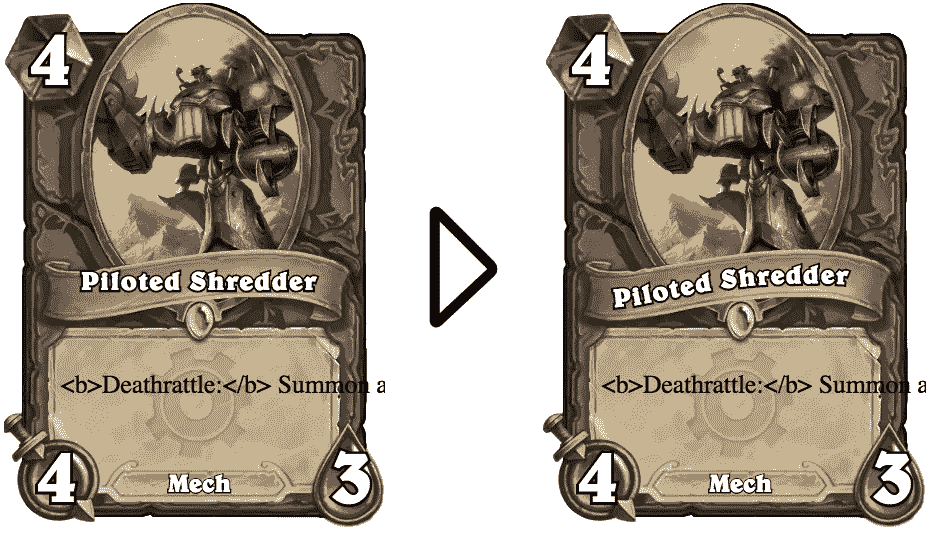
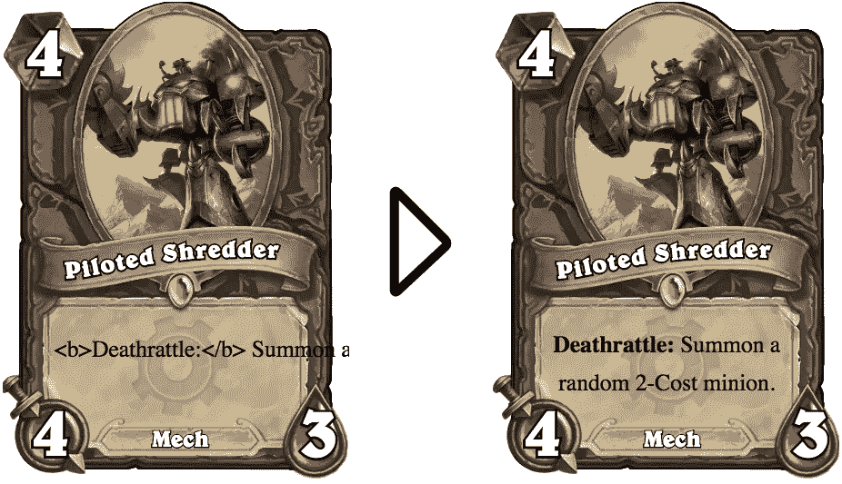

# 使用 React 和 SVG 渲染炉石卡。

> 原文：<https://medium.com/hackernoon/render-a-hearthstone-card-using-react-and-svg-cb086957e74a>

*想知道如何使用 React 和 SVG 渲染炉石卡吗？*

你在说什么？那个问题太具体了？嗯…即使你从来没有问过自己如何使用 [React](https://hackernoon.com/tagged/react) 和 [SVG](https://hackernoon.com/tagged/svg) 渲染炉石卡，现在你有机会学习如何混合和混合炉石、SVG 和 React。让我们开始吧！

我们将从几个备用的卡片资产开始，混合那些风格化的文字，最终得到一个漂亮的 SVG 和反应驱动的机甲-地精卡片。

# 布局卡元素

我们要做的第一件事是把所有独立的卡片元素，如成本、框架和标题，变成看起来像卡片的东西。我们如何做到这一点？嗯，我们有几个布局元素的选项，我们必须选择其中之一。我们可以使用`position: relative`来排列它们，我们可以使用 flexbox 将这些元素组合在一起，或者我们可以使用 SVG 来排列它们。

CSS 有一些很好的工具来布局元素，比如`position: relative;`或者 flexbox，但是我认为 SVG 更适合于布局构成我们卡片的独立元素。SVG 有大量的编辑器，让我们可以直观地排列内容，而不是处理原始像素或 flexbox 属性。SVG 标记也可以很容易地嵌入到 React 组件中。

将元素组合在一起并导出结果，我们可以获得一个整洁的卡片框架，如下所示:

这是创建的 React 组件:

# 圆形卡片图像

我们有一个卡片框架，看起来几乎和炉石框架一模一样，除了卡片图像周围丑陋的方形边框。我们怎样才能消除它呢？

轻松点。使用 SVG 的`<clipPath />`。为了基于另一个元素裁剪一个 SVG 元素，我们可以为它添加一个引用另一个元素的 clipPath 属性。因此，我们将把`clipPath="url(#image-clip-path)"`添加到我们的试点碎纸机图像中。

See the diff [here](https://gist.github.com/JulianMayorga/4210f62c00e980d74dca48f9cde405b7/revisions#diff-cd0fde9ec78c8937e515f85dc70a0582).

感谢上帝，边界消失了！

# 显示可变文本

这个卡片框只需要一些卡片文字，看起来就像真的卡片一样！幸运的是，添加文本非常容易，我们只需添加一些 svg `text`标签，并用 JSX 插值它的值。

See the diff [here](https://gist.github.com/JulianMayorga/4210f62c00e980d74dca48f9cde405b7/revisions#diff-cd0fde9ec78c8937e515f85dc70a0582).

既然我们已经在卡片上引入了可变文本，那就没有限制了！

# 设置文本样式

当然，卡片现在有一些文字。但是看起来一点也不像真正的炉石文字。它需要一些香料和风格，所以我们将继续添加它。

原来让炉石文字看起来像炉石文字的魔酱就是贝尔威字体！我们将设置文本使用这种字体系列，给它一个白色填充和一个粗黑边框，就这样！

As always, [here](https://gist.github.com/JulianMayorga/4210f62c00e980d74dca48f9cde405b7/revisions#diff-cd0fde9ec78c8937e515f85dc70a0582) is the diff.

这是一些好看的炉石寻找文本！

# 让标题流过

现在这些都是非常好看的成本，健康和力量值！但是那个标题看起来太生硬了，看起来不太对，不应该画直线；所以我们会让它沿着一条想象的曲线流动。

SVG 再次为我们提供了合适的工具，这次是以`textPath`的形式，它可以使文本沿着`<path>`的形状呈现。所以我在我的 SVG 编辑器中用`fill="none"`创建了一个`<path`,并用`textPath`在标题中引用它。

See the diff [here](https://gist.github.com/JulianMayorga/4210f62c00e980d74dca48f9cde405b7/revisions#diff-cd0fde9ec78c8937e515f85dc70a0582)

标题现在有一些病态流程！

# 结束文本

我们一直试图忽略这样一个事实，即卡片的正文有 html 标签，并且不环绕卡片边缘。这是我们需要的最后一个细节，让我们的图像和文本包看起来完全像炉石卡。

使用 HTML，这就像将卡片文本放入 div 中一样简单，但是没有简单的方法可以在 SVG 中自动换行。尽管这在 SVG 中不容易做到，但我们可以使用`<foreignObject />`在 SVG 标记中嵌入一个 HTML 片段。

我们要做的另一件事是将 HTML 字符串转换成 react 元素。幸运的是，这可以使用 [html-to-react](https://github.com/aknuds1/html-to-react) 轻松安全地完成。

这就是我们如何将卡片文本串解析成一个组件，并使用`<foreignObject />`将其嵌入。

Check out [this diff](https://gist.github.com/JulianMayorga/4210f62c00e980d74dca48f9cde405b7/revisions#diff-cd0fde9ec78c8937e515f85dc70a0582)

这是一个总结！

我们从几个备件到一个渲染精美的炉石卡，在这个过程中学习了一些 SVG 和 React 的技巧。我们了解到 SVG 在生成可视内容方面很棒，React 在赋予 SVG 动态性方面很棒，我们还看到使用这两种工具渲染炉石卡非常简单。

如果你想看到最终结果，请查看[源代码](https://github.com/JulianMayorga/render-hearthstone-card-react-svg)！你也可以在 https://render-hearthstone-card-react-svg.now.sh/现场观看。

> [黑客中午](http://bit.ly/Hackernoon)是黑客如何开始他们的下午。我们是 [@AMI](http://bit.ly/atAMIatAMI) 家庭的一员。我们现在[接受投稿](http://bit.ly/hackernoonsubmission)，并乐意[讨论广告&赞助](mailto:partners@amipublications.com)机会。
> 
> 如果你喜欢这个故事，我们推荐你阅读我们的[最新科技故事](http://bit.ly/hackernoonlatestt)和[趋势科技故事](https://hackernoon.com/trending)。直到下一次，不要把世界的现实想当然！

