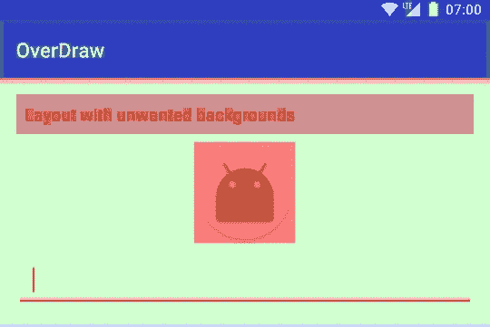
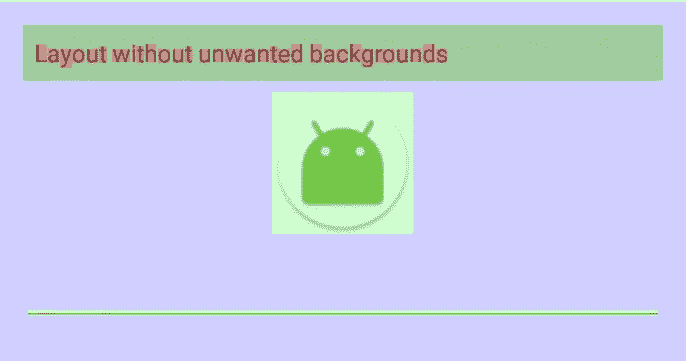

# Android 中的渲染性能- Overdraw

> 原文：<https://medium.com/hackernoon/rendering-performance-in-android-overdraw-3968ae63dfbd>

渲染性能是构建 [Android](https://hackernoon.com/tagged/android) 应用时经常被忽视的最常见的性能问题之一。鉴于大多数 Android 手机运行在功能较弱的 CPU 和 GPU 上，我们开发人员应该确保我们开发的应用程序不会使用不需要的和/或重复的指令使两个处理器过载。

两个处理器一起工作来渲染图像、颜色、可画性等。不必要的布局和频繁和/或不必要的失效(视图被测量、拆除并重新构建或重新绘制，例如:当用户滚动时，列表视图被重新构建/重新绘制太多次)导致 CPU 上的性能开销。然而，在 GPU 上，一个主要且常见的性能开销来自于*的透支*

**Overdraw** 顾名思义，是一个用来描述屏幕上的一个像素在单帧中被重画了多少次的术语。想象一下，粉刷一个房间，重新粉刷一遍；这导致第一次粉刷房间时浪费时间和精力。在 Android 的 overdraw 中，我们浪费了 GPU 的时间来给屏幕上的像素着色，而这些像素最终会被其他东西再次着色。

# 检测和修复透支

幸运的是，我们可以通过选择手机设置中*“开发者选项”*下*“调试 GPU 透支”*中的*“显示透支区域”*来检测安卓手机中的透支。

调试 GPU overdraw [工具](https://hackernoon.com/tagged/tool)用红、绿、蓝给屏幕上色；红色是屏幕上过度绘制程度最高的区域，蓝色是屏幕上过度绘制程度最低的区域。

在附上的截图中，我有两个垂直方向的 LinearLayout。第一个 LinearLayout 在 EditText 和 ImageView 等小部件上以及在布局上有不需要的背景。图像中的所有红色区域表明视图是在另一个视图的顶部重新绘制的，因此导致了过度绘制。



An example of Views being overdrawn

让我们看看第一个 LinearLayout，并找出问题所在。

```
<LinearLayout
    xmlns:android="http://schemas.android.com/apk/res/android"
    android:layout_width="match_parent"
    android:layout_height="match_parent"
    **android:background="@color/white"**>

    <LinearLayout
        android:id="@+id/unwanted_background_layout"
        android:layout_width="match_parent"
        android:layout_height="wrap_content"
 **android:background="@color/white"**
        android:orientation="vertical"
        android:padding="@dimen/button_margin">

        <TextView
            android:layout_width="match_parent"
            android:layout_height="wrap_content"
 **android:background="@color/grey"**
            android:padding="8dp"
            android:text="@string/layout_with_unwanted_backgrounds"
            android:textSize="17sp" />

        <ImageView
            android:id="@+id/image_view"
            android:layout_width="100dp"
            android:layout_height="100dp"
            android:layout_gravity="center"
            android:layout_marginTop="8dp"
            android:src="@mipmap/ic_launcher_round" />

        <EditText
            android:layout_width="match_parent"
            android:layout_height="wrap_content"
            android:layout_gravity="center"
            android:layout_marginTop="8dp"
            android:inputType="text"
            android:padding="16dp" />

    </LinearLayout> <LinearLayout
        ....
        android:id="@+id/fixed_background_layout"
        ....>
        ....
    </LinearLayout></LinearLayout>
```

粗体的 XML 代码显示了明显的错误。

我们已经为第一个 LinearLayout 视图组中的每个孩子声明了背景色。我们还在父视图组中设置了背景颜色。请注意，为视图设置背景颜色会增加过度绘制，并且不取决于使用哪种颜色。同样的颜色和不同的颜色也会发生过度绘制。

首先在屏幕上画出最上面的 LinearLayout。背景设置为白色。接下来绘制子 LinearLayout，它的背景色也是白色。此时的系统不知道颜色和以前一样。它所知道的就是有了新的颜色，像素又用新的颜色重画了一遍。子 TextView 和 ImageView 都设置了背景，这使得系统可以用新的颜色重新绘制像素。绘制和重绘相同的像素会浪费 GPU 周期。对于渲染性能来说，使用先前存在的相同数据在相同像素上重新绘制将被证明是代价高昂的。

**我们如何减少透支，提高业绩？**

我们知道相同的颜色在子视图中绘制了多次。让我们先去掉它，因为它不是一个设计约束。

```
<LinearLayout
 android:id=”@+id/fixed_background_layout”
 android:layout_width=”match_parent”
 android:layout_height=”wrap_content”
 android:orientation=”vertical”
 android:padding=”@dimen/button_margin”>
```

去掉子线条布局上的白色背景会显示出更少的过度绘制-



Reduced overdraw shown by less red marks

如果设计允许，你甚至可以去掉文本视图的背景来提高性能。

红色标记是看不见的，表明透支很少或没有透支。GPU 渲染该视图的速度更快，消耗的时间更少，有助于整体用户体验更加流畅和快速。

为了进一步提高性能，尽可能使用平面布局。嵌套视图的几个实例可能非常昂贵，因为子视图应该测量两次。由于这超出了本文的范围，你可以在 Android 开发者官方网站上研究[优化布局层次](https://developer.android.com/training/improving-layouts/optimizing-layout.html)。

在 GitHub 上克隆透支回购查看完整代码——【https://github.com/vishnusosale/Android-Overdraw

如果你觉得这篇文章对你或者你的安卓开发者朋友超级有帮助，请分享。你的掌声有助于我们被激励，写更多的内容。