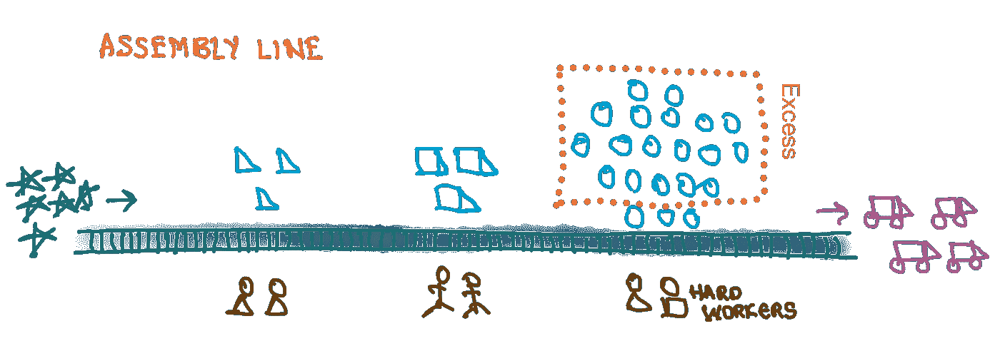
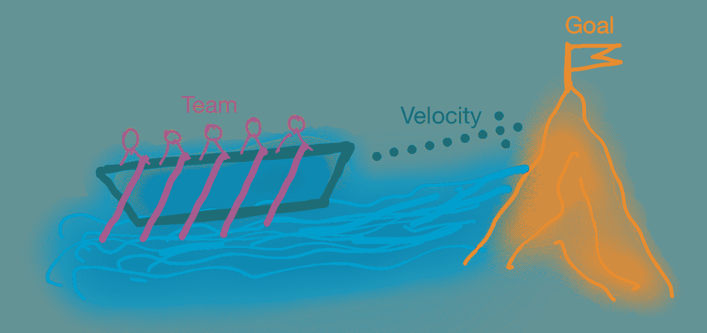
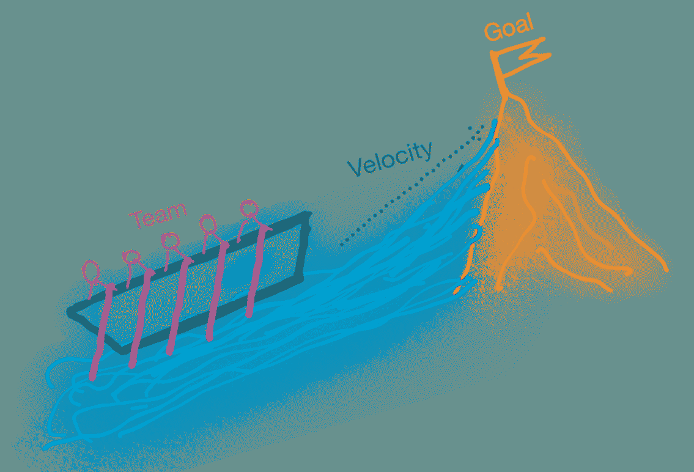
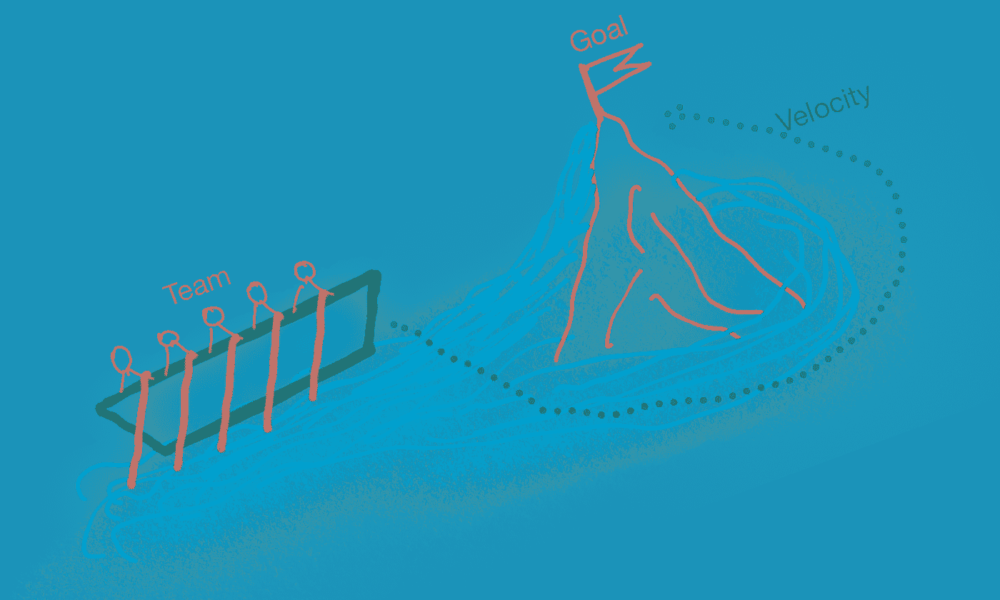
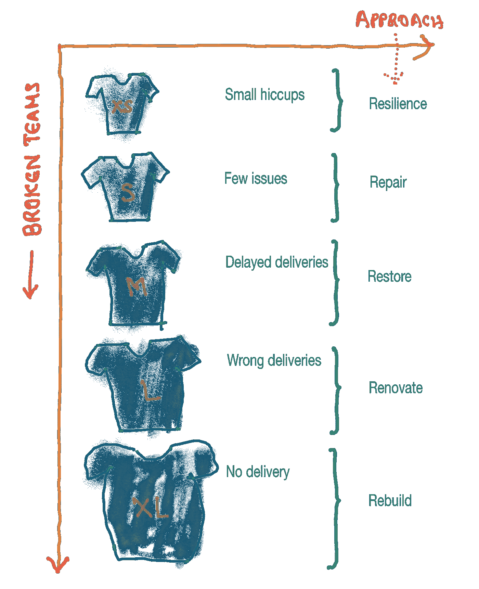
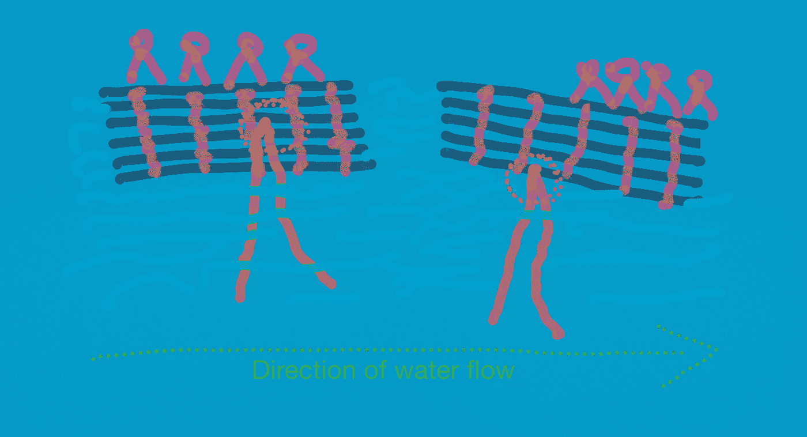
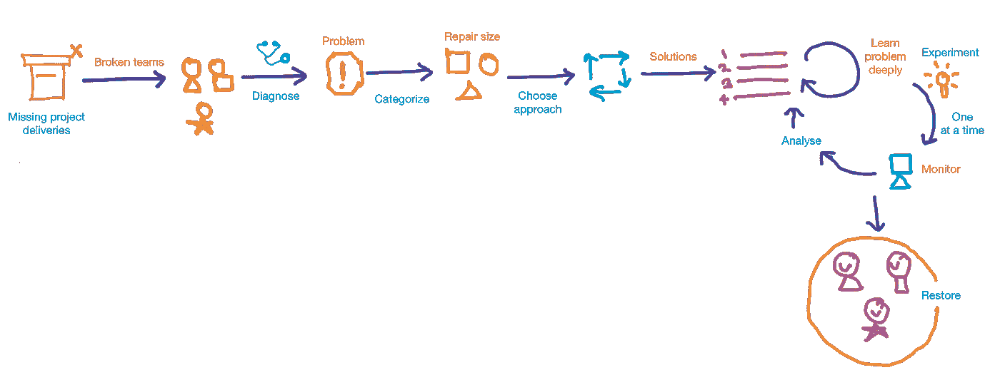

# 翻新团队

> 原文：<https://medium.com/hackernoon/renovating-teams-3fd708cdac74>

Repairing broken teams

## 修复破碎的团队。

下面的故事说明了*“团队工作越努力，公司损失的钱就越多。”*

Assembly line

[大野泰一](https://en.wikipedia.org/wiki/Taiichi_Ohno)曾参观一家公司的[流水线](https://en.wikipedia.org/wiki/Assembly_line)。他要求将所有多余的半成品零件退回到上一工序。过剩导致堆积如山的压制金属板被退回到冲压车间。这些人在装配线上生产的产品比其他任何人都多。它增加了存储和维护成本。这导致辛勤工作的成本增加。

**破** **队**

足球守门员的工作是什么？

> 大多数人会说这是为了防止对方得分。守门员的真正工作，就像球场上的其他球员一样，是赢得比赛。—杰夫·韦纳

一个组织有年度目标。这些目标是由团队分配/挑选的。实现目标的有效性决定了团队的成功。如果团队成功地完成了他们的目标，商业就是成功的。

破碎的团队是一群聪明的人在团队环境中失败了。这里的失败意味着团队没有达到目标。

**诊断驱动处方**

第一步是理解问题。我们会遇到人们在不理解问题的情况下应用不同的解决方案。我曾经见过一个产品经理向我建议将团队中质量分析师的能力增加一倍，因为有人对产品质量有所抱怨。我没有那样做，最终发现问题出在责任划分上。

> 医生不会为了找到或治愈一种疾病而开不同的药。他/她检查症状并诊断病情。成功检测后，开出治疗处方就变得简单了。

**诊断示例**

Figure 1: Team is struggling to improve velocity

图 1 显示了一个团队试图加快步伐来完成目标。在没有诊断问题的情况下，团队增加了更多的人来提高生产率。增加人员会减慢团队的速度。

Figure 2: Zooming out the problem

通过缩小问题进行进一步分析，该团队正试图克服重力。因此，增加更多的人正在减慢他们的速度。

Figure 3: Orienting the problem

经过进一步分析，它显示了增加速度的替代方法。如果团队遵循图 3 所示的路径，它允许团队避开上游。

它显示了在解决问题之前诊断问题的重要性。

**如何诊断？**

> "如果你不知道你要去哪里，任何一条路都会把你带到那里。"——刘易斯·卡罗尔

**诊断:团队**

团队是否理解目标，并有达成一致的方法？

是什么阻止了团队实现预期的结果？理解这一点的一个方法是通过[回顾](https://www.atlassian.com/team-playbook/plays/retrospective)。一个好的协调者会为讨论创造一个安全的区域，并跟进商定的行动。

**诊断:个人**

人们是否意识到他们有责任实现这个结果？是什么阻碍了个人为团队做出贡献？解决这个问题的一个好办法是给予和接受反馈。我们开展了一项名为*反馈约会的活动。*

Feedback dating

在反馈约会中，团队中的每个成员与其他成员会面 10 分钟，然后继续前进。在每次会面中，此人给出反馈 5 分钟，接受反馈 5 分钟。每个人都会记下这些评论。与团队中的每个人见面后，这个人会花时间思考笔记。它提供了一个很好的平台来识别和分享各个阻碍因素和促成因素。

诊断显示了症状的原因——问题。

> “如果我有一个小时来解决一个问题，我会花 55 分钟思考问题，5 分钟思考解决方案。”――阿尔伯特·爱因斯坦

这 5 分钟令人兴奋。

**修理尺寸和方法**

> “我有两种问题:紧急的和重要的。紧急的事情并不重要，重要的事情从来都不紧急。”— 艾森豪威尔

修复规模是对交付结果的无效性进行分类。我们根据 t 恤尺寸进行分类。尺寸越大，效率越低。

Repair size and approaches

*   **XS(超小型):**团队按时交付。有时，团队会观察到一些小问题。这些都是群体中存在的小问题。该团队有足够的恢复能力来从中恢复。例如，团队中的一个关键人物休了几周的病假，这影响了交付。用建筑的比喻来说，这就像一个肮脏的地板，随着时间的推移被清理干净。

> 弹性:任何建筑都需要一般性维护。XS 问题在团队中很常见。最好让这些问题自愈。如果某个特定的问题重复出现，那么最好将其划分为 s。重复出现的问题就像房间经常变脏一样。典型的做法是不断清理。找到根源并消除它是值得的。

*   S (small): 团队错过了一些交付。团队通过付出额外的努力来管理。一个例子可以是一个人离开团队，这增加了团队的负担。美国的问题需要额外的努力来解决。他们可能在重复 XS 的问题。

> 修理:有时更换漏水的水龙头比不停地修理要好。的问题在团队中也很常见。更好的做法是提出这些问题，并就行动计划达成一致。反馈约会和回顾是了解问题的好平台。

*   **M(中):**团队在交付上有一致的延迟。一个例子可以是许多过度承诺的功能。团队努力完成业务承诺。

> 恢复:我在一些团队中看到的默认方法是增加更多的人员。当大坝被洪水淹没时，我们无法修补它。一种方法是阻止更多的水到来，另一种方法是将水源转向另一个方向。这给了我们修复大坝的时间。
> 
> 在一个捉襟见肘的团队中增加更多的人会增加更多的混乱。还不如了解核心原因。也许一双新鲜的眼睛能带来更好的见解。注意不同的故障源，一次转动一个旋钮。一种选择是将新的独立任务重新分配给另一个团队，或者组建另一个团队来解决部分问题。

*   **L(大):**团队在交付方面存在重大问题。团队付出了努力，但没有实现。它前进后退。

> 翻新:我们不会去修复一个脆弱的建筑。我们翻新它。最好不要在一个弱队上修复多个问题。修复一个产生另一个。它也很昂贵。更好的方法是给团队外部支持，使其安全，然后应用变更。

*   **XL(特大号):**工作永远做不完。

> 重建:当基础薄弱时，更容易重建结构。这座建筑的状况太脆弱，无法修复。XL 问题已经打破了基础。不如重建整个团队。

**寻找替代方案**

避免应用第一种解决方案。寻找其他选项。

> 避免第一种解决方案很难。对于第一种解决方案，我们倾向于将问题放入我们过去经历过的解决方案中。

Bamboo boat

我们乘坐竹船旅行，如上图所示。它被卡在一棵下陷的树上了。我们开始更努力地摇晃，看看压力是否会使木块松动。其中一个人拦住了我们，试图找到船卡住的确切位置。一旦他发现了那个地方，他就让我们一个接一个地走到船的另一边。如下图所示，重量把船举到了另一边。它释放了堵塞，船开始自由移动。如果我们施加压力，就会切断连接竹子的绳子。

Hold on to an solution before further analysis

> "摆脱对答案的渴望对于理解一个问题是至关重要的."—吉杜·克里希那穆提

**案例研究**

我以经理的身份加入了一个 14 人的团队。我花了一个月的时间建立信任，了解历史，了解人们和他们的风格，并记录我的观察。该团队延迟交付—维修规模为 m。

一旦我适应了，我就要求回顾展。团队可以安全地指出问题，并且与我的笔记相符。有两个突出的问题——范围不明确和会议时间较长。由于这是 M 修理尺寸，方法是恢复。

*1。范围不明确:*我提名自己为范围 cop。我们同意我们的带宽和范围，我们可以处理每一个[冲刺](https://en.wikipedia.org/wiki/Sprint_(software_development))。如果有任何重要的任务在中间，它只能与同等大小的当前任务交换。花了两个月才恢复。

*2。更长的会议:*我从[单口相声](https://en.wikipedia.org/wiki/Stand-up_meeting)开始。他们平均持续了 90 多分钟。我的目标是让他们少于 10 分钟。我们做了很多实验。即使我们找到了解决方案，我们也在有意识地寻求更多的建议。我分享几个对我们有效的方法。我们是一个分散的团队，最初花了 20 分钟来安排会议。我提前 10 分钟到达，以便在团队其他成员到达会议室之前做好一切准备。它每天为我们节省了 20 分钟。接下来的 10 分钟是热身闲聊——我们谈论了交通、天气等。我没有要求缩短这些对话，但是我确实通过向团队提供我的更新开始了会议，团队的其他人也展示了他们的更新。我们大声重复讨论，节省了几分钟时间。我们花了三个月时间恢复了这个习惯。

> “每一个问题都有三种解决方法:接受它，改变它或者离开它。如果你不能接受，那就改变它。如果你不能改变它，那就离开它。”—未知

**总结**

总之，每当你看到交付不准确的团队，这就是一个破碎的团队。诊断原因和了解问题是至关重要的。用组织、团队、个人的角度看问题。对问题进行分类并确定维修规模。根据维修规模选择方法。避免应用第一种解决方案。多了解问题，不断寻找替代解决方案。尝试一次转动一个旋钮。让你的航班恢复正常。

还发布在 [linkedin](https://www.linkedin.com/pulse/renovating-teams-ranganathan-balashanmugam) 。