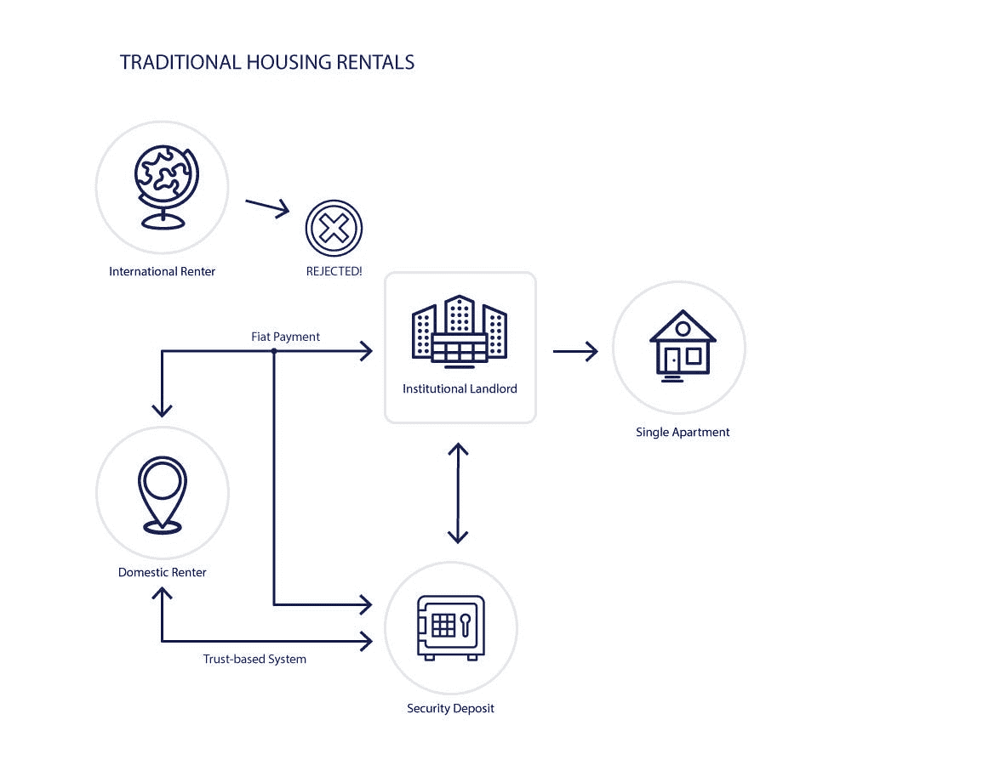
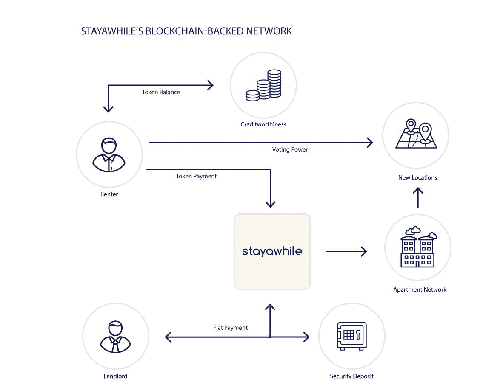

# 用密码租下你的下一个公寓

> 原文：<https://medium.com/hackernoon/rent-your-next-apartment-with-crypto-2725c3f7e855>

*数字货币和* [*【区块链】*](https://hackernoon.com/tagged/blockchain) [*技术*](https://hackernoon.com/tagged/technology) *有可能给 21 世纪的许多行业带来革命性的变化。降低房地产交易经常需要的大额跨境支付的相关成本是最直接的用例之一。*

在 [Stayawhile](http://stayawhile.com) ，我们的使命是创造一个少边界的世界。我们正在世界上最具活力的城市建立一个带家具的设计师公寓网络，我们希望每个人都有平等的机会。

不幸的是，结构性和财务上的障碍常常阻止国际公民在他们没有资产的国家租用公寓。机构房东一般不愿意租给外国客户，因为很难评估他们的信誉，也很难扣押他们存在海外银行账户中的资产。

更糟糕的是，某些国家的居民面临本国政府的货币贬值，这使得他们在国外市场的大宗购买变得不合理地昂贵。

即使对国内租房者来说，这个过程也可以大大改进。大多数保证金是完全基于信任的，租房者经常会损失金钱，同时几乎没有法律追索权或杠杆。

The process for renting apartments in international markets has long been burdened by the complications of an antiquated system.

**但是，如果搬到一个外国城市，租一套很棒的设计师公寓，就像转移数字货币一样简单，那会怎么样？**

A housing ecosystem for the modern era.

我们相信，在我们的网络中构建一个基于区块链的公用设施令牌将有助于解决其中的许多问题:

*   **增加透明度** —区块链作为公共分类账，确保所有交易(包括保证金)都有公共记录。
*   **更低的交易成本**—Stripe 等典型的信用卡供应商对每笔交易收取 2.9%+0.30 美元的费用，而比特币基地对以太坊兑换仅收取 1.49%的费用。目前发送乙醚的天然气成本中值约为每笔交易 10-20 gwei，约为 0.08 美元。
*   **评估信用** —随着时间的推移，我们将能够跟踪区块链上的支付历史，用户将能够积累 Stayawhile 网络独有的信用历史，但最终可能适用于更广泛的债权人和公司。
*   **构建社区**——我们也在围绕我们的网络构建一个社区，我们希望我们的令牌持有者能够对公司的方向有发言权。令牌持有者将拥有预订优先权，并能够就网络未来扩展的地点进行投票。

**进入 Stayabit。**了解更多:[token.stayawhile.com](http://token.stayawhile.com)。

