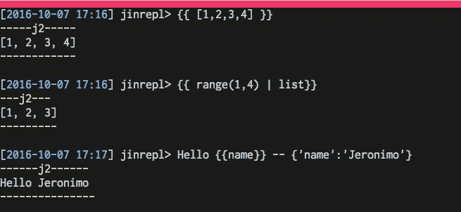
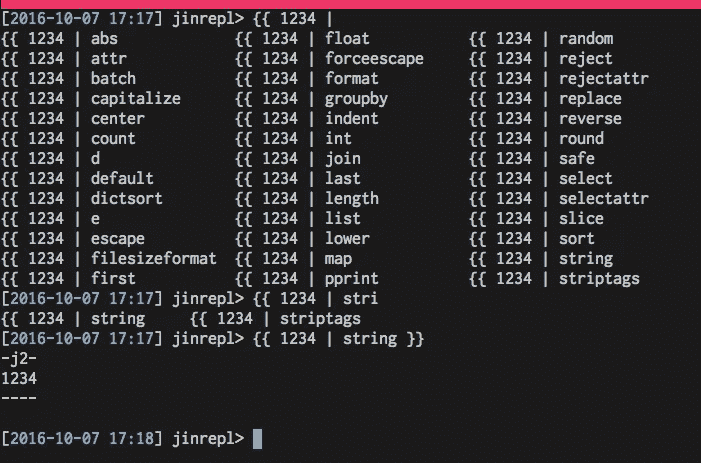
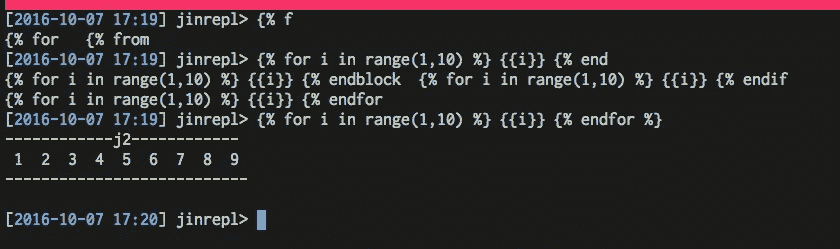
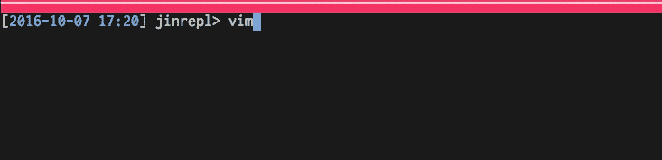
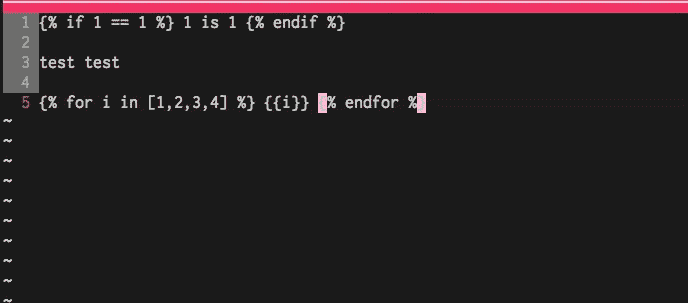
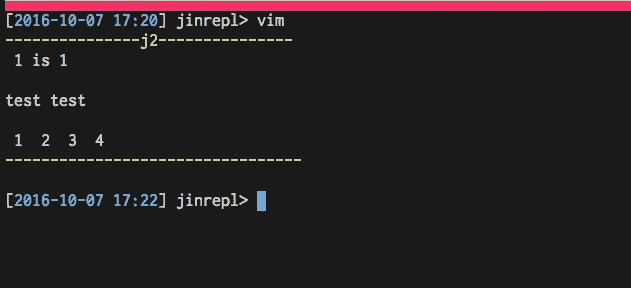

# jinja2 的 Repl

> 原文：<https://medium.com/hackernoon/repl-for-jinja2-1a1492196da5>

当我使用 **Ansible** (或者我尝试学习 **Ansible** )时，有时我想测试一些小的 **j2** 片段(在 **Ansible** 内的模板/when 条件/其他中使用)。你可以 **ipython** (或者你最喜欢的 repl)手动**或者你可以使用(并贡献)我昨天构建的这个小工具。**

我已经调用了 **jinrepl** (没有更好的名字)，它基本上将字符串赋值到 j2.template 中并呈现出来，没什么大不了的，但是有一些简洁的特性。

**特色:**

[https://github.com/bechampion/jinrepl](https://github.com/bechampion/jinrepl)

**安装:**

```
pip install termcolor
pip install jinja2
git clone [https://github.com/bechampion/jinrepl](https://github.com/bechampion/jinrepl)
cd jinrepl
python jinrepl.py
```

到目前为止，这几乎是您所需要的一切(使用当前的一组特性)

特征

*   **线金佳效果图**



*   **过滤自动完成**



*   **条件和语句自动完成**



**但是我最喜欢的是，嵌入式 Vim！(哈哈 just os.system("vim"))**



它做得更多一些，但是你可以在 github repo 上找到关于它的所有内容。

[https://github.com/bechampion/jinrepl](https://github.com/bechampion/jinrepl)

[](http://bit.ly/HackernoonFB)[](https://goo.gl/k7XYbx)[](https://goo.gl/4ofytp)

> [黑客中午](http://bit.ly/Hackernoon)是黑客如何开始他们的下午。我们是 [@AMI](http://bit.ly/atAMIatAMI) 家庭的一员。我们现在[接受投稿](http://bit.ly/hackernoonsubmission)并乐意[讨论广告&赞助](mailto:partners@amipublications.com)机会。
> 
> 如果你喜欢这个故事，我们推荐你阅读我们的[最新科技故事](http://bit.ly/hackernoonlatestt)和[趋势科技故事](https://hackernoon.com/trending)。直到下一次，不要把世界的现实想当然！

[](https://goo.gl/Ahtev1)