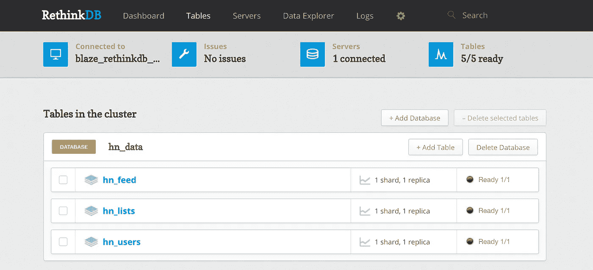
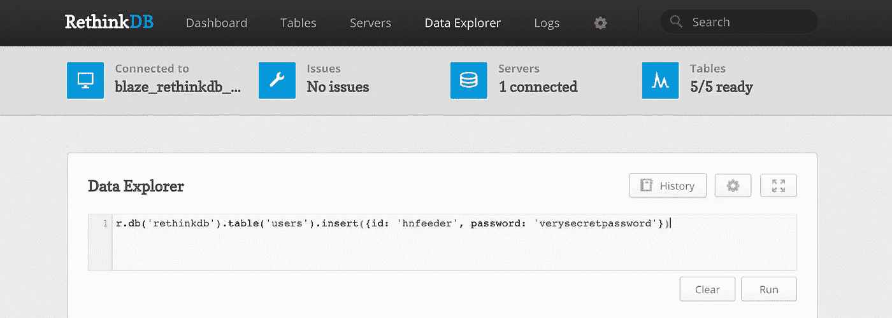
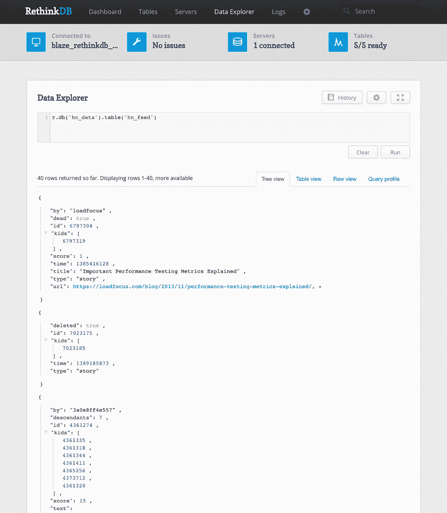

# 将数据从 Hacker News (Firebase)复制到 RethinkDB

> 原文：<https://medium.com/hackernoon/replicating-data-from-hacker-news-firebase-to-rethinkdb-8e62a3848863>


Image courtesy of the [amon.cx](https://www.amon.cx/blog/rethinkdb-reviewed-by-a-mongo-fan/) blog

几天前，我[发布了我的有趣的兼职项目](https://hackernoon.com/tophn-a-fun-side-project-built-with-vue-js-and-rethinkdb-f22159641c1b#.7rb5gidmh)，叫做[拓丰](https://tophn.info)。基本上，实时显示[黑客新闻](https://news.ycombinator.com/)头条新闻。事实证明，这篇文章在黑客社区中非常受欢迎，我收到了大量关于它的消息和推文，要求我扩展我的项目。

嗯，我非常乐意这样做，所以我想我会再发表两到三篇博文，深入研究代码和我是如何构建我的项目的。

# 组件

我的 TopHN 项目基本上有两个主要部分，实际上，它们运行在两个独立的虚拟服务器上。一台服务器基本上是我的 RethinkDB 服务器，我在 Digital Ocean 每月 10 美元的运行 Ubuntu Linux 的 VPS 上安装了它。该服务器还运行一个简短的(~100 行) [Node.js](https://hackernoon.com/tagged/nodejs) 应用程序，它纯粹用于从黑客新闻 Firebase feed 中读取数据，并将一个复制副本存储在 [RethinkDB](https://hackernoon.com/tagged/rethinkdb) 中。

另一个服务器是“表示层”，也运行一个小的 Node.js 应用程序，该应用程序用于提供网站的首页，并实时监听 RethinkDB 服务器，并将更改的信息推送到连接的 web 浏览器。

今天，我想谈谈托管我的 RethinkDB 数据库的第一台服务器，以及从黑客新闻获取数据的“feeder”node . js 应用程序。

# 安装 RethinkDB

我不会在这里过多地讨论实际的安装步骤，因为在 RethinkDB 网站上已经有了[很棒的说明。基本上，一旦设置了 Digital Ocean(或任何其他 Linux VPS ),您只需获得 root 控制台访问权限，并按照 RethinkDB 站点上的逐步说明进行设置和运行。这真的很简单，这也是我在这个项目中使用这个数据库的原因之一。](https://rethinkdb.com/docs/install/ubuntu/)

一旦安装并启动了 RethinkDB 服务器，您就可以访问控制面板，方法是

```
http://<your VPS IP Address>:8081
```

提示:我会在反向代理后面保护这个管理门户，并设置管理员密码，这样互联网上发现您的 RethinkDB 服务器的人就不能登录并操纵您的数据。再次，优秀的[这样做的指示是在他们的网站](https://rethinkdb.com/docs/security/)。我强烈建议你在继续之前这样做，但是如果时间紧迫，你可以继续这篇文章中的指导，稍后再回到这个话题。

# 设置数据表

有几种方法可以做到这一点，通过代码，或在管理控制台中手动完成。我将在控制台中完成它，因为这确实是一个“一次性”的练习，并且节省了几行以后可能会使人迷惑的代码。

在管理控制台中点击顶部的' ***表*** '菜单，然后点击' ***+添加数据库*** '。给数据库一个名称。对于黑客新闻数据，我将把它称为 **hn_data** ，但是你可以把它称为任何你想要的东西(只要你在代码的后面记住它)。

创建空数据库后，点击几次' ***+添加表格*** '并创建三个表格，名称为:

**hn_feed** —这将包含文章和评论的实际 feed。

hn_lists —这将包含最新的“热门故事”、“最佳故事”、“问问 hn”、“乔布斯”等列表。黑客新闻的故事。

**hn_users** —这将包含从黑客新闻中读取的用户资料。



现在不需要用数据填充这些表——在未来的步骤中，我们可以用纯代码来完成。

# 创建 RethinkDB 用户

在我们继续深入之前，我们需要为 RethinkDB 创建一个唯一的用户，该用户将对我们刚刚创建的数据库具有读/写访问权限。这是我们稍后将从 Node.js 应用程序调用的用户，用于将黑客新闻数据推送到我们的数据库中。

最好不要使用默认的 admin 用户，而是创建一个只能访问这个数据库的新用户。这样，如果用户名被泄露，您可以轻松地更改他们的密码来再次保护您的提要。

要创建用户，我们可以在 RethinkDB 控制台中使用 ReQL 查询。点击顶部的' ***'数据浏览器*** '菜单选项，并输入以下 ReQL 命令:

```
r.db('rethinkdb').table('users').insert({id: 'hnfeeder', password: 'verysecretpassword'})
```



在你输入这个命令后，不要忘记点击 *Run* 来执行它。并且不要忘记用你自己选择的来替换`id`和`password`(并且记住它们以备后用)。

接下来，我们想给这个新用户对我们刚刚创建的 **hn_data** 表的完全读/写权限，使用下面的 ReQL 命令:

```
r.db('hn_data').grant('hnfeeder', {read: **true**, write: **true**, config: **true**});
```

不要忘记再次点击*运行*。现在，您的用户`hnfeeder`拥有了数据库中的读、写和配置权限。配置权限基本上意味着创建新表等的能力。，所以你现在可以把它保留为`false`,因为我们目前不会通过应用程序做任何类似的事情。

这就是数据库控制台目前的基本情况。

# 安装 Node.js

在这篇文章中，数字海洋实际上有一些关于在 Ubuntu 上安装 Node.js 的很好的说明。遵循它一步一步地达到最佳效果，然后再回到这篇文章。

这里我们唯一需要添加的是这个项目需要的节点模块。只有两个—(a)RethinkDB 模块和(Firebase 模块。

首先，切换到您将创建实际应用程序的文件夹。我只是在`/root`创建了我的，但是为了更安全，你可能想在`/var/app`或者类似的地方创建它。现在让我们继续关注`/root`:

```
cd /rootnpm install --save rethinkdb firebase
```

# 创建应用程序

现在我们已经准备好创建 Node.js 应用程序本身了。在`/root`文件夹中(或者你将要创建应用的任何地方)，创建一个名为`feeder.js`的文件，使用你最喜欢的编辑器，输入(或者复制粘贴)以下代码:

让我们仔细阅读这段代码，看看发生了什么。

前两行只是激活我们之前安装的节点模块。

第 4 到 7 行启动了到 Hacker News API 的 Firebase 连接。你可以把`appName`设置成你喜欢的任何值，但是`databaseURL`必须保持原样。

第 9 行只是将存储在`rdbconn`中的 RethinkDB 连接的占位符。稍后，在整个应用程序中，我们会使用它与我们的 RethinkDB 服务器进行对话。

第 11 到 14 行启动到我们的 RethinkDB 服务器的链接。记住将`host`、`user`和`password`替换为之前设置的值。如果您在安装 RethinkDB 的同一台服务器上运行这个应用程序(就像我们一样)，那么`host`可以简单地使用值`localhost`。

这是所有的初步连接的东西了。现在我们开始了解应用程序的本质。

第 16 到 23 行是我们为 HN API 设置各种 Firebase 提要的引用的地方。我们需要为我们想要的每个单独的提要设置一个*引用*。关于提要位置的更多信息在[黑客新闻 API 文档](https://github.com/HackerNews/API)网站上，但是基本上，他们发布的每个提要都有一个唯一的端点。

例如，在`/v0/newstories`发布“新故事”提要等。

在我们的示例中，我们实际上只设置了新的故事提要，但是如果您需要额外的内容，只需添加带有您需要/想要的独特提要端点的额外行。

第 23 行非常重要。这是一个来自 Firebase/HN 的特别供稿，包含了自上次推送更新以来发生变化的故事、评论和用户列表。此*更新*进给每隔 20 秒左右推出一次。你可以想象，黑客新闻的活跃程度，这个*更新* feed 的每次推送可以包含数百个已经更改的文章&评论 id，以及几十个已经更改的用户配置文件。

这是我们将主要收听的提要，以便了解黑客新闻的新内容，并相应地更新我们的本地数据库。

第 26 到 43 行是`pullUser()`函数。这是我们调用的函数，使用用户 ID 从 Firebase 读取单个用户，然后将其插入到我们的本地数据库中。我们为我上面提到的更新提要中推送给我们的每个用户 ID 调用这个函数。

这里的第 28 行调用了 Firebase `once()`函数，只读取一次特定的用户 ID。如果成功找到用户，那么第 31 行执行一个`insert()`调用，将其保存到本地数据库中的 **hn_users** 表中。注意这个命令中的`{conflict: "update"}`限定符。这基本上意味着，如果数据库中不存在记录，那么创建它，但是如果用户 ID 已经存在，那么更新现有的记录，而不是抛出错误。它本质上是一个“ *insert 或 update if exists* ”命令，使事情变得如此容易管理，这也是我喜欢 RethinkDB 的原因之一。

该功能的其余部分基本上是内务处理，输出一个带有已添加或更新的用户 ID 的 *console.log* 消息。

第 46 到 67 行是`pullItem()`函数，它与`pullUser()`函数完全相同，只是针对黑客新闻文章和评论。注意:文章和评论在 HN 存储在同一个表中)。


此时您可能会想——为什么我们在保存到本地数据库时不保存或映射单个字段呢？这个问题其实很容易回答。Firebase 以 JSON 结构的形式返回数据，而 RethinkDB 作为一个 NoSQL 系统，希望数据以 JSON 结构的形式发送给它。

所以真的没有额外的操作要做。我们只是将 Firebase 返回给我们的 JSON 数据直接传递给 RethinkDB。所有字段及其值都“按原样”发送。

70 号线到 82 号线是整个 app 最忙的线。这是等待从 Firebase 推送更新事件的函数。`on("value" ...)`函数基本上是一个等待来自 Firebase 值变化事件，然后运行的函数。

该函数检查两个数组的传入更新。`items[]`数组包含已经更改的文章和评论 id 的列表，而`users[]`数组包含已经更改的用户 id 的列表。我们简单地遍历这些数组，然后调用`pullItem()`和`pullUser()`来读取单个的 id 并将它们导入到我们的本地数据库中。

第 87 到 93 行类似，但是是一个`on("value" ...)`函数，它监听从 Firebase 推出的一系列新故事。我们在这里所做的就是获取新故事 id 的数组，并将它们保存到 **hn_lists** 数据库中以备后用。

重要提示:您需要为每个想要保存数据的提要设置一个单独的监听器函数。基本上，对于您之前在应用程序中设置的每个*引用*(第 17 行到第 23 行)，您需要针对该引用创建一个`on("value ...)`函数来读取和处理数据。

就是这样！一个只有 100 行左右的简短应用程序，但它做了很多。让我们运行它。保存文件并返回命令行，键入:

```
node feeder.js
```

您应该会看到控制台消息，显示正在传输的用户、文章和评论。

如果您仍然在浏览器中打开 RethinkDB 控制台窗口，您应该会看到每隔 15 到 20 秒就会出现一次活动图峰值，因为从 Firebase 推送的数据流被读取和保存。

提示:您现在可以将 Node.js 应用程序设置为作为服务运行，这样即使您的服务器重新启动，它也会自动启动并运行。在 Node.js 上将 PM2 设置为[作为服务运行的详细信息在本详细的数字海洋指南](https://www.digitalocean.com/community/tutorials/how-to-use-pm2-to-setup-a-node-js-production-environment-on-an-ubuntu-vps)中。

一旦你做到了这一点，你就可以“启动并忘记”你的 feed 刷新服务器。注意:随着时间的推移，您的 RethinkDB 将被填满，因此请确保您的虚拟服务器有足够的磁盘空间。您可能希望将 RethinkDB 数据指向一个单独的块存储设备。我发现我的数据库每天至少增加 100–150 MB。大约每 10 天就有 1000MB 的数据！

# 检查数据

你可能会有点怀疑一切都在正常运行，我不怪你。这一切似乎很容易，不是吗？；)

嗯，有一个简单的方法来检查发生了什么，这是通过 RethinkDB 控制台中的*数据浏览器*选项卡。您可以运行简单的 ReQL 查询来检查这些表。例如，要从 feeds 表中读取前 40 条左右的记录，可以运行以下命令:

```
r.db('hn_data').table('hn_feed')
```

这将向您显示如下内容:



您甚至可以进行一些有趣的查询，比如通过查询以下内容，按日期倒序返回最后 10 篇文章:

```
r.db('hn_data').table('hn_feed').orderBy({index: r.desc('time')}).limit(10)
```

(注意:为了有效地工作，您必须在 RethinkDB 的`time`列中创建一个二级索引)。您可以通过以下命令直接在 ReQL 中创建一个二级索引:

```
r.db('hn_data').table('hn_feed').indexCreate('time')
```

请耐心等待——完全索引该表可能需要几分钟的时间(您可以从仪表板上查看重新索引的进度),但之后，上面排序的 ReQL 查询应该会工作。

# 结论

就是这样！您现在有了一个完全正常工作的 RethinkDB 服务器，它正忙于半实时地复制来自 Hacker News 的数据。我将发布的下一篇文章将讨论我们实际上如何处理这些数据，即使用 [Vue.js](https://vuejs.org/) 作为前端框架在实时网页中显示这些数据。到时候见！

[](http://bit.ly/HackernoonFB)[](https://goo.gl/k7XYbx)[](https://goo.gl/4ofytp)

> [黑客中午](http://bit.ly/Hackernoon)是黑客们下午的开始。我们是 [@AMI](http://bit.ly/atAMIatAMI) 家庭的一员。我们现在[接受投稿](http://bit.ly/hackernoonsubmission)并乐意[讨论广告&赞助](mailto:partners@amipublications.com)机会。
> 
> 如果你喜欢这个故事，我们推荐你阅读我们的[最新科技故事](http://bit.ly/hackernoonlatestt)和[趋势科技故事](https://hackernoon.com/trending)。直到下一次，不要把世界的现实想当然！

