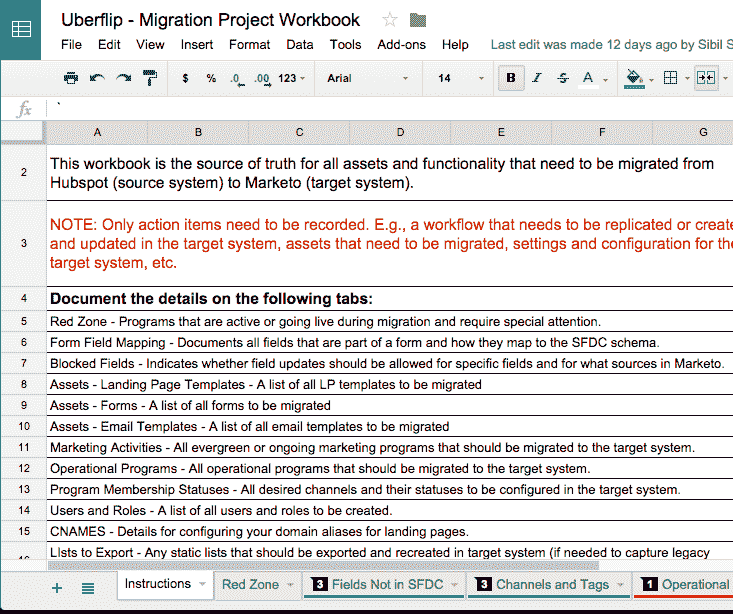
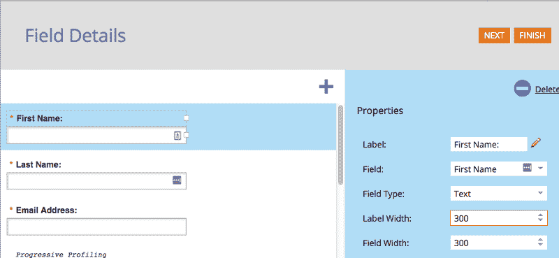

# 重新发布:3 周内从 Hubspot 迁移到 Marketo。

> 原文：<https://medium.com/hackernoon/republished-migrating-from-hubspot-to-marketo-in-3-weeks-175ebee394d>

> [**最初在 Inbound.org 上发表为入境原创。**](https://inbound.org/blog/migrating-from-hubspot-to-marketo-how-we-did-it-in-just-three-weeks)

答几个月前， [Uberflip](http://www.uberflip.com/) 的营销团队开始考虑从 HubSpot 转向另一个更强大的系统。随着我们营销和需求挖掘活动的发展，我们需要一个更加可定制的工具，该工具与 Salesforce 进行了更深入的集成，并且在运营和财务方面都具有良好的可扩展性。

HubSpot 是一个很好的工具，可以用来开始构建我们的活动流程，但随着我们变得越来越复杂，我们遇到了某些限制。缺少定制选项和没有 Salesforce 集成开始阻碍我们的努力。例如，我们不能创建自己的生命周期阶段来反映我们营销漏斗的现实。

当我们开始寻求迁移到一个不同的平台时，归结到 Marketo 和 Pardot。这些平台非常相似，每个平台都有自己独特的癖好和擅长的领域。最终，赢家是 Marketo(尽管 Pardot 销售团队在办公室进行了多次上门拜访)。

任何类型的系统迁移都是一个巨大的工程。我将在下面分享一些经验和过程，以防任何人在经历自己的迁移时发现它很有帮助。对于上下文，我们的团队是四个人，我们有一个 90，000+的当前联系人 DB 大小，以及大量的创意和运营项目。

> **请注意:这是从我们内部营销的角度进行的迁移，我们的 Uberflip 平台与主要营销自动化平台的集成没有任何变化 *s.***

# 迁移过程

典型的 MA(营销自动化)迁移至少需要一个月或两个月以上。我们只有不到一个月的时间来转换开关(是的，Uberflip 有一个同名的播客——我们喜欢留在品牌上)。

我们聘请了 Perkuto(一家 Marketo 代理公司)来帮助我们管理项目，并最大限度地减少团队中断，因为我们的团队仍然有我们的常规需求挖掘项目要运行。对于这种规模的项目，我们必须确保业务和运营保持运行，同时我们慢慢地在后端进行切换

我们通过让[贾斯廷·诺里斯](https://www.linkedin.com/in/justinnorris)(他们的解决方案架构师)与我们共度一天，开始了与 Perkuto 的迁移。我们向他介绍了 HubSpot 中的运营工作流程、评分模型、登录页面模板、电子邮件模板、移交流程、数据架构、销售流程以及 Salesforce 和 HubSpot 中的一般业务角色。

# 选择 MVP 迁移路线

通常这种规模的迁移需要几个月的时间才能完成，然而我们的 HubSpot 许可证即将到期，所以我们的时间框架被缩短了。为了帮助实现这一点，我们不必一天 24 小时都在进行迁移，我们决定了 MVP 迁移范围。

在这个场景中，MVP 代表最小可行项目。我们必须弄清楚迁移的最低限度是什么，这样一切才能正常运行，我们才能赶上最后期限。我们最终首先迁移了我们的数据库、活动模板和运营工作流，然后在完成基本元素后，构建了更强大的数据库。

如果我们有更多的时间，我们将构建完整的漏斗培养、更多的模板、深入的评分模型、经过测试的 Bizible/Marketo 集成以及活动的运营工作流。

**提示:**

*   预先做好清点所有东西的工作，虽然很痛苦，但会让事情一帆风顺，但不要花太多时间在文档上。

迁移的一个很大的好处是，你可以摆脱所有随着时间积累的遗留“垃圾”,重新开始。不利的一面是移动部件的数量太多了。

根据我们的讨论，Justin 整理了一份技术设计文档(TDD ),作为迁移的圣经。TDD 更像是一个正式的项目管理文档，所以为了跟踪、盘点和标记待办事项，我们使用了一个迁移工作簿(如下所示)。

**提示:**

*   让你的需求挖掘团队或者其他任何人参与到你的营销自动化系统中来，但是不要让太多的厨师在厨房里。否则，就会出现“分析瘫痪”式的情况。在我们的案例中，我们包括了我们的四人需求团队，在我们每个人之间，我们分解了我们要做的事情，并相互信任来完成工作。

# 同步 Salesforce

我们的记录系统是 Salesforce，因此在处理任何运营和活动项目之前，我们需要将 Salesforce 与 Marketo 连接起来，以便我们的销售线索开始同步。

[Sibil](https://www.linkedin.com/in/sibilsamuel) (营销运营)和 [Tara](https://twitter.com/taraarobertson) (集客营销)将我们的 90，000+联系人数据库细分为“Marketo 同步”和“丢弃”。被丢弃的邮件由免费的电子邮件地址(Gmail，Yahoo 等)组成。)、硬退回的电子邮件以及在过去一年中没有任何活动的任何人。

这些“垃圾”联系人仍然作为备份存在于我们的 Salesforce 实例中，但不会迁移到 Marketo。

为了对数据库进行细分，我们创建了一个标记为“sync to Marketo”的自定义复选框字段，并使用智能列表进行筛选，使用 HubSpot 工作流将任何要迁移的联系人标记为“true”。此复选框随后与所有“真实”联系人的 Salesforce 同步。

> *由于我们的销售团队拥有我们整个营销/销售数据库，我们有一份所有在那里创建的联系人的备份。但是为了保持我们闪亮的新 Marketo 实例的干净，我们只同步实际上是好的联系人。*

**怪癖:**

*   在 Marketo 中设置过滤器时出现一些问题。这样做并不常见，但这是可能的。我们不得不多次致电 Marketo 寻求支持。

**提示:**

*   由于 CAN-SPAM 法规要求在我们当前的平台上拥有最新的列表，我们将所有的“选择退出”迁移到 Marketo。对于那些已经选择加入的人，我们不会从 Marketo 重新选择加入。

# 数据模式

在 HubSpot 中，我们有多年的自定义字段、一次性字段、复选框和其他各种项目。此处重要注意事项—这些字段仅在 HubSpot 中，而不在 Salesforce 中，因此没有像其他项目那样的 Salesforce 备份。

使用 HubSpot-Salesforce 集成和字段映射，我们首先列出了两个系统之间所有正确的映射，以便我们可以复制它。然后，我们作为一个团队坐下来，查看了所有的营销领域，并讨论了它们是否值得保留。

有些被标记为“非 MVP ”,这意味着我们以后会重访他们。对于活动报告至关重要的其他数据在 Marketo 中使用相同的数据类型重新创建，以确保兼容性。

**提示:**

*   确保正确映射字段类型。否则，日期将以数字和文本形式结束。特别是对于日期，将其作为“日期”类型可以更容易地使用日期选择工具对联系人进行分类。

# 模板表单和模板& CSS:

Tara 负责登录页面和电子邮件，以确定哪些是实际使用的，哪些是“测试”或一次性的。这意味着检查每一项资产，以确定它是否正在使用或将要使用，以及它的确切用途。

我们在 HubSpot 中提供了模板，加上截图和可编辑区域，然后 Perkuto 将它们重新创建到 Marketo 中。在某些情况下，只要您删除了系统脚本语言，就可以在 HubSpot 和 Marketo 之间使用相同的 HTML/CSS。

我们有时不得不跳进去做一些微调和 QA，尤其是对表单。典型的例子:在 Marketo 中，如果您使用表单编辑器设置表单宽度，它将为每个字段添加内嵌样式，这将覆盖您添加的任何自定义 CSS。

对我们来说，最好的做法是在 CSS 中向父类添加样式，以保持一致性和易于编辑(如上图所示，不要添加内联样式)。

对于登录页面，默认情况下它们是无响应的，因此我们不得不在模板中添加一个“HTML 框”来包含一些媒体查询，这令人惊讶。

**怪癖:**

*   在 Marketo 中，登录页面没有通用的页眉或页脚代码部分。相反，它是通过一个通用令牌来完成的。在 HubSpot 中，通过将脚本包含在通用的或部分中，可以相对容易地在所有 HubSpot 页面中添加脚本。似乎 Marketo 没有考虑到这一点。
*   如果您编辑任何资产，它将被保存为草稿，直到您批准它。要查看更改，您需要首先批准它。
*   如果资产(如登录页面正在使用的表单)被编辑，登录页面将自动保存为草稿。因此，请确保您保存表单，批准它，并批准登录页面，否则任何更改都不会生效。
*   Marketo 表单类很棘手，但是使用 Firebug 这样的工具将有助于抓住正确的选择器(但是它会让你想拔毛)。密切注意表单上的复选框及其对齐方式
*   如果表单中下拉列表中的值没有显示出来，但仍然作为数据值传递到 Marketo 中，请检查填充。
*   Marketo 不支持自定义值的下拉字段。作为解决方法，您可以在 Salesforce 中创建字段，然后将其推送到 Marketo。

# 工作流程和评分模型

我们的运营工作流程控制着营销自动化系统中的销售线索管理。对我们来说，最危险的是我们的分配规则和演示请求分配。Perkuto 在这些方面起了带头作用，我们做了五次 QA 以确保线索畅通无阻。

**怪癖:**

*   有一个小菜单可供选择和/或触发条件。
*   如果您正在触发规则，请仔细检查它们是否基于“数据值更改”或“空白”。这让我们有些头疼。

# 各种各样的名单

列表。喜欢或讨厌它们，但它们是细分和自动化的核心。我们把自己关在一个放着音乐的房间里，开始浏览智能和静态列表，以确定哪些是我们想要保留的，哪些是可有可无的。

对于静态列表，在某些情况下，将多个列表合并成一个“主列表”是有意义的，这样可以更容易地管理列表。在这种情况下，我们创建了一个新的智能列表来触发静态列表成员资格，并将它们导出为 CSV，以便备份和导入回 Marketo。

对于智能列表来说，要复杂一些。我们的大多数智能列表依赖于只存在于 HubSpot 而不存在于 Salesforce 的字段。我们希望保持我们的 SF 模式干净。由于 Marketo 中没有这些字段，所以不可能重新创建这些智能列表。为了解决这个问题，我们根据需要在 Marketo 中重新创建智能列表，创建了自定义字段。这是一项乏味的任务，但却是必不可少的。

在 Marketo 中创建字段并创建正确的文件夹结构后，我们将从 HubSpot 导出带有电子邮件的列表以及所选的自定义字段，并在 Marketo 中填充这些字段。在某些情况下，我们将多个智能列表合并成一个智能列表，并将其导入 Marketo。

**怪癖:**

*   Marketo 将创建一个没有电子邮件的线索。对此要小心。
*   导入 CSV 文件时，从“导入”菜单的文件类型中选择 CSV，不要依赖“自动检测”默认选项。

# Hub & CTAs 和位置

我们迁移过程中的另一个额外步骤是将我们的 [Uberflip Hub 与 Marketo 整合。](http://hub.uberflip.com/h/)

对于 Hub CTAs，我们得到了优秀的内容团队的帮助，他们复制了每个 CTA，并在 Marketo 中制作了一个静态列表，以供输入。在一些 QA 并确保所有数据字段都填充了正确的参数后，我们在发布前将其搁置了一天。

**怪癖:**

*   我们必须确保在“上线”之前不添加任何位置，否则我们会在 HubSpot 和 Marketo CTAs 中出现混搭。
*   确保 CTA 中的正确参数被创建为隐藏字段。

# 命名约定

Marketo 是基于文件夹的，这意味着命名惯例和结构非常重要。我们花了一些时间来组织我们的营销活动，所以一切都设置正确

一般来说，有一个合适的命名约定是一个好主意，但是对于 Marketo 来说，有一个一致的命名约定是至关重要的，这样东西更容易找到和使用。在我们的例子中，我们设置如下:

*   主动营销计划:
*   2016 营销
*   网络研讨会
*   2016 — DD —活动名称
*   内容联合
*   CS — 2016 —资产名称—渠道名称
*   社会的
*   事件
*   2016 —活动名称
*   常青树计划
*   培育
*   2016 —豆腐—滋养

一般命名惯例: **YY- DD —资产/活动名称—渠道名称**

# 质量保证和测试

一旦所有东西都上传到 Marketo，我们就测试“红色”项目的模板、表格和工作流，并建立一些“红区”活动(如 Marketo 中的 ABM Hacks 系列)。

我们在表单上遇到了一些错误，比如下拉字段有额外的填充，这意味着用户的选择不会显示，即使它会被传递到 Marketo。一些工作流被设置为在数据值更改时触发，但它不会基于空白值的已知值触发。

另一个意想不到的问题是 DKIM 值。Marketo 使用“m1_key ”,这意味着我们没有 Marketo 代表我们发送电子邮件的授权。

我们的质量保证是临时做的，因为我们已经关闭了 HubSpot，我们在 Marketo 上运行。团队努力工作，确保没有重要的东西被破坏。

# 经验教训

回想起来，我们本应该将这种转换告知我们的用户。这似乎对他们来说没什么区别，因为这都是在后端完成的，但如果出了问题，他们会知道原因。在一个案例中，在转换之前从 HubSpot 发出的一封电子邮件有死链接，如果在迁移之后(三天的间隔)打开，就会丢失图像。

总的来说，我们的 MVP 迁移花了三周时间才完成。在使用 HubSpot 后，我们对 Marketo 有一个轻微的学习曲线，因为我们正在弄清楚它的不同设置和怪癖。

总的来说，迁移进行得很顺利。一些需要记住的事情:

如果您决定迁移，请确保在开始迁移之前记录了所有内容。

一般来说，要保持一个健康的营销自动化系统，每六个月要有一个清理日。这将使房子井然有序。

不要在意细节。大多数营销自动化系统做你需要他们做的事情，做得非常非常好。请确保您浏览了重要的功能。对我们来说，这是真正定制我们的活动和培养的能力，以及销售人员直接从其 Salesforce 帐户将联系人登记到 Marketo 活动中的能力。

测试一切。尤其是 web 表单、电子邮件发送以及电子邮件和登录页面模板的响应。我怎么强调测试都不为过。测试所有运营工作流、与 Salesforce 的数据同步以及活动设置。在我们的例子中，我们还必须测试 Bizible 集成。

非常感谢来自 Uberflip 的[塔拉](https://twitter.com/taraarobertson)、[西比尔](https://www.linkedin.com/in/sibilsamuel)、[香农](https://twitter.com/dougallshannon)、[维多利亚](https://twitter.com/victoriahoffman)和[凯利](https://twitter.com/kellohara)，以及来自 Perkuto 的[贾斯汀](https://www.linkedin.com/in/justinnorris)、[猫](https://www.linkedin.com/in/catherinechampoux)、[埃里克](https://www.linkedin.com/in/3ricvaillancourt)和[亚当](https://www.linkedin.com/in/adamhodgden)完成了这一切。三周的时间对于迁移来说实在是太短了。我仍然记得贾斯汀说，“通常一次迁移需要几个月，三周是闻所未闻的！”但是我们成功了。巨大的荣誉属于每一个参与的人！

有问题吗？[来 Uberflip 体验中心见我吧！](http://ufx.uberflip.com/2016/)

> 黑客中午是黑客如何开始他们的下午。我们是这个家庭的一员。我们现在[接受投稿](http://bit.ly/hackernoonsubmission)并乐意[讨论广告&赞助](mailto:partners@amipublications.com)机会。
> 
> 如果你喜欢这个故事，我们推荐你阅读我们的[最新科技故事](http://bit.ly/hackernoonlatestt)和[趋势科技故事](https://hackernoon.com/trending)。直到下一次，不要把世界的现实想当然！

