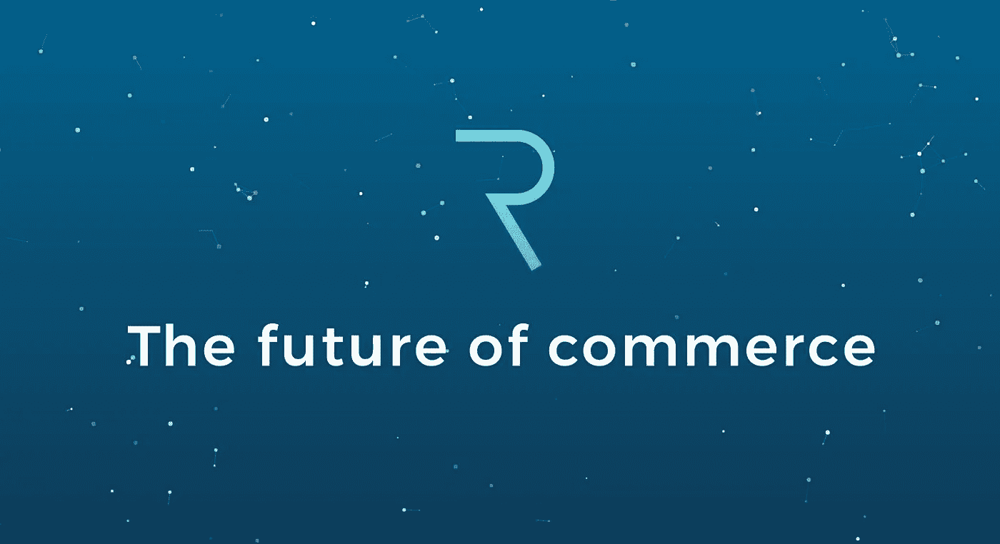
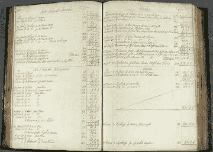
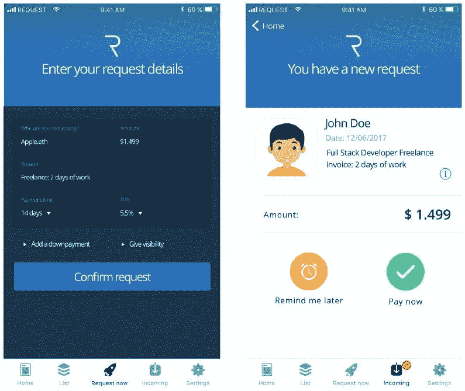
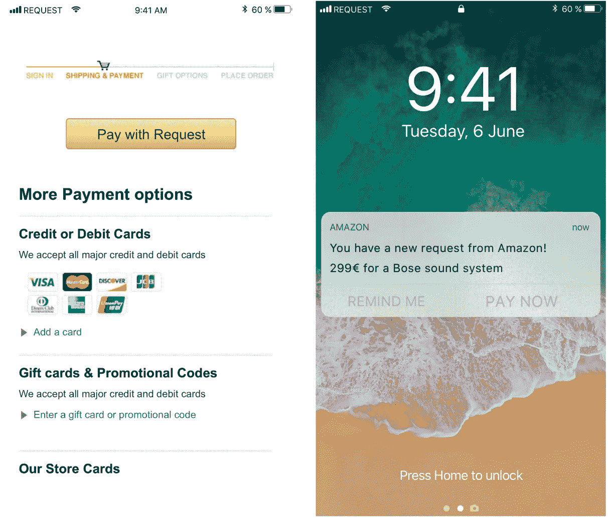
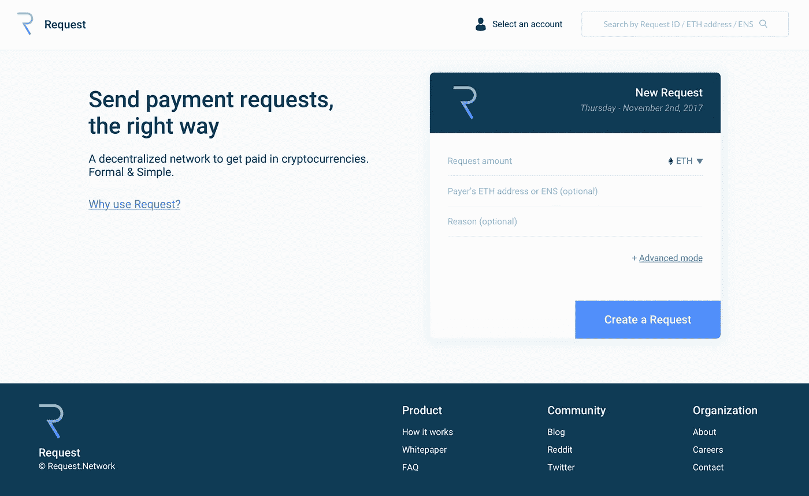

# Request Network 不仅仅是 PayPal 2.0，它可能会彻底改变金融世界

> 原文：<https://medium.com/hackernoon/request-network-is-more-than-just-paypal-2-0-it-could-revolutionize-the-finance-world-87b54bb455>

## 请求网络不仅仅是一种新支付服务。这是一个先进的金融网络，可以改变我们做生意的方式

**请求网是一个去中心化的支付平台**。它允许人们安全地请求支付，而不需要中央机构。但它还远远不止这些…

**令牌:REQ**

# 今天的问题

为了理解潜在的请求，我们必须理解他们的目的是破坏什么。完美的系统不能被破坏…但是我们今天的金融系统离完美还很远。

## 简单的交易

我们来玩个游戏，叫“我们现在的财政支付体系到底出了什么问题？”如今，对于简单的交易，我们需要使用 PayPal、Venmo 或其他一些集中支付服务。

如果我使用这些服务中的一个，我相信他们会有效安全地保护我的信息和身份。我也相信他们不会散布或出售我的信息。我们都知道这通常有多好。其次，在这些平台上，我要么牺牲交易安全，要么支付费用。如果我想在易贝买一双新的滑雪板，我可以用 PayPal gift 或 Venmo 支付，而不用支付交易费，太棒了！但是如果那些滑雪板没有送到我手里，或者这是个骗局，我就不能投诉了。这就像用现金交易。通过不*支付*，而是*赠予*我的钱，我牺牲了我的合法权利。然而，如果我使用 PayPal 的支付功能，收款人——带着滑雪板的家伙——支付 2.9%。由于易贝的滑雪板价值 300 美元，他不打算买那 3%的滑雪板。我将不得不多付给他 9 美元。

对于信用卡，Visa 对每笔刷卡交易收取 1.51%的费用。这笔费用要么由卖家支付，要么由买家支付，因为他们为每个人都穿的靴子支付了更高的价格。这些中间人伤害了我——买家——和商店——卖家。

此外，我必须提供互联网交易的身份证明。我不能只买。我必须注册，创建一个帐户，并给我的电子邮件和个人信息。我需要给他们我的信用卡信息。所有这些都让我面临潜在的黑客攻击和非法使用我的信息。谷歌和亚马逊将从我身上获取最大利润；他们完全有合法权利出售我的一些信息，因为那些长长的“条款和条件”表没人看。但我们也被迫签署了它们。我们有什么选择？这些服务对现代生活至关重要，放弃它们是不可取的。

**TLDR:信用卡或贝宝的高额费用，缺乏身份保护，以及需要包含你的私人信息，使得点对点交易既昂贵又不安全。**

## 为了生意

会计是工业的支柱。公司必须仔细记录他们的会计历史，否则整个信托系统就会崩溃。我们使用会计师来防止欺诈，防止浪费开支，并使有效的预算。没有这些记录，投资将是不可能的，因为我们将无法有效地评估公司。政府需要他们，这样他们才能适当地收税。

We might as well still be using this…

会计很关键。但是今天的会计方法非常低效。集中式系统没有统一的标准。他们依靠复式记账法，在分类账中记录投入和产出。举个实际的例子，假设我有一家公司，*(名字归功于我的朋友阿维·阿尔特舒勒)*，*，向当地商店出售散装葡萄酒，我会有一个记录收入的分类账和一个记录支出的分类账。然后，我自己的会计师可以确保这两个记录相匹配。我的买家会有他们自己的双本系统。随着发票的发送和接收，肯定会出现错误。我还需要确保我有一个记录系统记录已开具的发票，这样我就可以确定发票已支付，如果买家没有支付，我可以惩罚他们。第三方审计员为所有这些记录提供验证…但要收费。这是多么昂贵的代价。*

*仅小企业的审计费用就可能高达数万美元。美国 100 家最大的公司支付了 25 亿美元的审计费用。四大会计师事务所(世界上四大会计师事务所)一年的收入为 1338 亿美元。那可以买很多我的 10 美元散装葡萄酒——确切地说是 130 亿瓶。在当今的体制下，公司别无选择，只能支付昂贵的费用。*

*这个系统也与即将到来的物联网(IoT)革命完全不兼容(稍后阅读更多内容)。*

***TLDR:由于没有用于开具发票、会计和审计的包罗万象的标准化平台，公司必须花费数百万美元购买第三方服务。***

# ***解决方案***

*人们早就认为区块链可以简化这个会计系统。该系统可以想象是完全自动化的。如果你的车能做到，为什么你的税收计划不能？现在不能发生这种情况的原因是因为没有会计方法、平台和信息的标准化。在第三方审计员核实之前，我不能相信你的记录和账簿。我需要支付整个会计部门来处理我所有的发票和费用的输入。但是区块链可以提供解决方案。*

*想象一下，在一个系统中，可以向买家发放安全的数字发票，并记录到区块链中。条款可以通过智能合同进行编码，包括滞纳金和其他罚款。或者可能有提前付款的动机。付款后，资金会自动记录到分散的、不变的通用会计系统中，全部存储在区块链上。该系统是通用的，这意味着它可以支持任何类型的发票和货币，并且在所有行业都是标准化的。然后，公司可以完全信任彼此的记录而无需审计——因为没有人能改变自动输入的信息。自动审计将成为可能，因为每个人都使用相同的分类帐，并且可以编写高级程序来评估所述分类帐。*

**

*不再有发票——付款时，发票成为交易。不再有冗长的书面记录和巨大的开销。没有更昂贵的会计费用。不再有*做假账*。*

*T4 政府将会受益，因为信息会被即时发送给他们，税收也可以立即征收。或者至少他们会有所有商业交易的记录，并且很容易证实公司没有进行税务欺诈。*

*企业——尤其是慈善机构和非营利组织——可以主动要求变得完全透明，以换取客户的信任。*

*消费者会受益，因为费用会降低；没有中央银行或支付公司从中获利。在某些情况下，用户可能必须在请求网络上提供其数字身份的验证。但与今天不同的是，没有公司可以在没有用户确认的情况下看到该身份，用户也不需要信任任何人来保护他们的身份安全，但企业仍然可以遵守 KYC(了解你的客户)法律。*

*投资者将拥有公司所有财务交易的最新、可信的记录。*

*用例是无穷无尽的。*请求*启用全部。*

***TLDR:一个标准化的支付系统，因为区块链而变得不可信，从而支持一系列新的金融服务。有了可核实的分类账，自动化会计和审计成为可能。***

# *请求网络*

*我认为有一种误解，认为*请求网络*只是一个简单的支付请求应用程序(也许是它的名字？).一个 *PayPal 2.0* 。但是要求远不止这些。**它是一个支付平台。**其他分散的应用程序可以与 it 协同开发，实现请求团队无法想象的可能性。这就像以太坊是一个支持全新的去中心化互联网的平台。Request 是一个平台，可以支持全新的分散式会计系统。*

*Request 是一个平台而不是 DApp，这是我感兴趣的主要原因之一。平台促进创新。虽然有其他项目试图成为简单的分散支付应用程序，但 Request 超越了这个特定的用例。此外，随着区块链开始发展并破坏我们现有的行业，新的用例以及新的公司很可能会开发出比当前分散应用更好的产品。**平台可以与不可预见的事物共存。他们没有与所有的创新和革命性发展竞争。他们使之成为可能。这就是 Pets.com 和微软操作系统的区别。Pets.com 被击败了。微软不是。***

***TDLR:Request 是一个平台，而不是简单的 DApp，这一事实给了他们更多的潜力。***

## *站台*

*Request 使卖方能够作为通用支付系统的一部分开具支付发票。任何人都可以在*申请分类账上发出付款申请。*钱包和其他应用程序将检测支付请求，并为用户提供支付选项。*

**

*A mockup of the platform taken from Request’s W[hitepaper](https://request.network/assets/pdf/request_whitepaper.pdf)*

*例如，假设我还需要一副滑雪板。现在是阿拉斯加的冬季。我去了易贝，找到了那副被称为“滑雪板极限”的人制作的很棒的滑雪板。我给他发了一条信息，他在 *Request、*上打开了一个请求，然后我的手机收到了一条通知。我按下按钮，瞧，滑雪板是我的了。不需要使用 PayPal 这样的付费服务，不需要给他任何个人信息，不需要使用信用卡。如果 TheSki 的极限想更新他的财务账户，只要他的会计软件与 Request 兼容，它就能自动更新。*

*亚马逊将从使用这一系统中受益，因为他们将节省大量资金——包括会计和审计费用——以及不支付信用卡交易费用。*

## *方法*

*网关支持自动货币兑换。买家可以用任何货币支付，卖家可以用任何货币支付。网关充当中间人 API，在买方和卖方之间转换货币。这项技术的天才之处在于，买家和卖家都不需要持有请求令牌。他们支付并接收他们想要的任何令牌，看门人支付令牌(REQ)费用(可能还会收取额外费用)。kyber Network——一个具有支持这一功能的接口的分散式交换机——将充当看门人。*

**

*A sample of what the future could hold*

*这使得像亚马逊这样的网站可以发出请求，用户可以付费。两者都不需要任何区块链的理解；双方都不需要购买或存储任何 REQ 令牌，并且都可以用他们想要的任何货币进行支付或接收。REQ 仍然在交易中被烧毁，确保令牌仍然是生态系统的重要组成部分。*

## *网络的层次:*

*洋葱、食人魔和请求网络有什么共同点？层次。请求网络被分解成确定的层，每一层都支持一系列高级财务操作。这些层使得请求是独特的。正如我之前说过的，Request 的独特之处不仅在于它能够在网络上支付和请求，还在于它具有广泛的财务可能性的**可用性。为了理解这些可能性，理解这些层如何工作和交互是很重要的。***

**

*Shrek would be proud*

***核心层:**建立在以太坊区块链之上，核心层管理总账和智能合约。它处理货币转换，并可以与基于它构建的其他应用程序进行交互。当请求被支付时，它立即进行处理。核心层还支持退款、折扣、小费和其他基本的增减。这一层对于大多数简单的交易来说已经足够了:比如那些易贝滑雪板。**这是免费使用的，只减去以太坊气费。***

***扩展层:**但是如果您需要更复杂的更高级的事务呢？如果你想启用*滞纳金*，*首付*，*托管*(一个持有货币并有条件分配的合同)，或者*自动缴税*怎么办？扩展层支持这些功能。任何人都可以构建扩展。*

**

*No need for sticky note reminders with blockchain and Request*

*假设你同意付房租。如果没有按时付款，你的房东会收取 10%的滞纳金。然而，你不想为离开你的银行帐户的一大块零钱做预算，所以你使用扩展层自动地以小的每日分段支付你的租金。税款从这些付款中扣除，并转移到正确的一方。但这笔钱也是托管的，只有当你的房东把适当的钱转给电力公司时，这笔钱才会被释放。你也可以将押金存入托管账户，以确保你和房东的安全。**所有这些在请求网络上都是可能的。***

*这一层需要付费。使用的分机越多，费用就越高。然而，这些费用会很低——从 0.05%到 0.5%不等，取决于你使用的许多应用程序。任何创建新扩展的人都可以收取费用。**这鼓励人们开发额外的应用程序。***

***应用层:**这一层发生在区块链之外，与请求连接以访问信息或创建请求。几乎任何金融服务都可以与请求相连接，包括会计、审计和税务。将开发 API 来简化这一过程。*

*想象一下，你有一个小企业，所有的付款和发票都是应要求提供的。Quickbooks 可能与请求兼容。只需按一下按钮，你就可以将所有数据整合到 Quickbooks 中。*

*这一层包括一个信誉系统，它会随着网络行为(如支付及时性)而提高或降低。把它想象成*易贝反馈*，除了它是由网络自动更新的。这使得每个人都可以看到公司所有合同的逾期天数，除了滞纳金之外，还增加了另一个后果。我不太可能和一个从来没有按时付款的人一起工作。*

*所有这些层共同组成了请求网络。*

***TLDR:像 Kyber Network 这样的网关和三个请求层(核心层、扩展层和应用层)一起工作，使请求网络能够有更广泛的应用，而不仅仅是在以太网上支付你的比萨饼。***

## *请求启用…*

***自动记账** —由于 Request 使用了*通用*系统，自动记账成为可能。如果所有的收入和支出都通过请求处理，那么兼容的会计软件可以实时更新。不再有深夜税前日马拉松会议。*

***薪资请求** —公司可以提供有请求的自动薪资支付，这些都反映在账户中。这种形式的请求允许额外的支付，如加班费和奖金。*

***贷款请求** —今天贷款时，有几笔不相关的付款。你需要提供首期付款，分期付款，并支付利息。Request 允许在一次贷款请求中支付所有这些款项。*

**

*Trick or Treat for UNICEF*

***责任**——非营利组织和其他公司可以向所有人展示他们账户的完全透明的记录。无需猜测联合国儿童基金会将把你的捐款送往何处。*

***物联网** —物联网不会使用中间商或第三方。它需要一个不可辩驳和可访问的支付系统。通过请求，亚马逊的送货无人机可以为自己订购新零件，并预付 20%，其余部分在送货时支付。机器之间可以直接进行交易。*

***专业费用** — 请求使员工能够轻松报销公司发生的费用。*

***自动审计—** 凭借完全透明的交易、即时更新的分类账和自动化会计，数字审计成为可能。成本的节约和效率的提高是不言而喻的。*

***众筹:**可以创建可以被很多人资助的请求。这可能会用于即将推出的 ico。*

# *行业伙伴关系*

*Request 有几个有趣的合作伙伴和附属机构，它们都为他们的网络提供了额外的功能，并巩固了他们在行业中的声誉。*

*[**凯伯网**](https://www.google.co.il/search?q=kybernetwork&rlz=1C5CHFA_enUS766US766&oq=kybernetwork&aqs=chrome..69i57j69i60j0j69i60j69i61j0.2165j0j4&sourceid=chrome&ie=UTF-8) **和**[**0x**](https://0xproject.com/)**:**这两个项目都启用分散交易。这意味着它们可以很容易地从一种货币转换到另一种货币。在这里阅读它们。0x 功能将允许用户在汇款前轻松地兑换他们的钱。不过，与 **Kyber Network** 的合作最有意思。**凯博网络将启用自动转换；我之前谈到过。Kyber 将收到一种货币的付款，兑换它(同时刻录 REQ)并将货币发送给卖方。简单易行。如果 Kyber 运作良好，将使 0x 的贡献请求过时。 **Request 需要简单易用，尤其是对于不了解区块链的用户；Kyber 实现了这一点。*****

*[**思域**](https://www.civic.com/) **:** 思域带来数字身份请求。通过在请求网络上拥有您的数字身份，就有可能使用会计、信誉和审计系统。此外，如果 Request 希望机构和政府使用网络，他们必须拥有集成的数字身份。*

*[**Aragon**](https://aragon.one/)**:**Aragon**为协助治理和维护的组织提供工具。它们使组织能够使用许多不同的复杂组织结构，这些结构是由区块链实现的。Request 可以为这些公司提供简化的会计服务。***

***我 [**Ex。Ec**](https://iex.ec/) — iExec 是一家去中心化的云计算公司。这真是一个令人着迷的想法。一方面，Request 将为 iExec 提供一个解决方案，包括会计服务、简化的审计流程，以及管理买卖双方财务往来的能力。***

***作为回报，iExec 将协助 Request 开发一种分散审计算法，帮助公司进行自己的财务审计。***

***此外，iExec 首席执行官还是请求团队的顾问。***

***点击阅读更多关于 iExec [**路线图**](https://hackernoon.com/blockchains-need-iexec-the-market-just-hasnt-realized-it-yet-5597c743cd0a#/) **:*****

***他们的路线图提供了巨大的短期需求潜力。在未来两周的某个时候，Request 将推出他们的核心平台和 API，称为以太坊测试网上的巨像(以太坊测试网是一个以太坊区块链，用于测试目的，其中以太不是真实的)。该平台将允许发布和接受简单的请求(仅在以太网中)。***

***(更新:12/27)——请求释放[巨像](https://app.request.network/#/)到以太坊测试网。***

******

***The Colossal Interface***

***对于那些不知道的人来说，API 只是一个简单的接口，允许非技术人员使用请求平台。所以每个人都可以分享快乐。上面的接口就是 API。***

***我认为这个更新，一个真正的工作产品，可以真正推动 Request 的估值。目前没有多少平台和 DApps 有可用的产品。我真的很兴奋能亲自尝试一下。***

*****其他路线图目标:**主要发布将在 2018 年第一季度进行。它们还将支持其他 ERC20 令牌(基于以太坊构建的令牌)的兼容性。他们计划发布一个网站可以整合的“请求支付”按钮——类似于“用贝宝支付”按钮。***

******

***未来的更新将包括对实体店的支持。想象一下，结账的时候弹出一个二维码。你扫描代码并支付请求。***

***此外，他们计划支持复杂的支付。假设我付钱给丹，丹付钱给鲍勃。有了请求，我可以只支付鲍勃和网络将处理的钱通过丹。***

***要求有令人印象深刻的[思维导图](https://www.mindmeister.com/991002501?t=R1iofDilV0)它基本上列出了每个项目开发的所有步骤和目标。这超出了本文的范围，但是我欣赏他们的组织和透明度。***

*****TLDR: Request 的演示产品将在未来两周内发布。在 Q1 2018，主要产品将正式推出。他们的路线图上还有很多额外的计划。*****

# ***摘要***

***要求的不仅仅是 DApp。DApps 可以被新的[技术](https://hackernoon.com/tagged/technology)淘汰。DApps 试图创新，但最终，他们有专门的用例，容易受到竞争对手和新创新的影响。请求是一个平台。Request 提供了先进的金融工具网络。因此，请求不太可能被新的创新淘汰，因为请求支持创新并为其提供工具。***

## *****阳性:*****

1.  ***简单易用的界面，允许以任何货币支付***
2.  ***一个颠覆时机已经成熟的行业。花费在物理审计和金融服务上的价值是巨大的。这意味着大量的潜在需求。***
3.  ***高级支付功能，如贷款、托管、延期支付和物联网功能。***
4.  ***公司的自动化会计和自动化审计***
5.  ***用户终于可以在线交易，而不会泄露他们的信息。***
6.  ***一个真正强大的团队参与到社区中来——他们每两周发布一次吸引人且易于理解的更新。他们对我提出的任何问题都迅速作出了回应。他们关于思维导图的透明度非常好。他们有网络开发和寻找漏洞的激励计划。***
7.  ***Y 组合子支持***
8.  ***我预计一个工作产品的发布会带来许多新的用户和投资者。***

## *****负面/担忧*****

***虽然我对这个项目感到兴奋，但我也有一些担忧。了解投资早期项目的风险也非常重要。***

1.  ***对以太坊的依赖——以太坊有自己的扩展问题，并且使用我认为是过时的工作协议证明。这限制了请求。Request 预计，新的以太坊开发，如股权证明、分片和 sk-Snarks，将极大地有利于 Request。然而，以太坊不能保证实现这些目标。请求的成功取决于以太坊的成功。尽管所有 ERC20 令牌都是如此。***
2.  ***先有鸡还是先有蛋？— Request 需要大量用户来提供强大的网络。如果会计软件不兼容，企业就不会采用它；如果行业不使用 Request，会计软件就不会兼容。收费需要低，用户才会来；用户需要为低收费而来。然而，我认为如果产品被开发并支持团队预期的所有方面，用户就会来。***
3.  ***与其他加密支付解决方案的竞争——有许多其他项目试图提供一种加密货币支付方式。然而，正如我前面所说的，*没有人*做请求正在做的事情。没有人支持标准化的会计和审计系统；*没有人*在创造一个金融平台。在这方面，请求是独特的。***

***在接下来的几周内，观看他们的演示发布将会非常有趣。有了一个可工作的产品，我们将会对需求有一个更好的认识。当我关注区块链的项目时，我想投资那些我可以预见自己会用到的项目。我绝对会使用请求。***

*****感谢罗恩·格林伯格、尼尔·卡贝萨、塔尔·卡贝萨和本·莫格曼的会前评论*****

***有兴趣可以买币安 REQ:【https://www.binance.com/?ref=10928176】T2(推荐链接)***

***非常感谢捐赠和支持***

***NEO:agpjyu 9 fy 58 tgd hhbxgtxaosxh 5 uumvp***

***ETH:0x4c 35100 a0a 25 b 3933 ba 1c 0469 b 5 df 8 b 24035775 b***

***BTC:1 dmri 6j 1 EPQ 7mg 1 thcwvpqaflajesxe 1 hx***

***在 Twitter 上关注我:@ noamlevenson***

******免责声明:我是被要求投资的。这不是投资建议，仅仅是我对平台的看法。自己做研究。******

***如果您喜欢该内容，请按住鼓掌按钮！它帮助我获得曝光率。***

******鼓掌 50 次！******

****我喜欢收到问题或建议，所以请留言吧！****