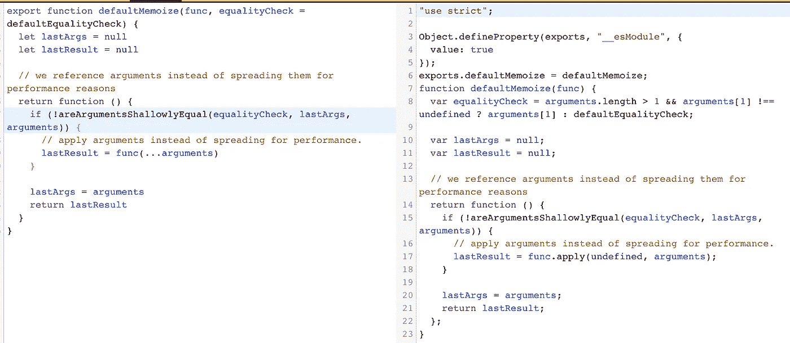

# 在 3 个函数中重新选择记忆

> 原文：<https://medium.com/hackernoon/reselect-style-memoization-in-3-functions-aff30f8cba11>

我一直在通读 Reselect 的[源代码](https://github.com/reactjs/reselect/blob/master/src/index.js)(只有 107 行未被统一)，认为在一篇博客文章中解开一些概念可能是值得的。

## 概念 1:记忆化

> 在计算中，记忆化是一种优化技术，主要用于通过存储昂贵的函数调用的结果并在相同的输入再次出现时返回缓存的结果来加速计算机程序。([来源](https://en.wikipedia.org/wiki/Memoization))

换句话说，如果你有一个运行时占用资源的纯函数`doResourceHoggingThing`(例如`doResourceHoggingThing(argument)`)，记忆化是一个捷径，这样如果你一遍又一遍地运行它而不改变`argument`，那么这个函数只在第一次运行。之后，它只保留结果的一个副本，并在提供相同的`argument`时将其吐出，这样您就不必浪费资源一遍又一遍地计算相同的值。

由于 Reselect 在 React 渲染周期内运行，所以它主要关心的不是保存*之前函数执行的所有结果*，而是只保存*最后的结果*，这样，如果它要输出一致的值，就可以跳过(可能很昂贵的)更新周期。

在 Javascript 中使用闭包很容易实现简单的记忆化(存储带有单个参数的函数的最后结果)。

```
const memoizeFunc = func => {
  // these variables inside the closure keep track of
  // the previous data to do the comparison
  let lastArg = null;
  let lastResult = null; return function (newArg) {
    // if the arguments don't match
    // calculate the result and return it
    if (newArg !== lastArg) {
      console.log('new', lastResult)
      lastResult = func(newArg)
    } // otherwise just return the old result
    lastArg = newArg;
    console.log('cached', lastResult)
    return lastResult;
  }
}const identity = x => x;
const memedFunc = memoizeFunc(identity);memedFunc(4) // 'new', 4
memedFunc(5) // 'new', 5
memedFunc(5) // 'cached', 4
```

然而，对任意数量的参数进行记忆要稍微复杂一些。

## 复习 1:通过引用进行相等检查

一个记忆化的函数需要做的主要决定是“自从上次我被调用以来，我的参数改变了吗？”，所以 Reselect 中的第一个函数是一个简单的相等检查，用于确定传递给函数的参数是否相等:

```
// Reselect Function #1
function defaultEqualityCheck(a, b) {
  return a === b
}
```

这里值得理解的是，这是通过*引用*而不是通过值来比较两个值的。由于内存化的函数经常将 Javascript 对象(任何非原始数据类型，如 T4 或 T5)作为参数，并且由于相等性检查对象本身可能是资源密集型的，所以 Reselect 跳过对象值的深度比较，并使用它们的底层引用作为相等性的代理。

这种快捷方式是安全的，因为虽然对于两个值相等但引用不同的对象，让这个检查返回`false`相对容易，但我想不出两个对象可以共享一个引用而值不同的场景。

```
const opt0 = {value: 0};
const opt1 = {value: 1};
const opt2 = {value: 1};
const opt3 = opt1;const arr = [
  opt0, opt1, opt2, opt3
]// Both values and reference match
defaultEqualityCheck(arr[0], arr[0]) // true// Neither value nor reference matches
defaultEqualityCheck(arr[0], arr[1]) // false// value matches, but reference doesn't
defaultEqualityCheck(arr[1], arr[2]) // false// reference matches
defaultEqualityCheck(arr[1], arr[3]) // true
```

这是 React 应用程序中容易出错的地方，因为这种边缘情况(如果发生的话)会导致冗余的渲染周期，而不是在底层数据更改时导致更新失败。

## 复习 2:参数对象

`arguments`对象是所有(非箭头)函数中可用的局部变量。你可以通过使用`arguments`对象在函数中引用函数的参数。该对象为传递给函数的每个参数包含一个条目，第一个条目的索引从 0 开始。([来源](https://developer.mozilla.org/en-US/docs/Web/JavaScript/Reference/Functions/arguments))

如果我们可以直接在`arguments`的两个实例上运行等式检查就好了，但是它们永远不会共享相同的底层引用，所以这是行不通的。我们必须更深入地挖掘，这将我们带到下一个重新选择函数。

```
// Reselect Function #2
function areArgumentsShallowlyEqual(equalityCheck, prev, next) {
  if (
    prev === null || 
    next === null || 
    prev.length !== next.length
  ) {
    return false
  }

  // Do this in a for loop (and not a `forEach` or an `every`)
  // so we can determine equality as fast as possible.
  const length = prev.length
  for (let i = 0; i < length; i++) {
    if (!equalityCheck(prev[i], next[i])) {
      return false
    }
  }

  return true
}
```

这只是迭代两个`arguments`对象中的属性，并使用传入的相等检查对它们进行简单的比较。由于`arguments`对象是一个类似数组的对象，它有一个内置属性`length`，允许在循环之前进行一些快速测试来加速。

## 概念 3:记忆功能

既然已经理解了所有的构建模块，那么在重选中使用的默认记忆功能就是它们的组合。

```
// Reselect Function #3
export function defaultMemoize(func, equalityCheck = defaultEqualityCheck) {
  let lastArgs = null
  let lastResult = null
  // we reference arguments instead of spreading them for performance reasons
  return function () {
    if (!areArgumentsShallowlyEqual(equalityCheck, lastArgs, arguments)) {
      // apply arguments instead of spreading for performance.
      lastResult = func.apply(null, arguments)
    }

    lastArgs = arguments
    return lastResult
  }
}
```

我不是 100%确定通过使用`func.apply`增加的增强的粒度细节，但它看起来像是引擎盖下的巴别塔 transpiles `func(...arguments)`。



# 结论

就是这样。三个函数中的重选基础。源代码中还有更多的内容，所以我可能会在不久的将来添加第 2 部分。