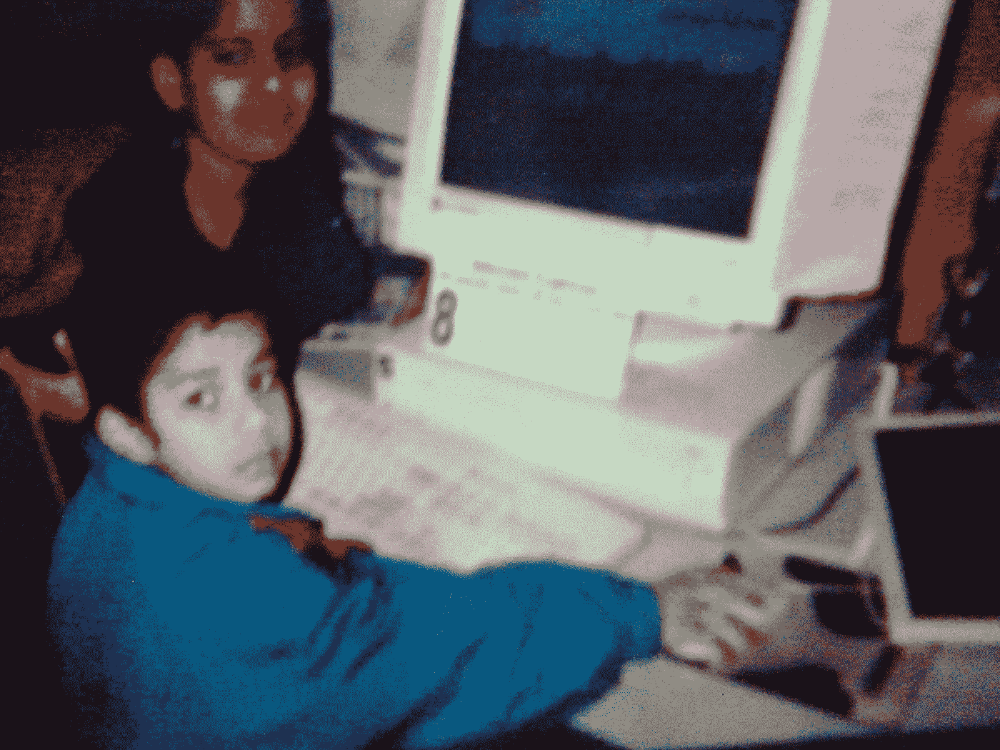
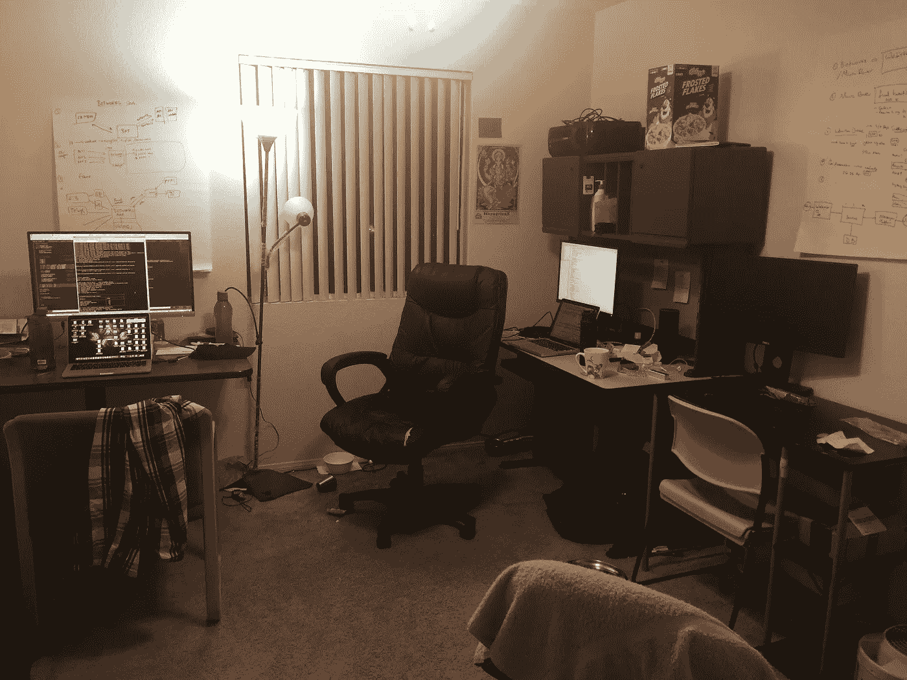

# 抵制平均

> 原文：<https://medium.com/hackernoon/resisting-average-cedf3718a7d9>

我的名字是 Kannan Ravindran，这是我的第一个博客。我是来自印度南部的全栈开发者、游戏玩家和徒步旅行者。我毕业时是一名计算机科学工程师，就像和我一起毕业的数百万人一样。为什么我要写这篇博客，为什么你要阅读这篇以外的内容？这只是我的个人经历，我无意浪费你的时间。

我为什么选择计算机科学？不，计算机科学选择了我。这一切都始于游戏。我认识的每一个疯狂的游戏玩家在某种程度上都是技术人员。这可能是最简单和有趣的方法之一。对游戏的浓厚兴趣开始转向。从游戏到黑客，一个接一个。我对网络安全非常感兴趣，也为零开放安全做了一些贡献。在黑客中，我学到了“要打破规则，你需要知道规则”。这使我成为一名全栈开发者。

When Mario was “game of the year”

曾经有一段时间，我被父母逼着做大多数邻居、朋友和亲戚一生都在做的事情。这是印度父母信奉的策略。走同样的路，有更好的工作/薪水，结婚，生孩子，买房子，让他们的孩子做同样的事情是最好的情况。我父母已经尽了最大努力。如果没有父母的支持和鼓励，我甚至不会接近这种情况。在相当长的一段时间里，我沿着平均水平走了同样的路。我尝试过 IIT-JEE 法案，但是没有深入进去。当然没有好排名)。我对本科所学并不满意，想探索更多。我试图和几个朋友一起创办一家公司。不幸的是，在我们开始之前，这也失败了。毫无工作经验，我一毕业就来到美国攻读硕士学位。再次跟随**平均值**。我在大多数学生身上看到的是，他们渴望选择能让他们获得实习机会的课程。能给他们带来高薪的工作。当然，这些是找到工作和偿还贷款最重要的部分。但我不准备迈出那一步。我很害怕，那条路会限制我的梦想。我可能完全错了，但大多数时候我的直觉是对的。抛开所有这些想法，我继续寻找实习机会。就像之前跟随**平均**一样。这次连平均都没考虑我。我没能给自己找到实习机会。更重要的是，看着每个人都找到工作，让我感觉自己就像一辆在比赛开始前就抛锚的汽车。得不到实习机会并不是世界末日，但这是获得全职工作机会的终结。普通人群在实现他们想要的目标方面取得了一般的成功。尽管我遵循了平均水平**,但我还是没能达到。这次不会，以前也不会。**

**When I am following the **average****

> **每个人都是天才。但是如果你根据一条鱼爬树的能力来判断它，它会一辈子相信自己是愚蠢的。
> —阿尔伯特·爱因斯坦**

**我意识到我为什么要跟随**平均值**才能成功。谁定义成功？。如果我是火箭呢？我不需要通过赢得一场汽车比赛来证明。就在那时，神奇的事情发生了。一个再次追寻梦想的机会。**

**2016 年初，我有幸组建了一个令人惊叹的团队，参加一场全国性的[黑客马拉松](https://en.wikipedia.org/wiki/Hackathon)。我在那里遇到了几个非常优秀的开发人员。我们提出了一些很棒的想法和策略，让我们赢得了黑客马拉松。那次胜利让我有了几个熟人。2016 年夏天，我遇到了一位校友(联系人之一)，他来自我就读的同一所大学，拥有令人惊叹的销售和营销技能以及技术知识。他再次提出了创业的想法。那是通往我梦想的洞穴尽头的一盏灯。我们加入并共同创办了一家初创公司。我看待自己生活的角度完全改变了。为什么我们需要跟随别人？答案是安全一点。为什么我们需要更安全一点？以防止或至少减少失败。但是我也是这样，但是失败从来没有找不到我。我决定为什么不做我喜欢的事情，而不去关心更安全的一面呢？**

**在过去的一年里，我从创业经历中学到的东西比硕士课程还多。我工作了无数个小时，却不知道现在是白天还是晚上。我不觉得我在工作。我花的每一个小时都离我的创业成功更近了一步。尽管我和另一位联合创始人的技能不同，但我一直很羡慕他的参与和奉献精神。这让我不断完善自己，提高自己的标准。他一直是我的良师益友。在过去的一年里，当我被如此多的障碍和忧郁打击时，我能够面对它们，克服它们，并且仍然变得坚强。总的来说，这是一次奇妙的经历，我不后悔。尽管我有自己的责任，比如偿还硕士学位的贷款和赡养父母，但这些责任都没有让我想过放弃现在正在做的事情。**

**你可能想知道我是否真的能学到比硕士课程更多的东西。嗯，因人而异。我是那种靠**[**DIY**](https://en.wikipedia.org/wiki/Do_it_yourself)**学习的人。我从开发聊天机器人开始。跳进了[神经网络](https://en.wikipedia.org/wiki/Artificial_neural_network)和[机器学习](https://en.wikipedia.org/wiki/Machine_learning)。创建完整产品的必要性使我成为了一名全栈开发人员。我曾经做过[后端开发者](https://www.techopedia.com/definition/29568/back-end-developer)、 [UI 设计师](https://en.wikipedia.org/wiki/User_interface_design)，甚至是[数据科学家](https://en.wikipedia.org/wiki/Data_science)。我也有一些关于增强现实的奇妙经历。这就是我得到的自由程度。我可以选择我想学的道路。这种满足感是任何薪水都无法比拟的。在**“福布斯”**上也提到了我开发的产品。******

********

****Early stages of my room/office****

****我的创业已经过去 1 年 2 个月了，我们仍在不断壮大。有太多有权势的人没有创业就成功了。我为什么要做这些？为什么我必须选择困难的方式？因为这给了我肾上腺素。因为这带走了我，就像童年时游戏带给我的一样。因为我不再追随**平均**而开始**反抗平均**。****

****在某些情况下，我有责任从事与我专业领域完全不相关的技术工作，比如 UI 设计和 3D 模型。尽管我不得不通过纠缠我的朋友和可怕的谷歌搜索来学习，但我做到了。为什么我明知那不是我该做的，却还要坚持下去？为了更大的利益。如果不这样做成为我的产品失败的原因之一怎么办？“永远不要在你热爱的事情上冒险”我内心的声音说道。这让我从平均水平中脱颖而出。在**普通**人群中有比我更好的程序员，但他们不是我。除了编码，我知道什么对产品重要，什么不重要。我知道产品特性的优先级，以及复杂性和可用性之间的平衡点。我知道什么时候修复一个 bug，什么时候忽略它并声称它是一个未记录的特性。这让我不同于一般的 T4 程序员。****

****我一直在做一个加密货币的网络应用。去年我制作了一个交易机器人，从那以后我就对它越来越感兴趣。区块链比特币背后的技术有着巨大的应用，我现在正在积极追求。下一篇文章会有更多更新。****