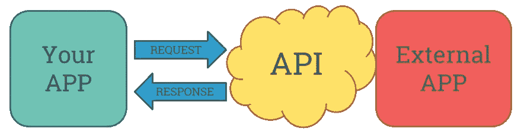
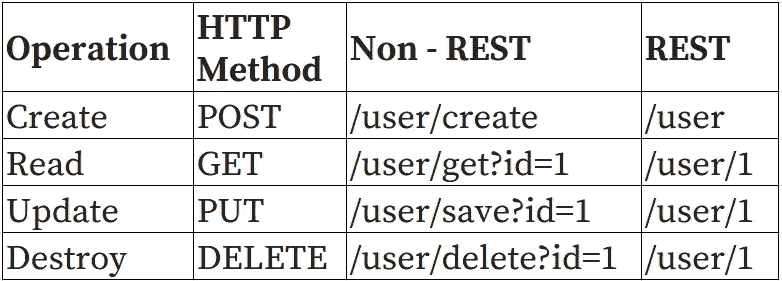
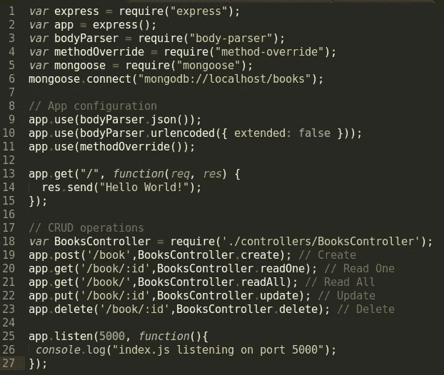
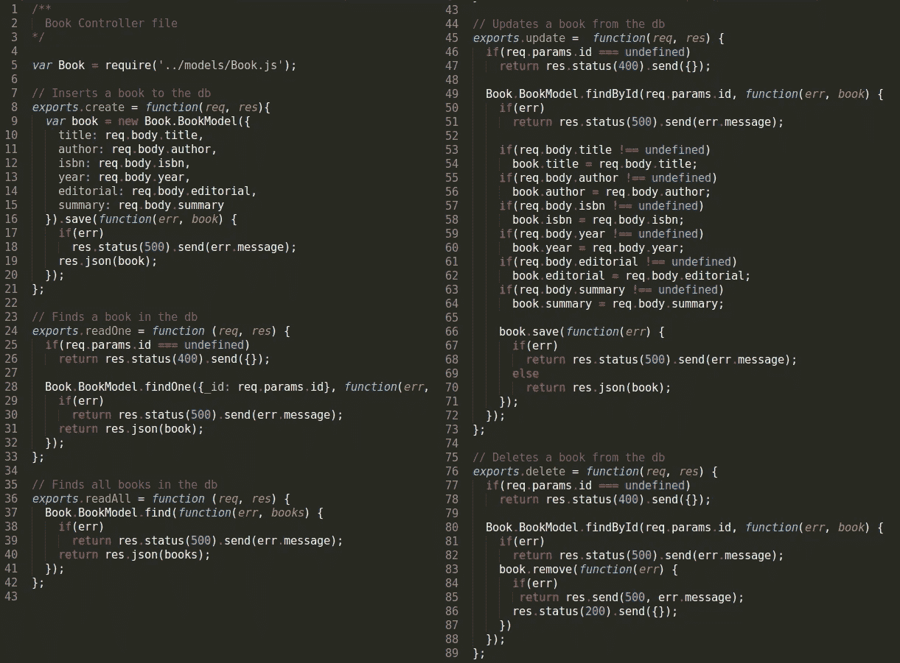

# 使用 Node.js 的 RESTful API

> 原文：<https://medium.com/hackernoon/restful-api-with-node-js-938c1ae386fe>


如果您从事 web 开发，那么 API、REST、RESTful 这些术语可能对您来说很熟悉。作为一个初学者，我努力(现在仍然是)得到一个关于 REST 的外行定义，然后，把这个概念翻译成代码。

这篇文章的目的是给其他初学者一些启发，并通过一个例子展示如何使用[node . js](https://hackernoon.com/tagged/nodejs)+express js+MongoDB 开发 RESTful API。在文章的底部，你会发现我们将会用到的文件的存储库。

## API:应用编程接口

API 是一组用于访问基于 web 的应用程序的[编程](https://hackernoon.com/tagged/programming)例程、协议、指令和标准。它是可以与其他应用程序交互的应用程序层。

看起来好像我们的应用程序向外部应用程序请求数据，我们必须首先以正确的格式创建请求，并将其发送到我们想要从中获取数据的应用程序 API。API 读取请求，向应用程序请求数据，然后创建对请求的响应，并将其发送回我们的应用程序。



Basic diagram

现在，有很多公司向公众发布他们的 API，这样开发者就可以在他们自己的应用和软件中使用它们。举个例子:

*   [谷歌](https://developers.google.com/apis-explorer/)
*   [维基百科](https://www.mediawiki.org/wiki/API:Main_page)
*   《纽约时报》
*   [脸书](https://developers.facebook.com/)
*   [贝宝](https://developer.paypal.com/)

这样的例子不胜枚举……[programmable Web](http://www.programmableweb.com/news/9000-apis-mobile-gets-serious/2013/04/30)追踪了 2013 年可用的 9000 个 Web APIs，而 2005 年只有 105 个。你可以在你每天访问的大部分页面中看到它们的使用。作为开发人员，您也可以使用它们！

## REST:表象状态转移

休息是我刚开始学习时无法掌握的事情之一。根据[维基百科](https://en.wikipedia.org/wiki/Representational_state_transfer):

> REST 是一种体系结构风格，由分布式超媒体系统中应用于组件、连接器和数据元素的一组协调的体系结构约束组成

这并不能说明什么(至少对我来说)，所以我必须研究并寻找其他的定义和解释。


Taken from [http://goo.gl/d5FUJp](http://goo.gl/d5FUJp). Give it a read too!

基本上，REST 是一种设计模式，一种使用 HTTP 协议设计 web 应用程序以在 web 上公开资源的方法。这些资源可以通过 URL 来标识，例如:

```
http://www.myblog.com/posts/34
http://www.hello.com//myList/5/item/12/
```

REST 服务器用“原始”数据而不是花哨的 HTML 文件来响应这些请求。这些“原始”数据使用 JSON 或 XML(以及其他)作为表示资源的媒体类型。

为了对资源进行操作，REST 通过 4 个 HTTP 方法或“动词”使用成对的请求和响应:

*   获取:读取资源。
*   发布:创建资源。
*   上传:更新资源。
*   删除:删除资源。



Non-REST vs REST comparison

在上图中，当您想要“读取”特定用户时，您可以转到/user/:id。请注意，当您想要更新或删除用户时，也可以使用该路径。还要注意这与非 REST 方法有什么不同。

当一个 API 或服务器符合 REST 的约束时，它们可以被称为 RESTful。

# Node.js 中 RESTful API 的实现

对于这个例子，我们将开发一个 API 来管理书籍。这个 API 将允许我们在数据库中执行 CRUD 操作。

使用 *npm、*启动存储库，我们将使用“index.js”作为我们的服务器文件 *:*

```
$ npm init
```

然后，安装依赖项。我们将使用:

*   [express](https://www.npmjs.com/package/express)’:node . js 的快速、非个性化、极简主义的 web 框架
*   [body-parser](https://www.npmjs.com/package/body-parser)':node . js body 解析中间件。
*   [method-override](https://www.npmjs.com/package/method-override)’:允许您在客户端不支持的地方使用 HTTP 动词，比如 PUT 或 DELETE。
*   [mongose](https://www.npmjs.com/package/mongoose)’:mongose 是一个 [MongoDB](https://www.mongodb.org/) 对象建模工具，设计用于在异步环境中工作。

要安装它们，请键入:

```
$ sudo npm install express body-parser method-override mongoose --save
```

然后，在“index.js”文件中，写入:

```
var express = require("express");
var app = express();
var bodyParser = require("body-parser");
var methodOverride = require("method-override");
var mongoose = require("mongoose");// App configuration
app.use(bodyParser.json());
app.use(bodyParser.urlencoded({ extended: false }));
app.use(methodOverride());app.get("/", function(req, res) { 
 res.send("Hello World!");
});app.listen(5000, function(){
 console.log("index.js listening on port 5000");
})
```

到目前为止，我们有一个服务器，侦听端口 5000 以获取'/'路由上的请求。该文件的框架类似于我在[上一篇](/@jcapona/basic-server-using-node-js-express-69a7b8af26f4#.s5wmch8nx)文章中展示的框架。不同之处在于，现在我们使用的是在上一步中安装的包。

## 为我们的应用程序创建模型

模型表示应用程序的信息和用于操作数据的规则。在我们的例子中，我们的模型将代表一本书。

我们将把名为“Book.js”的模型放在“models”文件夹中。这个文件包含一本书的表示:标题、作者、ISBN 代码、出版年份、摘要等等。然后，我们使用“module.exports”从其他文件中使用这个模型文件。

图书模型文件“Book.js”如下所示:

```
/**
 Model file of a Book
*/
var mongoose = require("mongoose");var BookSchema = new mongoose.Schema({ 
  title: { type: String, required: true },
  author: { type: String, required: true },
  isbn: { type: String, required: true },
  pages: { type: Number },
  summary: { type: String }
});var Book = mongoose.model("books", BookSchema);module.exports = {
 BookModel: Book
};
```

## 使用 MongoDB 创建本地数据库

为了管理这些书，我们需要一个运行的数据库。出于这个例子的目的，我们将使用一个本地 Mongo 数据库。要创建我们将在 out 应用程序中使用的数据库，请运行下一张图片中的命令。


Creating a local mongo database called ‘books’

如果您在 mongo shell 中运行“show dbs”命令，您很可能看不到新的“books”数据库，因为它是空的。

要使用“mongoose”连接到数据库，请在“index.js”文件中添加以下行:

```
mongoose.connect("mongodb://localhost/books");
```

## CRUD 操作的实现

因此，我们有了一本书的模型，以及一个名为“books”的本地数据库。现在，我们必须修改我们的应用程序代码，即“index.js”文件，以便我们能够从数据库中创建、阅读、更新和删除书籍。

为了管理我们的应用程序将为每个路线或请求的动作做什么，我们将使用一个控制器，特别是一个 BookController。创建一个文件夹“controllers ”,并在其中放置“BooksController.js”文件。

我们必须告诉我们的“index.js”文件，我们的 BooksController 将管理所有与图书管理相关的操作。这是通过添加以下内容来实现的:

```
var BooksController = require("./controllers/BooksController");
app.post("/book",BooksController.create); // Create
app.get("/book/:id",BooksController.readOne); // Read One
app.get("/book/",BooksController.readAll); // Read All
app.put("/book/:id",BooksController.update); // Update
app.delete("/book/:id",BooksController.delete); // Delete
```

这些行告诉我们的服务器，如果接收到对“/book”路由的 POST 请求，我们的“BooksController.js”文件中的例程“create”将管理它。



Final index.js file. You can find the code in the Github repo. Keep reading!

还有，有 2 个 GET 路由:'/book '和'/book/:id '；第一个将返回我们数据库中的所有书籍，第二个将只显示 id 用作参数的书籍。

我们新创建的“BooksController.js”文件应该具有以下形式:

```
/**
 Book Controller file
*/var Book = require("../models/Book.js");// Inserts a book to the db
exports.create = function(req, res){
};// Finds a single book in the db
exports.readOne = function (req, res) {
};// Finds all books in the db
exports.readAll = function (req, res) {
};// Updates a book from the db
exports.update = function(req, res) {
};// Deletes a book from the db
exports.delete = function(req, res) {
};
```

在每个功能块里面都有管理我们的书籍和与我们的数据库交互的代码。这里没有太多要解释的，在 ever 函数内部，我们简单地使用 mongoose &我们的 book 模型执行基本的 CRUD 操作。



BookController. You can find the code in the Github repo. Keep reading!

## 测试我们的 API

为了方便测试我们的 API，我们将使用 [POSTMAN](https://www.getpostman.com/) 。这基本上是一个用于测试 web 服务的 HTTP 客户端。还有其他应用程序做类似的事情，但邮递员是轻量级的&非常简单易用。

首先，我们将创建我们的第一个图书资源。打开 POSTMAN，在' localhost:5000/book '上选择一个 POST 操作。现在，填充您想要插入到数据库中的书的键和值。最后，按“发送”并检查服务器的响应。如果没有出错，您应该会收到一个 JSON，其中包含数据库中已创建图书的数据。


Using POSTMAN to test our API

要查看我们保存的第一本书，请使用带有 GET 请求的 POSTMAN，访问 URL(您也可以在浏览器中查看):

```
[http://localhost:5000/book/](http://localhost:5000/book/)
```

这应该会打印出我们数据库中的所有书籍(目前只有一本)。

要仅阅读某本书，请使用 URL:

```
http://localhost:5000/book/56d37e1430678fde6e037e27
```

其中“/book/”后的代码对应于您要阅读的书的“_id”。

您现在可以使用我们的 API，随心所欲地创建、阅读、更新和删除书籍:)。

# 最终意见

我希望这能帮助读者更好地理解什么是 REST，并减轻如何开发一个合适的 RESTful API 的负担。

环顾四周，有几个框架可以自动为您创建和管理模型和控制器文件，但是如果您是初学者，在您使用 shell 中的一个命令行命令完成所有工作之前，了解基础并了解它的工作原理是很重要的。

如果你有任何意见或更正(我也是 noob！)，就告诉我一声！

## 代码

可以找代码 [@Github](https://github.com/jcapona/restful-server-example)