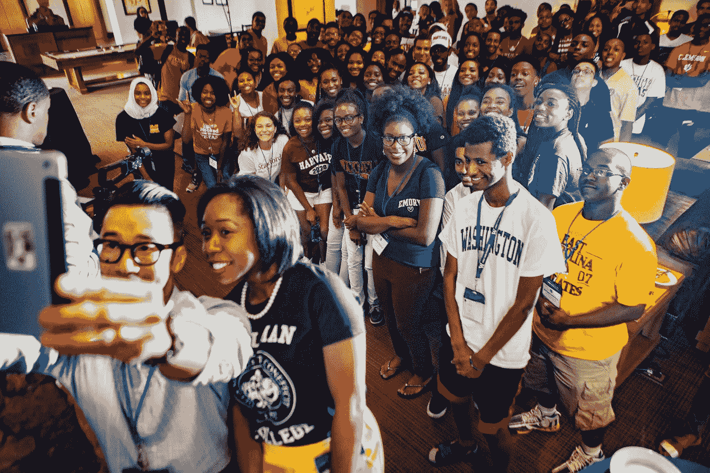
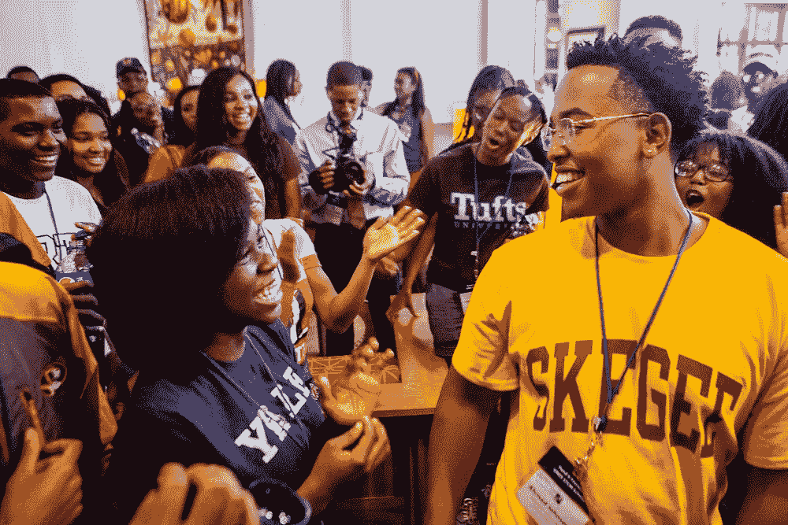
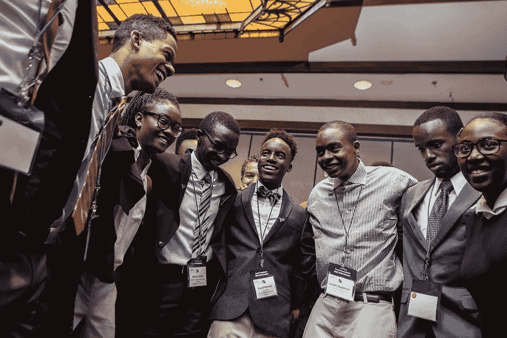
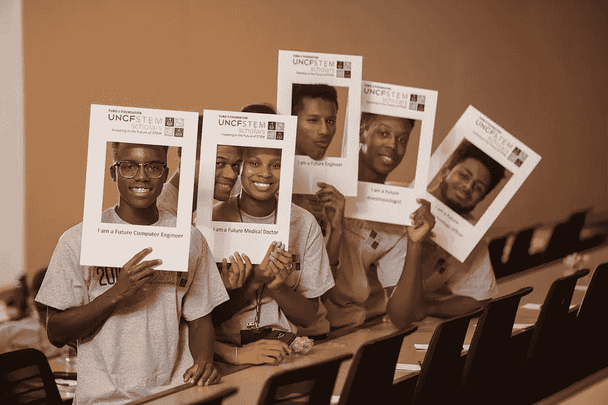
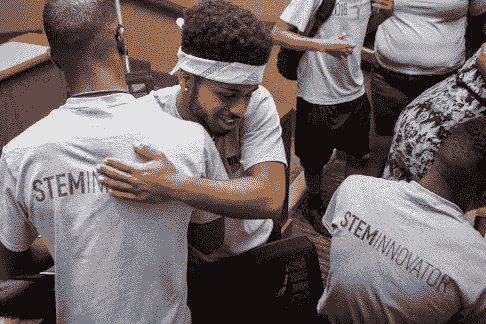
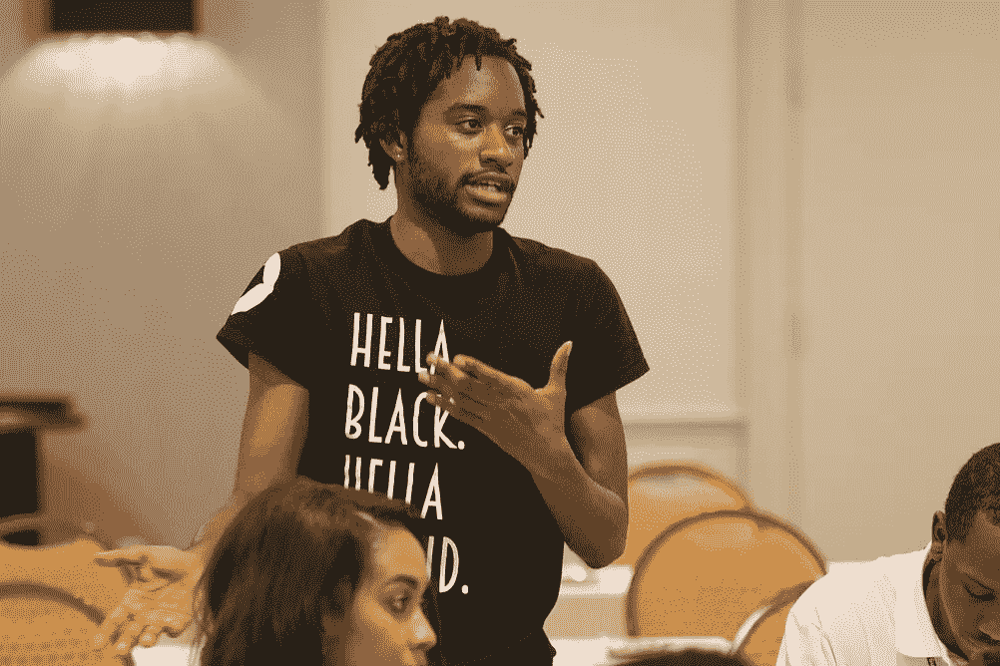

# 用我们新的事业恢复我的理智，为我们的未来而战

> 原文：<https://medium.com/hackernoon/restoring-my-sanity-with-our-renewed-cause-fighting-for-our-future-29d5bf951fd0>

2016 UNCF STEM Scholars Orientation. Photo by Johnathon Henninger

上周，我在 DC 的华盛顿下班回家的路上遭到了言语攻击。大选之夜大约下午 6:30，我站在五边形城市地铁站外，一个主要的交通和购物中心，等待我的公寓班车。我焦急地等待着回家，等待选举结果。我坐在拥挤的长椅上，裹着围巾和夹克依偎在一起。秋天已经来到了 DC。

不知从哪里冒出来一辆快速行驶的深色汽车，当它沿着街道倾斜时引起了我的注意。一个男人伸出头喊道，**“操你个黑鬼。”**

我周围的人震惊地左顾右盼。我们不敢相信地保持沉默。我心想，“他明天不会大喊大叫的，”我相信希拉里会被提名为总统当选人。我一点也不知道这是一个预兆，一个伏笔，一个即将到来的危险信号。

直到我半夜被特朗普接受当选总统提名的演讲惊醒，我才真正意识到这一点。我的胃里形成了一个结，我能听到的只有一遍又一遍的重复，“T4，你这个黑鬼。”我开始哭泣，感到绝望。

# 第二天

我终于又睡了几个小时，第二天沿着前一天晚上我听到种族歧视的同一条交通路线去上班。不断提醒和似曾相识的感觉。为什么会发生这种事……在 DC 这个大熔炉的所有地方？为什么我要经历这些？为什么特朗普的竞选团队创建了这个巨大的平台来提升其支持者的议程？为什么特朗普的竞选加剧了偏见和仇恨犯罪？这是我们新的标准和现实吗？我开始通过社交媒体看到全国各地仇恨犯罪的报道:种族主义涂鸦和诽谤。我的少数民族同胞成了密歇根州孩子们高呼“建墙吧！”的诋毁的受害者或者被叫做“中国佬”

在去工作的 DC 地铁上，出奇的安静。我周围的人的忧郁情绪穿透了寒冷、清新的空气。具有讽刺意味的是，沉闷的阴雨正好符合我们的心情。我们都很悲伤。我默默的哭着，用围巾擦脸。当我进入工作场所时，我不知道如何问候我的团队。我坐在办公桌前，同事问:“你还好吗？”我摇摇头，“没有”，走到卫生间抹眼泪。我看了看我的日历，发现里面塞满了为即将到来的峰会做准备的会议。由于没有时间去悲伤或处理选举结果，我决定今天避开媒体和新闻，让自己一头扎进工作中。那天下午晚些时候，我们的首席执行官为我们举行了一个全体员工的市政厅会议，承认发生了巨大的事件，并允许我们一起哀悼，同时提供安慰的话。

我在 UNCF(美国黑人大学基金会)担任科学教育项目的高级经理。我的人数不多但很强大的少数族裔团队正在为即将于 11 月 16 日至 20 日在加州三藩市举行的 [2016 UNCF HBCU 创新峰会](http://www.hbcuinnovation.org/my-product/2016-hbcu-innovation-summit/)做准备。

与来自 **31 所 HBCU**的 [5 **2 名历史上黑人学院和大学(HBCU)的学生**](http://www.hbcuinnovation.org/our-fellows/) **和 20 名计算机科学教师**一起踏上一段奇妙的旅程，我们的学生将于 11 月 16 日前往硅谷，拜访 10 家新兴的主要科技公司，同时参加名为“[在](https://nvite.com/GetyourPitchon/c4b2)[上发表演讲，](https://nvite.com/GetyourPitchon/c4b2) [a](https://nvite.com/GetyourPitchon/c4b2)[l](https://nvite.com/GetyourPitchon/c4b2)I[v](https://nvite.com/GetyourPitchon/c4b2)e[模拟](https://nvite.com/GetyourPitchon/c4b2)s[t](https://nvite.com/GetyourPitchon/c4b2)a[r](https://nvite.com/GetyourPitchon/c4b2)t[u](https://nvite.com/GetyourPitchon/c4b2)p[p](https://nvite.com/GetyourPitchon/c4b2)[I](https://nvite.com/GetyourPitchon/c4b2)t[c](https://nvite.com/GetyourPitchon/c4b2)h 创投前的竞争。 其他峰会活动包括职业准备和技术赋权研讨会，而教师有一个单独的跟踪重点课程[发展](https://hackernoon.com/tagged/development)以符合技术行业标准。HBCU 代表团将会见来自领先科技公司的高管和长得像他们的员工——他们都有投资并渴望推进职业发展和实现梦想。我们都有一份工作……保护我们未来的声音。我们大多数年轻人投票支持进步领袖。所以让我们一起继续战斗吧。我将继续为我的少数民族学生奋斗，把他们培养成明天的领袖。

我所做的工作是选举对我打击如此之大的原因。我哭了，因为像许多其他人一样，我每天都在努力为我们服务的年轻人开辟道路。**我哭了，因为我不知道如何保护我提供奖学金和职业发展的 200 多名少数族裔学生免受仇恨犯罪和种族/性别歧视/厌恶女性的诽谤。我哭是因为我害怕接下来会发生什么。我感觉被打败了。我和很多有同感的朋友聊过。但是，随着时间的推移，我们的悲伤和恐惧变成了希望和机会…**

## 但是，唉，悲伤必须结束，因为我们的工作必须继续和完成。看着我们未来的眼睛，我的理智已经恢复；从车窗向那个按住我一小会儿的种族主义者扔石头。我已经复活了。

感谢我的部落和一路上支持我的人。我们在一起。

Photos captured by Johnathon Henninger from a recent STEM Scholars Conference organized by my team

Photos from 2015 UNCF HBCU Innovation Summit

感谢我的部落和一路上支持我的支持者。我们在一起。关注#HBCUInnovation，见证我们的旅程。

[查看我们的 2016 UNCF HBCU 创新峰会研究员](http://www.hbcuinnovation.org/our-fellows/)

-丙

> [黑客中午](http://bit.ly/Hackernoon)是黑客如何开始他们的下午。我们是 [@AMI](http://bit.ly/atAMIatAMI) 家庭的一员。我们现在[接受投稿](http://bit.ly/hackernoonsubmission)并乐意[讨论广告&赞助](mailto:partners@amipublications.com)机会。
> 
> 如果你喜欢这个故事，我们推荐你阅读我们的[最新科技故事](http://bit.ly/hackernoonlatestt)和[趋势科技故事](https://hackernoon.com/trending)。直到下一次，不要把世界的现实想当然！

